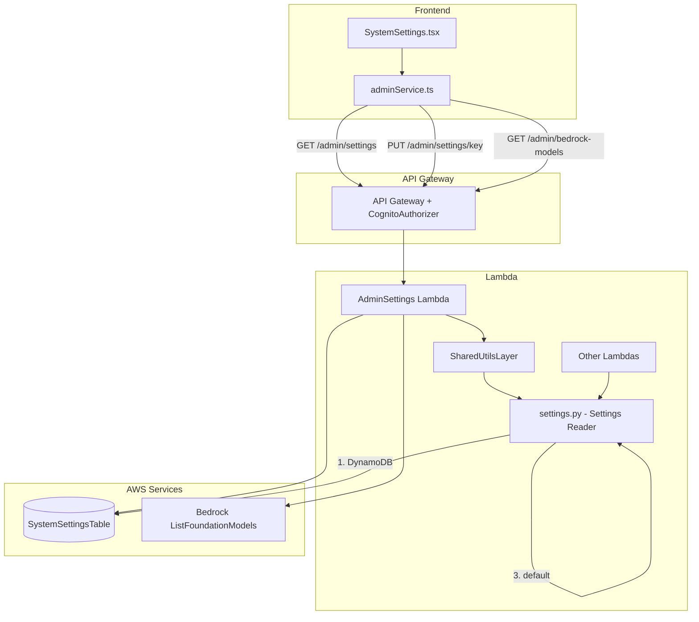

# Design Document: Admin System Settings

## Overview

This feature replaces the current read-only `SystemSettings.tsx` page with a fully editable, DynamoDB-backed configuration management system. It introduces:

1. A `SystemSettingsTable` in DynamoDB storing all configurable values as typed key-value pairs with audit metadata.
2. A new `AdminSettings` Lambda with `GET /admin/settings`, `PUT /admin/settings/{settingKey}`, and `GET /admin/bedrock-models` endpoints.
3. A shared `settings.py` reader utility (via `SharedUtilsLayer`) with 5-minute TTL caching and a fallback chain: DynamoDB → environment variable → hardcoded default.
4. An idempotent seed script that populates the table with initial values from environment variables, SSM parameters, and hardcoded constants.
5. A redesigned React settings page with collapsible sections, type-aware input controls, inline save with validation, toast notifications, and a model picker dropdown showing Bedrock models with pricing.

The system enables runtime configuration changes without redeploying the SAM stack, while preserving backward compatibility through the fallback chain.

## Architecture



### Request Flow

1. Admin navigates to `/admin/settings` → `SystemSettings.tsx` loads.
2. Page calls `GET /admin/settings` → Lambda scans `SystemSettingsTable`, groups by `section`, returns JSON.
3. For `model` type settings, page also calls `GET /admin/bedrock-models` (once, cached for session).
4. Admin edits a value → save icon appears → clicks save → `PUT /admin/settings/{settingKey}` with new value.
5. Lambda validates type, updates DynamoDB with `updatedAt`/`updatedBy`, returns success.
6. Other Lambdas call `get_setting(key, default)` → checks module-level cache (5-min TTL) → DynamoDB → env var → default.

## Components and Interfaces

### Backend Components

#### 1. SystemSettingsTable (DynamoDB)

Defined in `SamLambda/template.yml` as a `AWS::DynamoDB::Table` resource.

- Partition key: `settingKey` (S), no sort key
- Billing: PAY_PER_REQUEST
- Encryption: KMS via `DataEncryptionKey`, SSEType KMS
- Point-in-Time Recovery: enabled
- Global env var: `TABLE_SYSTEM_SETTINGS` added to `Globals.Function.Environment.Variables`

#### 2. AdminSettings Lambda

Located at `SamLambda/functions/adminFunctions/adminSettings/app.py`.

Follows the same handler pattern as `adminQuestions/app.py`:
- OPTIONS preflight → 200 with CORS headers
- `verify_admin(event)` → 403 if not admin
- Method/resource routing via `httpMethod` + `resource`
- `try/except` with `error_response()` for all unhandled exceptions

**Routes:**

| Method | Resource | Handler | Description |
|--------|----------|---------|-------------|
| GET | `/admin/settings` | `handle_get_settings` | Scan table, group by section |
| PUT | `/admin/settings/{settingKey}` | `handle_put_setting` | Validate type, update item |
| GET | `/admin/bedrock-models` | `handle_get_bedrock_models` | List models with pricing |
| OPTIONS | `/admin/settings` | preflight | CORS |
| OPTIONS | `/admin/settings/{settingKey}` | preflight | CORS |
| OPTIONS | `/admin/bedrock-models` | preflight | CORS |

**IAM Policies:**
- `dynamodb:Scan`, `dynamodb:GetItem`, `dynamodb:PutItem` on `SystemSettingsTable`
- `kms:Decrypt`, `kms:DescribeKey`, `kms:GenerateDataKey` on `DataEncryptionKey`
- `bedrock:ListFoundationModels` (region-scoped)

**Type Validation Logic (PUT):**

| valueType | Validation Rule |
|-----------|----------------|
| `string` | Non-empty, no newline characters |
| `integer` | Parses as Python `int` |
| `float` | Parses as Python `float` |
| `boolean` | Exactly `"true"` or `"false"` (case-sensitive) |
| `text` | Any string (multiline allowed) |
| `model` | Non-empty string present in Bedrock model ID list |

#### 3. Settings Reader (`settings.py`)

Located at `SamLambda/functions/shared/python/settings.py`, accessible via `SharedUtilsLayer`.

```python
def get_setting(key: str, default: str = '') -> str:
    """
    Read a setting with fallback chain:
    1. Module-level cache (if TTL not expired)
    2. SystemSettingsTable DynamoDB lookup
    3. os.environ.get(key)
    4. Provided default
    
    Never raises — falls back silently on DynamoDB errors.
    """
```

**Cache design:**
- Module-level `_cache: dict[str, tuple[str, float]]` mapping `key → (value, timestamp)`
- TTL: 300 seconds (5 minutes)
- On cache miss or expiry: fetch from DynamoDB, update cache
- On DynamoDB error: fall back to `os.environ.get(key, default)`, do not cache the fallback

#### 4. Bedrock Models Endpoint

The `handle_get_bedrock_models` handler:
1. Checks a module-level cache (24-hour TTL) for the model list.
2. On cache miss, calls `bedrock.list_foundation_models()` via boto3.
3. Filters to models with `ON_DEMAND` in `inferenceTypesSupported`.
4. Enriches each model with pricing from a static `BEDROCK_PRICING` dict (maintained in the Lambda code).
5. Sorts by `inputPricePerKToken` descending (highest cost first).
6. Returns the list.

**Static Pricing Map:**

A `BEDROCK_PRICING` dictionary in the Lambda maps `modelId` → `{ inputPricePerKToken, outputPricePerKToken }`. This is a maintained lookup updated when Bedrock pricing changes (infrequently). Models not in the map get `null` pricing values and sort to the bottom.

```python
BEDROCK_PRICING = {
    "anthropic.claude-3-5-sonnet-20241022-v2:0": {
        "inputPricePerKToken": 0.003,
        "outputPricePerKToken": 0.015,
    },
    "anthropic.claude-3-haiku-20240307-v1:0": {
        "inputPricePerKToken": 0.00025,
        "outputPricePerKToken": 0.00125,
    },
    # ... additional models
}
```

#### 5. Seed Script

Located at `SamLambda/functions/adminFunctions/adminSettings/seed.py`. A standalone Python script (run via CLI, not a Lambda) that:

1. Reads initial values from environment variables, SSM parameters, and hardcoded defaults as specified in the requirements tables.
2. Uses `put_item` with `ConditionExpression='attribute_not_exists(settingKey)'` for idempotency — existing items are never overwritten.
3. Sets `updatedBy` to `"seed-script"` and `updatedAt` to the current ISO 8601 timestamp.
4. For SSM-sourced values (data retention, conversation config), reads from SSM Parameter Store and uses the value as the initial default. Falls back to the hardcoded default if SSM is unreachable.

**Design decision — SSM and retention_config.py:**
The seed script reads SSM values as initial defaults for the Settings_Table. The existing `retention_config.py` module continues reading from SSM as-is — no changes to that module. A future migration can update `retention_config.py` to read from the Settings_Table via `settings.py` instead of SSM.

### Frontend Components

#### 6. SystemSettings Page (`SystemSettings.tsx`)

Complete rewrite of the existing read-only page. Key components:

**Page Structure:**
```
SystemSettings
├── Page header ("System Settings")
├── Loading skeleton (while fetching)
├── Error state (if fetch fails)
└── Section groups (collapsible)
    ├── Section header (click to expand/collapse)
    └── Setting rows
        ├── Label + description
        ├── Type-appropriate input control
        ├── Save icon (visible only when value changed)
        ├── Validation error (red border + inline message)
        └── "Last updated by {email} at {timestamp}" metadata
```

**UI Components Used:**
- `Collapsible` + `CollapsibleTrigger` + `CollapsibleContent` from shadcn/ui for sections
- `Card` / `CardContent` for section containers
- `Input` for string/integer/float
- `Textarea` for text
- `Switch` for boolean
- `Select` for model picker
- `toast` from `sonner` for success/error notifications
- `Save` icon from `lucide-react` (appears on value change)
- `AlertTriangle` icon from `lucide-react` for model availability warning

**State Management:**
- `settings`: fetched settings array, grouped by section
- `editedValues`: `Record<string, string>` tracking in-progress edits
- `validationErrors`: `Record<string, string>` tracking per-field errors
- `savingKeys`: `Set<string>` tracking which settings are currently saving
- `bedrockModels`: cached model list (fetched once on mount if any model settings exist)

#### 7. Admin Service Extensions (`adminService.ts`)

New functions added to the existing `adminService.ts`:

```typescript
// Settings
export async function fetchSettings(): Promise<SettingsResponse>;
export async function updateSetting(settingKey: string, value: string): Promise<UpdateSettingResponse>;

// Bedrock Models
export async function fetchBedrockModels(): Promise<BedrockModel[]>;
```

**Types:**

```typescript
interface SettingItem {
  settingKey: string;
  value: string;
  valueType: 'string' | 'integer' | 'float' | 'boolean' | 'text' | 'model';
  section: string;
  label: string;
  description: string;
  updatedAt: string;
  updatedBy: string;
}

interface SettingsResponse {
  settings: Record<string, SettingItem[]>; // grouped by section
}

interface UpdateSettingResponse {
  message: string;
  updatedAt: string;
  updatedBy: string;
}

interface BedrockModel {
  modelId: string;
  modelName: string;
  providerName: string;
  inputPricePerKToken: number | null;
  outputPricePerKToken: number | null;
}
```

## Data Models

### SystemSettingsTable Item Schema

| Attribute | Type | Description |
|-----------|------|-------------|
| `settingKey` | S (PK) | Unique identifier, e.g. `PSYCH_PROFILE_BEDROCK_MODEL` |
| `value` | S | Current value stored as string |
| `valueType` | S | One of: `string`, `integer`, `float`, `boolean`, `text`, `model` |
| `section` | S | Grouping label, e.g. `AI & Models`, `Data Retention` |
| `label` | S | Human-readable display name |
| `description` | S | Help text shown under the label |
| `updatedAt` | S | ISO 8601 timestamp of last update |
| `updatedBy` | S | Email of admin who last updated, or `"seed-script"` |

### GET /admin/settings Response

```json
{
  "settings": {
    "AI & Models": [
      {
        "settingKey": "PSYCH_PROFILE_BEDROCK_MODEL",
        "value": "anthropic.claude-3-haiku-20240307-v1:0",
        "valueType": "model",
        "section": "AI & Models",
        "label": "Psych Profile Bedrock Model",
        "description": "AI model used for assessment narrative generation",
        "updatedAt": "2025-01-15T10:30:00Z",
        "updatedBy": "admin@soulreel.net"
      }
    ],
    "Data Retention": [ ... ]
  }
}
```

### PUT /admin/settings/{settingKey} Request/Response

**Request body:**
```json
{ "value": "anthropic.claude-3-5-sonnet-20241022-v2:0" }
```

**Success response (200):**
```json
{
  "message": "Setting updated",
  "updatedAt": "2025-01-15T11:00:00Z",
  "updatedBy": "admin@soulreel.net"
}
```

**Validation error (400):**
```json
{ "error": "Invalid value for integer type: 'abc' is not a valid integer" }
```

### GET /admin/bedrock-models Response

```json
{
  "models": [
    {
      "modelId": "anthropic.claude-3-5-sonnet-20241022-v2:0",
      "modelName": "Claude 3.5 Sonnet v2",
      "providerName": "Anthropic",
      "inputPricePerKToken": 0.003,
      "outputPricePerKToken": 0.015
    },
    {
      "modelId": "anthropic.claude-3-haiku-20240307-v1:0",
      "modelName": "Claude 3 Haiku",
      "providerName": "Anthropic",
      "inputPricePerKToken": 0.00025,
      "outputPricePerKToken": 0.00125
    }
  ]
}
```

### Settings Reader Cache Structure

```python
# Module-level cache: key → (value, fetch_timestamp)
_cache: dict[str, tuple[str, float]] = {}
_CACHE_TTL = 300  # 5 minutes in seconds
```


## Correctness Properties

*A property is a characteristic or behavior that should hold true across all valid executions of a system — essentially, a formal statement about what the system should do. Properties serve as the bridge between human-readable specifications and machine-verifiable correctness guarantees.*

### Property 1: Type validation accepts valid values and rejects invalid values

*For any* `valueType` in `{string, integer, float, boolean, text, model}` and *for any* input string, the validation function SHALL accept the value if and only if it conforms to the type's rules: `integer` iff parseable as Python `int`; `float` iff parseable as Python `float`; `boolean` iff exactly `"true"` or `"false"`; `string` iff non-empty with no newline characters; `text` always accepted; `model` iff non-empty and present in the known model ID set.

**Validates: Requirements 3.3, 3.4, 3.5, 3.6, 3.7, 3.8, 3.9**

### Property 2: Settings Reader fallback chain precedence

*For any* setting key and *for any* combination of DynamoDB value, environment variable, and default parameter, the Settings Reader SHALL return the highest-precedence available value: DynamoDB value if present, else environment variable if set, else the provided default.

**Validates: Requirements 5.1, 5.2, 5.3, 10.4, 13.1**

### Property 3: Settings Reader cache TTL behavior

*For any* setting key, after a successful `get_setting()` call, a subsequent call within 5 minutes SHALL return the cached value without querying DynamoDB, and a call after 5 minutes SHALL re-fetch from DynamoDB.

**Validates: Requirements 5.4, 5.5**

### Property 4: Settings Reader error resilience

*For any* setting key, when the DynamoDB read raises an exception, the Settings Reader SHALL not propagate the exception and SHALL return the environment variable value (if set) or the provided default.

**Validates: Requirements 5.6**

### Property 5: CORS headers on all API responses

*For any* request to the Settings API (any method, any path, any auth state), the response SHALL include `Access-Control-Allow-Origin`, `Access-Control-Allow-Headers`, and `Access-Control-Allow-Methods` headers.

**Validates: Requirements 2.4, 3.11, 11.8**

### Property 6: GET settings groups items by section

*For any* set of Setting_Items in the Settings_Table with varying `section` values, the `GET /admin/settings` response SHALL return a JSON object where each key is a section name and each value is an array containing exactly the settings belonging to that section.

**Validates: Requirements 2.1**

### Property 7: PUT setting updates metadata correctly

*For any* valid PUT request to `/admin/settings/{settingKey}` with a value that passes type validation, the updated Setting_Item SHALL have `updatedAt` set to a valid ISO 8601 timestamp within a reasonable window of the request time, and `updatedBy` set to the authenticated admin's email address.

**Validates: Requirements 3.1**

### Property 8: Seed script idempotency

*For any* Setting_Item that already exists in the Settings_Table, running the seed script SHALL not modify that item's `value`, `updatedAt`, or `updatedBy` attributes.

**Validates: Requirements 6.2, 13.2**

### Property 9: Seed script item completeness

*For any* Setting_Item written by the seed script, the item SHALL contain all required attributes (`settingKey`, `value`, `valueType`, `section`, `label`, `description`, `updatedAt`, `updatedBy`), the `valueType` SHALL be one of the six valid types, and `label` and `description` SHALL be non-empty strings.

**Validates: Requirements 1.6, 6.3, 6.4**

### Property 10: Input control type matches valueType

*For any* setting with a given `valueType`, the rendered input control SHALL match: `integer` → `<input type="number" step="1">`, `float` → `<input type="number" step="0.01">`, `boolean` → toggle switch, `string` → `<input type="text">`, `text` → `<textarea>`, `model` → `<select>` dropdown.

**Validates: Requirements 8.1, 8.2, 8.3, 8.4, 8.5, 8.6**

### Property 11: Save icon visibility on value change

*For any* setting, the save icon button SHALL be visible if and only if the current input value differs from the original fetched value.

**Validates: Requirements 9.1**

### Property 12: Client-side validation rejects invalid numeric inputs

*For any* string that does not parse as a whole number, client-side validation for an `integer` setting SHALL produce an error. *For any* string that does not parse as a number, client-side validation for a `float` setting SHALL produce an error.

**Validates: Requirements 9.5, 9.6**

### Property 13: Bedrock models filtered to ON_DEMAND only

*For any* list of foundation models returned by the Bedrock API, the `/admin/bedrock-models` endpoint SHALL return only those models whose `inferenceTypesSupported` includes `ON_DEMAND`.

**Validates: Requirements 11.2**

### Property 14: Bedrock models sorted by cost descending

*For any* list of models returned by `/admin/bedrock-models`, the models SHALL be ordered such that each model's `inputPricePerKToken` is greater than or equal to the next model's `inputPricePerKToken`. Models with `null` pricing sort to the end.

**Validates: Requirements 11.4**

### Property 15: Bedrock model response contains required fields

*For any* model in the `/admin/bedrock-models` response, the model object SHALL contain `modelId` (non-empty string), `modelName` (non-empty string), `providerName` (non-empty string), and `inputPricePerKToken` and `outputPricePerKToken` (number or null).

**Validates: Requirements 11.3**

### Property 16: Model picker display format

*For any* Bedrock model with non-null pricing, the dropdown option text SHALL contain the `providerName`, `modelName`, `inputPricePerKToken`, and `outputPricePerKToken` formatted as "{providerName} — {modelName} ($X/1K input, $Y/1K output)".

**Validates: Requirements 12.2**

### Property 17: Model picker pre-selects current value

*For any* setting with `valueType` "model" whose current value matches a `modelId` in the Bedrock models list, the dropdown SHALL have that option selected.

**Validates: Requirements 12.4**

## Error Handling

### Backend Error Handling

| Scenario | HTTP Status | Response | Logging |
|----------|-------------|----------|---------|
| Non-admin user (GET or PUT) | 403 | `{"error": "Forbidden: admin access required"}` | None (expected) |
| Setting not found (PUT) | 404 | `{"error": "Setting not found"}` | None (expected) |
| Type validation failure (PUT) | 400 | `{"error": "Invalid value for {type} type: {detail}"}` | None (expected) |
| Empty request body (PUT) | 400 | `{"error": "Missing required field: value"}` | None (expected) |
| DynamoDB scan/write failure | 500 | `{"error": "A server error occurred. Please try again."}` | Full exception + traceback via `error_response()` |
| Bedrock API failure | 500 | `{"error": "Failed to retrieve model list. Please try again."}` | Full exception + traceback |
| Unexpected exception | 500 | `{"error": "An unexpected error occurred. Please try again."}` | Full exception + traceback via `error_response()` |

### Settings Reader Error Handling

The `get_setting()` function never raises exceptions. On DynamoDB errors:
1. Logs the exception to CloudWatch via `print()`.
2. Falls back to `os.environ.get(key)`.
3. If env var is also missing, returns the provided `default`.
4. Does NOT cache the fallback value (so the next call retries DynamoDB).

### Frontend Error Handling

| Scenario | User Feedback |
|----------|---------------|
| Settings fetch fails | Error toast: "Failed to load settings" |
| Bedrock models fetch fails | Error toast: "Failed to load model list"; model dropdowns show current value as text |
| Save succeeds | Success toast: "Setting updated" + metadata refresh |
| Save fails (400/404/500) | Error toast with API error message |
| Client-side validation failure | Red border on input + inline error message below the field; save icon disabled |
| Current model not in Bedrock list | Warning icon (⚠️) next to the current value text with tooltip "This model may no longer be available" |

### Validation Error Messages (Client-Side)

| valueType | Condition | Error Message |
|-----------|-----------|---------------|
| `integer` | Not a whole number | "Must be a whole number" |
| `float` | Not a valid number | "Must be a valid number" |
| `string` | Empty | "Value cannot be empty" |

## Testing Strategy

### Dual Testing Approach

This feature uses both unit tests and property-based tests for comprehensive coverage:

- **Unit tests**: Verify specific examples, edge cases, error conditions, and integration points (e.g., OPTIONS returns 200, non-admin returns 403, seed script writes expected keys).
- **Property tests**: Verify universal properties across randomly generated inputs (e.g., type validation correctness, fallback chain precedence, cache TTL behavior).

### Backend Testing

**Framework**: `pytest` + `hypothesis` (already used in `SamLambda/tests/property/`)

**Property tests** (`SamLambda/tests/property/test_admin_settings.py`):
- Property 1: Type validation — generate random strings and valueTypes, verify accept/reject matches rules
- Property 2: Fallback chain — generate random key/value combinations across DynamoDB, env vars, and defaults
- Property 3: Cache TTL — mock time progression, verify cache hit/miss behavior
- Property 4: Error resilience — mock DynamoDB failures, verify fallback without exception
- Property 5: CORS headers — generate various request types, verify headers present
- Property 6: Section grouping — generate random settings with random sections, verify grouping
- Property 7: PUT metadata — generate valid updates, verify timestamp and email
- Property 8: Seed idempotency — pre-populate settings, run seed, verify unchanged
- Property 9: Seed item completeness — inspect all seed items for required attributes
- Property 13: ON_DEMAND filter — generate mock Bedrock responses with mixed inference types
- Property 14: Cost sorting — generate models with random prices, verify descending order
- Property 15: Model response fields — verify all required fields present

Each property test runs minimum 100 iterations. Each test is tagged with:
`Feature: admin-system-settings, Property {N}: {property_text}`

**Unit tests** (`SamLambda/tests/unit/test_admin_settings.py`):
- OPTIONS preflight returns 200 with CORS
- Non-admin GET returns 403
- Non-admin PUT returns 403
- PUT to non-existent key returns 404
- PUT with missing body returns 400
- Bedrock API failure returns 500
- DynamoDB scan failure returns 500
- Seed script writes all expected setting keys
- Template validation (SAM validate --lint)

### Frontend Testing

**Framework**: `vitest` + `fast-check` (already used in `FrontEndCode/src/__tests__/`)

**Property tests** (`FrontEndCode/src/__tests__/admin-settings.property.test.ts`):
- Property 10: Input control type mapping — generate random valueTypes, verify control type
- Property 11: Save icon visibility — generate original/edited value pairs, verify visibility logic
- Property 12: Client-side validation — generate random strings, verify integer/float validation
- Property 16: Model picker display format — generate random model data, verify format string
- Property 17: Model picker pre-selection — generate model lists with a current value, verify selection

Each property test runs minimum 100 iterations (`{ numRuns: 100 }`). Each test is tagged with:
`Feature: admin-system-settings, Property {N}: {property_text}`

**Unit tests** (within the same test file or a separate unit test file):
- Page renders loading skeleton initially
- Error toast on fetch failure
- Collapsible sections expand/collapse
- Save button triggers PUT request
- Success toast on save
- Error toast on save failure
- Warning indicator for unavailable model
- Bedrock models fetched once per session

### Property-Based Testing Libraries

- **Backend**: `hypothesis` (already in `SamLambda/tests/requirements.txt`)
- **Frontend**: `fast-check` v4.5.3 (already in `FrontEndCode/package.json` devDependencies)

Each correctness property is implemented by a SINGLE property-based test. Property tests and unit tests are complementary — property tests cover the input space broadly, unit tests pin down specific edge cases and integration behavior.
