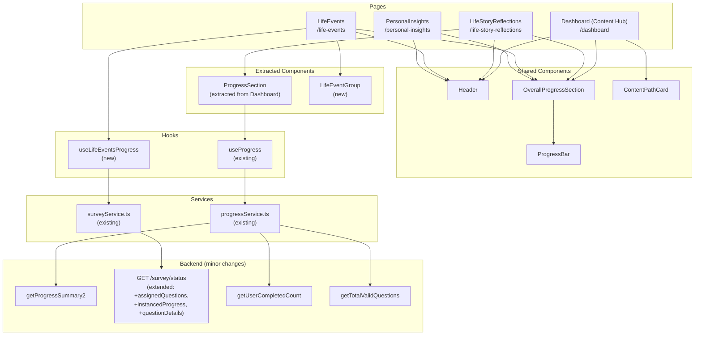
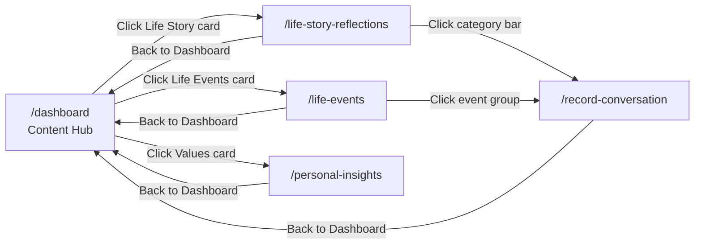
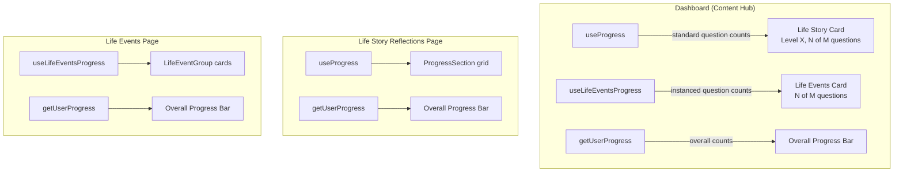

# Design Document: Dashboard Content Hub

## Overview

The Dashboard Content Hub transforms the existing flat Dashboard into a three-path navigation hub. Today, the Dashboard shows a streak counter, info panel, overall progress bar, and a per-category progress grid that mixes standard life-story questions with life-event instanced questions. After this feature, the Dashboard becomes a content hub with three large, visually attractive cards that route to dedicated pages:

1. **Life Story Reflections** — the existing per-category/theme progress grid (standard questions only), moved to its own page at `/life-story-reflections`
2. **Life Events** — a new page at `/life-events` showing instanced questions grouped by life event instance, ordered by lowest difficulty level then alphabetical
3. **Values & Emotions Deep Dive** — a placeholder page at `/personal-insights` with a "Coming Soon" state

The Dashboard retains the StreakCounter, DashboardInfoPanel, and OverallProgressBar at the top. The three content path cards replace the current ProgressSection and "Continue Recording" button.

### Key Design Decisions

1. **Minimal backend change** — One small backend tweak is needed: the `GET /survey/status` Lambda already reads the full `userStatusDB` record but only returns a subset of fields. We add `assignedQuestions` and `instancedProgress` (answered question IDs for instanced questions) to the response. This is a safe, additive change — just including more fields from the same `GetItem` call plus one `Query` to `userQuestionStatusDB`. No new endpoints, no IAM changes (the Lambda already has `GetItem` on `userStatusDB`). A new IAM policy for `dynamodb:Query` on `userQuestionStatusDB` is needed.

2. **New `useLifeEventsProgress` hook** — A new React Query hook fetches the extended `getSurveyStatus` response and computes per-instance-group progress. The hook receives `assignedQuestions.instanced` (question IDs per group), `instancedProgress` (which instanced questions are answered), and question metadata (text, difficulty) in a single API call. This keeps the Life Events page data-fetching clean and cacheable with no N+1 queries.

3. **ProgressSection extracted, not duplicated** — The existing `ProgressSection` component (currently inline in Dashboard.tsx) is extracted into its own file and reused on the Life Story Reflections page. The Dashboard no longer renders it directly.

4. **Card-based navigation with `useNavigate`** — Content path cards use React Router's `useNavigate` for programmatic navigation on click/keyboard, keeping the URL bar in sync and enabling browser back-button support.

5. **Life Events ordering: lowest level first, then alphabetical** — Life event groups are sorted by the minimum difficulty level of their questions (ascending), then alphabetically by event key. This surfaces the easiest questions first without level-gating.

6. **Overall progress bar as shared component** — The `OverallProgressBar` section (white card with title + `ProgressBar`) is extracted into a small shared component used on all four pages (Dashboard, Life Story Reflections, Life Events, Personal Insights).

7. **Question text and difficulty included in survey status response** — Rather than making separate calls to `allQuestionDB` from the frontend for each instanced question, the extended `GET /survey/status` response includes a `questionDetails` map (`questionId` → `{ text, difficulty, questionType }`) for all instanced question IDs. The Lambda already scans `allQuestionDB` during assignment; for the status endpoint, it does a targeted `BatchGetItem` for only the instanced question IDs. This eliminates the need for the frontend to call `getUnansweredQuestionsWithText` per question type.

## Architecture



### Navigation Flow



## Components and Interfaces

### New Components

#### ContentPathCard

A reusable, large navigation card component used on the Dashboard content hub.

```tsx
// FrontEndCode/src/components/ContentPathCard.tsx
interface ContentPathCardProps {
  title: string;
  subtitle: string;
  icon: React.ReactNode;
  progressLabel: string;        // e.g. "12 out of 45 questions"
  levelLabel?: string;          // e.g. "Level 3" — only for Life Story
  accentColor: string;          // Tailwind color class e.g. "border-legacy-purple"
  disabled?: boolean;           // true for Coming Soon cards
  badge?: string;               // e.g. "Coming Soon"
  onClick: () => void;
}
```

Visual design:
- White card with rounded corners (`rounded-xl`), generous padding (`p-6`), and a left accent border (`border-l-4`) using the `accentColor`
- Minimum height of 120px on mobile for comfortable tap targets (well above 48px requirement)
- Icon rendered at 40×40 in a soft-colored circle background matching the accent
- Title in `text-xl font-semibold text-legacy-navy`
- Subtitle in `text-sm text-gray-500`
- Progress label in `text-sm font-medium text-gray-700`
- Level label (when present) as a small `Badge` component in `legacy-purple`
- Chevron right icon (`ChevronRight`) on the right side, vertically centered
- Hover: `shadow-lg` elevation + slight scale (`hover:scale-[1.01]`) with `transition-all duration-200`
- Active/press: `active:scale-[0.99]` for tactile feedback on mobile
- Focus: `focus-visible:ring-2 focus-visible:ring-legacy-purple focus-visible:ring-offset-2`
- Disabled state: `opacity-60 cursor-default` with no hover/active effects
- Keyboard: `role="button"`, `tabIndex={0}`, responds to Enter and Space

Distinct visual accents per card:
- Life Story Reflections: `border-legacy-purple`, purple book/story icon
- Life Events: `border-blue-500`, blue calendar/milestone icon
- Values & Emotions: `border-amber-500`, amber heart/sparkle icon

#### OverallProgressSection

Extracted from the current Dashboard's inline overall progress display.

```tsx
// FrontEndCode/src/components/OverallProgressSection.tsx
interface OverallProgressSectionProps {
  completed: number;
  total: number;
}
```

Renders the white card with "Your Overall Progress" heading, InfoTooltip, and the existing `ProgressBar` component. Used on all four pages.

#### LifeEventGroup

A card component for displaying a single life event instance group on the Life Events page.

```tsx
// FrontEndCode/src/components/LifeEventGroup.tsx
interface LifeEventGroupProps {
  eventKey: string;
  instanceName: string;
  instanceOrdinal: number;
  questions: Array<{
    questionId: string;
    questionText: string;
    isAnswered: boolean;
  }>;
  totalQuestions: number;
  completedQuestions: number;
  onRecord: (questionIds: string[], questionTexts: string[]) => void;
}
```

Visual design:
- White card with rounded corners, left accent border colored by event category
- Header: event label (from `LIFE_EVENT_REGISTRY`) + instance name (e.g., "Got Married — Sarah")
- Progress: `completedQuestions` / `totalQuestions` with a small inline progress bar
- Expandable question list showing each question with a checkmark (answered) or circle (unanswered) icon and the personalized question text
- "Record" button that navigates to the recording flow with unanswered questions for this group
- When all questions in the group are answered, the card shows a completed state with muted styling

### Extracted Components

#### ProgressSection (Extracted)

The existing `ProgressSection` component currently defined inline inside `Dashboard.tsx` is extracted to its own file:

```tsx
// FrontEndCode/src/components/ProgressSection.tsx
interface ProgressSectionProps {
  user: { id: string; personaType: string };
  navigationState?: any;
}
```

This is the same component with the same logic (auto-advance level, per-category progress grid, click-to-record). The only changes:
- Removed the "Continue Recording" button and its associated `handleContinueRecording` function
- Removed the `overallProgress` prop and the inline overall progress display (now handled by `OverallProgressSection` separately)
- The component is imported by `LifeStoryReflections` page

### New Pages

#### LifeStoryReflections (`/life-story-reflections`)

```tsx
// FrontEndCode/src/pages/LifeStoryReflections.tsx
```

Layout:
1. `<Header />`
2. Back to Dashboard button (ghost button with ArrowLeft icon, navigates to `/dashboard`)
3. `<OverallProgressSection />` — fetches via `getUserProgress`
4. `<ProgressSection />` — the extracted component with per-category grid

Uses `useProgress` hook (existing) for category data and `getUserProgress` for overall progress.

#### LifeEvents (`/life-events`)

```tsx
// FrontEndCode/src/pages/LifeEvents.tsx
```

Layout:
1. `<Header />`
2. Back to Dashboard button
3. `<OverallProgressSection />`
4. Life event groups list — one `<LifeEventGroup />` per instance group from `assignedQuestions.instanced`
5. Empty state when no instanced questions assigned

Data flow:
- `useLifeEventsProgress` hook fetches `getSurveyStatus()` to get `assignedQuestions.instanced` and `lifeEventInstances`
- For each instance group, fetches answered status by querying the user's completed questions
- Sorts groups by minimum question difficulty level (ascending), then alphabetically by `eventKey`
- Replaces `instancePlaceholder` tokens in question text with `instanceName`

#### PersonalInsights (`/personal-insights`)

```tsx
// FrontEndCode/src/pages/PersonalInsights.tsx
```

Layout:
1. `<Header />`
2. Back to Dashboard button
3. `<OverallProgressSection />`
4. "Coming Soon" card with description text and a decorative illustration/icon

### New Hooks

#### useLifeEventsProgress

```tsx
// FrontEndCode/src/hooks/useLifeEventsProgress.ts

interface InstanceGroupProgress {
  eventKey: string;
  instanceName: string;
  instanceOrdinal: number;
  questions: Array<{
    questionId: string;
    questionText: string;       // placeholder already replaced with instanceName
    isAnswered: boolean;
    difficulty: number;
  }>;
  totalQuestions: number;
  completedQuestions: number;
  minDifficultyLevel: number;   // lowest difficulty across questions in this group
  eventLabel: string;           // human-readable label from LIFE_EVENT_REGISTRY
}

interface LifeEventsProgressData {
  groups: InstanceGroupProgress[];
  totalQuestions: number;
  completedQuestions: number;
}

function useLifeEventsProgress(userId: string | undefined): UseQueryResult<LifeEventsProgressData>
```

Implementation approach (single API call, no N+1):
1. Call `getSurveyStatus()` which returns the extended response including `assignedQuestions`, `instancedProgress`, and `questionDetails`
2. For each instance group in `assignedQuestions.instanced`:
   a. Look up each `questionId` in `questionDetails` to get `text`, `difficulty`, `questionType`
   b. Replace placeholder tokens in question text with `instanceName` (using `INSTANCEABLE_KEY_TO_PLACEHOLDER` from the registry)
   c. Check if `questionId#eventKey:ordinal` exists in `instancedProgress.answeredKeys` to determine `isAnswered`
   d. Calculate `minDifficultyLevel` as the minimum `difficulty` across all questions in the group
3. Sort groups: ascending by `minDifficultyLevel`, then alphabetically by `eventKey`
4. Sum up `totalQuestions` and `completedQuestions` across all groups

This approach requires exactly one API call (`GET /survey/status`) and does all computation client-side. The response is cached by React Query with a 60-second stale time.

### Modified Components

#### Dashboard.tsx

The Dashboard is significantly simplified:
- Keeps: `Header`, `StreakCounter`, `DashboardInfoPanel`, survey overlay logic
- Adds: `OverallProgressSection`, three `ContentPathCard` components
- Removes: inline `ProgressSection` component, "Continue Recording" button
- The `ProgressSection` is extracted to its own file (not deleted, just moved)

The Dashboard needs to compute progress numbers for each card:
- **Life Story Reflections**: Uses `useProgress` to sum up standard question progress across all categories. The current level comes from `progressItems[0].currentQuestLevel`.
- **Life Events**: Uses `useLifeEventsProgress` to get total/completed instanced questions.
- **Values & Emotions**: Static "0 out of 0".

#### App.tsx

Three new routes added:

```tsx
<Route path="/life-story-reflections" element={
  <ProtectedRoute requiredPersona="legacy_maker">
    <LifeStoryReflections />
  </ProtectedRoute>
} />
<Route path="/life-events" element={
  <ProtectedRoute requiredPersona="legacy_maker">
    <LifeEvents />
  </ProtectedRoute>
} />
<Route path="/personal-insights" element={
  <ProtectedRoute requiredPersona="legacy_maker">
    <PersonalInsights />
  </ProtectedRoute>
} />
```

The existing `ProtectedRoute` already handles survey gating — if `hasCompletedSurvey === false`, it redirects to `/dashboard` where the survey overlay shows. No changes needed to `ProtectedRoute`.

### Routing Changes Summary

| Route | Page | Protection |
|---|---|---|
| `/dashboard` | Dashboard (Content Hub) | `ProtectedRoute requiredPersona="legacy_maker"` |
| `/life-story-reflections` | LifeStoryReflections | `ProtectedRoute requiredPersona="legacy_maker"` |
| `/life-events` | LifeEvents | `ProtectedRoute requiredPersona="legacy_maker"` |
| `/personal-insights` | PersonalInsights | `ProtectedRoute requiredPersona="legacy_maker"` |

All existing routes remain unchanged. The `RecordConversation` page continues to work as-is — it receives question data via `location.state` from whichever page navigates to it.

## Data Models

### Backend Change: Extended `GET /survey/status` Response

The `handle_status` function in `SamLambda/functions/surveyFunctions/survey/app.py` is extended to return three additional fields. The Lambda already reads the full `userStatusDB` record via `GetItem`; we add the `assignedQuestions` field from that same record. We also add a `Query` to `userQuestionStatusDB` to get answered instanced question keys, and a `BatchGetItem` to `allQuestionDB` to get question text and difficulty for instanced questions.

#### IAM Change Required

The SurveyFunction Lambda needs an additional IAM policy statement:

```yaml
- Statement:
    - Effect: Allow
      Action:
        - dynamodb:Query
      Resource: !Sub arn:aws:dynamodb:${AWS::Region}:${AWS::AccountId}:table/userQuestionStatusDB
```

The Lambda already has `dynamodb:Scan` and `dynamodb:Query` on `allQuestionDB`, so no additional permission is needed for the `BatchGetItem` there (note: `BatchGetItem` requires `dynamodb:BatchGetItem` — we need to add this too):

```yaml
# Add to existing allQuestionDB policy:
- dynamodb:BatchGetItem
```

#### Extended Response Shape

```python
# In handle_status(), after existing code:
assigned = item.get('assignedQuestions')

# 1. Include full assignedQuestions structure
# 2. Query userQuestionStatusDB for instanced answered keys (sort keys containing '#')
# 3. BatchGetItem from allQuestionDB for instanced question text + difficulty

response_body = {
    'hasCompletedSurvey': item.get('hasCompletedSurvey', False),
    'selectedLifeEvents': item.get('selectedLifeEvents'),
    'surveyCompletedAt': item.get('surveyCompletedAt'),
    'lifeEventInstances': item.get('lifeEventInstances'),
    'assignedQuestionCount': assigned_question_count,
    'assignedQuestions': assigned,                    # NEW — full structure
    'instancedProgress': {                            # NEW
        'answeredKeys': ['marriage-00001#got_married:1', ...]  # composite sort keys from userQuestionStatusDB
    },
    'questionDetails': {                              # NEW — only for instanced questionIds
        'marriage-00001': { 'text': 'Tell us about...', 'difficulty': 3, 'questionType': 'Love, Romance' },
        ...
    }
}
```

#### Frontend TypeScript Types

```typescript
interface SurveyStatusResponse {
  hasCompletedSurvey: boolean;
  selectedLifeEvents: string[] | null;
  surveyCompletedAt: string | null;
  lifeEventInstances: LifeEventInstanceGroup[] | null;
  assignedQuestionCount: number | null;
  assignedQuestions: AssignedQuestions | null;           // NEW
  instancedProgress: InstancedProgress | null;          // NEW
  questionDetails: Record<string, QuestionDetail> | null; // NEW
}

interface AssignedQuestions {
  standard: string[];
  instanced: InstanceGroup[];
}

interface InstanceGroup {
  eventKey: string;
  instanceName: string;
  instanceOrdinal: number;
  questionIds: string[];
}

interface InstancedProgress {
  answeredKeys: string[];  // composite keys like "questionId#eventKey:ordinal"
}

interface QuestionDetail {
  text: string;
  difficulty: number;
  questionType: string;
}
```

### Existing Data Structures (No Changes)

#### assignedQuestions (existing in userStatusDB)

```json
{
  "standard": ["childhood-00001", "career-00005", "general-00012"],
  "instanced": [
    {
      "eventKey": "got_married",
      "instanceName": "Sarah",
      "instanceOrdinal": 1,
      "questionIds": ["marriage-00001", "marriage-00003"]
    },
    {
      "eventKey": "had_children",
      "instanceName": "Emma",
      "instanceOrdinal": 1,
      "questionIds": ["children-00001", "children-00005"]
    }
  ]
}
```

#### ProgressData (existing in useProgress hook)

```typescript
interface ProgressData {
  questionTypes: string[];
  friendlyNames: string[];
  numValidQuestions: number[];
  progressDataMap: Record<string, number>;
  unansweredQuestionsMap: Record<string, string[]>;
  unansweredQuestionTextsMap: Record<string, string[]>;
  progressItems: ProgressItem[];
}
```

This is used by the Life Story Reflections page (via the extracted ProgressSection) to display per-category progress. The Dashboard also uses it to compute the Life Story card's aggregate progress.

### Frontend State Flow




## Correctness Properties

*A property is a characteristic or behavior that should hold true across all valid executions of a system — essentially, a formal statement about what the system should do. Properties serve as the bridge between human-readable specifications and machine-verifiable correctness guarantees.*

### Property 1: Life Story progress calculation

*For any* set of progress items (each with `numValidQuestions` and `unansweredCount`), the Life Story Reflections card's completed count should equal the sum of `(numValidQuestions[i] - unansweredCount[i])` across all categories, and the total count should equal the sum of `numValidQuestions[i]` across all categories.

**Validates: Requirements 2.3, 12.1**

### Property 2: Life Events total question calculation

*For any* `assignedQuestions.instanced` array (including empty), the Life Events card's total question count should equal the sum of `questionIds.length` across all instance groups, and each instance group's question count should be counted separately (e.g., if two groups each have 3 questions, total is 6).

**Validates: Requirements 3.2, 12.2**

### Property 3: Overall progress excludes personal insights

*For any* `assignedQuestions` structure with `standard` (array of strings) and `instanced` (array of instance groups), the overall progress total should equal `standard.length` plus the sum of `questionIds.length` across all instanced groups, with zero contribution from the Values & Emotions Deep Dive path.

**Validates: Requirements 4.4, 10.3**

### Property 4: Content path card keyboard accessibility

*For any* `ContentPathCard` component that is not disabled, pressing the Enter key or Space key while the card is focused should invoke the card's `onClick` callback exactly once.

**Validates: Requirements 5.5**

### Property 5: Life event group sorting

*For any* list of life event instance groups (each with a `minDifficultyLevel` and `eventKey`), the sorted output should be ordered such that for any two adjacent groups A and B (where A comes before B), either `A.minDifficultyLevel < B.minDifficultyLevel`, or `A.minDifficultyLevel === B.minDifficultyLevel` and `A.eventKey <= B.eventKey` (lexicographic).

**Validates: Requirements 7.3**

### Property 6: Life event grouping completeness and per-group progress

*For any* set of instanced question assignments and *for any* user level, every assigned instanced question should appear in exactly one life event group (no questions omitted, no duplicates across groups, no level gating). Furthermore, for each group, the completed count should equal the number of questions in that group that have been answered, and the total count should equal the group's `questionIds.length`.

**Validates: Requirements 7.2, 7.4, 7.5**

### Property 7: Placeholder token replacement

*For any* question text containing a placeholder token (e.g., `{spouse_name}`, `{child_name}`, `{deceased_name}`) and *for any* non-empty instance name string, replacing the placeholder with the instance name should produce a string that contains the instance name and does not contain the original placeholder token.

**Validates: Requirements 8.3**

### Property 8: Progress consistency across pages

*For any* user session, the overall progress bar's completed count and total count should be identical on the Content Hub, Life Story Reflections page, Life Events page, and Personal Insights page, because all pages use the same `getUserProgress` service function and the same underlying data.

**Validates: Requirements 10.2**

## Error Handling

### Data Fetching Errors

| Scenario | Behavior |
|---|---|
| `useProgress` fails on Dashboard | Life Story card shows "—" for progress, card still navigable |
| `useProgress` fails on Life Story Reflections page | ProgressSection shows error message with retry button (existing behavior) |
| `useLifeEventsProgress` fails on Dashboard | Life Events card shows "—" for progress, card still navigable |
| `useLifeEventsProgress` fails on Life Events page | Full-page error state with "Something went wrong" message and retry button |
| `getUserProgress` fails | Overall progress bar shows skeleton/loading state, does not block page rendering |
| `getSurveyStatus` fails (no assignedQuestions) | Life Events card shows "0 out of 0", Life Events page shows empty state |

### Navigation Edge Cases

| Scenario | Behavior |
|---|---|
| User navigates to `/life-events` before completing survey | `ProtectedRoute` redirects to `/dashboard` where survey overlay shows |
| User navigates to `/life-story-reflections` directly via URL | Page loads normally if authenticated and survey completed; otherwise redirected |
| User navigates to `/personal-insights` and clicks browser back | Returns to previous page (standard React Router history behavior) |
| `assignedQuestions` is null/undefined | Life Events card shows empty state; Life Story card uses existing progress data (backward compatible) |
| `assignedQuestions` is legacy flat list format | Treat as `{ standard: <flat list>, instanced: [] }` — Life Events shows empty state |

### Loading States

- Dashboard: Skeleton cards while `useProgress` and `useLifeEventsProgress` load
- Life Story Reflections: Skeleton grid while `useProgress` loads (existing ProgressSection behavior)
- Life Events: Skeleton cards while `useLifeEventsProgress` loads
- Personal Insights: No loading state needed (static content)
- Overall Progress Bar: Skeleton bar while `getUserProgress` loads

## Testing Strategy

### Dual Testing Approach

This feature requires both unit tests and property-based tests for comprehensive coverage.

**Unit tests** cover:
- Component rendering (each page renders expected elements)
- Navigation behavior (card clicks navigate to correct routes)
- Empty states and edge cases
- Error states with retry
- Survey gating redirects on new routes
- Keyboard accessibility of ContentPathCard

**Property-based tests** cover:
- Progress calculation correctness across random input sets
- Sorting algorithm correctness for life event groups
- Placeholder replacement for arbitrary strings
- Grouping completeness (no questions lost or duplicated)

### Property-Based Testing Configuration

- Library: **fast-check** (already available in the JS/TS ecosystem, works with Vitest)
- Minimum iterations: **100** per property test
- Each property test must reference its design document property with a comment tag

Tag format: `Feature: dashboard-content-hub, Property {number}: {property_text}`

### Test File Structure

```
FrontEndCode/src/components/__tests__/
  ContentPathCard.test.tsx        — unit + property tests for card component
  OverallProgressSection.test.tsx — unit tests for progress display
  LifeEventGroup.test.tsx         — unit tests for event group card

FrontEndCode/src/pages/__tests__/
  Dashboard.test.tsx              — unit tests for content hub layout
  LifeStoryReflections.test.tsx   — unit tests for page rendering
  LifeEvents.test.tsx             — unit tests for page rendering + empty state
  PersonalInsights.test.tsx       — unit tests for placeholder page

FrontEndCode/src/hooks/__tests__/
  useLifeEventsProgress.test.ts   — unit + property tests for hook logic

FrontEndCode/src/__tests__/
  progress-calculations.property.test.ts  — property tests for Properties 1-3, 6
  sorting.property.test.ts                — property test for Property 5
  placeholder-replacement.property.test.ts — property test for Property 7
```

### Property Test Implementation Notes

Each correctness property maps to a single property-based test:

| Property | Test | Generator Strategy |
|---|---|---|
| Property 1: Life Story progress | Generate random arrays of `{numValidQuestions, unansweredCount}` | `fc.array(fc.record({total: fc.nat({max:100}), unanswered: fc.nat({max:100})}))` with constraint `unanswered <= total` |
| Property 2: Life Events total | Generate random arrays of instance groups with random `questionIds` arrays | `fc.array(fc.record({questionIds: fc.array(fc.string())}))` |
| Property 3: Overall progress | Generate random `{standard: string[], instanced: [{questionIds: string[]}]}` | Combine generators for standard and instanced |
| Property 4: Keyboard accessibility | Generate random card props, simulate keydown events | `fc.oneof(fc.constant('Enter'), fc.constant(' '))` |
| Property 5: Sorting | Generate random arrays of `{minDifficultyLevel: number, eventKey: string}` | `fc.array(fc.record({level: fc.nat({max:10}), key: fc.string()}))` |
| Property 6: Grouping completeness | Generate random instanced assignments with random answered sets | Combine instance group generator with random answered subset |
| Property 7: Placeholder replacement | Generate random question texts with placeholder tokens and random instance names | `fc.tuple(fc.string(), fc.oneof(...placeholders), fc.string({minLength:1}))` |
| Property 8: Progress consistency | Covered by Properties 1-3 (same function produces same output) | No separate generator needed — this is an architectural property verified by unit tests |
