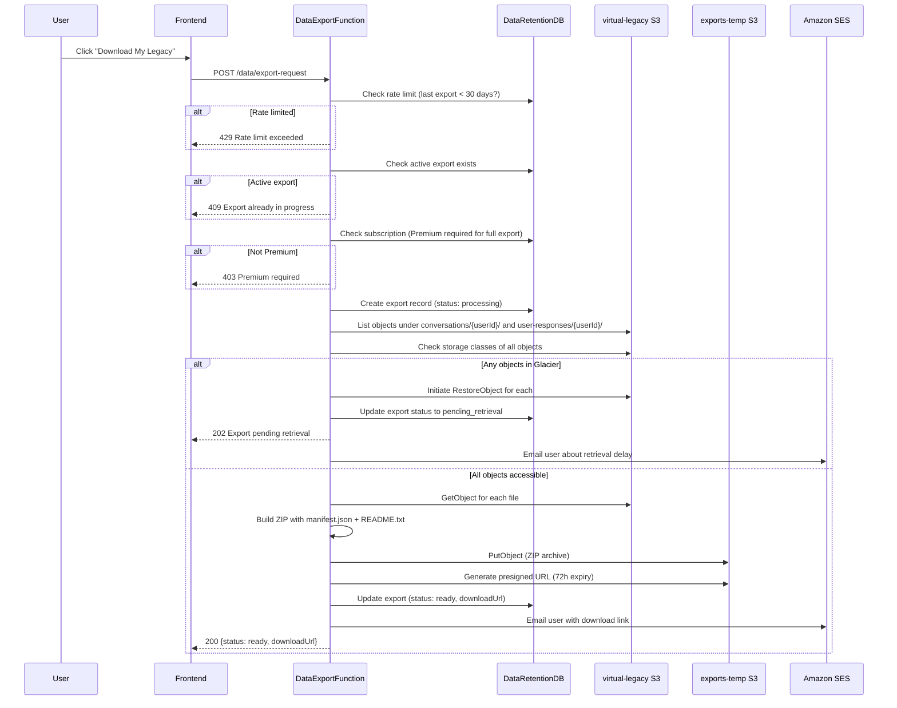
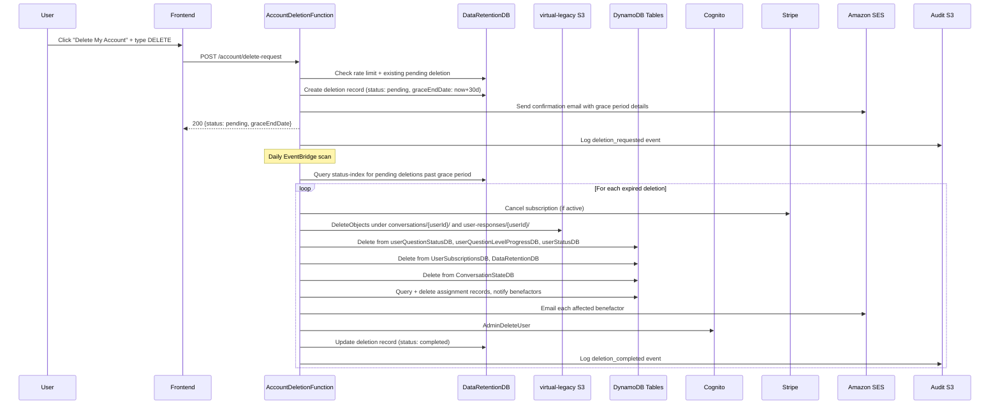
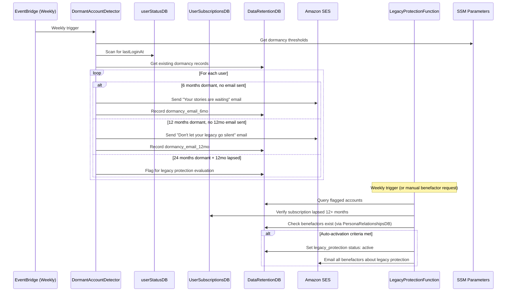
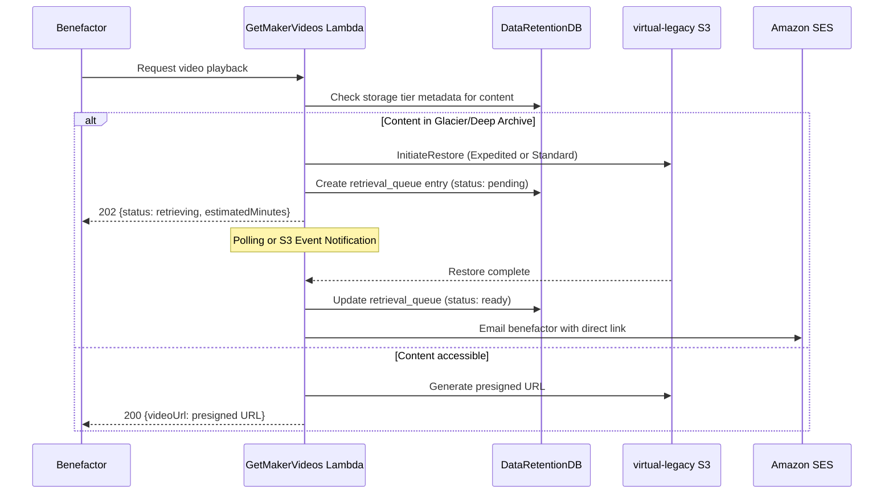
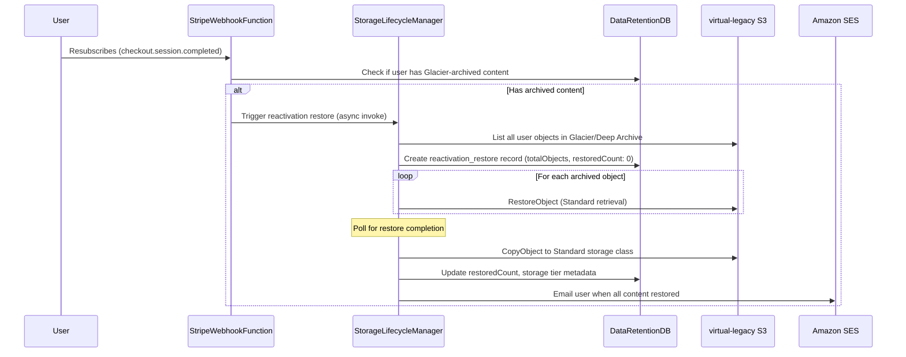

# Design Document: Data Retention Lifecycle

## Overview

This design introduces a comprehensive data retention, export, and account lifecycle system for SoulReel — a legacy preservation platform where user content (video recordings, transcripts, AI conversation summaries) is irreplaceable and intended to outlive the creator. The system must balance regulatory compliance (GDPR Articles 17/20, CCPA), sustainable storage costs at scale, and the platform's core promise: content is never lost.

The feature adds six backend services (Lambda functions), a new DynamoDB table (DataRetentionDB), a dedicated audit log S3 bucket, S3 lifecycle policies on the existing `virtual-legacy` bucket, a new frontend Data & Privacy page, and admin testing/simulation endpoints. All new infrastructure follows existing SAM/Python patterns: python3.12, arm64, SharedUtilsLayer, explicit IAM policies, KMS encryption via DataEncryptionKey, and CORS via `cors_headers(event)`.

### Key Design Goals

1. **Content preservation by default**: No content is ever deleted without an explicit user request and a 30-day grace period. Dormancy triggers re-engagement emails, not deletion.
2. **Cost sustainability**: S3 Intelligent-Tiering after 30 days, Glacier Deep Archive for legacy-protected content with no recent benefactor access. Per-user cost tracking.
3. **Regulatory compliance**: Self-service data export (Premium: full Content_Package; all users: lightweight GDPR JSON), account deletion with cascading cleanup, audit trail with 3-year retention.
4. **Legacy protection**: Deceased creators' content is preserved indefinitely for benefactors at minimal cost, exempt from all cleanup processes.
5. **Testability**: All time thresholds are SSM-configurable, all lifecycle functions accept simulated time, admin endpoints enable end-to-end scenario testing.

### Key Flows

- **Data Export**: User requests export → Lambda packages S3 content + DynamoDB data into ZIP → uploads to temp S3 location → sends presigned URL via SES email. Premium-only for full export; GDPR text-only export available to all.
- **Auto-Export on Cancellation**: Stripe webhook `customer.subscription.deleted` → triggers automatic Content_Package export as courtesy.
- **Storage Lifecycle**: Weekly EventBridge → Lambda reconciles per-user storage metrics, applies S3 lifecycle transitions, archives legacy-protected content to Glacier Deep Archive.
- **Glacier Retrieval**: Benefactor requests archived content → system returns HTTP 202 with ETA → initiates S3 RestoreObject → polls/event notification → emails benefactor when ready.
- **Account Deletion**: User requests deletion → 30-day grace period → daily EventBridge scan → cascading delete across S3, DynamoDB, Cognito → audit log → benefactor notification.
- **Dormancy Detection**: Weekly EventBridge → scan userStatusDB for inactive accounts → escalating SES re-engagement emails at 6/12/24 months → flag for legacy protection evaluation.
- **Legacy Protection**: Auto-activated (24mo dormant + 12mo lapsed + benefactors exist) or manually by benefactor request → content preserved indefinitely, exempt from cleanup.
- **Reactivation Restore**: Lapsed user resubscribes → bulk S3 RestoreObject from Glacier → track progress in DataRetentionDB → email when complete.

### Design Decisions and Rationale

| Decision | Rationale |
|----------|-----------|
| **Single DataRetentionDB table with composite key (userId + recordType)** | All lifecycle state for a user lives in one table. The `recordType` sort key enables multiple record types per user (export, deletion, dormancy, legacy protection, retrieval queue, storage metrics) without separate tables. Follows DynamoDB single-table design for related entities. |
| **Separate audit log S3 bucket with Object Lock** | Regulatory requirement: audit logs must be tamper-proof and retained for 3 years. Object Lock in compliance mode prevents deletion even by root. Separate from user content bucket to avoid lifecycle policy conflicts. |
| **S3 lifecycle policy on `virtual-legacy` bucket for Intelligent-Tiering** | Intelligent-Tiering after 30 days is a bucket-level lifecycle rule — no Lambda needed. The Storage_Lifecycle_Manager handles Glacier Deep Archive transitions selectively (only legacy-protected content with no recent access), which requires per-user logic that can't be done with bucket-level rules alone. |
| **Weekly EventBridge schedule for lifecycle functions** | Dormancy detection, storage reconciliation, and legacy protection evaluation are not time-critical. Weekly runs reduce Lambda invocations and cost. Deletion processing runs daily (grace period precision matters). |
| **Expedited retrieval for Intelligent-Tiering archive, Standard for Glacier Deep Archive** | Intelligent-Tiering archive access tier supports Expedited retrieval (1-5 min). Glacier Deep Archive only supports Standard (3-5 hours). Using the fastest available tier per storage class minimizes benefactor wait time. |
| **Lightweight GDPR export separate from full Content_Package** | GDPR Article 20 requires data portability for all users regardless of payment. The lightweight export (JSON text only, no videos) is cheap to produce and doesn't require Glacier retrieval. Full export with videos is a Premium feature to manage egress costs. |
| **SSM Parameter Store for all time thresholds** | Enables runtime configuration changes without redeployment. Critical for testing (can set dormancy threshold to 1 day) and for adjusting policy as the platform scales. Follows existing pattern from billing feature. |
| **`simulatedCurrentTime` parameter in lifecycle functions** | Enables deterministic testing of time-dependent logic. Gated behind SSM `testing-mode` flag so it's never active in production. Cheaper and more reliable than manipulating system clocks or waiting real time. |
| **Auto-export on subscription cancellation** | Builds trust — users know their data is safe even if they leave. Reduces support burden. Skips if user already exported recently (prevents duplicate work). |
| **Legacy Protection absorbs storage cost** | Core product promise. Glacier Deep Archive costs ~$0.00099/GB/month. A typical user with 5GB of video costs ~$0.005/month to preserve indefinitely. This is a rounding error compared to the brand value of "your stories live forever." |
| **Benefactor access maintained on subscription lapse** | Existing system already preserves content on lapse (reverts to Free tier). This design formalizes that: benefactor access is never revoked by payment status, only by explicit user action or account deletion. |
| **Admin simulation endpoints gated by SSM testing-mode** | Defense in depth. Even if an admin accidentally calls simulation endpoints in production, they return 403 unless the SSM flag is explicitly set. The flag defaults to `disabled`. |
| **Deletion audit uses SHA-256 hashed user IDs** | Audit log must not contain PII per Requirement 11. One-way hash preserves the ability to correlate events for a specific user (if you have the original userId) without storing the userId itself. |
| **Separate Lambda per lifecycle concern** | Data_Export_Service, Account_Deletion_Service, Dormant_Account_Detector, Storage_Lifecycle_Manager, and Legacy_Protection_Service are separate Lambdas. Each has different IAM needs, timeout requirements, and trigger patterns. Follows existing pattern (BillingFunction vs CouponExpirationFunction vs WinBackFunction). |
| **Reactivation restore tracked in DataRetentionDB** | Glacier restores are async (hours). Tracking progress (objects total vs restored) in DynamoDB lets the frontend show a progress indicator and lets the system email the user when complete. |

## Architecture

### High-Level Architecture

```mermaid
graph TB
    subgraph Frontend["Frontend (React + TypeScript)"]
        YDP["/your-data Page"]
        UM[UserMenu + 'Your Data' item]
        SC[SubscriptionContext]
        DRS[dataRetentionService.ts]
    end

    subgraph APIGateway["API Gateway (REST)"]
        AUTH_EP["Authenticated Endpoints<br/>/data/export-request POST<br/>/data/gdpr-export POST<br/>/data/export-status GET<br/>/account/delete-request POST<br/>/account/cancel-deletion POST<br/>/account/deletion-status GET<br/>/legacy/protection-request POST"]
        ADMIN_EP["Admin Endpoints<br/>/admin/storage-report GET<br/>/admin/lifecycle/simulate POST<br/>/admin/lifecycle/set-timestamps POST<br/>/admin/lifecycle/run-scenario POST<br/>/admin/storage/simulate-tier POST<br/>/admin/storage/clear-simulation POST"]
    end

    subgraph Lambdas["Lambda Functions"]
        DES[DataExportFunction<br/>Cognito Auth]
        ADS[AccountDeletionFunction<br/>Cognito Auth + EventBridge Daily]
        DAD[DormantAccountDetector<br/>EventBridge Weekly]
        SLM[StorageLifecycleManager<br/>EventBridge Weekly + Admin API]
        LPS[LegacyProtectionFunction<br/>Cognito Auth + EventBridge Weekly]
        ALF[AdminLifecycleFunction<br/>Cognito Auth + Admin Only]
        SWF[StripeWebhookFunction<br/>existing — modified]
        GMV[GetMakerVideos<br/>existing — modified]
    end

    subgraph Storage["Storage"]
        DRDB[(DataRetentionDB<br/>DynamoDB)]
        VLB[(virtual-legacy<br/>S3 Bucket)]
        TMPB[(soulreel-exports-temp<br/>S3 Bucket)]
        AUDB[(soulreel-retention-audit<br/>S3 Bucket + Object Lock)]
        SSM[(SSM Parameter Store<br/>/soulreel/data-retention/*)]
    end

    subgraph ExistingDB["Existing DynamoDB Tables"]
        USDB[(userStatusDB)]
        UQSDB[(userQuestionStatusDB)]
        UQLPDB[(userQuestionLevelProgressDB)]
        USUBS[(UserSubscriptionsDB)]
    end

    subgraph External["External"]
        SES[Amazon SES]
        STRIPE[Stripe API]
        COGNITO[Cognito User Pool]
    end

    YDP --> DRS --> AUTH_EP
    UM --> YDP

    AUTH_EP --> DES
    AUTH_EP --> ADS
    AUTH_EP --> LPS
    ADMIN_EP --> ALF
    ADMIN_EP --> SLM

    DES --> DRDB
    DES --> VLB
    DES --> TMPB
    DES --> SES
    DES --> UQSDB
    DES --> SSM

    ADS --> DRDB
    ADS --> VLB
    ADS --> AUDB
    ADS --> SES
    ADS --> STRIPE
    ADS --> COGNITO
    ADS --> USUBS
    ADS --> UQSDB
    ADS --> UQLPDB
    ADS --> USDB

    DAD --> DRDB
    DAD --> USDB
    DAD --> USUBS
    DAD --> SES
    DAD --> SSM

    SLM --> DRDB
    SLM --> VLB
    SLM --> SSM
    SLM --> SES

    LPS --> DRDB
    LPS --> USDB
    LPS --> USUBS
    LPS --> SES
    LPS --> SSM

    ALF --> DRDB
    ALF --> USDB
    ALF --> USUBS
    ALF --> SSM
    ALF --> AUDB

    SWF -.->|auto-export trigger| DES
    GMV -.->|storage tier check| DRDB
```




### Data Export Flow



### Account Deletion Flow



### Dormancy Detection and Legacy Protection Flow



### Glacier Retrieval Flow (Benefactor Access)



### Reactivation Restore Flow




## Components and Interfaces

### Backend Components

#### 1. DataRetentionDB Table (DynamoDB)

New table added to `SamLambda/template.yml`. Follows existing table patterns: PAY_PER_REQUEST, KMS-encrypted with `DataEncryptionKey`, PITR enabled.

**Table Configuration:**
- Table Name: `DataRetentionDB`
- Partition Key: `userId` (String) — Cognito `sub`
- Sort Key: `recordType` (String) — e.g., `export_request`, `deletion_request`, `dormancy_state`, `legacy_protection`, `retrieval_queue#<s3Key>`, `storage_metrics`, `reactivation_restore`
- Billing Mode: PAY_PER_REQUEST
- Encryption: KMS with `DataEncryptionKey`
- PITR: Enabled
- TTL Attribute: `expiresAt` (for auto-cleanup of completed exports and resolved retrieval entries)
- GSI: `status-index` (PK: `status`, SK: `updatedAt`) — enables efficient queries for pending deletions, active retrievals, dormant accounts

**Validates: Requirements 12.1–12.6**

**SAM Template Definition:**
```yaml
DataRetentionTable:
  Type: AWS::DynamoDB::Table
  Properties:
    TableName: DataRetentionDB
    BillingMode: PAY_PER_REQUEST
    AttributeDefinitions:
      - AttributeName: userId
        AttributeType: S
      - AttributeName: recordType
        AttributeType: S
      - AttributeName: status
        AttributeType: S
      - AttributeName: updatedAt
        AttributeType: S
    KeySchema:
      - AttributeName: userId
        KeyType: HASH
      - AttributeName: recordType
        KeyType: RANGE
    GlobalSecondaryIndexes:
      - IndexName: status-index
        KeySchema:
          - AttributeName: status
            KeyType: HASH
          - AttributeName: updatedAt
            KeyType: RANGE
        Projection:
          ProjectionType: ALL
    TimeToLiveSpecification:
      AttributeName: expiresAt
      Enabled: true
    SSESpecification:
      SSEEnabled: true
      SSEType: KMS
      KMSMasterKeyId: !GetAtt DataEncryptionKey.Arn
    PointInTimeRecoverySpecification:
      PointInTimeRecoveryEnabled: true
```

#### 2. Audit Log S3 Bucket (soulreel-retention-audit)

Dedicated S3 bucket for data lifecycle audit logs. Separate from the existing `soulreel-audit-logs` CloudTrail bucket.

**Configuration:**
- Bucket Name: `soulreel-retention-audit-{AccountId}`
- Encryption: KMS with `DataEncryptionKey`, BucketKeyEnabled
- Public Access: All blocked
- Object Lock: Enabled, Compliance mode, 3-year retention
- Lifecycle: No expiration (Object Lock prevents deletion for 3 years; after 3 years, a lifecycle rule transitions to Glacier Deep Archive)
- Versioning: Enabled (required for Object Lock)

**Validates: Requirements 11.1–11.4**

**SAM Template Definition:**
```yaml
RetentionAuditBucket:
  Type: AWS::S3::Bucket
  Properties:
    BucketName: !Sub soulreel-retention-audit-${AWS::AccountId}
    ObjectLockEnabled: true
    ObjectLockConfiguration:
      ObjectLockEnabled: Enabled
      Rule:
        DefaultRetention:
          Mode: COMPLIANCE
          Years: 3
    VersioningConfiguration:
      Status: Enabled
    BucketEncryption:
      ServerSideEncryptionConfiguration:
        - ServerSideEncryptionByDefault:
            SSEAlgorithm: aws:kms
            KMSMasterKeyID: !GetAtt DataEncryptionKey.Arn
          BucketKeyEnabled: true
    PublicAccessBlockConfiguration:
      BlockPublicAcls: true
      BlockPublicPolicy: true
      IgnorePublicAcls: true
      RestrictPublicBuckets: true
    LifecycleConfiguration:
      Rules:
        - Id: ArchiveAfterRetention
          Status: Enabled
          Transitions:
            - TransitionInDays: 1095
              StorageClass: DEEP_ARCHIVE
    Tags:
      - Key: Project
        Value: SoulReel
      - Key: Purpose
        Value: DataRetentionAudit
```

#### 3. Exports Temp S3 Bucket (soulreel-exports-temp)

Temporary bucket for Content_Package ZIP archives. Objects auto-expire after 7 days.

**Configuration:**
- Bucket Name: `soulreel-exports-temp-{AccountId}`
- Encryption: KMS with `DataEncryptionKey`, BucketKeyEnabled
- Public Access: All blocked
- Lifecycle: Expire all objects after 7 days
- No versioning, no Object Lock (temporary data)

**SAM Template Definition:**
```yaml
ExportsTempBucket:
  Type: AWS::S3::Bucket
  Properties:
    BucketName: !Sub soulreel-exports-temp-${AWS::AccountId}
    BucketEncryption:
      ServerSideEncryptionConfiguration:
        - ServerSideEncryptionByDefault:
            SSEAlgorithm: aws:kms
            KMSMasterKeyID: !GetAtt DataEncryptionKey.Arn
          BucketKeyEnabled: true
    PublicAccessBlockConfiguration:
      BlockPublicAcls: true
      BlockPublicPolicy: true
      IgnorePublicAcls: true
      RestrictPublicBuckets: true
    LifecycleConfiguration:
      Rules:
        - Id: ExpireExports
          Status: Enabled
          ExpirationInDays: 7
    Tags:
      - Key: Project
        Value: SoulReel
      - Key: Purpose
        Value: DataExportTemp
```

#### 4. S3 Lifecycle Policy on virtual-legacy Bucket

The `virtual-legacy` bucket is not managed by CloudFormation (created via AWS console). The S3 Intelligent-Tiering lifecycle rule must be applied manually or via a one-time CLI command:

```bash
aws s3api put-bucket-lifecycle-configuration \
  --bucket virtual-legacy \
  --lifecycle-configuration '{
    "Rules": [
      {
        "ID": "IntelligentTieringConversations",
        "Status": "Enabled",
        "Filter": { "Prefix": "conversations/" },
        "Transitions": [
          { "Days": 30, "StorageClass": "INTELLIGENT_TIERING" }
        ]
      },
      {
        "ID": "IntelligentTieringUserResponses",
        "Status": "Enabled",
        "Filter": { "Prefix": "user-responses/" },
        "Transitions": [
          { "Days": 30, "StorageClass": "INTELLIGENT_TIERING" }
        ]
      }
    ]
  }'
```

**Note:** Glacier Deep Archive transitions are NOT done via bucket lifecycle rules. They are handled selectively by the Storage_Lifecycle_Manager Lambda for legacy-protected content only, because the transition criteria depend on per-user state (legacy protection status, last benefactor access date) that S3 lifecycle rules cannot evaluate.

**Validates: Requirements 3.1**

#### 5. DataExportFunction (Lambda)

Handles data export requests: full Content_Package (Premium) and lightweight GDPR export (all users).

**Location:** `SamLambda/functions/dataRetentionFunctions/dataExport/app.py`

| Endpoint | Method | Auth | Handler |
|----------|--------|------|---------|
| `/data/export-request` | POST | CognitoAuthorizer | `handle_export_request()` |
| `/data/gdpr-export` | POST | CognitoAuthorizer | `handle_gdpr_export()` |
| `/data/export-status` | GET | CognitoAuthorizer | `handle_export_status()` |

**Environment Variables:**
- `TABLE_DATA_RETENTION`: `!Ref DataRetentionTable`
- `TABLE_SUBSCRIPTIONS`: `UserSubscriptionsDB` (from Globals)
- `TABLE_QUESTION_STATUS`: `userQuestionStatusDB` (from Globals)
- `S3_BUCKET`: `virtual-legacy` (from Globals)
- `EXPORTS_BUCKET`: `!Ref ExportsTempBucket`
- `AUDIT_BUCKET`: `!Ref RetentionAuditBucket`
- `SENDER_EMAIL`: `noreply@soulreel.net`
- `FRONTEND_URL`: `https://www.soulreel.net`

**IAM Policies:**
```yaml
Policies:
  - Statement:
      - Effect: Allow
        Action:
          - dynamodb:GetItem
          - dynamodb:PutItem
          - dynamodb:UpdateItem
          - dynamodb:Query
        Resource:
          - !GetAtt DataRetentionTable.Arn
          - !Sub ${DataRetentionTable.Arn}/index/*
  - Statement:
      - Effect: Allow
        Action:
          - dynamodb:GetItem
        Resource:
          - !Sub arn:aws:dynamodb:${AWS::Region}:${AWS::AccountId}:table/UserSubscriptionsDB
  - Statement:
      - Effect: Allow
        Action:
          - dynamodb:Query
        Resource:
          - !Sub arn:aws:dynamodb:${AWS::Region}:${AWS::AccountId}:table/userQuestionStatusDB
  - Statement:
      - Effect: Allow
        Action:
          - s3:GetObject
          - s3:ListBucket
          - s3:HeadObject
        Resource:
          - arn:aws:s3:::virtual-legacy
          - arn:aws:s3:::virtual-legacy/*
  - Statement:
      - Effect: Allow
        Action:
          - s3:PutObject
          - s3:GetObject
        Resource:
          - !Sub ${ExportsTempBucket.Arn}/*
  - Statement:
      - Effect: Allow
        Action:
          - s3:RestoreObject
        Resource:
          - arn:aws:s3:::virtual-legacy/*
  - Statement:
      - Effect: Allow
        Action:
          - s3:PutObject
        Resource:
          - !Sub ${RetentionAuditBucket.Arn}/*
  - Statement:
      - Effect: Allow
        Action:
          - ses:SendEmail
        Resource: '*'
  - Statement:
      - Effect: Allow
        Action:
          - ssm:GetParameter
        Resource:
          - !Sub arn:aws:ssm:${AWS::Region}:${AWS::AccountId}:parameter/soulreel/data-retention/*
  - Statement:
      - Effect: Allow
        Action:
          - kms:Decrypt
          - kms:DescribeKey
          - kms:GenerateDataKey
        Resource: !GetAtt DataEncryptionKey.Arn
```

**SAM Events (with OPTIONS for CORS):**
```yaml
Events:
  ExportRequest:
    Type: Api
    Properties:
      Path: /data/export-request
      Method: POST
      Auth:
        Authorizer: CognitoAuthorizer
  ExportRequestOptions:
    Type: Api
    Properties:
      Path: /data/export-request
      Method: OPTIONS
  GdprExport:
    Type: Api
    Properties:
      Path: /data/gdpr-export
      Method: POST
      Auth:
        Authorizer: CognitoAuthorizer
  GdprExportOptions:
    Type: Api
    Properties:
      Path: /data/gdpr-export
      Method: OPTIONS
  ExportStatus:
    Type: Api
    Properties:
      Path: /data/export-status
      Method: GET
      Auth:
        Authorizer: CognitoAuthorizer
  ExportStatusOptions:
    Type: Api
    Properties:
      Path: /data/export-status
      Method: OPTIONS
```

**Runtime Configuration:**
- Runtime: python3.12
- Architecture: arm64
- Timeout: 900 (15 min)
- MemorySize: 512
- EphemeralStorage: 10240 (10GB for ZIP assembly)
- Layers: `!Ref SharedUtilsLayer`

**Note:** DataExportFunction also needs access to PersonaRelationshipsDB (for benefactor list in GDPR export) and userStatusDB (for user profile data). Additional IAM statements:
```yaml
  - Statement:
      - Effect: Allow
        Action:
          - dynamodb:Query
        Resource:
          - !GetAtt PersonaRelationshipsTable.Arn
          - !Sub ${PersonaRelationshipsTable.Arn}/index/*
  - Statement:
      - Effect: Allow
        Action:
          - dynamodb:GetItem
        Resource:
          - !Sub arn:aws:dynamodb:${AWS::Region}:${AWS::AccountId}:table/userStatusDB
```

**Validates: Requirements 1.1–1.9, 2.1–2.4, 6.1–6.7, 16.1**

#### 6. AccountDeletionFunction (Lambda)

Handles deletion requests, cancellations, and daily grace period processing.

**Location:** `SamLambda/functions/dataRetentionFunctions/accountDeletion/app.py`

| Endpoint | Method | Auth | Handler |
|----------|--------|------|---------|
| `/account/delete-request` | POST | CognitoAuthorizer | `handle_delete_request()` |
| `/account/cancel-deletion` | POST | CognitoAuthorizer | `handle_cancel_deletion()` |
| `/account/deletion-status` | GET | CognitoAuthorizer | `handle_deletion_status()` |
| (EventBridge daily) | — | — | `handle_process_deletions()` |

**Environment Variables:**
- `TABLE_DATA_RETENTION`: `!Ref DataRetentionTable`
- `TABLE_SUBSCRIPTIONS`: `UserSubscriptionsDB` (from Globals)
- `TABLE_QUESTION_STATUS`: `userQuestionStatusDB` (from Globals)
- `TABLE_QUESTION_PROGRESS`: `userQuestionLevelProgressDB` (from Globals)
- `TABLE_USER_STATUS`: `userStatusDB` (from Globals)
- `TABLE_RELATIONSHIPS`: `PersonaRelationshipsDB` (from Globals)
- `S3_BUCKET`: `virtual-legacy` (from Globals)
- `AUDIT_BUCKET`: `!Ref RetentionAuditBucket`
- `SENDER_EMAIL`: `noreply@soulreel.net`
- `FRONTEND_URL`: `https://www.soulreel.net`
- `COGNITO_USER_POOL_ID`: `!Ref ExistingUserPoolId`

**IAM Policies:**
```yaml
Policies:
  - Statement:
      - Effect: Allow
        Action:
          - dynamodb:GetItem
          - dynamodb:PutItem
          - dynamodb:UpdateItem
          - dynamodb:DeleteItem
          - dynamodb:Query
        Resource:
          - !GetAtt DataRetentionTable.Arn
          - !Sub ${DataRetentionTable.Arn}/index/*
  - Statement:
      - Effect: Allow
        Action:
          - dynamodb:DeleteItem
          - dynamodb:Query
        Resource:
          - !Sub arn:aws:dynamodb:${AWS::Region}:${AWS::AccountId}:table/userQuestionStatusDB
          - !Sub arn:aws:dynamodb:${AWS::Region}:${AWS::AccountId}:table/userQuestionLevelProgressDB
          - !Sub arn:aws:dynamodb:${AWS::Region}:${AWS::AccountId}:table/userStatusDB
  - Statement:
      - Effect: Allow
        Action:
          - dynamodb:DeleteItem
          - dynamodb:GetItem
        Resource:
          - !Sub arn:aws:dynamodb:${AWS::Region}:${AWS::AccountId}:table/UserSubscriptionsDB
  - Statement:
      - Effect: Allow
        Action:
          - dynamodb:Query
          - dynamodb:DeleteItem
        Resource:
          - !GetAtt PersonaRelationshipsTable.Arn
          - !Sub ${PersonaRelationshipsTable.Arn}/index/*
  - Statement:
      - Effect: Allow
        Action:
          - dynamodb:DeleteItem
          - dynamodb:Query
        Resource:
          - !GetAtt ConversationStateTable.Arn
  - Statement:
      - Effect: Allow
        Action:
          - s3:DeleteObject
          - s3:ListBucket
        Resource:
          - arn:aws:s3:::virtual-legacy
          - arn:aws:s3:::virtual-legacy/*
  - Statement:
      - Effect: Allow
        Action:
          - s3:PutObject
        Resource:
          - !Sub ${RetentionAuditBucket.Arn}/*
  - Statement:
      - Effect: Allow
        Action:
          - ses:SendEmail
        Resource: '*'
  - Statement:
      - Effect: Allow
        Action:
          - ssm:GetParameter
        Resource:
          - !Sub arn:aws:ssm:${AWS::Region}:${AWS::AccountId}:parameter/soulreel/stripe/*
          - !Sub arn:aws:ssm:${AWS::Region}:${AWS::AccountId}:parameter/soulreel/data-retention/*
  - Statement:
      - Effect: Allow
        Action:
          - cognito-idp:AdminDeleteUser
        Resource: !Ref ExistingUserPoolArn
  - Statement:
      - Effect: Allow
        Action:
          - kms:Decrypt
          - kms:DescribeKey
          - kms:GenerateDataKey
        Resource: !GetAtt DataEncryptionKey.Arn
```

**SAM Events:**
```yaml
Events:
  DeleteRequest:
    Type: Api
    Properties:
      Path: /account/delete-request
      Method: POST
      Auth:
        Authorizer: CognitoAuthorizer
  DeleteRequestOptions:
    Type: Api
    Properties:
      Path: /account/delete-request
      Method: OPTIONS
  CancelDeletion:
    Type: Api
    Properties:
      Path: /account/cancel-deletion
      Method: POST
      Auth:
        Authorizer: CognitoAuthorizer
  CancelDeletionOptions:
    Type: Api
    Properties:
      Path: /account/cancel-deletion
      Method: OPTIONS
  DeletionStatus:
    Type: Api
    Properties:
      Path: /account/deletion-status
      Method: GET
      Auth:
        Authorizer: CognitoAuthorizer
  DeletionStatusOptions:
    Type: Api
    Properties:
      Path: /account/deletion-status
      Method: OPTIONS
  DailyDeletionScan:
    Type: Schedule
    Properties:
      Schedule: 'rate(1 day)'
      Description: Process pending account deletions past grace period
      Enabled: true
```

**Runtime Configuration:**
- Runtime: python3.12
- Architecture: arm64
- Timeout: 300 (5 min)
- MemorySize: 256
- Layers: `!Ref SharedUtilsLayer`, `!Ref StripeDependencyLayer` (for Stripe subscription cancellation)

**Additional IAM for EngagementDB and AccessConditionsDB cleanup:**
```yaml
  - Statement:
      - Effect: Allow
        Action:
          - dynamodb:DeleteItem
          - dynamodb:GetItem
        Resource:
          - !GetAtt EngagementTable.Arn
  - Statement:
      - Effect: Allow
        Action:
          - dynamodb:Query
          - dynamodb:DeleteItem
        Resource:
          - !GetAtt AccessConditionsTable.Arn
          - !Sub ${AccessConditionsTable.Arn}/index/*
```

**Validates: Requirements 5.1–5.10, 14.1–14.4, 16.2**

#### 7. DormantAccountDetector (Lambda)

Weekly scheduled function that identifies dormant accounts and sends re-engagement emails.

**Location:** `SamLambda/functions/dataRetentionFunctions/dormantDetector/app.py`

| Trigger | Handler |
|---------|---------|
| EventBridge Weekly | `lambda_handler()` |

**Environment Variables:**
- `TABLE_DATA_RETENTION`: `!Ref DataRetentionTable`
- `TABLE_USER_STATUS`: `userStatusDB` (from Globals)
- `TABLE_SUBSCRIPTIONS`: `UserSubscriptionsDB` (from Globals)
- `TABLE_QUESTION_STATUS`: `userQuestionStatusDB` (from Globals)
- `TABLE_RELATIONSHIPS`: `PersonaRelationshipsDB` (from Globals)
- `SENDER_EMAIL`: `noreply@soulreel.net`
- `FRONTEND_URL`: `https://www.soulreel.net`

**IAM Policies:**
```yaml
Policies:
  - Statement:
      - Effect: Allow
        Action:
          - dynamodb:GetItem
          - dynamodb:PutItem
          - dynamodb:UpdateItem
          - dynamodb:Query
          - dynamodb:Scan
        Resource:
          - !GetAtt DataRetentionTable.Arn
          - !Sub ${DataRetentionTable.Arn}/index/*
  - Statement:
      - Effect: Allow
        Action:
          - dynamodb:Scan
        Resource:
          - !Sub arn:aws:dynamodb:${AWS::Region}:${AWS::AccountId}:table/userStatusDB
  - Statement:
      - Effect: Allow
        Action:
          - dynamodb:Scan
        Resource:
          - !Sub arn:aws:dynamodb:${AWS::Region}:${AWS::AccountId}:table/UserSubscriptionsDB
  - Statement:
      - Effect: Allow
        Action:
          - dynamodb:Query
        Resource:
          - !Sub arn:aws:dynamodb:${AWS::Region}:${AWS::AccountId}:table/userQuestionStatusDB
  - Statement:
      - Effect: Allow
        Action:
          - dynamodb:Query
        Resource:
          - !GetAtt PersonaRelationshipsTable.Arn
          - !Sub ${PersonaRelationshipsTable.Arn}/index/*
  - Statement:
      - Effect: Allow
        Action:
          - s3:PutObject
        Resource:
          - !Sub ${RetentionAuditBucket.Arn}/*
  - Statement:
      - Effect: Allow
        Action:
          - ses:SendEmail
        Resource: '*'
  - Statement:
      - Effect: Allow
        Action:
          - ssm:GetParameter
        Resource:
          - !Sub arn:aws:ssm:${AWS::Region}:${AWS::AccountId}:parameter/soulreel/data-retention/*
  - Statement:
      - Effect: Allow
        Action:
          - kms:Decrypt
          - kms:DescribeKey
        Resource: !GetAtt DataEncryptionKey.Arn
```

**SAM Events:**
```yaml
Events:
  WeeklyDormancyScan:
    Type: Schedule
    Properties:
      Schedule: 'rate(7 days)'
      Description: Detect dormant accounts and send re-engagement emails
      Enabled: true
```

**Runtime Configuration:**
- Runtime: python3.12
- Architecture: arm64
- Timeout: 300 (5 min)
- MemorySize: 256
- Layers: `!Ref SharedUtilsLayer`

**Validates: Requirements 7.1–7.9**


#### 8. StorageLifecycleManager (Lambda)

Weekly scheduled function that reconciles storage metrics, manages Glacier transitions for legacy-protected content, handles reactivation restores, and exposes admin storage report.

**Location:** `SamLambda/functions/dataRetentionFunctions/storageLifecycle/app.py`

| Endpoint/Trigger | Method | Auth | Handler |
|------------------|--------|------|---------|
| EventBridge Weekly | — | — | `handle_weekly_reconciliation()` |
| `/admin/storage-report` | GET | CognitoAuthorizer + Admin | `handle_storage_report()` |

**Environment Variables:**
- `TABLE_DATA_RETENTION`: `!Ref DataRetentionTable`
- `TABLE_QUESTION_STATUS`: `userQuestionStatusDB` (from Globals)
- `S3_BUCKET`: `virtual-legacy` (from Globals)
- `SENDER_EMAIL`: `noreply@soulreel.net`
- `FRONTEND_URL`: `https://www.soulreel.net`
- `AUDIT_BUCKET`: `!Ref RetentionAuditBucket`

**IAM Policies:**
```yaml
Policies:
  - Statement:
      - Effect: Allow
        Action:
          - dynamodb:GetItem
          - dynamodb:PutItem
          - dynamodb:UpdateItem
          - dynamodb:Query
          - dynamodb:Scan
        Resource:
          - !GetAtt DataRetentionTable.Arn
          - !Sub ${DataRetentionTable.Arn}/index/*
  - Statement:
      - Effect: Allow
        Action:
          - dynamodb:UpdateItem
        Resource:
          - !Sub arn:aws:dynamodb:${AWS::Region}:${AWS::AccountId}:table/userQuestionStatusDB
  - Statement:
      - Effect: Allow
        Action:
          - s3:ListBucket
          - s3:GetObject
          - s3:HeadObject
          - s3:RestoreObject
          - s3:PutObject
          - s3:CopyObject
        Resource:
          - arn:aws:s3:::virtual-legacy
          - arn:aws:s3:::virtual-legacy/*
  - Statement:
      - Effect: Allow
        Action:
          - s3:PutObject
        Resource:
          - !Sub ${RetentionAuditBucket.Arn}/*
  - Statement:
      - Effect: Allow
        Action:
          - ses:SendEmail
        Resource: '*'
  - Statement:
      - Effect: Allow
        Action:
          - ssm:GetParameter
        Resource:
          - !Sub arn:aws:ssm:${AWS::Region}:${AWS::AccountId}:parameter/soulreel/data-retention/*
  - Statement:
      - Effect: Allow
        Action:
          - cloudwatch:PutMetricData
        Resource: '*'
  - Statement:
      - Effect: Allow
        Action:
          - kms:Decrypt
          - kms:DescribeKey
          - kms:GenerateDataKey
        Resource: !GetAtt DataEncryptionKey.Arn
```

**SAM Events:**
```yaml
Events:
  WeeklyReconciliation:
    Type: Schedule
    Properties:
      Schedule: 'rate(7 days)'
      Description: Reconcile storage metrics and manage Glacier transitions
      Enabled: true
  StorageReport:
    Type: Api
    Properties:
      Path: /admin/storage-report
      Method: GET
      Auth:
        Authorizer: CognitoAuthorizer
  StorageReportOptions:
    Type: Api
    Properties:
      Path: /admin/storage-report
      Method: OPTIONS
```

**Runtime Configuration:**
- Runtime: python3.12
- Architecture: arm64
- Timeout: 900 (15 min)
- MemorySize: 512
- Layers: `!Ref SharedUtilsLayer`

**Validates: Requirements 3.1–3.9, 10.1–10.4**

#### 9. LegacyProtectionFunction (Lambda)

Handles manual benefactor requests for legacy protection and weekly auto-evaluation.

**Location:** `SamLambda/functions/dataRetentionFunctions/legacyProtection/app.py`

| Endpoint/Trigger | Method | Auth | Handler |
|------------------|--------|------|---------|
| `/legacy/protection-request` | POST | CognitoAuthorizer | `handle_protection_request()` |
| EventBridge Weekly | — | — | `handle_auto_evaluation()` |

**Environment Variables:**
- `TABLE_DATA_RETENTION`: `!Ref DataRetentionTable`
- `TABLE_USER_STATUS`: `userStatusDB` (from Globals)
- `TABLE_SUBSCRIPTIONS`: `UserSubscriptionsDB` (from Globals)
- `TABLE_RELATIONSHIPS`: `PersonaRelationshipsDB` (from Globals)
- `SENDER_EMAIL`: `noreply@soulreel.net`
- `FRONTEND_URL`: `https://www.soulreel.net`
- `AUDIT_BUCKET`: `!Ref RetentionAuditBucket`

**IAM Policies:**
```yaml
Policies:
  - Statement:
      - Effect: Allow
        Action:
          - dynamodb:GetItem
          - dynamodb:PutItem
          - dynamodb:UpdateItem
          - dynamodb:Query
          - dynamodb:Scan
        Resource:
          - !GetAtt DataRetentionTable.Arn
          - !Sub ${DataRetentionTable.Arn}/index/*
  - Statement:
      - Effect: Allow
        Action:
          - dynamodb:Scan
        Resource:
          - !Sub arn:aws:dynamodb:${AWS::Region}:${AWS::AccountId}:table/userStatusDB
  - Statement:
      - Effect: Allow
        Action:
          - dynamodb:Scan
        Resource:
          - !Sub arn:aws:dynamodb:${AWS::Region}:${AWS::AccountId}:table/UserSubscriptionsDB
  - Statement:
      - Effect: Allow
        Action:
          - dynamodb:Query
        Resource:
          - !GetAtt PersonaRelationshipsTable.Arn
          - !Sub ${PersonaRelationshipsTable.Arn}/index/*
  - Statement:
      - Effect: Allow
        Action:
          - s3:PutObject
        Resource:
          - !Sub ${RetentionAuditBucket.Arn}/*
  - Statement:
      - Effect: Allow
        Action:
          - ses:SendEmail
        Resource: '*'
  - Statement:
      - Effect: Allow
        Action:
          - ssm:GetParameter
        Resource:
          - !Sub arn:aws:ssm:${AWS::Region}:${AWS::AccountId}:parameter/soulreel/data-retention/*
  - Statement:
      - Effect: Allow
        Action:
          - kms:Decrypt
          - kms:DescribeKey
        Resource: !GetAtt DataEncryptionKey.Arn
```

**SAM Events:**
```yaml
Events:
  ProtectionRequest:
    Type: Api
    Properties:
      Path: /legacy/protection-request
      Method: POST
      Auth:
        Authorizer: CognitoAuthorizer
  ProtectionRequestOptions:
    Type: Api
    Properties:
      Path: /legacy/protection-request
      Method: OPTIONS
  WeeklyAutoEvaluation:
    Type: Schedule
    Properties:
      Schedule: 'rate(7 days)'
      Description: Auto-evaluate accounts for legacy protection activation
      Enabled: true
```

**Runtime Configuration:**
- Runtime: python3.12
- Architecture: arm64
- Timeout: 120 (2 min)
- MemorySize: 256
- Layers: `!Ref SharedUtilsLayer`

**Validates: Requirements 8.1–8.9**

#### 10. AdminLifecycleFunction (Lambda)

Admin-only endpoints for lifecycle simulation, timestamp manipulation, scenario testing, and storage tier simulation.

**Location:** `SamLambda/functions/dataRetentionFunctions/adminLifecycle/app.py`

| Endpoint | Method | Auth | Handler |
|----------|--------|------|---------|
| `/admin/lifecycle/simulate` | POST | CognitoAuthorizer + Admin | `handle_simulate()` |
| `/admin/lifecycle/set-timestamps` | POST | CognitoAuthorizer + Admin | `handle_set_timestamps()` |
| `/admin/lifecycle/run-scenario` | POST | CognitoAuthorizer + Admin | `handle_run_scenario()` |
| `/admin/storage/simulate-tier` | POST | CognitoAuthorizer + Admin | `handle_simulate_tier()` |
| `/admin/storage/clear-simulation` | POST | CognitoAuthorizer + Admin | `handle_clear_simulation()` |

**Environment Variables:**
- `TABLE_DATA_RETENTION`: `!Ref DataRetentionTable`
- `TABLE_USER_STATUS`: `userStatusDB` (from Globals)
- `TABLE_SUBSCRIPTIONS`: `UserSubscriptionsDB` (from Globals)
- `TABLE_QUESTION_STATUS`: `userQuestionStatusDB` (from Globals)
- `TABLE_RELATIONSHIPS`: `PersonaRelationshipsDB` (from Globals)
- `AUDIT_BUCKET`: `!Ref RetentionAuditBucket`
- `SENDER_EMAIL`: `noreply@soulreel.net`
- `FRONTEND_URL`: `https://www.soulreel.net`

**IAM Policies:**
```yaml
Policies:
  - Statement:
      - Effect: Allow
        Action:
          - dynamodb:GetItem
          - dynamodb:PutItem
          - dynamodb:UpdateItem
          - dynamodb:Query
          - dynamodb:Scan
        Resource:
          - !GetAtt DataRetentionTable.Arn
          - !Sub ${DataRetentionTable.Arn}/index/*
  - Statement:
      - Effect: Allow
        Action:
          - dynamodb:GetItem
          - dynamodb:UpdateItem
        Resource:
          - !Sub arn:aws:dynamodb:${AWS::Region}:${AWS::AccountId}:table/userStatusDB
  - Statement:
      - Effect: Allow
        Action:
          - dynamodb:GetItem
          - dynamodb:UpdateItem
        Resource:
          - !Sub arn:aws:dynamodb:${AWS::Region}:${AWS::AccountId}:table/UserSubscriptionsDB
  - Statement:
      - Effect: Allow
        Action:
          - dynamodb:Query
          - dynamodb:UpdateItem
        Resource:
          - !Sub arn:aws:dynamodb:${AWS::Region}:${AWS::AccountId}:table/userQuestionStatusDB
  - Statement:
      - Effect: Allow
        Action:
          - dynamodb:Query
        Resource:
          - !GetAtt PersonaRelationshipsTable.Arn
          - !Sub ${PersonaRelationshipsTable.Arn}/index/*
  - Statement:
      - Effect: Allow
        Action:
          - s3:PutObject
        Resource:
          - !Sub ${RetentionAuditBucket.Arn}/*
  - Statement:
      - Effect: Allow
        Action:
          - ses:SendEmail
        Resource: '*'
  - Statement:
      - Effect: Allow
        Action:
          - ssm:GetParameter
        Resource:
          - !Sub arn:aws:ssm:${AWS::Region}:${AWS::AccountId}:parameter/soulreel/data-retention/*
  - Statement:
      - Effect: Allow
        Action:
          - lambda:InvokeFunction
        Resource:
          - !GetAtt DormantAccountDetector.Arn
          - !GetAtt AccountDeletionFunction.Arn
          - !GetAtt StorageLifecycleManager.Arn
          - !GetAtt LegacyProtectionFunction.Arn
  - Statement:
      - Effect: Allow
        Action:
          - kms:Decrypt
          - kms:DescribeKey
          - kms:GenerateDataKey
        Resource: !GetAtt DataEncryptionKey.Arn
```

**SAM Events:**
```yaml
Events:
  LifecycleSimulate:
    Type: Api
    Properties:
      Path: /admin/lifecycle/simulate
      Method: POST
      Auth:
        Authorizer: CognitoAuthorizer
  LifecycleSimulateOptions:
    Type: Api
    Properties:
      Path: /admin/lifecycle/simulate
      Method: OPTIONS
  SetTimestamps:
    Type: Api
    Properties:
      Path: /admin/lifecycle/set-timestamps
      Method: POST
      Auth:
        Authorizer: CognitoAuthorizer
  SetTimestampsOptions:
    Type: Api
    Properties:
      Path: /admin/lifecycle/set-timestamps
      Method: OPTIONS
  RunScenario:
    Type: Api
    Properties:
      Path: /admin/lifecycle/run-scenario
      Method: POST
      Auth:
        Authorizer: CognitoAuthorizer
  RunScenarioOptions:
    Type: Api
    Properties:
      Path: /admin/lifecycle/run-scenario
      Method: OPTIONS
  SimulateTier:
    Type: Api
    Properties:
      Path: /admin/storage/simulate-tier
      Method: POST
      Auth:
        Authorizer: CognitoAuthorizer
  SimulateTierOptions:
    Type: Api
    Properties:
      Path: /admin/storage/simulate-tier
      Method: OPTIONS
  ClearSimulation:
    Type: Api
    Properties:
      Path: /admin/storage/clear-simulation
      Method: POST
      Auth:
        Authorizer: CognitoAuthorizer
  ClearSimulationOptions:
    Type: Api
    Properties:
      Path: /admin/storage/clear-simulation
      Method: OPTIONS
```

**Runtime Configuration:**
- Runtime: python3.12
- Architecture: arm64
- Timeout: 300 (5 min)
- MemorySize: 256
- Layers: `!Ref SharedUtilsLayer`

**Validates: Requirements 17.1–17.6, 18.1–18.5, 19.1–19.5**

#### 11. Modifications to Existing Functions

##### StripeWebhookFunction — Auto-Export on Cancellation + Lapse Reassurance Email

**File:** `SamLambda/functions/billingFunctions/stripeWebhook/app.py`

In the `customer.subscription.deleted` handler, add logic to trigger an automatic data export and send a reassurance email:

```python
# In handle_subscription_deleted():
# After updating subscription status to canceled...

# Send reassurance email about content safety (Requirement 9.4)
try:
    from email_utils import send_email_with_retry
    send_email_with_retry(
        destination=user_email,
        subject='Your Content is Safe',
        html_body=_build_lapse_reassurance_html(user_name),
        text_body=_build_lapse_reassurance_text(user_name),
        sender_email=os.environ.get('SENDER_EMAIL', 'noreply@soulreel.net'),
    )
except Exception as e:
    print(f"[WEBHOOK] Failed to send lapse reassurance email: {e}")

# Trigger auto-export as courtesy (Requirement 2)
try:
    lambda_client = boto3.client('lambda')
    lambda_client.invoke(
        FunctionName=os.environ.get('DATA_EXPORT_FUNCTION', ''),
        InvocationType='Event',  # Async invocation
        Payload=json.dumps({
            'source': 'auto_export_on_cancellation',
            'userId': user_id,
        })
    )
    print(f"[WEBHOOK] Triggered auto-export for canceled user: {user_id}")
except Exception as e:
    print(f"[WEBHOOK] Failed to trigger auto-export: {e}")
    # Don't fail the webhook — auto-export is best-effort
```

**New IAM permissions needed:**
- `lambda:InvokeFunction` on DataExportFunction ARN
- `ses:SendEmail` on `*` (for lapse reassurance email — if not already present)

**New environment variables:**
- `DATA_EXPORT_FUNCTION`: `!GetAtt DataExportFunction.Arn`
- `SENDER_EMAIL`: `noreply@soulreel.net`

##### GetMakerVideos — Storage Tier Check

**File:** `SamLambda/functions/videoFunctions/getMakerVideos/app.py`

Before generating presigned URLs, check storage tier metadata in DataRetentionDB:

```python
# Before generating presigned URL for each video:
retention_table = dynamodb.Table(os.environ.get('TABLE_DATA_RETENTION', 'DataRetentionDB'))

# Check if content has simulated or actual Glacier storage tier
try:
    tier_record = retention_table.get_item(
        Key={'userId': maker_id, 'recordType': 'storage_metrics'}
    ).get('Item', {})
    storage_tier = tier_record.get('currentTier', 'STANDARD')
    is_simulated = tier_record.get('simulated', False)
except Exception:
    storage_tier = 'STANDARD'
    is_simulated = False

if storage_tier in ('GLACIER', 'DEEP_ARCHIVE'):
    # Return 202 with retrieval info instead of presigned URL
    estimated_minutes = 5 if storage_tier == 'GLACIER' else 300  # 5 min vs 5 hours
    # ... initiate restore and create retrieval_queue entry
```

**New IAM permissions needed:**
- `dynamodb:GetItem` on DataRetentionTable
- `dynamodb:PutItem` on DataRetentionTable (for retrieval_queue entries)
- `s3:RestoreObject` on `virtual-legacy/*`

**New environment variable:**
- `TABLE_DATA_RETENTION`: `!Ref DataRetentionTable`

##### LegacyProtectionFunction — Deactivation on Login

When a user logs in to an account in Legacy_Protection_Mode, the PostConfirmation trigger or a login hook should check and deactivate legacy protection. Since Cognito doesn't have a reliable post-login trigger, this check is done in the frontend's SubscriptionContext on load:

The DataExportFunction's `/data/export-status` endpoint (called on page load of `/your-data`) will also check legacy protection status and deactivate if the user is actively logged in. Additionally, the DormantAccountDetector will skip accounts that have a recent `lastLoginAt` timestamp, naturally preventing re-flagging.

For explicit deactivation, the LegacyProtectionFunction exposes internal logic that the AdminLifecycleFunction can invoke, and the StripeWebhookFunction calls on resubscription:

```python
def deactivate_legacy_protection(user_id: str):
    """Deactivate legacy protection when user returns."""
    table = _dynamodb.Table(os.environ.get('TABLE_DATA_RETENTION', 'DataRetentionDB'))
    table.update_item(
        Key={'userId': user_id, 'recordType': 'legacy_protection'},
        UpdateExpression='SET #s = :s, deactivatedAt = :now, updatedAt = :now',
        ExpressionAttributeNames={'#s': 'status'},
        ExpressionAttributeValues={
            ':s': 'deactivated',
            ':now': datetime.now(timezone.utc).isoformat(),
        }
    )
    # Log to audit
    _log_audit_event('legacy_protection_deactivated', user_id)
    # Send welcome-back email
    _send_welcome_back_email(user_id)
```

### Shared Utilities

#### audit_logger.py (SharedUtilsLayer)

New file: `SamLambda/functions/shared/python/audit_logger.py`

```python
"""
Audit logging utility for data retention lifecycle events.
Writes anonymized audit records to the retention audit S3 bucket.
"""
import hashlib
import json
import os
from datetime import datetime, timezone

import boto3

_s3 = boto3.client('s3')
_AUDIT_BUCKET = os.environ.get('AUDIT_BUCKET', '')

VALID_EVENT_TYPES = [
    'export_requested', 'export_completed', 'export_failed',
    'deletion_requested', 'deletion_canceled', 'deletion_completed',
    'legacy_protection_activated', 'legacy_protection_deactivated',
    'storage_tier_transition', 'dormancy_email_sent',
    'benefactor_access_revoked', 'glacier_retrieval_requested',
    'lifecycle_simulation', 'test_scenario_executed',
]

def log_audit_event(event_type: str, user_id: str, details: dict,
                    initiator: str = 'system') -> None:
    """Log a data lifecycle event to the audit S3 bucket."""
    if event_type not in VALID_EVENT_TYPES:
        raise ValueError(f"Invalid event type: {event_type}")

    anonymized_id = hashlib.sha256(user_id.encode()).hexdigest()
    now = datetime.now(timezone.utc)

    record = {
        'eventType': event_type,
        'anonymizedUserId': anonymized_id,
        'timestamp': now.isoformat(),
        'details': details,
        'initiator': initiator,
    }

    key = f"audit/{now.strftime('%Y/%m/%d')}/{event_type}/{anonymized_id}_{now.strftime('%H%M%S%f')}.json"

    _s3.put_object(
        Bucket=_AUDIT_BUCKET,
        Key=key,
        Body=json.dumps(record),
        ContentType='application/json',
    )
```

#### retention_config.py (SharedUtilsLayer)

New file: `SamLambda/functions/shared/python/retention_config.py`

```python
"""
Configuration loader for data retention thresholds.
Reads from SSM Parameter Store with module-level caching.
"""
import json
import os
import boto3

_ssm = boto3.client('ssm')
_config_cache: dict = {}

DEFAULTS = {
    'dormancy-threshold-1': 180,
    'dormancy-threshold-2': 365,
    'dormancy-threshold-3': 730,
    'deletion-grace-period': 30,
    'legacy-protection-dormancy-days': 730,
    'legacy-protection-lapse-days': 365,
    'glacier-transition-days': 365,
    'glacier-no-access-days': 180,
    'intelligent-tiering-days': 30,
    'export-rate-limit-days': 30,
    'export-link-expiry-hours': 72,
    'testing-mode': 'disabled',
}

def get_config(key: str) -> str | int:
    """Get a data retention config value from SSM, with caching and defaults."""
    if key not in _config_cache:
        try:
            resp = _ssm.get_parameter(
                Name=f'/soulreel/data-retention/{key}'
            )
            value = resp['Parameter']['Value']
            # Try to parse as int for numeric values
            try:
                value = int(value)
            except (ValueError, TypeError):
                pass
            _config_cache[key] = value
        except Exception:
            _config_cache[key] = DEFAULTS.get(key, '')
    return _config_cache[key]

def is_testing_mode() -> bool:
    """Check if testing mode is enabled."""
    return get_config('testing-mode') == 'enabled'

def get_current_time(event: dict = None):
    """Get current time, respecting simulatedCurrentTime if testing mode is enabled."""
    from datetime import datetime, timezone
    if event and is_testing_mode():
        simulated = event.get('simulatedCurrentTime') or \
                    (event.get('body') and json.loads(event['body']).get('simulatedCurrentTime'))
        if simulated:
            return datetime.fromisoformat(simulated.replace('Z', '+00:00'))
    return datetime.now(timezone.utc)
```

### Frontend Components

#### 1. dataRetentionService.ts

New service module: `FrontEndCode/src/services/dataRetentionService.ts`

Follows existing pattern from `billingService.ts`: uses `fetchAuthSession()` for Cognito tokens, `buildApiUrl()` for API URLs.

```typescript
// Public API
export const requestDataExport = async (): Promise<ExportResponse> => { ... }
export const requestGdprExport = async (): Promise<ExportResponse> => { ... }
export const getExportStatus = async (): Promise<ExportStatusResponse> => { ... }
export const requestAccountDeletion = async (): Promise<DeletionResponse> => { ... }
export const cancelAccountDeletion = async (): Promise<CancelDeletionResponse> => { ... }
export const getDeletionStatus = async (): Promise<DeletionStatusResponse> => { ... }
export const requestLegacyProtection = async (legacyMakerId: string, reason?: string): Promise<LegacyProtectionResponse> => { ... }
```

**New API_CONFIG endpoints:**
```typescript
// Added to FrontEndCode/src/config/api.ts
DATA_EXPORT_REQUEST: '/data/export-request',
DATA_GDPR_EXPORT: '/data/gdpr-export',
DATA_EXPORT_STATUS: '/data/export-status',
ACCOUNT_DELETE_REQUEST: '/account/delete-request',
ACCOUNT_CANCEL_DELETION: '/account/cancel-deletion',
ACCOUNT_DELETION_STATUS: '/account/deletion-status',
LEGACY_PROTECTION_REQUEST: '/legacy/protection-request',
ADMIN_STORAGE_REPORT: '/admin/storage-report',
```

#### 2. YourDataPage (`/your-data`)

New page: `FrontEndCode/src/pages/YourData.tsx`

Protected route (requires authentication, any plan tier). Accessible to both `legacy_maker` and `legacy_benefactor` personas.

**Component hierarchy:**
```
YourDataPage
├── Header (existing)
├── TrustStatement ("Your Stories Are Always Yours")
├── StorageExplanation ("How We Store Your Content")
├── LegacyProtectionSection ("Legacy Protection")
├── ExportSection ("Download Your Legacy") — legacy_maker only
│   ├── ExportButton (Premium: "Download My Legacy")
│   ├── GdprExportButton (Free: "Download My Data (Text Only)")
│   ├── ExportStatusDisplay (when export in progress)
│   └── UpgradePrompt (Free users, for full export)
├── DeletionSection ("Delete Your Account") — legacy_maker only
│   ├── DeleteButton → ConfirmationDialog
│   ├── PendingDeletionDisplay (when deletion pending)
│   └── CancelDeletionButton
├── ContentSummary (recordings count, storage used, benefactors)
└── RightsSection ("Your Rights" — GDPR/CCPA summary)
```

**Behavior by persona:**
- `legacy_maker`: All sections visible
- `legacy_benefactor`: Only TrustStatement, LegacyProtectionSection, RightsSection visible

**Route registration in App.tsx:**
```tsx
<Route path="/your-data" element={
  <ProtectedRoute>
    <YourData />
  </ProtectedRoute>
} />
```

#### 3. UserMenu Changes

Add "Your Data" menu item after "Security & Privacy", before disabled "Settings":

```tsx
<DropdownMenuItem
  className="cursor-pointer hover:bg-legacy-purple/10 focus:bg-legacy-purple/10 min-h-[44px] py-3"
  onClick={() => navigate('/your-data')}
>
  <HardDrive className="mr-2 h-4 w-4 text-legacy-purple" />
  <span className="text-sm text-legacy-navy">Your Data</span>
</DropdownMenuItem>
```

Visible to both `legacy_maker` and `legacy_benefactor` persona types.

**Validates: Requirements 15.1–15.8**

#### 4. DeleteConfirmationDialog

New component: `FrontEndCode/src/components/DeleteConfirmationDialog.tsx`

Uses shadcn Dialog. Requires user to type "DELETE" to confirm. Shows:
- Warning about 30-day grace period
- Permanence of deletion
- Impact on benefactor access
- Confirm input field

**Validates: Requirements 13.3**


### API Contracts

#### POST /data/export-request (Cognito Auth — Premium Only)

Initiates a full Content_Package export.

**Request:** No body required.

**Response 200 (export started):**
```json
{
  "status": "processing",
  "exportId": "export_2026-06-15T10:30:00Z",
  "message": "Your export is being prepared. We'll email you when it's ready."
}
```

**Response 200 (export ready — if content is small and completes synchronously):**
```json
{
  "status": "ready",
  "downloadUrl": "https://soulreel-exports-temp-962214556635.s3.amazonaws.com/...",
  "expiresAt": "2026-06-18T10:30:00Z",
  "message": "Your export is ready for download."
}
```

**Response 202 (pending Glacier retrieval):**
```json
{
  "status": "pending_retrieval",
  "estimatedAvailableAt": "2026-06-15T15:30:00Z",
  "message": "Some of your content is in our archive. We'll email you when the export is ready (estimated 3-5 hours)."
}
```

**Response 403 (not Premium):**
```json
{
  "error": "Data export requires an active Premium subscription",
  "upgradeUrl": "/pricing"
}
```

**Response 409 (export already in progress):**
```json
{
  "error": "An export is already in progress",
  "existingStatus": "processing"
}
```

**Response 429 (rate limited):**
```json
{
  "error": "Rate limit exceeded",
  "retryAfter": "2026-07-15T10:30:00Z"
}
```

#### POST /data/gdpr-export (Cognito Auth — All Users)

Initiates a lightweight GDPR portability export (text data only, no videos).

**Request:** No body required.

**Response 200:**
```json
{
  "status": "ready",
  "downloadUrl": "https://soulreel-exports-temp-962214556635.s3.amazonaws.com/...",
  "expiresAt": "2026-06-18T10:30:00Z",
  "message": "Your data export is ready for download."
}
```

**Response 429 (rate limited):**
```json
{
  "error": "Rate limit exceeded",
  "retryAfter": "2026-07-15T10:30:00Z"
}
```

#### GET /data/export-status (Cognito Auth)

Returns the status of the user's most recent export request.

**Response 200 (no export):**
```json
{
  "hasExport": false
}
```

**Response 200 (export in progress):**
```json
{
  "hasExport": true,
  "status": "processing",
  "requestedAt": "2026-06-15T10:30:00Z"
}
```

**Response 200 (export ready):**
```json
{
  "hasExport": true,
  "status": "ready",
  "downloadUrl": "https://...",
  "expiresAt": "2026-06-18T10:30:00Z",
  "requestedAt": "2026-06-15T10:30:00Z"
}
```

**Response 200 (pending retrieval):**
```json
{
  "hasExport": true,
  "status": "pending_retrieval",
  "estimatedAvailableAt": "2026-06-15T15:30:00Z",
  "requestedAt": "2026-06-15T10:30:00Z"
}
```

#### POST /account/delete-request (Cognito Auth)

Initiates an account deletion request with grace period.

**Request:** No body required (user ID from Cognito token).

**Response 200:**
```json
{
  "status": "pending",
  "requestedAt": "2026-06-15T10:30:00Z",
  "graceEndDate": "2026-07-15T10:30:00Z",
  "message": "Your account deletion has been scheduled. You have 30 days to cancel."
}
```

**Response 409 (deletion already pending):**
```json
{
  "error": "A deletion request is already pending",
  "graceEndDate": "2026-07-15T10:30:00Z"
}
```

**Response 429 (rate limited):**
```json
{
  "error": "Rate limit exceeded",
  "retryAfter": "2026-07-15T10:30:00Z"
}
```

#### POST /account/cancel-deletion (Cognito Auth)

Cancels a pending deletion request during the grace period.

**Request:** No body required.

**Response 200:**
```json
{
  "status": "canceled",
  "message": "Your deletion request has been canceled. Your content is safe."
}
```

**Response 404 (no pending deletion):**
```json
{
  "error": "No pending deletion request found"
}
```

**Response 410 (deletion already executed):**
```json
{
  "error": "Deletion has already been completed and cannot be reversed"
}
```

#### GET /account/deletion-status (Cognito Auth)

Returns the status of the user's deletion request.

**Response 200 (no deletion):**
```json
{
  "hasDeletion": false
}
```

**Response 200 (pending):**
```json
{
  "hasDeletion": true,
  "status": "pending",
  "requestedAt": "2026-06-15T10:30:00Z",
  "graceEndDate": "2026-07-15T10:30:00Z"
}
```

**Response 200 (canceled):**
```json
{
  "hasDeletion": true,
  "status": "canceled",
  "canceledAt": "2026-06-20T10:30:00Z"
}
```

#### POST /legacy/protection-request (Cognito Auth — Benefactors)

Allows a benefactor to request legacy protection for a legacy maker's account.

**Request:**
```json
{
  "legacyMakerId": "abc123-def456-...",
  "reason": "My father passed away last month"
}
```

**Response 200:**
```json
{
  "status": "activated",
  "message": "Legacy protection has been activated. All benefactors have been notified."
}
```

**Response 403 (not a benefactor):**
```json
{
  "error": "You are not an authorized benefactor of this legacy maker"
}
```

**Response 409 (already protected):**
```json
{
  "error": "This account is already in Legacy Protection mode"
}
```

#### GET /admin/storage-report (Cognito Auth — Admin Only)

Returns aggregate storage metrics and per-lifecycle-state breakdown.

**Response 200:**
```json
{
  "aggregate": {
    "totalBytesStored": 1073741824000,
    "totalBytesStandard": 536870912000,
    "totalBytesIntelligentTiering": 429496729600,
    "totalBytesGlacier": 107374182400,
    "estimatedMonthlyCostUsd": 12.50,
    "totalUsers": 500,
    "totalContentItems": 15000
  },
  "byLifecycleState": {
    "active": { "userCount": 350, "totalBytes": 751619276800, "estimatedCostUsd": 10.00 },
    "dormant": { "userCount": 100, "totalBytes": 214748364800, "estimatedCostUsd": 2.00 },
    "legacy_protected": { "userCount": 30, "totalBytes": 96636764160, "estimatedCostUsd": 0.10 },
    "pending_deletion": { "userCount": 20, "totalBytes": 10737418240, "estimatedCostUsd": 0.40 }
  },
  "averageBytesPerUser": 2147483648,
  "generatedAt": "2026-06-15T10:30:00Z"
}
```

**Response 403 (not admin):**
```json
{
  "error": "Forbidden: admin access required"
}
```

#### POST /admin/lifecycle/simulate (Cognito Auth — Admin Only)

Invokes a lifecycle function with simulated time for a specific user.

**Request:**
```json
{
  "userId": "abc123-def456-...",
  "simulatedCurrentTime": "2028-06-15T10:30:00Z",
  "action": "check_dormancy"
}
```

**Response 200:**
```json
{
  "action": "check_dormancy",
  "userId": "abc123-def456-...",
  "simulatedCurrentTime": "2028-06-15T10:30:00Z",
  "result": {
    "dormancyDays": 730,
    "actionTaken": "flagged_for_legacy_protection",
    "emailsSent": ["dormancy_email_6mo", "dormancy_email_12mo"]
  }
}
```

**Response 403 (testing mode disabled):**
```json
{
  "error": "Testing mode is not enabled. Set /soulreel/data-retention/testing-mode to 'enabled'."
}
```

#### POST /admin/lifecycle/set-timestamps (Cognito Auth — Admin Only)

Sets user timestamps for testing scenarios.

**Request:**
```json
{
  "userId": "abc123-def456-...",
  "lastLoginAt": "2024-06-15T10:30:00Z",
  "subscriptionLapsedAt": "2025-06-15T10:30:00Z"
}
```

**Response 200:**
```json
{
  "message": "Timestamps updated successfully",
  "userId": "abc123-def456-...",
  "lastLoginAt": "2024-06-15T10:30:00Z",
  "subscriptionLapsedAt": "2025-06-15T10:30:00Z"
}
```

#### POST /admin/lifecycle/run-scenario (Cognito Auth — Admin Only)

Executes a predefined end-to-end test scenario.

**Request:**
```json
{
  "userId": "abc123-def456-...",
  "scenario": "dormancy_full_cycle"
}
```

**Response 200:**
```json
{
  "scenario": "dormancy_full_cycle",
  "steps": [
    { "step": "Set lastLoginAt to 6 months ago", "status": "passed", "details": "Updated userStatusDB" },
    { "step": "Run dormancy check", "status": "passed", "details": "6-month email sent" },
    { "step": "Set lastLoginAt to 12 months ago", "status": "passed", "details": "Updated userStatusDB" },
    { "step": "Run dormancy check", "status": "passed", "details": "12-month email sent" },
    { "step": "Set lastLoginAt to 24 months ago + lapse 12 months", "status": "passed", "details": "Updated both tables" },
    { "step": "Run dormancy check", "status": "passed", "details": "Flagged for legacy protection" }
  ],
  "overallStatus": "passed"
}
```

#### POST /admin/storage/simulate-tier (Cognito Auth — Admin Only)

Simulates a storage tier for a user's content.

**Request:**
```json
{
  "userId": "abc123-def456-...",
  "storageTier": "DEEP_ARCHIVE"
}
```

**Response 200:**
```json
{
  "message": "Storage tier simulated",
  "userId": "abc123-def456-...",
  "storageTier": "DEEP_ARCHIVE",
  "simulated": true
}
```

#### POST /admin/storage/clear-simulation (Cognito Auth — Admin Only)

Clears simulated storage tier metadata.

**Request:**
```json
{
  "userId": "abc123-def456-..."
}
```

**Response 200:**
```json
{
  "message": "Storage simulation cleared",
  "userId": "abc123-def456-..."
}
```

### Email Templates

All emails sent via `send_email_with_retry()` from `email_utils.py` using sender `noreply@soulreel.net`.

| Trigger | Subject | Key Content | Validates |
|---------|---------|-------------|-----------|
| Export ready | "Your SoulReel Legacy Export is Ready" | Download link, 72h expiry notice | Req 1.6 |
| Export pending retrieval | "Your Export is Being Prepared" | Explanation of archive retrieval, estimated time | Req 1.7 |
| Auto-export on cancellation | "Your SoulReel Legacy — Download Your Stories" | Download link, 72h expiry, content-safe reassurance, re-subscribe CTA | Req 2.2, 2.3 |
| Deletion request confirmation | "Account Deletion Requested" | Deletion date, grace period end date, cancel instructions, permanence warning | Req 5.4 |
| Deletion canceled | "Deletion Canceled — Your Content is Safe" | Confirmation, reassurance | Req 14.3 |
| Benefactor access revoked (creator deleted) | "A Shared Legacy is No Longer Available" | Creator deleted account, content no longer available | Req 5.7 |
| Dormancy 6 months | "Your stories are waiting for you" | Content summary, login link, emotional reminder | Req 7.2 |
| Dormancy 12 months | "Don't let your legacy go silent" | Content summary, login link, legacy protection notice | Req 7.3 |
| Legacy protection activated | "Legacy Protection Activated" | Creator's content preserved indefinitely, benefactor access confirmed | Req 8.7 |
| Legacy protection deactivated (user returned) | "Welcome Back to SoulReel" | Account restored, content accessible | Req 8.9 |
| Subscription lapse reassurance | "Your Content is Safe" | Benefactor access preserved, content safe, re-subscribe CTA | Req 9.4 |
| Glacier retrieval ready (benefactor) | "Your Recording is Ready to View" | Direct link to content | Req 4.5 |
| Reactivation restore complete | "All Your Content is Now Accessible" | All content restored from archive, welcome back | Req 3.8 |

### SSM Parameter Store Configuration

All parameters under `/soulreel/data-retention/` prefix:

| Parameter | Default | Type | Description | Validates |
|-----------|---------|------|-------------|-----------|
| `/soulreel/data-retention/dormancy-threshold-1` | `180` | String | Days of inactivity for first re-engagement email | Req 17.1 |
| `/soulreel/data-retention/dormancy-threshold-2` | `365` | String | Days of inactivity for second re-engagement email | Req 17.1 |
| `/soulreel/data-retention/dormancy-threshold-3` | `730` | String | Days of inactivity for legacy protection evaluation | Req 17.1 |
| `/soulreel/data-retention/deletion-grace-period` | `30` | String | Days in deletion grace period | Req 17.1 |
| `/soulreel/data-retention/legacy-protection-dormancy-days` | `730` | String | Days dormant for auto legacy protection | Req 17.1 |
| `/soulreel/data-retention/legacy-protection-lapse-days` | `365` | String | Days subscription lapsed for auto legacy protection | Req 17.1 |
| `/soulreel/data-retention/glacier-transition-days` | `365` | String | Days since last benefactor access before Glacier transition | Req 17.1 |
| `/soulreel/data-retention/glacier-no-access-days` | `180` | String | Days with no benefactor access threshold | Req 17.1 |
| `/soulreel/data-retention/intelligent-tiering-days` | `30` | String | Days before S3 Intelligent-Tiering transition | Req 17.1 |
| `/soulreel/data-retention/export-rate-limit-days` | `30` | String | Minimum days between export requests | Req 17.1 |
| `/soulreel/data-retention/export-link-expiry-hours` | `72` | String | Hours before export download link expires | Req 17.1 |
| `/soulreel/data-retention/testing-mode` | `disabled` | String | Enable/disable testing mode (`enabled`/`disabled`) | Req 17.5 |


## Data Models

### DataRetentionDB Item Schemas

All items share the composite key: `userId` (PK) + `recordType` (SK).

#### Export Request Record

| Attribute | Type | Description |
|-----------|------|-------------|
| `userId` | String (PK) | Cognito `sub` |
| `recordType` | String (SK) | `export_request` |
| `status` | String | `pending`, `processing`, `pending_retrieval`, `ready`, `expired`, `failed` |
| `exportType` | String | `full` or `gdpr` |
| `downloadUrl` | String | Presigned S3 URL (when ready) |
| `s3Key` | String | Key in exports-temp bucket |
| `requestedAt` | String | ISO 8601 timestamp |
| `completedAt` | String | ISO 8601 timestamp (when ready) |
| `expiresAt` | Number | TTL epoch seconds (7 days after ready) |
| `estimatedAvailableAt` | String | ISO 8601 (when pending_retrieval) |
| `source` | String | `user_request` or `auto_cancellation` |
| `updatedAt` | String | ISO 8601 timestamp |

#### Deletion Request Record

| Attribute | Type | Description |
|-----------|------|-------------|
| `userId` | String (PK) | Cognito `sub` |
| `recordType` | String (SK) | `deletion_request` |
| `status` | String | `pending`, `canceled`, `completed` |
| `requestedAt` | String | ISO 8601 timestamp |
| `graceEndDate` | String | ISO 8601 timestamp (requestedAt + grace period) |
| `canceledAt` | String | ISO 8601 (if canceled) |
| `completedAt` | String | ISO 8601 (if completed) |
| `dataCategoriesDeleted` | List | `['s3_content', 'dynamodb_records', 'cognito_account', 'benefactor_assignments']` |
| `updatedAt` | String | ISO 8601 timestamp |

#### Dormancy State Record

| Attribute | Type | Description |
|-----------|------|-------------|
| `userId` | String (PK) | Cognito `sub` |
| `recordType` | String (SK) | `dormancy_state` |
| `status` | String | `active`, `dormant_6mo`, `dormant_12mo`, `dormant_24mo`, `flagged_for_legacy_protection` |
| `lastLoginAt` | String | ISO 8601 (copied from userStatusDB for reference) |
| `emailsSent` | Map | `{ "6mo": "2026-06-15T...", "12mo": "2027-06-15T..." }` |
| `flaggedAt` | String | ISO 8601 (when flagged for legacy protection) |
| `updatedAt` | String | ISO 8601 timestamp |

#### Legacy Protection Record

| Attribute | Type | Description |
|-----------|------|-------------|
| `userId` | String (PK) | Cognito `sub` (of the legacy maker) |
| `recordType` | String (SK) | `legacy_protection` |
| `status` | String | `active`, `deactivated` |
| `activationType` | String | `automatic` or `manual` |
| `requestedBy` | String | Benefactor userId (for manual) or `system` (for automatic) |
| `reason` | String | Optional reason text (manual requests) |
| `activatedAt` | String | ISO 8601 timestamp |
| `deactivatedAt` | String | ISO 8601 (if deactivated) |
| `benefactorCount` | Number | Number of benefactors at activation time |
| `updatedAt` | String | ISO 8601 timestamp |

#### Retrieval Queue Record

| Attribute | Type | Description |
|-----------|------|-------------|
| `userId` | String (PK) | Benefactor's Cognito `sub` |
| `recordType` | String (SK) | `retrieval_queue#<s3Key>` (e.g., `retrieval_queue#conversations/abc123/video1.webm`) |
| `status` | String | `pending`, `ready` |
| `contentOwnerId` | String | Legacy maker's userId |
| `s3Key` | String | Full S3 object key |
| `retrievalTier` | String | `Expedited` or `Standard` |
| `estimatedCompletionAt` | String | ISO 8601 timestamp |
| `completedAt` | String | ISO 8601 (when ready) |
| `expiresAt` | Number | TTL epoch seconds (24h after ready) |
| `updatedAt` | String | ISO 8601 timestamp |

#### Storage Metrics Record

| Attribute | Type | Description |
|-----------|------|-------------|
| `userId` | String (PK) | Cognito `sub` |
| `recordType` | String (SK) | `storage_metrics` |
| `status` | String | `active`, `dormant`, `legacy_protected`, `pending_deletion` |
| `totalBytes` | Number | Total storage in bytes |
| `bytesStandard` | Number | Bytes in S3 Standard |
| `bytesIntelligentTiering` | Number | Bytes in Intelligent-Tiering |
| `bytesGlacier` | Number | Bytes in Glacier Deep Archive |
| `contentItemCount` | Number | Total number of content objects |
| `estimatedMonthlyCostUsd` | Number | Estimated monthly cost in USD |
| `currentTier` | String | Dominant storage tier: `STANDARD`, `INTELLIGENT_TIERING`, `GLACIER`, `DEEP_ARCHIVE` |
| `simulated` | Boolean | `true` if tier is simulated for testing |
| `lastBenefactorAccessAt` | String | ISO 8601 (last time any benefactor accessed content) |
| `lastReconciliationAt` | String | ISO 8601 (last weekly reconciliation) |
| `updatedAt` | String | ISO 8601 timestamp |

#### Reactivation Restore Record

| Attribute | Type | Description |
|-----------|------|-------------|
| `userId` | String (PK) | Cognito `sub` |
| `recordType` | String (SK) | `reactivation_restore` |
| `status` | String | `in_progress`, `completed` |
| `totalObjects` | Number | Total objects to restore |
| `restoredCount` | Number | Objects restored so far |
| `estimatedCompletionAt` | String | ISO 8601 timestamp |
| `startedAt` | String | ISO 8601 timestamp |
| `completedAt` | String | ISO 8601 (when all restored) |
| `updatedAt` | String | ISO 8601 timestamp |

### Content_Package Structure (ZIP Archive)

```
soulreel-export-{userId}-{date}/
├── manifest.json
├── README.txt
├── data-portability.json
├── conversations/
│   ├── {questionId}/
│   │   ├── video.webm (or .mp4)
│   │   ├── transcript.txt
│   │   └── summary.txt
│   └── ...
└── user-responses/
    ├── {questionId}/
    │   ├── video.webm (or .mp4)
    │   └── thumbnail.jpg
    └── ...
```

**manifest.json schema:**
```json
{
  "schemaVersion": "1.0",
  "exportDate": "2026-06-15T10:30:00Z",
  "userId": "abc123-def456-...",
  "totalItems": 42,
  "items": [
    {
      "type": "video_response",
      "questionId": "life_story_reflections-general-L1-Q3",
      "questionText": "What is your earliest childhood memory?",
      "category": "life_story_reflections",
      "createdAt": "2026-01-15T10:30:00Z",
      "files": [
        { "path": "user-responses/abc123/video1.webm", "type": "video", "sizeBytes": 15000000 },
        { "path": "user-responses/abc123/video1.jpg", "type": "thumbnail", "sizeBytes": 50000 }
      ]
    },
    {
      "type": "conversation",
      "questionId": "life_story_reflections-general-L1-Q3",
      "questionText": "What is your earliest childhood memory?",
      "category": "life_story_reflections",
      "createdAt": "2026-01-15T10:35:00Z",
      "files": [
        { "path": "conversations/abc123/conv1/audio.webm", "type": "audio", "sizeBytes": 5000000 },
        { "path": "conversations/abc123/conv1/transcript.txt", "type": "transcript", "sizeBytes": 2000 },
        { "path": "conversations/abc123/conv1/summary.txt", "type": "summary", "sizeBytes": 500 }
      ]
    }
  ]
}
```

**data-portability.json schema (GDPR Article 20):**
```json
{
  "schemaVersion": "1.0",
  "exportDate": "2026-06-15T10:30:00Z",
  "platform": "SoulReel",
  "user": {
    "accountCreatedAt": "2026-01-01T00:00:00Z",
    "firstName": "[name]",
    "lastName": "[name]",
    "email": "[email]"
  },
  "responses": [
    {
      "questionId": "life_story_reflections-general-L1-Q3",
      "questionText": "What is your earliest childhood memory?",
      "category": "life_story_reflections",
      "respondedAt": "2026-01-15T10:30:00Z",
      "transcript": "I remember being about four years old...",
      "aiSummary": "The user recalls a vivid childhood memory..."
    }
  ],
  "benefactors": [
    {
      "name": "[name]",
      "email": "[email]",
      "relationship": "daughter",
      "assignedAt": "2026-02-01T00:00:00Z"
    }
  ],
  "subscriptionHistory": [
    {
      "planId": "premium",
      "status": "active",
      "startedAt": "2026-01-08T00:00:00Z",
      "currentPeriodEnd": "2026-07-08T00:00:00Z"
    }
  ]
}
```

### Audit Log Record Schema

Each audit record is a JSON file stored in the retention audit S3 bucket.

**S3 Key Pattern:** `audit/{YYYY}/{MM}/{DD}/{eventType}/{anonymizedUserId}_{HHMMSSffffff}.json`

```json
{
  "eventType": "deletion_completed",
  "anonymizedUserId": "a1b2c3d4e5f6...sha256hash",
  "timestamp": "2026-07-15T10:30:00Z",
  "details": {
    "action": "permanent_deletion",
    "dataCategoriesDeleted": ["s3_content", "dynamodb_records", "cognito_account"],
    "s3ObjectsDeleted": 42,
    "dynamodbRecordsDeleted": 156,
    "benefactorsNotified": 3
  },
  "initiator": "system"
}
```


## Correctness Properties

*A property is a characteristic or behavior that should hold true across all valid executions of a system — essentially, a formal statement about what the system should do. Properties serve as the bridge between human-readable specifications and machine-verifiable correctness guarantees.*

### Property 1: Export access control by subscription and export type

*For any* user with a subscription state (free, premium, trialing, canceled, expired, comped) and an export type (full or gdpr), the export request should succeed if and only if: (a) the export type is `gdpr` (available to all authenticated users), or (b) the export type is `full` AND the user has an active Premium subscription (status in [active, trialing with valid trial, comped]).

**Validates: Requirements 1.4, 6.3, 7.8**

### Property 2: Content_Package completeness

*For any* user with a set of N content items (videos, transcripts, summaries) across their `conversations/` and `user-responses/` S3 prefixes, a full Content_Package export should produce a ZIP archive containing exactly N content items plus a `manifest.json` listing all N items with correct metadata (filename, creation date, question text, category), a `README.txt`, and a `data-portability.json` with schema version.

**Validates: Requirements 1.2, 1.9, 6.4, 6.5**

### Property 3: GDPR export contains only text data

*For any* user with content including videos and text data, the lightweight GDPR portability export should produce a `data-portability.json` containing all transcript text, AI summaries, user profile data, benefactor list, and subscription history, but zero video or audio binary files. The JSON should have a `schemaVersion` field at the root.

**Validates: Requirements 6.2, 6.5, 6.7**

### Property 4: Export record round trip

*For any* export request (full or gdpr), a corresponding record should be created in DataRetentionDB with the correct userId, recordType `export_request`, request timestamp, and initial status. Querying DataRetentionDB by userId + recordType should return this record.

**Validates: Requirements 1.5**

### Property 5: Glacier content triggers pending_retrieval for exports

*For any* full export request where at least one content file has a storage tier of GLACIER or DEEP_ARCHIVE (real or simulated), the export status should be set to `pending_retrieval` and the response should include an `estimatedAvailableAt` timestamp. If all content is in STANDARD or INTELLIGENT_TIERING, the export should proceed to `processing` or `ready`.

**Validates: Requirements 1.7, 18.2**

### Property 6: One active export at a time

*For any* user, there should never be more than one export record with status in [pending, processing, pending_retrieval] in DataRetentionDB at any given time. A second export request while one is active should be rejected.

**Validates: Requirements 1.8**

### Property 7: Auto-export deduplication on cancellation

*For any* subscription cancellation event, if the user has an export record with `completedAt` within the past 24 hours, the auto-export should be skipped. If no recent export exists, a new export should be initiated with source `auto_cancellation`.

**Validates: Requirements 2.1, 2.4**

### Property 8: Grace period calculation and deletion state machine

*For any* deletion request created at time T with a configured grace period of G days, the `graceEndDate` should equal T + G days. A cancellation attempt at time C should succeed (status → canceled) if C < graceEndDate, and should return HTTP 410 if C ≥ graceEndDate and status is `completed`. During the grace period, no user data should be deleted from any data store.

**Validates: Requirements 5.2, 5.3, 14.2, 14.4**

### Property 9: Cascading deletion completeness

*For any* deletion that has passed the grace period and is executed, all of the following should be true: (a) no S3 objects exist under `conversations/{userId}/` or `user-responses/{userId}/`, (b) no records exist in userQuestionStatusDB, userQuestionLevelProgressDB, userStatusDB, UserSubscriptionsDB, ConversationStateDB, or EngagementDB for that userId, (c) no DataRetentionDB records exist for that userId except the deletion record itself (status: completed), (d) no PersonaRelationships records exist where the user is the initiator, (e) no AccessConditions records exist for relationships involving the user, (f) the Cognito user account has been deleted.

**Validates: Requirements 5.5, 5.6**

### Property 10: Audit log integrity — no PII, correct hash, required fields

*For any* audit log record written to the retention audit S3 bucket, the record should contain: `eventType` (from the valid event types list), `anonymizedUserId` (SHA-256 hex digest of the original userId), `timestamp` (valid ISO 8601), `details` (non-empty object), and `initiator` (one of: user, system, admin). The record should NOT contain any field with a raw userId, email address, name, or other PII.

**Validates: Requirements 11.1, 11.3, 11.4**

### Property 11: Dormancy escalation correctness

*For any* account with `lastLoginAt` at time L and current time T, and dormancy thresholds D1/D2/D3 days, the dormancy detector should: (a) send the 6-month email if (T - L) ≥ D1 days and no 6mo email was previously sent, (b) send the 12-month email if (T - L) ≥ D2 days and no 12mo email was previously sent, (c) flag for legacy protection if (T - L) ≥ D3 days AND subscription lapsed ≥ legacy-protection-lapse-days AND at least one benefactor exists. No email should be sent if the account is already in Legacy_Protection_Mode. No email should be sent twice for the same threshold.

**Validates: Requirements 7.2, 7.3, 7.4, 7.6, 7.9**

### Property 12: Dormancy never triggers deletion

*For any* account processed by the Dormant_Account_Detector, regardless of dormancy duration, no content should be deleted and no S3 objects should be removed. The detector should only send emails and update dormancy state records.

**Validates: Requirements 7.7**

### Property 13: Benefactor access invariant across subscription changes

*For any* legacy maker subscription state change (active → canceled, active → past_due, active → expired, or any other transition), all existing benefactor access assignments in PersonaRelationshipsDB should remain unchanged. The count of active relationships before and after the subscription change should be identical.

**Validates: Requirements 9.1, 9.2, 9.3**

### Property 14: Legacy protection exempts from cleanup

*For any* account in Legacy_Protection_Mode (status = `legacy_protected` in DataRetentionDB), the account should be skipped by: (a) the Dormant_Account_Detector (no emails sent), (b) the Account_Deletion_Service daily scan (not processed even if a deletion record somehow exists), and (c) the Storage_Lifecycle_Manager should only transition to Glacier after the configured no-access threshold, never delete.

**Validates: Requirements 8.2, 8.3**

### Property 15: Legacy protection benefactor verification

*For any* manual legacy protection request, the requesting user must have an active relationship as a benefactor of the specified legacy maker in PersonaRelationshipsDB. If no such relationship exists, the request should be rejected with HTTP 403.

**Validates: Requirements 8.6**

### Property 16: Legacy protection deactivation on login

*For any* account in Legacy_Protection_Mode, if the legacy maker logs in (lastLoginAt is updated to a recent timestamp), the legacy protection status should be deactivated (status → `deactivated`) and a welcome-back email should be triggered.

**Validates: Requirements 8.9**

### Property 17: Glacier retrieval tier selection

*For any* content access request where the storage tier is archived, the system should select Expedited retrieval for INTELLIGENT_TIERING archive access tiers and Standard retrieval for GLACIER_DEEP_ARCHIVE. The response should be HTTP 202 with `estimatedMinutes` reflecting the selected tier (1-5 for Expedited, 180-300 for Standard). A retrieval queue entry should be created in DataRetentionDB.

**Validates: Requirements 4.2, 4.3, 4.4**

### Property 18: Retrieval queue TTL

*For any* retrieval queue entry that transitions to status `ready` at time C, the `expiresAt` TTL should be set to C + 24 hours (as epoch seconds).

**Validates: Requirements 4.6**

### Property 19: Reactivation restore completeness

*For any* reactivation restore where a user has N objects in Glacier/Deep Archive, after the restore completes: (a) all N objects should be in S3 Standard storage class, (b) the storage_metrics record should reflect STANDARD tier, (c) the reactivation_restore record should have restoredCount = N and status = completed, (d) a confirmation email should be triggered.

**Validates: Requirements 3.6, 3.8**

### Property 20: Partial restore accessibility

*For any* reactivation restore in progress where K of N objects have been restored (K < N), the K restored objects should be accessible via presigned URLs, and the remaining (N - K) objects should return the retrieval status (HTTP 202).

**Validates: Requirements 3.9**

### Property 21: Storage metrics accuracy

*For any* user with S3 content, the storage_metrics record in DataRetentionDB should accurately reflect: totalBytes = sum of all object sizes, bytes per tier matching actual S3 storage classes, contentItemCount = number of objects, and estimatedMonthlyCostUsd calculated from tier-specific pricing rates.

**Validates: Requirements 3.3, 10.1**

### Property 22: Aggregate metrics consistency

*For any* set of users with storage_metrics records, the aggregate platform metrics should equal: totalBytesStored = sum of all per-user totalBytes, totalEstimatedCost = sum of all per-user costs, userCount per lifecycle state = count of users in each state, averageBytesPerUser = totalBytes / totalUsers.

**Validates: Requirements 10.2**

### Property 23: Rate limiting enforcement

*For any* user and rate-limited operation (export or deletion), if a request of the same type was completed within the configured rate-limit window (default 30 days), the subsequent request should return HTTP 429 with a `retryAfter` timestamp that is a valid ISO 8601 date in the future.

**Validates: Requirements 16.1, 16.2, 16.3**

### Property 24: Testing mode gate

*For any* admin simulation endpoint (`/admin/lifecycle/simulate`, `/admin/lifecycle/set-timestamps`, `/admin/lifecycle/run-scenario`, `/admin/storage/simulate-tier`, `/admin/storage/clear-simulation`), when the SSM parameter `/soulreel/data-retention/testing-mode` is NOT set to `enabled`, the endpoint should return HTTP 403 regardless of the request payload or admin status.

**Validates: Requirements 17.5, 18.4, 19.4**

### Property 25: Simulated time override

*For any* lifecycle function invoked with a `simulatedCurrentTime` parameter while testing mode is enabled, all time-based threshold calculations should use the simulated time instead of the actual system time. The function's decisions (dormancy classification, grace period expiration, Glacier transition eligibility) should be identical to what they would be if the real clock showed the simulated time.

**Validates: Requirements 17.2**

### Property 26: Storage tier simulation round trip

*For any* user, setting a simulated storage tier via `/admin/storage/simulate-tier` and then clearing it via `/admin/storage/clear-simulation` should restore the storage_metrics record to its pre-simulation state. While the simulation is active, the `simulated` flag should be `true` and all downstream tier-checking logic should use the simulated tier.

**Validates: Requirements 18.1, 18.2, 18.5**

### Property 27: Glacier transition criteria for legacy-protected content

*For any* legacy-protected account, content should only be transitioned to Glacier Deep Archive when BOTH conditions are met: (a) the account has been in Legacy_Protection_Mode for at least `glacier-transition-days` (default 365), AND (b) no benefactor has accessed the content in at least `glacier-no-access-days` (default 180). If either condition is not met, content should remain in its current tier.

**Validates: Requirements 3.2, 8.4**

### Property 28: Persona-based page section visibility

*For any* authenticated user viewing the `/your-data` page, if the user's persona is `legacy_benefactor`, only the TrustStatement, LegacyProtection, and Rights sections should be rendered. If the persona is `legacy_maker`, all sections (including Export and Deletion) should be rendered.

**Validates: Requirements 15.8**

### Property 29: Content summary accuracy

*For any* user viewing the `/your-data` page, the displayed content summary (recording count, storage size, benefactor count) should match the actual data: recording count = number of items in userQuestionStatusDB for that user, storage size = totalBytes from storage_metrics record, benefactor count = number of active relationships in PersonaRelationshipsDB.

**Validates: Requirements 15.6**

### Property 30: Scenario result structure

*For any* test scenario execution via `/admin/lifecycle/run-scenario`, the response should contain: `scenario` (matching the requested scenario name), `steps` (non-empty array where each element has `step`, `status`, and `details` fields), and `overallStatus` (either `passed` or `failed`, where `failed` if any step has status `failed`).

**Validates: Requirements 19.3**


## Error Handling

### Lambda Error Handling Patterns

All new Lambda functions follow the existing error handling pattern:

```python
import os
import sys
sys.path.append('/opt/python')
from cors import cors_headers
from responses import error_response

def lambda_handler(event, context):
    if event.get('httpMethod') == 'OPTIONS':
        return {'statusCode': 200, 'headers': cors_headers(event), 'body': ''}

    try:
        # ... business logic ...
        return {
            'statusCode': 200,
            'headers': cors_headers(event),
            'body': json.dumps(response_body),
        }
    except Exception as e:
        return error_response(500, 'A server error occurred. Please try again.', e, event)
```

Every response includes CORS headers via `cors_headers(event)`. Every Lambda file includes `import os` at the top (per CORS steering rule).

### Specific Error Scenarios

| Scenario | Handling | HTTP Code | User Message |
|----------|----------|-----------|--------------|
| Export request by Free user | Check subscription before processing | 403 | "Data export requires an active Premium subscription" |
| Export request while one is active | Check DataRetentionDB for active export | 409 | "An export is already in progress" |
| Export rate limit exceeded | Check last export timestamp | 429 | "Rate limit exceeded" with retryAfter |
| Deletion rate limit exceeded | Check last deletion timestamp | 429 | "Rate limit exceeded" with retryAfter |
| Cancel deletion after grace period | Check deletion status | 410 | "Deletion has already been completed and cannot be reversed" |
| Cancel deletion with no pending request | Check DataRetentionDB | 404 | "No pending deletion request found" |
| Legacy protection by non-benefactor | Check PersonaRelationshipsDB | 403 | "You are not an authorized benefactor of this legacy maker" |
| Legacy protection already active | Check DataRetentionDB | 409 | "This account is already in Legacy Protection mode" |
| Admin endpoint by non-admin | verify_admin() returns None | 403 | "Forbidden: admin access required" |
| Admin simulation with testing mode disabled | Check SSM testing-mode | 403 | "Testing mode is not enabled" |
| S3 GetObject fails during export | Catch ClientError, log, set export to failed | 500 | "A server error occurred" (via error_response) |
| SES email send fails | send_email_with_retry() handles retries | — | Logged, non-blocking for most flows |
| DynamoDB throttling | boto3 built-in retry handles most cases | 500 | "A server error occurred" |
| Cognito AdminDeleteUser fails | Catch, log, mark deletion as partially_failed | 500 | Logged, admin alerted |
| Stripe subscription cancel fails during deletion | Catch, log, continue with data deletion | — | Best-effort; data deletion proceeds |
| S3 RestoreObject fails for Glacier content | Catch, log, set retrieval status to failed | 500 | "A server error occurred" |
| Export ZIP exceeds Lambda /tmp (512MB) | Use streaming ZIP or increase ephemeral storage to 10GB | — | Lambda configured with 10GB ephemeral storage |

### Graceful Degradation

- **DataRetentionDB unreachable**: Export and deletion endpoints return 500. Scheduled jobs log error and exit without processing. No data is lost.
- **SES unreachable**: Emails are best-effort. Export/deletion operations complete successfully; email failure is logged but doesn't block the operation. The user can check status via the API.
- **S3 unreachable**: Export fails with status `failed`. Deletion is retried on next daily scan. Retrieval requests fail and are retried.
- **SSM unreachable**: Config values fall back to hardcoded defaults in `retention_config.py`. Testing mode defaults to `disabled` (safe).
- **Stripe API unreachable during deletion**: Stripe cancellation is best-effort. Data deletion proceeds. A follow-up reconciliation can clean up orphaned Stripe subscriptions.

### Lambda Timeout Configuration

| Function | Timeout | Rationale |
|----------|---------|-----------|
| DataExportFunction | 900s (15 min) | Large ZIP assembly for users with many videos. Uses async invocation for large exports. |
| AccountDeletionFunction | 300s (5 min) | Cascading deletes across multiple tables and S3. Daily scan may process multiple users. |
| DormantAccountDetector | 300s (5 min) | Scans userStatusDB (potentially thousands of users). |
| StorageLifecycleManager | 900s (15 min) | S3 ListObjects for all users, metric calculations, Glacier transitions. |
| LegacyProtectionFunction | 120s (2 min) | Single-user operations for manual requests; weekly scan for auto-evaluation. |
| AdminLifecycleFunction | 300s (5 min) | Scenario execution may invoke multiple lifecycle functions. |

### Lambda Memory Configuration

All new functions: 256MB (matches existing billing functions). DataExportFunction and StorageLifecycleManager may need 512MB if processing large datasets — monitor and adjust.

### Ephemeral Storage

DataExportFunction: 10240MB (10GB) ephemeral storage for assembling large ZIP archives. Configured via SAM `EphemeralStorage` property.

## Testing Strategy

### Dual Testing Approach

This feature requires both unit tests and property-based tests:

- **Unit tests**: Verify specific examples, edge cases, integration points, and error conditions
- **Property-based tests**: Verify universal properties across randomly generated inputs using a PBT library

Both are complementary and necessary. Unit tests catch concrete bugs in specific scenarios. Property tests verify general correctness across the full input space.

### Property-Based Testing Configuration

- **Library**: `hypothesis` (Python backend) and `fast-check` (TypeScript frontend)
- **Minimum iterations**: 100 per property test
- **Each property test must reference its design document property via tag comment**
- **Tag format**: `# Feature: data-retention-lifecycle, Property {number}: {property_text}`

### Backend Property Tests (Python + Hypothesis)

Each correctness property from the design document maps to a single property-based test.

**Test file**: `SamLambda/functions/tests/test_data_retention_properties.py`

| Property | Test Description | Generator Strategy |
|----------|-----------------|-------------------|
| Property 1 | Export access control | Generate random (subscription_status, export_type) pairs |
| Property 2 | Content_Package completeness | Generate random lists of content items with metadata |
| Property 3 | GDPR export text-only | Generate random user data with mixed content types |
| Property 4 | Export record round trip | Generate random export requests, verify DB persistence |
| Property 5 | Glacier triggers pending_retrieval | Generate random content sets with mixed storage tiers |
| Property 6 | One active export at a time | Generate random sequences of export requests |
| Property 7 | Auto-export deduplication | Generate random (cancellation_time, last_export_time) pairs |
| Property 8 | Grace period state machine | Generate random (request_time, cancel_time, grace_days) triples |
| Property 9 | Cascading deletion completeness | Generate random user data across tables, verify cleanup |
| Property 10 | Audit log integrity | Generate random lifecycle events, verify record structure |
| Property 11 | Dormancy escalation | Generate random (lastLoginAt, currentTime, thresholds, existing_emails) tuples |
| Property 12 | Dormancy never deletes | Generate random dormant accounts, verify no deletions |
| Property 13 | Benefactor access invariant | Generate random subscription state transitions, verify relationships unchanged |
| Property 14 | Legacy protection exemption | Generate random legacy-protected accounts, verify skip logic |
| Property 15 | Benefactor verification | Generate random (requester_id, maker_id, relationships) triples |
| Property 16 | Legacy protection deactivation | Generate random login events for legacy-protected accounts |
| Property 17 | Glacier retrieval tier selection | Generate random storage tiers, verify tier selection and response |
| Property 18 | Retrieval queue TTL | Generate random completion timestamps, verify TTL calculation |
| Property 19 | Reactivation restore completeness | Generate random object counts, verify restore tracking |
| Property 20 | Partial restore accessibility | Generate random (total, restored) pairs, verify access decisions |
| Property 21 | Storage metrics accuracy | Generate random S3 object lists with sizes and tiers |
| Property 22 | Aggregate metrics consistency | Generate random per-user metrics, verify aggregation |
| Property 23 | Rate limiting enforcement | Generate random request timestamp sequences |
| Property 24 | Testing mode gate | Generate random (testing_mode, endpoint) pairs |
| Property 25 | Simulated time override | Generate random (real_time, simulated_time, thresholds) triples |
| Property 26 | Storage tier simulation round trip | Generate random tier simulations, verify round trip |
| Property 27 | Glacier transition criteria | Generate random (legacy_protection_days, last_access_days) pairs |
| Property 28 | Persona-based section visibility | Generate random persona types, verify section lists |
| Property 29 | Content summary accuracy | Generate random user data, verify summary values |
| Property 30 | Scenario result structure | Generate random scenario executions, verify response format |

### Frontend Property Tests (TypeScript + fast-check)

**Test file**: `FrontEndCode/src/__tests__/data-retention.property.test.ts`

| Property | Test Description |
|----------|-----------------|
| Property 28 | Persona-based section visibility: generate random persona types, verify rendered sections |
| Property 29 | Content summary formatting: generate random byte counts, verify human-readable format |

### Unit Tests

**Backend unit tests** (`SamLambda/functions/tests/test_data_retention_unit.py`):

- Export request by Free user returns 403 with correct error body
- Export request by Premium user creates DB record
- GDPR export by Free user succeeds
- Deletion request creates record with correct grace end date
- Cancel deletion within grace period succeeds
- Cancel deletion after grace period returns 410
- Legacy protection request by non-benefactor returns 403
- Legacy protection request by valid benefactor succeeds
- Admin endpoint by non-admin returns 403
- Simulation endpoint with testing mode disabled returns 403
- Auto-export skipped when recent export exists
- Dormancy email not sent to legacy-protected account
- Audit log record contains no PII
- Storage tier simulation sets simulated flag
- Rate limit returns 429 with valid retryAfter

**Frontend unit tests** (`FrontEndCode/src/components/__tests__/YourData.test.tsx`):

- YourData page renders all sections for legacy_maker
- YourData page renders subset for legacy_benefactor
- Delete confirmation dialog requires "DELETE" input
- Export button disabled when export in progress
- Cancel deletion button shown when deletion pending
- Content summary displays correct values

### Integration Tests

Integration tests verify the end-to-end flows using the admin simulation endpoints:

- **Export flow**: Request export → check status → verify download URL
- **Deletion flow**: Request deletion → verify grace period → cancel → verify restored
- **Dormancy flow**: Set timestamps → run dormancy check → verify emails sent
- **Legacy protection flow**: Set conditions → run evaluation → verify activation
- **Glacier retrieval flow**: Simulate tier → request content → verify 202 response

These are run via the `/admin/lifecycle/run-scenario` endpoint with testing mode enabled.
