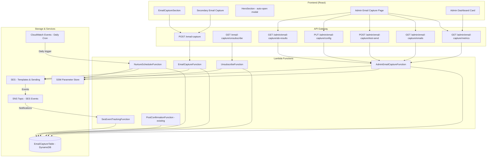

# Design Document: Email Capture & Nurture System

## Overview

This design describes a full-stack email capture and nurture system for SoulReel. The system captures visitor email addresses from the landing page, stores them in DynamoDB, sends an immediate welcome email with a sample question via SES, then delivers a timed sequence of branded reminder emails over 8 weeks. It includes conversion tracking (integrated with the existing Cognito postConfirmation trigger), unsubscribe handling, SES open/click/bounce tracking, A/B testing infrastructure, referral tracking, rate limiting, and a comprehensive admin management UI.

The system follows the existing project patterns: Python Lambda functions defined in `SamLambda/template.yml`, DynamoDB for storage, SES for email delivery, SSM Parameter Store for configuration, and React + TypeScript + Tailwind + shadcn/ui for the admin frontend.

## Architecture



### Key Architecture Decisions

1. **Separate Lambda functions per concern** (not a shared handler): Follows the existing project pattern where each function has its own directory under `SamLambda/functions/`. This keeps IAM policies scoped tightly per the lambda-iam-permissions rule.

2. **Single admin Lambda with path-based routing**: The admin endpoints (`/admin/email-capture/*`) share one Lambda function with internal routing by HTTP method and path suffix. This matches the existing `adminSettings` pattern and avoids proliferating admin Lambdas.

3. **SNS topic for SES event fan-out**: A single SNS topic receives all SES event notifications (opens, clicks, bounces). The `SesEventTrackingFunction` subscribes to it and routes events internally. This is simpler than multiple SES event destinations.

4. **DynamoDB with email as partition key**: Email is the natural unique identifier. GSIs support admin queries by status and capture date.

5. **SES Configuration Set**: All nurture emails are sent through a dedicated SES configuration set (`soulreel-nurture`) that has event destinations for open, click, and bounce tracking.

## Components and Interfaces

### Lambda Functions

#### 1. EmailCaptureFunction
- **Path**: `SamLambda/functions/emailCaptureFunctions/emailCapture/app.py`
- **Trigger**: `POST /email-capture` (no Cognito auth required)
- **Responsibilities**: Validate email, rate-limit by IP, check disposable domain blocklist, store/update record in DynamoDB (including computing and setting `statusGsi` to `"active"`), send Welcome Email via SES, return success/error response
- **Environment Variables**: `ALLOWED_ORIGIN`, `TABLE_EMAIL_CAPTURE`, `TABLE_RATE_LIMIT`, `SES_CONFIGURATION_SET`
- **SSM reads at runtime** (cached): `/soulreel/email-nurture/unsubscribe-secret` (for generating unsubscribe tokens in the welcome email), `/soulreel/email-nurture/disposable-domains` (blocklist)
- **IAM note**: In addition to DynamoDB and SES permissions, this function needs `ssm:GetParameter` on `/soulreel/email-nurture/unsubscribe-secret` and `/soulreel/email-nurture/disposable-domains`. Also needs `dynamodb:PutItem`, `dynamodb:GetItem`, `dynamodb:UpdateItem` on the RateLimitTable.

#### 2. UnsubscribeFunction
- **Path**: `SamLambda/functions/emailCaptureFunctions/unsubscribe/app.py`
- **Trigger**: `GET /email-capture/unsubscribe` (no Cognito auth required)
- **Responsibilities**: Read unsubscribe secret from SSM (cached), validate HMAC token, mark email as unsubscribed (set `unsubscribedAt` and update `statusGsi` to `"unsubscribed"`), return branded HTML confirmation page
- **Environment Variables**: `ALLOWED_ORIGIN`, `TABLE_EMAIL_CAPTURE`
- **SSM reads at runtime** (cached): `/soulreel/email-nurture/unsubscribe-secret`

#### 3. NurtureSchedulerFunction
- **Path**: `SamLambda/functions/emailCaptureFunctions/nurtureScheduler/app.py`
- **Trigger**: CloudWatch Events cron rule (`cron(0 14 * * ? *)` — daily at 2 PM UTC)
- **Responsibilities**: Check pause flag in SSM, scan eligible records, determine stage transitions based on configurable intervals, select A/B variant template, send templated emails via SES, update `reminderStage` and `statusGsi`, set `expiredAt` (and update `statusGsi` to `"expired"`) for completed sequences, handle win-back at 6 months
- **Environment Variables**: `TABLE_EMAIL_CAPTURE`, `SES_CONFIGURATION_SET`
- **SSM reads at runtime** (cached): `/soulreel/email-nurture/schedule` (stage intervals), `/soulreel/email-nurture/paused` (pause flag), `/soulreel/email-nurture/unsubscribe-secret` (for generating unsubscribe tokens in each email)
- **Two-pass processing**: Pass 1 scans active records (`expiredAt` is null, `convertedAt` is null, `unsubscribedAt` is null, `bounceStatus` is not `"hard"`) for stage 0→4 transitions. Pass 2 scans win-back candidates (`expiredAt` is set, `reminderStage` = 4, `capturedAt` ≥ 180 days ago, `convertedAt` is null, `unsubscribedAt` is null, `bounceStatus` is not `"hard"`) for stage 5 sends. Win-back records keep `statusGsi` as `"expired"` — they are queried separately via a filter on `reminderStage`.

#### 4. SesEventTrackingFunction
- **Path**: `SamLambda/functions/emailCaptureFunctions/sesEventTracking/app.py`
- **Trigger**: SNS subscription (SES event notifications)
- **Responsibilities**: Parse SNS messages for open/click/bounce events. For opens: increment `openCount`, update `lastOpenedAt`, and store the stage number from the template name in a `stageOpens` map attribute. For clicks: increment `clickCount`, update `lastClickedAt`, and store the stage number in a `stageClicks` map attribute. For bounces: read current `bounceStatus` via GetItem (to check for soft-to-hard escalation), then set `bounceStatus` accordingly and update `statusGsi` to `"bounced"` for hard bounces.
- **Environment Variables**: `TABLE_EMAIL_CAPTURE`
- **IAM**: Needs both `dynamodb:GetItem` (for bounce escalation check) and `dynamodb:UpdateItem` on the EmailCapture_Table. This is a single Lambda handling all SES event types — the IAM policy is the union of open/click tracking and bounce handling needs.
- **Stage extraction**: The SES event includes the template name (e.g., `soulreel-nurture-stage-2-A`). The function parses the stage number from this to attribute opens/clicks to the correct stage for per-stage A/B analysis.

#### 5. AdminEmailCaptureFunction
- **Path**: `SamLambda/functions/adminFunctions/adminEmailCapture/app.py`
- **Trigger**: Multiple API Gateway events (Cognito-authorized):
  - `GET /admin/email-capture/metrics` — aggregated metrics, funnel counts, conversion rates, time-to-convert stats
  - `GET /admin/email-capture/emails` — paginated list of captured emails with filtering by status
  - `POST /admin/email-capture/test-send` — trigger manual reminder for a specific email
  - `PUT /admin/email-capture/config` — update SSM parameters (schedule intervals, pause flag)
  - `GET /admin/email-capture/ab-results` — A/B test performance data per stage (including per-stage open/click rates by variant)
- **Environment Variables**: `TABLE_EMAIL_CAPTURE`, `SES_CONFIGURATION_SET`

#### 6. PostConfirmationFunction (existing — modified)
- **Path**: `SamLambda/functions/cognitoTriggers/postConfirmation/app.py`
- **Modification**: Add conversion tracking logic after the existing subscription creation. Query `EmailCaptureTable` for the new user's email; if found, set `convertedAt`, `convertedAtStage`, and update `statusGsi` to `"converted"`. Wrapped in try/except so failures never block signup.

### Frontend Components

#### 1. EmailCaptureSection (modified)
- **Path**: `FrontEndCode/src/components/landing/EmailCaptureSection.tsx`
- **Changes**: Replace console-only `trackEvent` with actual POST to `/email-capture` API. Add loading state, success message ("Check your inbox — your first question is on its way!"), error handling. Accept `source` prop. Store submission state in sessionStorage for cross-component dedup. Read `ref` from sessionStorage and include as `referredBy` in the request.

#### 2. SecondaryEmailCapture (new)
- **Path**: `FrontEndCode/src/components/landing/SecondaryEmailCapture.tsx`
- **Description**: Compact, inline email capture (single row: input + button) placed after FounderStorySection. Uses softer messaging: "Moved by this story? We'll send you a question to think about." Calls the same API with `source: "founder-story"`. Checks sessionStorage for prior submission and shows "You're already on the list!" if already captured.

#### 3. HeroSection (modified)
- **Path**: `FrontEndCode/src/components/landing/HeroSection.tsx`
- **Changes**: Read `?signup=` query parameter on mount via `useSearchParams`. If present, auto-open the SignupModal with the matching variant and fire `trackEvent('signup_modal_auto_open', { variant, source: 'email' })`.

#### 4. Home (modified)
- **Path**: `FrontEndCode/src/pages/Home.tsx`
- **Changes**: Read `?ref=` query parameter on mount and store in sessionStorage. Insert `<SecondaryEmailCapture />` between FounderStorySection and ClosingCTASection.

#### 5. AdminEmailCapturePage (new)
- **Path**: `FrontEndCode/src/pages/admin/AdminEmailCapture.tsx`
- **Description**: Full admin page with metrics cards, funnel visualization, email table, A/B test results, nurture configuration panel, and management controls.

#### 6. AdminLayout (modified)
- **Path**: `FrontEndCode/src/components/AdminLayout.tsx`
- **Changes**: Add "MARKETING" nav section with "Email Capture" link to `/admin/email-capture`.

#### 7. AdminDashboard (modified)
- **Path**: `FrontEndCode/src/pages/admin/AdminDashboard.tsx`
- **Changes**: Add "Email Capture" summary card showing total captured, conversion rate, active nurture count, expired count, unsubscribed count, and mini funnel indicator. Card is clickable and navigates to `/admin/email-capture`.

#### 8. API Config (modified)
- **Path**: `FrontEndCode/src/config/api.ts`
- **Changes**: Add new endpoint constants for email capture and admin email capture APIs.

### API Endpoints

| Method | Path | Auth | Description |
|--------|------|------|-------------|
| POST | `/email-capture` | None | Capture email address |
| GET | `/email-capture/unsubscribe` | None | One-click unsubscribe |
| GET | `/admin/email-capture/metrics` | Cognito | Aggregated metrics, funnel data, time-to-convert |
| GET | `/admin/email-capture/emails` | Cognito | Paginated email list with status filtering |
| POST | `/admin/email-capture/test-send` | Cognito | Manual test reminder send |
| PUT | `/admin/email-capture/config` | Cognito | Update nurture config (SSM) |
| GET | `/admin/email-capture/ab-results` | Cognito | A/B test performance data per stage |

## Data Models

### EmailCaptureTable (DynamoDB)

**Table Name**: `EmailCaptureDB`

| Attribute | Type | Description |
|-----------|------|-------------|
| `email` | String (PK) | Captured email address (lowercased) |
| `capturedAt` | String | ISO-8601 timestamp of initial capture |
| `reminderStage` | Number | Current nurture stage (0–5) |
| `convertedAt` | String \| null | ISO-8601 timestamp when user signed up |
| `convertedAtStage` | Number \| null | Stage at which conversion occurred |
| `expiredAt` | String \| null | ISO-8601 timestamp when sequence expired |
| `unsubscribedAt` | String \| null | ISO-8601 timestamp when user unsubscribed |
| `source` | String | Capture source: `"landing-page"`, `"discover-page"`, `"founder-story"` |
| `variant` | String | A/B variant: `"A"` or `"B"` |
| `openCount` | Number | Total email opens tracked |
| `clickCount` | Number | Total email clicks tracked |
| `lastOpenedAt` | String \| null | ISO-8601 timestamp of last open |
| `lastClickedAt` | String \| null | ISO-8601 timestamp of last click |
| `bounceStatus` | String \| null | `null`, `"soft"`, or `"hard"` |
| `referredBy` | String \| null | Referrer hash (if captured via referral link) |
| `sourceIp` | String | IP address of the capture request (for rate limiting audit) |
| `statusGsi` | String | Computed status for GSI: `"active"`, `"converted"`, `"expired"`, `"unsubscribed"`, `"bounced"`. **Must be updated by every writer that changes the record's logical status** (capture function sets `"active"`, scheduler sets `"expired"`, conversion tracker sets `"converted"`, unsubscribe function sets `"unsubscribed"`, bounce handler sets `"bounced"`). |
| `capturedWeek` | String | ISO week of capture (e.g., `"2025-W28"`) for weekly bucketing |
| `stageOpens` | Map \| null | Map of stage number → open count (e.g., `{"1": 2, "2": 1}`) for per-stage open tracking. Updated by SesEventTrackingFunction. |
| `stageClicks` | Map \| null | Map of stage number → click count (e.g., `{"1": 1}`) for per-stage click tracking. Updated by SesEventTrackingFunction. |

**Global Secondary Indexes**:

1. **StatusIndex** — For admin queries filtering by status
   - Partition Key: `statusGsi` (String)
   - Sort Key: `capturedAt` (String)
   - Projection: ALL

2. **CapturedWeekIndex** — For weekly cohort analysis and stacked bar chart
   - Partition Key: `capturedWeek` (String)
   - Sort Key: `capturedAt` (String)
   - Projection: ALL

**Table Configuration**:
- BillingMode: PAY_PER_REQUEST
- SSE: KMS (using existing `DataEncryptionKey`)
- PointInTimeRecovery: Enabled

### RateLimitTable (DynamoDB)

Rather than a separate table, rate limiting uses a lightweight approach within the EmailCaptureFunction: a DynamoDB table with TTL for automatic cleanup.

**Table Name**: `EmailCaptureRateLimitDB`

| Attribute | Type | Description |
|-----------|------|-------------|
| `ipAddress` | String (PK) | Source IP address |
| `requestCount` | Number | Number of requests in the current window |
| `windowStart` | String | ISO-8601 timestamp of window start |
| `ttl` | Number | Unix epoch timestamp for auto-deletion (1 hour after window start) |

**Table Configuration**:
- BillingMode: PAY_PER_REQUEST
- TTL: Enabled on `ttl` attribute
- No encryption needed (contains only IP addresses and counts)
- **Atomic increment pattern**: Use DynamoDB `UpdateItem` with `ADD requestCount :inc` and a `ConditionExpression` to initialize the record if it doesn't exist. This prevents race conditions when two requests arrive simultaneously for the same IP.

### Metrics Computation Note

The admin metrics endpoint (`GET /admin/email-capture/metrics`) computes aggregated stats including time-to-convert histograms. For small datasets (<10K records), a full scan with in-memory aggregation is acceptable. At scale, consider:
- Pre-computing daily aggregates via a separate scheduled Lambda that writes summary records to a `EmailCaptureMetrics` table
- Caching the metrics response in SSM or a short-TTL DynamoDB record (5-minute cache)
- Using the GSIs (StatusIndex, CapturedWeekIndex) to avoid full scans where possible

### SSM Parameters

| Parameter Path | Type | Default | Description |
|----------------|------|---------|-------------|
| `/soulreel/email-nurture/schedule` | String | `{"stage1":7,"stage2":14,"stage3":28,"stage4":56}` | JSON object with days-from-capture for each stage transition |
| `/soulreel/email-nurture/paused` | String | `"false"` | `"true"` to pause all nurture processing |
| `/soulreel/email-nurture/unsubscribe-secret` | SecureString | (generated) | HMAC-SHA256 secret for unsubscribe token signing |
| `/soulreel/email-nurture/disposable-domains` | String | (JSON array) | Blocklist of disposable email domains |

### SES Templates

Template naming convention: `soulreel-nurture-stage-{N}-{variant}`

| Template Name | Stage | Description |
|---------------|-------|-------------|
| `soulreel-nurture-stage-0-A` | 0 | Welcome email — variant A |
| `soulreel-nurture-stage-0-B` | 0 | Welcome email — variant B |
| `soulreel-nurture-stage-1-A` | 1 | 7-day founder story — variant A |
| `soulreel-nurture-stage-1-B` | 1 | 7-day founder story — variant B |
| `soulreel-nurture-stage-2-A` | 2 | 14-day social proof — variant A |
| `soulreel-nurture-stage-2-B` | 2 | 14-day social proof — variant B |
| `soulreel-nurture-stage-3-A` | 3 | 28-day urgency — variant A |
| `soulreel-nurture-stage-3-B` | 3 | 28-day urgency — variant B |
| `soulreel-nurture-stage-4-A` | 4 | 56-day final + COMEBACK20 — variant A |
| `soulreel-nurture-stage-4-B` | 4 | 56-day final + COMEBACK20 — variant B |
| `soulreel-nurture-stage-5-A` | 5 | 6-month win-back — variant A |
| `soulreel-nurture-stage-5-B` | 5 | 6-month win-back — variant B |

Each template receives these template data variables:
- `{{email}}` — recipient email
- `{{unsubscribe_url}}` — full unsubscribe URL with signed token
- `{{signup_url}}` — `https://www.soulreel.net/?signup=create-legacy`
- `{{referral_url}}` — `https://www.soulreel.net/?ref={email_hash}`

### SES Configuration Set

**Name**: `soulreel-nurture`

**Event Destinations**:
- SNS topic `soulreel-ses-nurture-events` for open, click, bounce, and complaint events
- The `SesEventTrackingFunction` subscribes to this SNS topic

### Referral Hash Generation

The referral hash is generated using the first 10 characters of a SHA-256 hash of the email address concatenated with a salt stored in SSM (`/soulreel/email-nurture/unsubscribe-secret` — reusing the same secret for simplicity):

```python
import hashlib
def generate_referral_hash(email: str, salt: str) -> str:
    return hashlib.sha256(f"{email.lower()}:{salt}".encode()).hexdigest()[:10]
```

This produces a short, non-reversible identifier (e.g., `a3f8b2c1d9`) suitable for URL query parameters. It's deterministic so the same email always produces the same hash, enabling referral attribution.

### Unsubscribe Token Generation

```python
import hmac, hashlib, base64
def generate_unsubscribe_token(email: str, secret: str) -> str:
    sig = hmac.new(secret.encode(), email.lower().encode(), hashlib.sha256).digest()
    return base64.urlsafe_b64encode(f"{email.lower()}:{sig.hex()}".encode()).decode().rstrip('=')

def verify_unsubscribe_token(token: str, secret: str) -> str | None:
    decoded = base64.urlsafe_b64decode(token + '==').decode()
    email, sig_hex = decoded.rsplit(':', 1)
    expected = hmac.new(secret.encode(), email.encode(), hashlib.sha256).hexdigest()
    if hmac.compare_digest(sig_hex, expected):
        return email
    return None
```


## Correctness Properties

*A property is a characteristic or behavior that should hold true across all valid executions of a system — essentially, a formal statement about what the system should do. Properties serve as the bridge between human-readable specifications and machine-verifiable correctness guarantees.*

### Property 1: New capture record has correct defaults

*For any* valid email address and source string, storing a new capture record should produce a record with `reminderStage` = 0, `convertedAt` = null, `expiredAt` = null, `unsubscribedAt` = null, `openCount` = 0, `clickCount` = 0, `variant` ∈ {"A", "B"}, and `capturedAt` as a valid ISO-8601 timestamp.

**Validates: Requirements 1.1**

### Property 2: Re-capture preserves variant assignment

*For any* email address that already exists in the EmailCapture_Table with a variant assignment, re-capturing that email should reset `capturedAt` and `reminderStage` to 0 but preserve the original `variant` value.

**Validates: Requirements 1.2, 12.6**

### Property 3: Invalid email format is rejected

*For any* string that does not conform to basic RFC 5322 email format (missing `@`, missing domain, missing local part, consecutive dots, etc.), the Email_Capture_API should return a 400 status code and the record should not be stored.

**Validates: Requirements 1.3**

### Property 4: Welcome email sent on every capture

*For any* valid email capture request (whether the email is new or already exists), the system should invoke SES to send the Stage 0 welcome email template to the captured email address.

**Validates: Requirements 1.6, 1.7**

### Property 5: CORS header present on all responses

*For any* request to the Email_Capture_API (valid, invalid, rate-limited, or error), the response should include the `Access-Control-Allow-Origin` header matching the configured `ALLOWED_ORIGIN` value.

**Validates: Requirements 1.10**

### Property 6: Nurture scheduler filters only eligible records

*For any* set of EmailCapture_Table records, the nurture scheduler's active pass should process only records where `convertedAt` is null AND `expiredAt` is null AND `unsubscribedAt` is null AND `bounceStatus` is not `"hard"`. The win-back pass should process only records where `expiredAt` is set AND `reminderStage` = 4 AND `capturedAt` is at least 180 days ago AND `convertedAt` is null AND `unsubscribedAt` is null AND `bounceStatus` is not `"hard"`. Records failing the respective conditions for each pass should be skipped.

**Validates: Requirements 3.2, 3.14, 14.4**

### Property 7: Stage transition correctness

*For any* eligible record with a given `reminderStage` and `capturedAt` timestamp, and a given current time, the scheduler should advance the record to the correct next stage if and only if the elapsed days from `capturedAt` meets or exceeds the configured threshold for that stage transition. Records at stage 5 should never be advanced. Records at stage 4 past the threshold should have `expiredAt` set. Records with `expiredAt` set and `capturedAt` ≥ 180 days ago should advance to stage 5 (win-back).

**Validates: Requirements 3.3, 3.4, 3.5, 3.6, 3.7, 3.14, 3.15**

### Property 8: Template selection matches stage and variant

*For any* stage number (0–5) and variant ("A" or "B"), the template name selected by the scheduler should be `soulreel-nurture-stage-{stage}-{variant}`. If the B variant template does not exist, the system should fall back to the A variant template name `soulreel-nurture-stage-{stage}-A`.

**Validates: Requirements 3.9**

### Property 9: Pause flag stops all processing

*For any* set of eligible records, when the SSM parameter `/soulreel/email-nurture/paused` is `"true"`, the scheduler should process zero records and send zero emails.

**Validates: Requirements 3.13**

### Property 10: Schedule intervals from SSM with defaults

*For any* SSM parameter value for the schedule (valid JSON with stage keys), the scheduler should use those intervals. When the SSM parameter is missing or invalid, the scheduler should fall back to defaults: stage 1 = 7 days, stage 2 = 14 days, stage 3 = 28 days, stage 4 = 56 days.

**Validates: Requirements 3.8**

### Property 11: Conversion tracking updates matching records

*For any* email address, if a record exists in the EmailCapture_Table with that email and the postConfirmation trigger fires for a user with that email, then `convertedAt` should be set to a valid ISO-8601 timestamp and `convertedAtStage` should equal the record's current `reminderStage`. If no record exists, no error should occur and the trigger should complete normally.

**Validates: Requirements 5.1, 5.2, 5.3**

### Property 12: Unsubscribe token round trip

*For any* email address and secret, generating an unsubscribe token and then verifying that token should return the original email address. This is a round-trip property: `verify(generate(email, secret), secret) == email`.

**Validates: Requirements 6.1**

### Property 13: Tampered unsubscribe token is rejected

*For any* valid unsubscribe token, modifying any character in the token should cause verification to fail (return null/None). This ensures the HMAC signature detects tampering.

**Validates: Requirements 6.3**

### Property 14: Rate limiting enforces per-IP threshold

*For any* source IP address, the first 5 requests within a 1-hour window should succeed (return 200), and the 6th and subsequent requests within the same window should return 429.

**Validates: Requirements 7.1**

### Property 15: Disposable email domains are rejected

*For any* email address whose domain appears in the configured disposable domain blocklist, the Email_Capture_API should return a 400 response and the record should not be stored.

**Validates: Requirements 7.3**

### Property 16: SES event tracking increments correct counter

*For any* open event targeting a record with `openCount` = N, processing the event should result in `openCount` = N + 1 and `lastOpenedAt` set to a valid timestamp. Similarly, for any click event targeting a record with `clickCount` = M, processing should result in `clickCount` = M + 1 and `lastClickedAt` set to a valid timestamp.

**Validates: Requirements 11.3, 11.4**

### Property 17: Hard bounce marks record as undeliverable

*For any* hard bounce event targeting an email in the EmailCapture_Table, the record's `bounceStatus` should be set to `"hard"` after processing.

**Validates: Requirements 14.2**

### Property 18: Soft bounce escalation to hard

*For any* email that receives a soft bounce event, `bounceStatus` should be set to `"soft"`. If the same email receives a second soft bounce event, `bounceStatus` should be upgraded to `"hard"`.

**Validates: Requirements 14.3**

### Property 19: Referral hash is deterministic and fixed-length

*For any* email address and salt, the referral hash function should always produce the same 10-character hexadecimal string. Two different email addresses should produce different hashes (collision resistance over reasonable input sets).

**Validates: Requirements 15.2**

## Error Handling

### Email Capture API Errors

| Error Condition | HTTP Status | Response Body | Behavior |
|----------------|-------------|---------------|----------|
| Missing/empty email | 400 | `{"success": false, "error": "Email is required."}` | No record stored |
| Invalid email format | 400 | `{"success": false, "error": "Please enter a valid email address."}` | No record stored |
| Disposable email domain | 400 | `{"success": false, "error": "Please use a permanent email address."}` | No record stored |
| Rate limited (>5/hr/IP) | 429 | `{"success": false, "error": "Too many requests. Please try again later."}` | No record stored |
| DynamoDB write failure | 500 | `{"success": false, "error": "Internal server error"}` | Logged, no email sent |
| SES send failure | 200 | `{"success": true}` | Record stored, SES error logged |

### Nurture Scheduler Errors

| Error Condition | Behavior |
|----------------|----------|
| SSM parameter read failure | Use default schedule intervals, log warning |
| SES send failure for one email | Log error, skip that record (don't update stage), continue with remaining |
| DynamoDB scan failure | Log error, exit. CloudWatch alarm should trigger on repeated failures |
| Pause flag set | Exit immediately with no processing |

### Unsubscribe Endpoint Errors

| Error Condition | HTTP Status | Response |
|----------------|-------------|----------|
| Missing token parameter | 400 | HTML: "Invalid unsubscribe link" |
| Invalid/tampered token | 400 | HTML: "Invalid unsubscribe link" |
| Token for non-existent email | 200 | HTML: "You've been unsubscribed" (prevents enumeration) |
| DynamoDB update failure | 500 | HTML: "Something went wrong. Please try again." |

### SES Event Tracking Errors

| Error Condition | Behavior |
|----------------|----------|
| Malformed SNS message | Log error, return 200 to SNS (prevent retries) |
| Email not found in table | Log warning, skip (email may have been deleted) |
| DynamoDB update failure | Log error, return 200 to SNS (event will be lost but not retried) |

### Conversion Tracking Errors

| Error Condition | Behavior |
|----------------|----------|
| EmailCapture_Table query failure | Log error, continue postConfirmation normally — never block signup |
| EmailCapture_Table update failure | Log error, continue postConfirmation normally |
| No matching record | No action, continue normally |

### Frontend Error Handling

- Network errors or 500 responses: Display "Something went wrong. Please try again later."
- 400 responses: Display the server-provided error message
- 429 responses: Display "Too many requests. Please try again later."
- Loading state: Disable submit button, show spinner to prevent duplicate submissions

## Testing Strategy

### Property-Based Testing

**Library**: [Hypothesis](https://hypothesis.readthedocs.io/) for Python Lambda functions, [fast-check](https://fast-check.dev/) for TypeScript frontend logic.

**Configuration**: Minimum 100 iterations per property test. Each test tagged with:
```
Feature: email-capture-nurture, Property {N}: {property_text}
```

**Backend property tests** (Python + Hypothesis):
- Properties 1–5: Email capture API logic (validation, defaults, CORS, welcome email)
- Properties 6–10: Nurture scheduler logic (filtering, stage transitions, template selection, pause, schedule)
- Property 11: Conversion tracking logic
- Properties 12–13: Unsubscribe token generation and verification (round-trip and tamper detection)
- Properties 14–15: Rate limiting and disposable domain validation
- Properties 16–18: SES event tracking and bounce handling
- Property 19: Referral hash generation

**Frontend property tests** (TypeScript + fast-check):
- Email validation logic (mirrors backend validation)
- Referral hash determinism (if hash is computed client-side)

### Unit Testing

Unit tests complement property tests by covering specific examples, edge cases, and integration points:

**Backend unit tests**:
- DynamoDB write failure returns 500 (Req 1.8)
- SES send failure still returns 200 (Req 1.9)
- SES send failure in scheduler skips stage update (Req 3.11)
- Conversion tracking failure doesn't block signup (Req 5.4)
- Unsubscribe for non-existent email returns success page (Req 6.4)
- Empty/missing email field returns 400 (Req 1.4)

**Frontend unit tests**:
- EmailCaptureSection shows confirmation on 200 response (Req 2.2)
- EmailCaptureSection shows server error on 400 response (Req 2.3)
- EmailCaptureSection shows generic error on network failure (Req 2.4)
- EmailCaptureSection disables button during loading (Req 2.5)
- EmailCaptureSection calls trackEvent after success (Req 2.6)
- SecondaryEmailCapture shows "already on the list" when session flag is set (Req 13.5)
- HeroSection auto-opens modal from query parameter (Req 16.1, 16.2)
- HeroSection does not auto-open without query parameter (Req 16.3)

### Integration Testing

- End-to-end flow: capture email → verify DynamoDB record → verify SES called
- Scheduler processes a batch of records with mixed statuses
- Unsubscribe flow: generate token → call endpoint → verify record updated
- Conversion flow: capture email → simulate postConfirmation → verify convertedAt set
