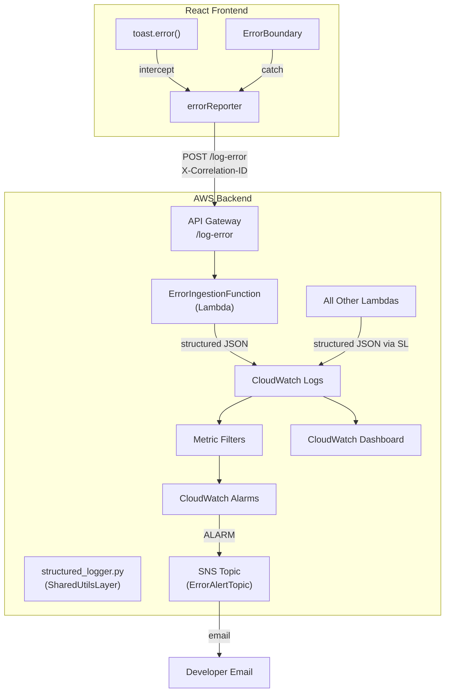

# Design Document: Error Logging & Monitoring

## Overview

This design introduces a unified error observability system ("Error Telescope") for SoulReel. It replaces inconsistent `print()` statements and `console.error()` calls with structured JSON logging on the backend, adds a new Lambda endpoint to ingest frontend errors, and wires up CloudWatch dashboards and alarms for proactive alerting.

The system has three main pillars:

1. **Structured Logger** — A new `structured_logger.py` module in the SharedUtilsLayer that every Lambda function imports. It outputs single-line JSON log entries with consistent fields (timestamp, level, operation, correlationId, userId, etc.) and includes a PII redaction filter.
2. **Frontend Error Pipeline** — A new `ErrorIngestionFunction` Lambda (POST `/log-error`) that receives error reports from the frontend, plus a TypeScript `errorReporter` module that intercepts toast errors and ErrorBoundary catches and silently ships them to the endpoint.
3. **CloudWatch Observability** — Metric filters on log groups that count ERROR entries, CloudWatch Alarms that fire when thresholds are exceeded, an SNS topic for email notifications, and a CloudFormation-managed dashboard showing error trends.

All infrastructure is defined in `template.yml` and deploys with a single `sam deploy`. The design reuses the existing SharedUtilsLayer, CognitoAuthorizer, CORS patterns, and SecurityAlertEmail parameter.



## Architecture

### Backend: Structured Logger Module

A new file `SamLambda/functions/shared/python/structured_logger.py` is added to the SharedUtilsLayer. It provides:

- `StructuredLog` class — initialized per-invocation with the Lambda event, extracts userId from JWT claims, reads X-Correlation-ID header, captures function name and environment context from the Lambda context object.
- `info()`, `warning()`, `error()` methods — each emits a single-line JSON string via Python's `logging` module.
- `log_aws_error()` — specialized method for logging failed AWS SDK calls with error code, message, and redacted request params.
- `pii_filter()` — static method that regex-replaces email addresses, phone numbers, and name-like patterns in string values before they're written.
- Drop-in integration with `error_response()` — the existing `responses.py` `error_response()` function is updated to call `StructuredLog.error()` instead of `print()`.

Each Lambda function initializes the logger at the top of its handler:

```python
from structured_logger import StructuredLog

def lambda_handler(event, context):
    log = StructuredLog(event, context)
    log.info('Processing request', details={'testId': test_id})
    try:
        # ... business logic ...
    except ClientError as e:
        log.log_aws_error('DynamoDB', 'GetItem', e, {'TableName': table, 'Key': key})
        return error_response(500, 'Server error', e, event)
    except Exception as e:
        log.error('Unexpected failure', e)
        return error_response(500, 'Server error', e, event)
```

### Backend: Error Ingestion Endpoint

A new Lambda function `ErrorIngestionFunction` at `SamLambda/functions/errorIngestion/app.py`:

- Route: `POST /log-error` with CognitoAuthorizer
- Validates required fields: `errorMessage`, `component`, `url`
- Truncates `stackTrace` to 4096 chars if needed
- Writes a structured JSON log entry with `source: "frontend"` using the StructuredLog class
- Returns `{"status": "logged"}` with 200
- Uses SharedUtilsLayer for CORS and responses

### Frontend: Error Reporter Module

A new file `FrontEndCode/src/services/errorReporter.ts`:

- Generates a session-level UUID v4 correlation ID on module load
- Exports `reportError(details)` — sends POST to `/log-error` with auth token
- Exports `getCorrelationId()` — for attaching to outgoing API requests
- Rate limiter: max 10 reports per 60-second sliding window
- Silent failure: catches all network errors without surfacing them
- Auth check: only sends when a valid Cognito session exists, discards otherwise
- PII guard: does not include form field values or user-generated content

Integration points:
- `ErrorBoundary.tsx` — `componentDidCatch` calls `reportError()` with error + component info
- A wrapper around Sonner's `toast.error()` that calls `reportError()` before/after showing the toast
- `authFetch` / `getAuthHeaders` patterns updated to include `X-Correlation-ID` header

### Infrastructure: CloudWatch Resources (template.yml)

All defined as CloudFormation resources:

1. **ErrorAlertTopic** — New SNS topic `soulreel-error-alerts` with email subscription using existing `SecurityAlertEmail` parameter
2. **FrontendErrorMetricFilter** — Metric filter on the ErrorIngestionFunction log group, matching `{ $.level = "ERROR" && $.source = "frontend" }`, publishing to `SoulReel/Errors/Frontend` metric
3. **BackendErrorMetricFilter** — Metric filter on backend Lambda log groups, matching `{ $.level = "ERROR" && $.source = "backend" }`, publishing to `SoulReel/Errors/Backend` metric
4. **FrontendErrorAlarm** — Alarm on frontend metric, threshold 20 errors in 5 minutes, notifies ErrorAlertTopic
5. **BackendErrorAlarm** — Alarm on backend metric, threshold 10 errors in 5 minutes, notifies ErrorAlertTopic
6. **ErrorMonitoringDashboard** — Dashboard with widgets for total errors, error rate over time, top error types, frontend vs backend split, errors by operation/component, errors by userId, and recent error log entries

### Steering File

A new file `.kiro/steering/structured-logging.md` documenting:
- How to import and initialize `StructuredLog` in a new Lambda
- Which operations qualify as "significant" for INFO-level logging
- Required fields for ERROR and INFO entries with code examples
- PII handling rules and redaction
- How to add X-Correlation-ID to new frontend service functions
- How to wire up error reporting in new React components

## Components and Interfaces

### Backend Components

#### `structured_logger.py` (SharedUtilsLayer)

```python
class StructuredLog:
    def __init__(self, event: dict, context: object):
        """
        Extract userId from event.requestContext.authorizer.claims.sub
        Extract correlationId from X-Correlation-ID header
        Capture function_name, memory, region from context and env
        """

    def info(self, operation: str, details: dict = None, duration_ms: float = None) -> None:
        """Emit INFO-level structured JSON log entry."""

    def warning(self, operation: str, message: str, details: dict = None) -> None:
        """Emit WARNING-level structured JSON log entry."""

    def error(self, operation: str, exception: Exception, details: dict = None) -> None:
        """
        Emit ERROR-level structured JSON log entry.
        Includes: errorType, stackTrace, userId, httpMethod, path,
        function input params (PII-redacted), environment context.
        """

    def log_aws_error(self, service: str, operation: str, error: ClientError,
                      request_params: dict = None) -> None:
        """Log a failed AWS SDK call with error code, message, and redacted params."""

    @staticmethod
    def redact_pii(data: any) -> any:
        """
        Recursively walk dicts/lists and redact:
        - Email addresses -> [REDACTED_EMAIL]
        - Phone numbers -> [REDACTED_PHONE]
        - Known PII field names (email, phone, name, fullName) -> [REDACTED]
        """
```

#### `ErrorIngestionFunction` Lambda

```python
def lambda_handler(event, context):
    """
    POST /log-error
    
    Request body:
        errorMessage: str (required)
        component: str (required)
        url: str (required)
        stackTrace: str (optional, truncated to 4096 chars)
        errorType: str (optional)
        metadata: dict (optional)
    
    Response:
        200: {"status": "logged"}
        400: {"error": "Missing required field: <field>"}
    """
```

#### Updated `responses.py`

The existing `error_response()` function is updated to use `StructuredLog` when a log instance is passed, falling back to `print()` for backward compatibility:

```python
def error_response(status_code, public_message, exception=None, event=None, log=None):
    if log and exception:
        log.error(public_message, exception)
    elif exception:
        # Legacy fallback
        print(f"[ERROR] {public_message}: {exception}")
        print(traceback.format_exc())
    # ... return response dict as before
```

### Frontend Components

#### `errorReporter.ts`

```typescript
// Session-scoped correlation ID
const correlationId: string = crypto.randomUUID();

interface ErrorReport {
  errorMessage: string;
  component: string;
  url: string;
  stackTrace?: string;
  errorType?: string;
  metadata?: Record<string, unknown>;
}

export function getCorrelationId(): string;
export function reportError(report: ErrorReport): void;  // fire-and-forget, never throws
```

#### Updated `ErrorBoundary.tsx`

```typescript
componentDidCatch(error: Error, errorInfo: React.ErrorInfo) {
    console.error('Error caught by boundary:', error, errorInfo);
    reportError({
        errorMessage: error.message,
        component: errorInfo.componentStack ?? 'unknown',
        url: window.location.href,
        stackTrace: error.stack,
        errorType: error.name,
        metadata: {
            userAgent: navigator.userAgent,
            buildHash: import.meta.env.VITE_BUILD_HASH ?? 'dev',
            route: window.location.pathname,
        },
    });
}
```

#### Toast Error Wrapper

A `reportToastError()` helper that wraps Sonner's `toast.error()`:

```typescript
import { toast } from 'sonner';
import { reportError } from './errorReporter';

export function toastError(message: string, component: string) {
    toast.error(message);
    reportError({
        errorMessage: message,
        component,
        url: window.location.href,
    });
}
```

### CloudWatch Logs Insights Queries

Stored in `SamLambda/cloudwatch-queries/` as `.txt` files:

1. **all-recent-errors.txt** — All errors in last 24 hours across all log groups
2. **frontend-errors.txt** — Frontend-only errors filtered by `source = "frontend"`
3. **errors-by-component.txt** — Error frequency grouped by component/operation
4. **errors-by-user.txt** — Errors filtered by a specific userId
5. **correlation-trace.txt** — Cross-source trace by correlationId in chronological order
6. **error-frequency.txt** — Error count over time in 5-minute buckets
7. **top-error-types.txt** — Top error types by frequency

## Data Models

### Structured Log Entry (Backend — ERROR level)

```json
{
  "timestamp": "2025-01-15T14:30:00.000Z",
  "level": "ERROR",
  "source": "backend",
  "operation": "scorePsychTest",
  "correlationId": "a1b2c3d4-e5f6-7890-abcd-ef1234567890",
  "userId": "us-east-1_abc123",
  "httpMethod": "POST",
  "path": "/psych-tests/score",
  "errorType": "ClientError",
  "message": "Failed to read test definition from S3",
  "stackTrace": "Traceback (most recent call last):\n  ...",
  "environment": {
    "functionName": "Virtual-Legacy-MVP-1-ScorePsychTestFunction",
    "memoryMB": 512,
    "region": "us-east-1"
  },
  "inputParams": {
    "testId": "big-five-v1",
    "userId": "[REDACTED]"
  }
}
```

### Structured Log Entry (Backend — INFO level)

```json
{
  "timestamp": "2025-01-15T14:30:01.500Z",
  "level": "INFO",
  "source": "backend",
  "operation": "scorePsychTest",
  "correlationId": "a1b2c3d4-e5f6-7890-abcd-ef1234567890",
  "userId": "us-east-1_abc123",
  "durationMs": 1245,
  "details": {
    "testId": "big-five-v1",
    "domainsScored": 5,
    "narrativeGenerated": true
  },
  "status": "success"
}
```

### Structured Log Entry (Frontend — via Error Ingestion)

```json
{
  "timestamp": "2025-01-15T14:29:58.000Z",
  "level": "ERROR",
  "source": "frontend",
  "operation": "ErrorIngestion",
  "correlationId": "a1b2c3d4-e5f6-7890-abcd-ef1234567890",
  "userId": "us-east-1_abc123",
  "errorMessage": "HTTP 500: Server error",
  "component": "PsychTestScoring",
  "url": "https://www.soulreel.net/psych-tests/big-five-v1/results",
  "errorType": "Error",
  "stackTrace": "Error: HTTP 500: Server error\n    at authFetch ...",
  "metadata": {
    "userAgent": "Mozilla/5.0 ...",
    "buildHash": "abc123def",
    "route": "/psych-tests/big-five-v1/results"
  }
}
```

### Frontend Error Report (Request Body to POST /log-error)

```json
{
  "errorMessage": "HTTP 500: Server error",
  "component": "PsychTestScoring",
  "url": "https://www.soulreel.net/psych-tests/big-five-v1/results",
  "stackTrace": "Error: HTTP 500 ...",
  "errorType": "Error",
  "metadata": {
    "userAgent": "Mozilla/5.0 ...",
    "buildHash": "abc123def",
    "route": "/psych-tests/big-five-v1/results"
  }
}
```

### Rate Limiter State (Frontend, in-memory)

```typescript
interface RateLimiterState {
  timestamps: number[];  // timestamps of recent reports
  maxReports: 10;
  windowMs: 60000;       // 60 seconds
}
```

## Correctness Properties

*A property is a characteristic or behavior that should hold true across all valid executions of a system — essentially, a formal statement about what the system should do. Properties serve as the bridge between human-readable specifications and machine-verifiable correctness guarantees.*

### Property 1: ERROR-level log entries contain all required fields

*For any* Lambda event and any exception, when the StructuredLog `error()` method is called, the resulting JSON log entry SHALL contain all of: `timestamp` (valid ISO 8601 UTC), `level` (equal to "ERROR"), `source` (equal to "backend"), `operation`, `correlationId`, `message`, `errorType` (exception class name), `stackTrace`, `userId` (extracted from JWT claims if present), `httpMethod`, `path`, `environment` (with `functionName`, `memoryMB`, `region`), and `inputParams` (PII-redacted).

**Validates: Requirements 1.1, 1.2, 1.6, 4.2, 8.1**

### Property 2: INFO-level log entries contain all required fields

*For any* Lambda event and any operation details, when the StructuredLog `info()` method is called, the resulting JSON log entry SHALL contain all of: `timestamp` (valid ISO 8601 UTC), `level` (equal to "INFO"), `source` (equal to "backend"), `operation`, `correlationId`, `userId`, `details` (object), `durationMs` (when provided), and `status`.

**Validates: Requirements 1.1, 1.3, 4.2, 8.2**

### Property 3: PII redaction removes all PII patterns from log data

*For any* dictionary or string containing email addresses (matching `\S+@\S+\.\S+`), phone numbers (matching common phone patterns), or known PII field names (`email`, `phone`, `name`, `fullName`), after passing through `redact_pii()`, the output SHALL NOT contain any of the original PII values and SHALL contain the corresponding redaction placeholders (`[REDACTED_EMAIL]`, `[REDACTED_PHONE]`, `[REDACTED]`).

**Validates: Requirements 1.5**

### Property 4: Correlation ID propagation

*For any* Lambda event containing an `X-Correlation-ID` header with a non-empty string value, every log entry emitted by the StructuredLog instance (info, warning, or error) SHALL include a `correlationId` field equal to that header value.

**Validates: Requirements 1.7, 2.6**

### Property 5: Valid error ingestion produces correct log and response

*For any* JSON payload containing valid `errorMessage` (non-empty string), `component` (non-empty string), and `url` (non-empty string), plus any combination of optional fields (`stackTrace`, `errorType`, `metadata`), when submitted to the ErrorIngestionFunction handler with a valid Cognito event context, the function SHALL return status code 200 with body `{"status": "logged"}`, include CORS headers, and the emitted log entry SHALL contain `source` equal to `"frontend"` and the `userId` from the JWT claims.

**Validates: Requirements 2.1, 2.2, 2.7, 7.4**

### Property 6: Missing required fields returns 400

*For any* JSON payload that is missing one or more of the required fields (`errorMessage`, `component`, `url`), when submitted to the ErrorIngestionFunction handler, the function SHALL return status code 400 with a body containing an `error` field describing the missing field(s), and SHALL include CORS headers.

**Validates: Requirements 2.3**

### Property 7: Stack trace truncation

*For any* string of length greater than 4096 characters submitted as the `stackTrace` field to the ErrorIngestionFunction, the logged `stackTrace` value SHALL have length equal to 4096 plus the length of `"[truncated]"`, SHALL end with `"[truncated]"`, and the first 4096 characters SHALL equal the first 4096 characters of the original string. For any string of length ≤ 4096, the logged value SHALL equal the original string.

**Validates: Requirements 2.5**

### Property 8: Frontend error report payload contains all required metadata

*For any* error caught by the ErrorBoundary or reported via toastError, the error report payload sent to the endpoint SHALL contain: `errorMessage` (non-empty), `component` (non-empty), `url` (matching current location), and `metadata` containing `userAgent`, `buildHash`, and `route`.

**Validates: Requirements 3.1, 3.2, 8.4**

### Property 9: Rate limiter caps reports

*For any* sequence of N error reports submitted within a 60-second window where N > 10, only the first 10 SHALL result in HTTP requests to the endpoint. Subsequent reports within the same window SHALL be silently dropped without making network calls.

**Validates: Requirements 3.6**

### Property 10: Error reporter silently handles failures and unauthenticated state

*For any* error report, if the network request fails (timeout, DNS failure, server error) or if no valid Cognito session exists, the `reportError()` function SHALL NOT throw an exception and SHALL NOT trigger any user-visible error notification.

**Validates: Requirements 3.5, 3.8**

### Property 11: AWS SDK error logging includes error code and redacted params

*For any* `ClientError` exception from a boto3 call, when `log_aws_error()` is called with the service name, operation, exception, and request parameters, the resulting log entry SHALL contain the AWS `errorCode`, `errorMessage`, `service`, `operation`, and `requestParams` where all PII values in `requestParams` are redacted.

**Validates: Requirements 8.3**

## Error Handling

### Backend Error Handling

| Scenario | Behavior |
|---|---|
| StructuredLog initialization fails (malformed event) | Falls back to basic Python logging with a warning; does not crash the Lambda |
| PII redaction regex fails on unexpected input type | Catches TypeError, returns the input unchanged, logs a warning |
| ErrorIngestionFunction receives invalid JSON body | Returns 400 with `{"error": "Invalid JSON body"}` |
| ErrorIngestionFunction receives body exceeding 10KB | Returns 400 with `{"error": "Request body too large"}` |
| ErrorIngestionFunction CloudWatch write fails | Returns 500 with generic error; the error itself is logged via Python logging fallback |
| `log_aws_error()` called with non-ClientError exception | Treats it as a generic error, logs available fields, does not crash |

### Frontend Error Handling

| Scenario | Behavior |
|---|---|
| `reportError()` network request fails | Silently catches; no toast, no console.error, no retry |
| `reportError()` called when unauthenticated | Discards the report immediately without attempting the request |
| Rate limit exceeded | Drops the report silently; no queuing for later |
| `getCorrelationId()` called before module init | Returns the already-generated UUID (generated at module load time) |
| `crypto.randomUUID()` not available (old browser) | Falls back to a manual UUID v4 implementation using `Math.random()` |

### Backward Compatibility

The updated `error_response()` in `responses.py` accepts an optional `log` parameter. Existing Lambda functions that don't pass it continue to work with the old `print()` behavior. This allows incremental migration — each Lambda can be updated to pass the `StructuredLog` instance at its own pace.

## Testing Strategy

### Property-Based Testing

Property-based tests use **Hypothesis** (Python, backend) and **fast-check** (TypeScript, frontend) to validate the correctness properties defined above. Each property test runs a minimum of 100 iterations with randomly generated inputs.

Each test is tagged with a comment referencing the design property:
```
# Feature: error-logging-monitoring, Property 1: ERROR-level log entries contain all required fields
```

**Backend property tests** (`SamLambda/functions/tests/test_error_logging_properties.py`):
- Property 1: Generate random events (with/without JWT claims, various HTTP methods/paths) and random exceptions → verify ERROR log JSON has all required fields
- Property 2: Generate random events and operation details → verify INFO log JSON has all required fields
- Property 3: Generate random dicts with embedded emails, phone numbers, PII field names → verify `redact_pii()` removes all PII
- Property 4: Generate random UUID correlation IDs, set as X-Correlation-ID header → verify all log entries include it
- Property 5: Generate random valid payloads (errorMessage, component, url + optional fields) → verify handler returns 200 with correct body and log entry has source="frontend"
- Property 6: Generate payloads with random subsets of required fields missing → verify handler returns 400
- Property 7: Generate random strings of varying lengths (0 to 10000 chars) → verify truncation behavior at the 4096 boundary
- Property 11: Generate random ClientError exceptions with various error codes and request params containing PII → verify log entry structure and PII redaction

**Frontend property tests** (`FrontEndCode/src/__tests__/error-reporter.property.test.ts`):
- Property 8: Generate random error objects and component names → verify payload contains all required metadata fields
- Property 9: Generate sequences of N reports (N from 1 to 50) → verify only first 10 in any 60-second window trigger fetch calls
- Property 10: Generate random error reports with simulated network failures → verify no exceptions thrown

### Unit Testing

Unit tests complement property tests by covering specific examples, integration points, and edge cases:

**Backend unit tests**:
- StructuredLog initialization with a real-shaped Lambda event and context
- `error_response()` backward compatibility (no `log` param still works)
- ErrorIngestionFunction OPTIONS preflight returns CORS headers
- ErrorIngestionFunction with empty body returns 400
- PII redaction with nested dicts and lists
- `log_aws_error()` with a real `ClientError` shape

**Frontend unit tests**:
- `getCorrelationId()` returns a valid UUID v4 format
- `reportError()` calls fetch with correct URL and headers
- `toastError()` calls both `toast.error()` and `reportError()`
- ErrorBoundary `componentDidCatch` calls `reportError()` with correct shape
- Rate limiter resets after 60-second window expires
- Unauthenticated state: `reportError()` does not call fetch

### Integration Testing

- Deploy to a test stage and verify:
  - POST `/log-error` with valid payload returns 200
  - CloudWatch Logs contain the structured JSON entry
  - Metric filters increment the custom metric
  - Dashboard loads without errors
