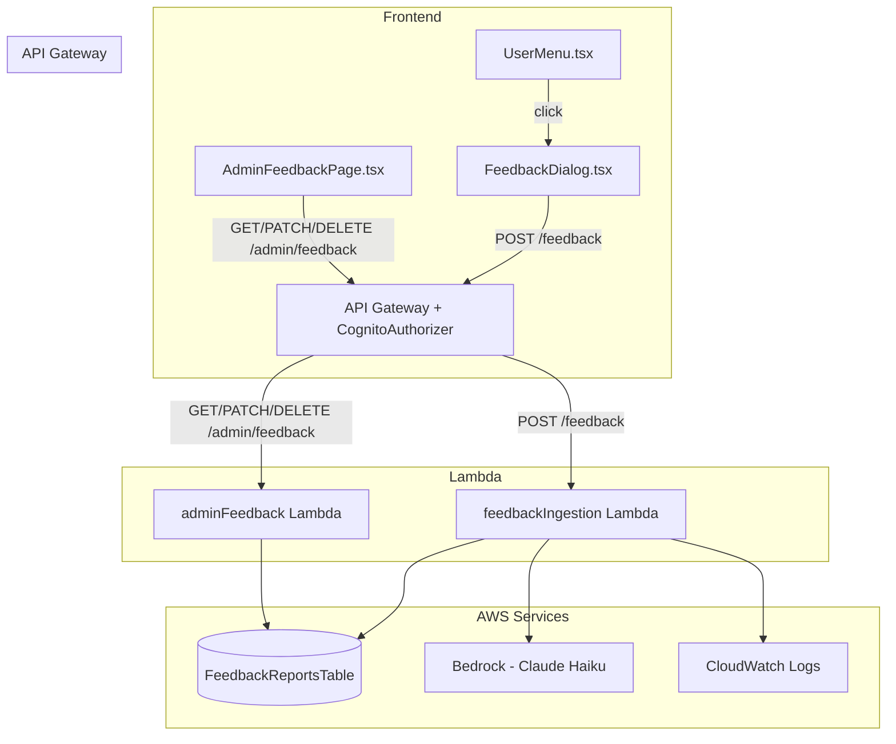

# Design Document: Feedback Report Modal

## Overview

This feature adds a user-facing feedback submission flow and an admin management interface for bug reports and feature requests in SoulReel. The system spans three layers:

1. **Frontend Modal** — A new "Report a Bug or Suggest a Feature" menu item in UserMenu opens a shadcn/ui Dialog containing a structured form (report type, subject, description, pre-filled user info). On submit, a thank-you message displays briefly before auto-closing.
2. **Ingestion Lambda** — A new `POST /feedback` endpoint validates the submission, stores it in a DynamoDB table, and invokes Claude Haiku via Bedrock to classify the report and generate a one-sentence summary. If Bedrock fails, the record is still saved with "unclassified" status.
3. **Admin Console** — A new "FEEDBACK" nav section in AdminLayout links to `/admin/feedback`, where admins see a sortable table of all reports. Each row supports archive/unarchive and delete actions. Clicking a row opens a detail dialog with the full submission.

The design follows all existing patterns: shadcn/ui Dialog for modals, `adminService.ts` for API calls, SAM template for Lambda + DynamoDB definitions, `verify_admin()` for server-side auth, and `toastError()` for error handling.

## Architecture



### Key Design Decisions

1. **Synchronous Bedrock call during ingestion** — The classification happens inline in the ingestion Lambda rather than asynchronously. Claude Haiku is fast (~1-2s) and the 15s Lambda timeout provides ample headroom. This avoids the complexity of an async pipeline (SQS, Step Functions) for a low-volume feature. If Bedrock fails, the record is saved with `aiClassification: "unclassified"` and `aiSummary: ""`, so the user always gets a success response.

2. **Single DynamoDB table with GSI** — A single `FeedbackReportsTable` with `reportId` as the partition key and a GSI on `submittedAt` for date-sorted admin queries. PAY_PER_REQUEST billing keeps costs at zero when idle.

3. **Dialog-based detail view** — The admin detail view uses a Dialog rather than a separate route, consistent with how ProfileDialog and PasswordDialog work. This keeps the admin experience snappy without adding route complexity.

4. **No email notifications** — Per requirements, no email is sent on submission. The admin console is the sole review interface.

## Components and Interfaces

### Frontend Components

#### FeedbackDialog (new)
- **Location**: `FrontEndCode/src/components/FeedbackDialog.tsx`
- **Props**: `{ open: boolean; onOpenChange: (open: boolean) => void }`
- **Behavior**: Renders a shadcn/ui Dialog with the feedback form. On open, resets all fields and pre-fills user email/name from `useAuth()`. On successful submit, shows a thank-you message for 2.5s then auto-closes.
- **Pattern**: Follows ProfileDialog / PasswordDialog pattern exactly (useState for form state, useEffect reset on open, Loader2 spinner, toastError on failure).

#### UserMenu changes
- **Location**: `FrontEndCode/src/components/UserMenu.tsx`
- **Change**: Add a `FeedbackDialog` state (`showFeedbackDialog`) and a new DropdownMenuItem between "Your Data" and "Settings". Clicking it sets `showFeedbackDialog(true)`. Render `<FeedbackDialog>` alongside existing dialogs.

#### AdminFeedbackPage (new)
- **Location**: `FrontEndCode/src/pages/admin/AdminFeedbackPage.tsx`
- **Behavior**: Fetches all feedback reports via `fetchFeedbackReports()`. Renders a sortable table with columns: AI Classification (badge), AI Summary, Date Submitted, Status (badge), User Name, User Email, Actions (Archive/Delete). Clicking a row opens a detail Dialog. Supports column-header sorting with default descending by date.

#### AdminLayout changes
- **Location**: `FrontEndCode/src/components/AdminLayout.tsx`
- **Change**: Add a new `FEEDBACK` nav section with a single item `{ to: "/admin/feedback", label: "Bugs & Requests", icon: MessageSquare }` between the ASSESSMENTS and SYSTEM sections.

#### App.tsx changes
- **Location**: `FrontEndCode/src/App.tsx`
- **Change**: Add `<Route path="feedback" element={<AdminFeedbackPage />} />` inside the admin route group.

### Frontend Service Functions

Added to `FrontEndCode/src/services/adminService.ts`:

```typescript
// --- Feedback Types ---
export interface FeedbackReport {
  reportId: string;
  reportType: 'bug' | 'feature';
  subject: string;
  description: string;
  userEmail: string;
  userName: string;
  userId: string;
  submittedAt: string;
  status: 'active' | 'archived';
  aiClassification: 'bug' | 'feature_request' | 'unclassified';
  aiSummary: string;
}

// --- Feedback Submission (user-facing) ---
export async function submitFeedback(payload: {
  reportType: 'bug' | 'feature';
  subject: string;
  description: string;
  userEmail: string;
  userName: string;
}): Promise<{ status: string }>;

// --- Feedback Admin ---
export async function fetchFeedbackReports(): Promise<FeedbackReport[]>;
export async function fetchFeedbackReport(reportId: string): Promise<FeedbackReport>;
export async function updateFeedbackStatus(reportId: string, status: 'active' | 'archived'): Promise<{ message: string }>;
export async function deleteFeedbackReport(reportId: string): Promise<{ message: string }>;
```

### API Endpoints (api.ts additions)

```typescript
SUBMIT_FEEDBACK: '/feedback',
ADMIN_FEEDBACK_LIST: '/admin/feedback',
ADMIN_FEEDBACK_DETAIL: '/admin/feedback',  // + /{reportId}
ADMIN_FEEDBACK_UPDATE: '/admin/feedback',   // PATCH /{reportId}
ADMIN_FEEDBACK_DELETE: '/admin/feedback',   // DELETE /{reportId}
```

### Backend — Feedback Ingestion Lambda

- **Location**: `SamLambda/functions/feedbackIngestion/app.py`
- **Route**: `POST /feedback`
- **Auth**: CognitoAuthorizer + no server-side admin check (all authenticated users can submit)
- **Flow**:
  1. Handle OPTIONS preflight
  2. Validate body size (≤20 KB), parse JSON
  3. Validate required fields: `reportType` (must be "bug" or "feature"), `subject`, `description`
  4. Truncate description to 5000 chars + "[truncated]" if over limit
  5. Extract `userId` from JWT claims
  6. Generate UUID `reportId`, ISO 8601 `submittedAt` timestamp
  7. Invoke Bedrock Claude Haiku for classification + summary (try/except with fallback)
  8. Write record to FeedbackReportsTable
  9. Log structured JSON entry to CloudWatch
  10. Return `{ status: "submitted" }`

### Backend — Admin Feedback Lambda

- **Location**: `SamLambda/functions/adminFunctions/adminFeedback/app.py`
- **Routes**:
  - `GET /admin/feedback` — Scan + sort by submittedAt desc
  - `GET /admin/feedback/{reportId}` — GetItem by reportId
  - `PATCH /admin/feedback/{reportId}` — Update status field
  - `DELETE /admin/feedback/{reportId}` — DeleteItem by reportId
- **Auth**: CognitoAuthorizer + `verify_admin(event)` server-side check
- **Pattern**: Follows adminSettings/app.py pattern (OPTIONS handling, cors_headers, error_response, StructuredLog)

## Data Models

### FeedbackReportsTable (DynamoDB)

| Attribute | Type | Description |
|---|---|---|
| `reportId` | String (PK) | UUID v4, generated server-side |
| `reportType` | String | User-selected: `"bug"` or `"feature"` |
| `subject` | String | Brief summary (max 200 chars) |
| `description` | String | Detailed description (max 5000 chars + "[truncated]") |
| `userEmail` | String | Submitter's email from request body |
| `userName` | String | Submitter's name from request body (or "Anonymous") |
| `userId` | String | Cognito `sub` from JWT claims |
| `submittedAt` | String | ISO 8601 UTC timestamp |
| `status` | String | `"active"` or `"archived"` |
| `aiClassification` | String | `"bug"`, `"feature_request"`, or `"unclassified"` |
| `aiSummary` | String | One-sentence AI summary (empty string if Bedrock failed) |

### Table Configuration

- **Partition Key**: `reportId` (String)
- **GSI**: `submittedAt-index` — Partition key: a fixed value (e.g., `"ALL"`), Sort key: `submittedAt` (String). This enables efficient date-sorted queries across all reports.
- **Billing**: PAY_PER_REQUEST
- **Encryption**: SSE with KMS (DataEncryptionKey)
- **PITR**: Enabled

### Bedrock Prompt Structure

```
You are classifying user feedback for a web application called SoulReel.

Given the following feedback submission:
- Report Type (user-selected): {reportType}
- Subject: {subject}
- Description: {description}

Respond with ONLY a JSON object (no markdown, no explanation):
{
  "classification": "bug" or "feature_request",
  "summary": "One sentence summary of the feedback"
}
```

Model: `anthropic.claude-3-haiku-20240307-v1:0` (lowest cost, fastest response)


## Correctness Properties

*A property is a characteristic or behavior that should hold true across all valid executions of a system — essentially, a formal statement about what the system should do. Properties serve as the bridge between human-readable specifications and machine-verifiable correctness guarantees.*

### Property 1: Form pre-fill with name fallback

*For any* user object from AuthContext (with any combination of present/absent firstName, lastName, and email fields), when the feedback modal opens, the email field should display the user's email, and the name field should display `"${firstName} ${lastName}"` when both are present, `firstName` alone when only firstName is present, or `"Anonymous"` when neither name field is available.

**Validates: Requirements 2.6, 3.5**

### Property 2: Form validation rejects invalid submissions

*For any* feedback form state where at least one required field (reportType, subject, or description) is missing or invalid (description < 10 chars, reportType not in {"bug", "feature"}), attempting to submit should produce validation errors and prevent the API call from being made. The number of validation errors should equal the number of invalid fields.

**Validates: Requirements 3.6, 5.8, 5.9**

### Property 3: Valid submission produces correct stored record

*For any* valid feedback payload (reportType in {"bug", "feature"}, non-empty subject ≤ 200 chars, description between 10 and 5000 chars, valid email, valid name), submitting to the ingestion endpoint should produce a stored record containing all submitted fields plus a server-generated `reportId` (UUID), `submittedAt` (ISO 8601), `status` set to `"active"`, and `aiClassification` in {"bug", "feature_request", "unclassified"}.

**Validates: Requirements 5.1, 5.3, 5.5, 5.10**

### Property 4: Bedrock failure graceful degradation

*For any* valid feedback submission, if the Bedrock invocation raises an exception or times out, the record should still be stored with `aiClassification` set to `"unclassified"` and `aiSummary` set to `""`, and the endpoint should still return HTTP 200.

**Validates: Requirements 5.6**

### Property 5: Description truncation

*For any* description string longer than 5000 characters, the stored description should be exactly 5000 characters followed by `"[truncated]"` (total length 5011). For any description string of 5000 characters or fewer, the stored description should equal the original.

**Validates: Requirements 5.13**

### Property 6: Date formatting produces human-readable output

*For any* valid ISO 8601 UTC timestamp string, the date formatting function should produce a string that contains the month name (or abbreviation), day number, year, and time components — and should never return the raw ISO string unchanged.

**Validates: Requirements 9.2**

### Property 7: Table sorting correctness

*For any* list of feedback reports and any sortable column (aiClassification, aiSummary, submittedAt, status, userName, userEmail), sorting the list by that column in ascending order should produce a list where each element is ≤ the next element according to that column's comparator. Sorting in descending order should produce the reverse. The default sort (submittedAt descending) should place the most recent report first.

**Validates: Requirements 9.3, 12.1**

### Property 8: Archive/unarchive round trip

*For any* feedback report with status `"active"`, archiving it (setting status to `"archived"`) and then unarchiving it (setting status back to `"active"`) should restore the report to its original status. The report's other fields should remain unchanged through both operations.

**Validates: Requirements 10.3, 12.3**

### Property 9: Submission then retrieval round trip

*For any* valid feedback submission, after the ingestion endpoint returns success, retrieving the report by its `reportId` via the admin GET endpoint should return a record where `reportType`, `subject`, `description` (accounting for truncation), `userEmail`, and `userName` match the originally submitted values.

**Validates: Requirements 12.2**

### Property 10: Delete then retrieve returns 404

*For any* feedback report that exists in the table, after deleting it via the admin DELETE endpoint, attempting to retrieve it by `reportId` should return HTTP 404. Additionally, for any random UUID that was never submitted, retrieving it should also return HTTP 404.

**Validates: Requirements 12.4, 12.6**

### Property 11: Report display contains all required fields

*For any* feedback report object, the rendered table row should contain the AI classification, AI summary, formatted date, status, user name, and user email. The rendered detail view should additionally contain the report type, subject, and full description.

**Validates: Requirements 9.1, 11.1**

## Error Handling

### Frontend Error Handling

| Scenario | Handling |
|---|---|
| Feedback submission fails (network error or non-200 response) | `toastError()` with user-friendly message; form stays open with input preserved |
| Admin feedback list fetch fails | `toastError()` with message; show retry option or empty state |
| Admin archive/unarchive fails | `toastError()` with message; row state unchanged |
| Admin delete fails | `toastError()` with message; row remains in table |
| Admin detail fetch fails | `toastError()` with message; close detail dialog |

### Backend Error Handling

| Scenario | Response | Logging |
|---|---|---|
| Missing required fields in feedback submission | HTTP 400 `{ error: "Missing required field(s): ..." }` | StructuredLog warning |
| Invalid reportType value | HTTP 400 `{ error: "Invalid reportType. Must be 'bug' or 'feature'" }` | StructuredLog warning |
| Request body > 20 KB | HTTP 400 `{ error: "Request body too large" }` | StructuredLog warning |
| Bedrock invocation failure | Record saved with `unclassified` / `""`, HTTP 200 returned | StructuredLog error for Bedrock failure |
| DynamoDB write failure (ingestion) | HTTP 500 via `error_response()` | StructuredLog error with AWS error details |
| Non-admin calls admin endpoint | HTTP 403 `{ error: "Forbidden: admin access required" }` | StructuredLog warning |
| Report not found (admin GET/PATCH/DELETE) | HTTP 404 `{ error: "Report not found" }` | StructuredLog info |
| DynamoDB failure (admin) | HTTP 500 via `error_response()` | StructuredLog error with AWS error details |

### CORS Handling

Both Lambda functions follow the project's CORS pattern:
- `import os` at the top of `app.py`
- Use `cors_headers(event)` from shared `cors.py` on every response
- Handle OPTIONS preflight explicitly
- `ALLOWED_ORIGIN` env var set via SAM Globals

## Testing Strategy

### Property-Based Testing (fast-check)

The project uses **Vitest** with **fast-check** for property-based testing. Each property test should run a minimum of 100 iterations.

Properties to implement as fast-check tests:

| Property | Test File | Focus |
|---|---|---|
| Property 1: Form pre-fill | `feedback-modal.property.test.ts` | Pre-fill logic with name fallback |
| Property 2: Validation rejection | `feedback-modal.property.test.ts` | Form validation for all invalid input combinations |
| Property 5: Description truncation | `feedback-modal.property.test.ts` | Truncation logic at 5000 char boundary |
| Property 6: Date formatting | `feedback-modal.property.test.ts` | Date formatter never returns raw ISO |
| Property 7: Table sorting | `feedback-admin.property.test.ts` | Sorting correctness for all columns and directions |
| Property 11: Report display fields | `feedback-admin.property.test.ts` | All required fields present in rendered output |

Each test must be tagged with a comment:
```
// Feature: feedback-report-modal, Property {N}: {title}
// Validates: Requirements X.Y
```

### Unit Testing (Vitest)

Unit tests complement property tests for specific examples and edge cases:

- **FeedbackDialog**: Submit button disabled during loading, thank-you message appears on success, modal auto-closes after 2.5s, form preserved on error
- **Validation edge cases**: Empty string subject, whitespace-only description, exactly 10-char description (boundary), exactly 200-char subject (boundary)
- **Backend validation**: Missing individual fields, body size exactly at 20 KB boundary, description exactly at 5000 chars
- **Bedrock fallback**: Mock Bedrock timeout, mock Bedrock error response
- **Admin actions**: Archive toggles status, delete removes row, confirmation dialog appears before delete
- **Empty state**: Table shows friendly message when no reports exist

### Python Backend Testing (pytest + Hypothesis)

For backend Lambda functions, use **pytest** with **Hypothesis** for property-based testing:

- Property 3 (valid submission → correct record): Generate random valid payloads, verify stored record structure
- Property 4 (Bedrock failure): Mock Bedrock to raise exceptions, verify fallback values
- Property 5 (truncation): Generate strings of varying lengths around the 5000-char boundary
- Property 8 (archive round trip): Generate random reports, archive then unarchive, verify state restoration
- Property 9 (submission → retrieval round trip): Submit random payloads, retrieve by ID, verify field equality
- Property 10 (delete → 404): Submit, delete, verify 404 on re-fetch

Each Hypothesis test should use `@settings(max_examples=100)` and be tagged:
```python
# Feature: feedback-report-modal, Property {N}: {title}
# Validates: Requirements X.Y
```
