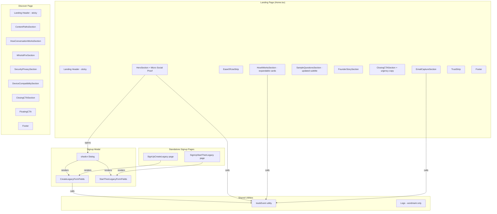

# Design Document: Landing Page UX Polish

## Overview

This design covers 16 requirements that polish the SoulReel landing page and related public pages to improve conversion, trust, and engagement. The changes span sticky navigation, copy improvements, a modal signup flow, interactive cards, logo simplification, a new Discover page, authentic social proof, email capture, SEO, and analytics tracking.

The existing stack is React 18 + TypeScript + Vite + Tailwind CSS + shadcn/ui + React Router v6. The landing page is rendered by `Home.tsx` and composed of section components under `FrontEndCode/src/components/landing/`. The authenticated header lives at `FrontEndCode/src/components/Header.tsx`. Signup forms are full-page components at `FrontEndCode/src/pages/SignUpCreateLegacy.tsx` and `SignUpStartTheirLegacy.tsx`.

Key design decisions:
- Shared signup form components extracted for reuse in both modal and standalone page contexts.
- A lightweight `trackEvent` analytics utility decoupled from any specific provider.
- The Discover page as a new route with its own section components, reusing the landing header/footer pattern.
- Accordion expansion for How It Works cards using CSS transitions (no additional library needed — Radix accordion is already available but simple height transitions suffice here).

## Architecture



### File Structure (new/modified files)

```
FrontEndCode/src/
├── components/
│   ├── Logo.tsx                          # MODIFIED - wordmark only
│   ├── Header.tsx                        # MODIFIED - sticky positioning
│   ├── landing/
│   │   ├── HeroSection.tsx               # MODIFIED - modal triggers, micro-copy, social proof
│   │   ├── HowItWorksSection.tsx         # MODIFIED - warmer copy for step 2
│   │   ├── HowItWorksCard.tsx            # MODIFIED - expandable accordion
│   │   ├── SampleQuestionsSection.tsx     # MODIFIED - updated subtitle, link to /discover
│   │   ├── ClosingCTASection.tsx          # MODIFIED - urgency copy, no-cc micro-copy
│   │   ├── TestimonialSection.tsx         # REMOVED (replaced by FounderStorySection)
│   │   ├── EaseOfUseStrip.tsx            # NEW
│   │   ├── FounderStorySection.tsx       # NEW
│   │   ├── EmailCaptureSection.tsx       # NEW
│   │   ├── MicroSocialProof.tsx          # NEW
│   │   └── SignupModal.tsx               # NEW
│   └── signup/
│       ├── CreateLegacyFormFields.tsx     # NEW - extracted shared form
│       └── StartTheirLegacyFormFields.tsx # NEW - extracted shared form
├── pages/
│   ├── Home.tsx                          # MODIFIED - section ordering, sticky header
│   ├── Discover.tsx                      # NEW
│   ├── SignUpCreateLegacy.tsx            # MODIFIED - uses shared form
│   ├── SignUpStartTheirLegacy.tsx        # MODIFIED - uses shared form
│   └── LegacyCreateChoice.tsx            # MODIFIED - descriptions added
├── lib/
│   └── analytics.ts                      # NEW - trackEvent utility
└── App.tsx                               # MODIFIED - /discover route
```

## Components and Interfaces

### 1. Sticky Header (Req 1)

**Landing Header** (`Home.tsx` inline header):
- Add `sticky top-0 z-50 bg-white/95 backdrop-blur-sm` to the `<header>` element.
- The existing `border-b` stays. No layout shift because `sticky` keeps the element in document flow.

**Dashboard Header** (`Header.tsx`):
- Add `sticky top-0 z-50` to the existing `<header>` element. Keep `bg-white shadow-sm`.

**Z-index coordination**: Landing header at `z-50`, signup modal at `z-[60]` (via Dialog's default `z-50` on overlay + content, overridden to `z-[60]`).

### 2. Warmer Copy for Step 2 (Req 2)

In `HowItWorksSection.tsx`, change step 2 props:
- `title`: `"Just Talk — We'll Listen"`
- `description`: `"Just talk naturally. We'll ask the right follow-up questions to help you uncover the moments that matter most."`
- Icon remains `Mic`.

### 3. EaseOfUseStrip (Req 3)

New component: `FrontEndCode/src/components/landing/EaseOfUseStrip.tsx`

```typescript
interface EaseOfUseStripProps {}
// Renders a thin banner with two messages:
// - "No typing required — just press record and talk" with Mic icon
// - "Works on computer, tablet, or phone" with Monitor, Smartphone, Tablet icons
// Desktop: horizontal row. Mobile: vertical stack.
// Styling: bg-gray-50, py-4, text-sm text-gray-500, centered content.
```

Placed in `Home.tsx` between `<HeroSection>` and `<HowItWorksSection>`.

### 4. Signup Modal & Shared Form Components (Req 4)

This is the most architecturally significant change. The goal is to extract the form fields, validation, and submit logic from the two signup pages into shared components that can be rendered in both a modal and a standalone page.

#### Shared Form Components

**`CreateLegacyFormFields.tsx`**:
```typescript
interface CreateLegacyFormFieldsProps {
  onSuccess?: () => void;       // Called after successful signup (modal closes, page redirects)
  inviteToken?: string | null;  // Passed from URL params when on standalone page
  showInviteBanner?: boolean;   // Whether to show the invite info banner
}
```

This component encapsulates:
- All form state (email, password, confirmPassword, firstName, lastName)
- All validation logic (email format, password strength, name format)
- The `signupWithPersona` call with correct persona params (`create_legacy` / `legacy_maker`, or `create_legacy_invited` with invite token)
- The invite token detection and banner display
- Uses `useAuth()` internally for `signupWithPersona` and `isLoading`

**`StartTheirLegacyFormFields.tsx`**:
```typescript
interface StartTheirLegacyFormFieldsProps {
  onSuccess?: () => void;
}
```

Same pattern, but with persona params `setup_for_someone` / `legacy_benefactor`. No invite token handling.

#### Standalone Pages (Modified)

`SignUpCreateLegacy.tsx` becomes a thin wrapper:
```tsx
// Reads ?invite= from URL, renders Card layout with Logo, renders <CreateLegacyFormFields>
```

`SignUpStartTheirLegacy.tsx` becomes a thin wrapper:
```tsx
// Renders Card layout with Logo, renders <StartTheirLegacyFormFields>
```

#### SignupModal Component

**`SignupModal.tsx`**:
```typescript
type SignupModalVariant = 'create-legacy' | 'start-their-legacy';

interface SignupModalProps {
  open: boolean;
  onOpenChange: (open: boolean) => void;
  variant: SignupModalVariant;
}
```

- Uses shadcn `Dialog`, `DialogContent`, `DialogHeader`, `DialogTitle`, `DialogDescription`.
- Renders `CreateLegacyFormFields` or `StartTheirLegacyFormFields` based on `variant`.
- On mobile: `DialogContent` gets `max-h-[90vh] overflow-y-auto w-[95vw]` for near-full-screen.
- On desktop: standard centered overlay with `max-w-lg`.
- Z-index: `DialogOverlay` and `DialogContent` use `z-[60]` to sit above the sticky header.
- `onSuccess` callback closes the modal; auth context handles redirect.

#### HeroSection Integration

`HeroSection.tsx` gains state for the modal:
```typescript
const [modalOpen, setModalOpen] = useState(false);
const [modalVariant, setModalVariant] = useState<SignupModalVariant>('create-legacy');
```

The "Start Free" and "Start Their Legacy" buttons become `<button>` elements (not `<Link>`) that open the modal with the appropriate variant. The `<Link>` wrappers are removed for unauthenticated users on the landing page.

### 5. Expandable How It Works Cards (Req 5)

**Modified `HowItWorksCard.tsx`**:
```typescript
interface HowItWorksCardProps {
  stepNumber: number;
  icon: React.ReactNode;
  title: string;
  description: string;
  expandedDescription: string;  // NEW
  isExpanded: boolean;          // NEW - controlled by parent
  onToggle: () => void;         // NEW - controlled by parent
}
```

- Collapsed state: shows step number, icon, title, description, and a "Learn more" text with chevron.
- Expanded state: reveals a placeholder screenshot area (gradient bg + "Screenshot coming soon"), the `expandedDescription`, and a "Try it now →" mini-CTA linking to signup.
- Transition: `transition-all duration-300 ease-in-out` on a wrapper div. Use `max-height` or `grid-rows` animation pattern.
- Only one card expanded at a time — managed by `HowItWorksSection` via `expandedStep` state.

**Modified `HowItWorksSection.tsx`**:
```typescript
const [expandedStep, setExpandedStep] = useState<number | null>(null);
const handleToggle = (step: number) => {
  setExpandedStep(prev => prev === step ? null : step);
};
```

### 6. Logo Simplification (Req 6)

**Modified `Logo.tsx`**:
- Remove the purple circle `<div>` with "SR".
- Keep only the `<span>` with the wordmark "SoulReel".
- Change to `text-2xl font-extrabold`.
- Detect `text-white` in `className` prop: if present, skip gradient classes and render solid white text. Implementation: check `className.includes('text-white')`.

```typescript
const Logo: React.FC<{ className?: string }> = ({ className = "" }) => {
  const isWhite = className.includes('text-white');
  const textClasses = isWhite
    ? 'text-2xl font-extrabold'
    : 'text-2xl font-extrabold bg-gradient-to-r from-legacy-navy to-legacy-purple bg-clip-text text-transparent';
  return (
    <span className={`${textClasses} ${className}`}>SoulReel</span>
  );
};
```

This automatically propagates to all 6+ usages since they all import the same component.

### 7. Discover Page (Req 7, 15)

**New page: `Discover.tsx`**

Sections (each a sub-component or inline JSX within the page):
1. **Hero/Intro** — `<h1>` with SEO-optimized title, intro paragraph.
2. **Content Paths** — Three cards/columns for Life Story Reflections, Life Events, Values & Emotions. Each with description, sample questions, and what users gain.
3. **How the Conversation Works** — Explains the natural flow, no typing, AI follow-ups.
4. **Who is SoulReel For?** — Two persona cards: "For you" and "For someone you love" with CTAs.
5. **Security & Privacy** — Encryption, data ownership, deletion rights, no third-party sharing.
6. **Device Compatibility** — Works on computer, tablet, phone.
7. **Closing CTA** — Primary and secondary buttons.

**Floating CTA**: A fixed-position button that appears after scrolling past the first section. Uses `IntersectionObserver` on the first section and the closing CTA section:
- Shows when first section exits viewport.
- Hides when closing CTA section enters viewport.
- Desktop: fixed bottom-right. Mobile: fixed bottom bar.

**SEO** (Req 15): Use `document.title` and a `<meta>` tag via `useEffect` on mount, or a lightweight `<Helmet>`-style approach. Since there's no SSR, we set `document.title` and create/update the meta description tag in a `useEffect`.

**Route**: Added to `App.tsx` as `<Route path="/discover" element={<Discover />} />` in the public routes section.

### 8. Enhanced Sample Questions Subtitle (Req 8)

In `SampleQuestionsSection.tsx`, replace the subtitle:
```
"Three paths to explore: your life story, the events that shaped you, and the values you hold dear."
```

### 9. Enhanced Legacy Choice Page (Req 9)

In `LegacyCreateChoice.tsx`:
- Add descriptive text below each button.
- Add a "Learn more" link to `/discover`.

### 10. "No Credit Card Required" Micro-Copy (Req 10)

In `HeroSection.tsx`: Replace "Preserve your own stories and memories" under "Start Free" with "Free forever. No credit card required."

In `ClosingCTASection.tsx`: Add "No credit card required" below the primary CTA.

### 11. Micro Social Proof (Req 11)

New component: `MicroSocialProof.tsx`
- Renders: `"Join families already preserving their stories"` in `text-sm text-gray-400`.
- Centered below the CTA buttons area in `HeroSection.tsx`.

### 12. Founder Story Section (Req 12)

New component: `FounderStorySection.tsx`
- Replaces `TestimonialSection` in `Home.tsx`.
- Heading: "My Story — Why I Built SoulReel".
- Body: The provided founder story text, rendered as paragraphs (not all italic).
- Background: `bg-legacy-lightPurple`.
- Attribution line at bottom.
- Responsive padding and text sizing.

### 13. Emotional Urgency Copy (Req 13)

In `ClosingCTASection.tsx`, add below the headline:
```
"Every day holds stories worth preserving. Don't wait for someday."
```
Styled as `text-base italic text-gray-500`.

### 14. Email Capture Section (Req 14)

New component: `EmailCaptureSection.tsx`
```typescript
interface EmailCaptureSectionProps {}
// State: email input, submitted flag, error message
// Validates email format on submit
// On success: shows "You're on the list!" message
// Storage: initially logs to console via trackEvent; 
//   future: POST to an API endpoint or third-party service
// Styling: subtle bg-gray-50, inline section, not a modal
```

Placed in `Home.tsx` between `ClosingCTASection` and `TrustStrip`.

### 15. Analytics Utility (Req 16)

New file: `FrontEndCode/src/lib/analytics.ts`

```typescript
export interface AnalyticsEvent {
  name: string;
  properties?: Record<string, string | number | boolean>;
}

/**
 * Fire-and-forget event tracking.
 * Currently logs to console. Replace the body with your analytics
 * provider's SDK call (e.g., gtag, mixpanel.track, amplitude.logEvent).
 */
export function trackEvent(name: string, properties?: Record<string, string | number | boolean>): void {
  try {
    // Future: replace with provider SDK call
    if (typeof window !== 'undefined' && window.console) {
      console.debug('[analytics]', name, properties);
    }
  } catch {
    // Non-blocking — swallow errors
  }
}
```

Design rationale: A single function with a simple signature. No async, no promises — truly fire-and-forget. The `try/catch` ensures it never throws. When a real provider is added, only this file changes.

**Event catalog** (tracked interactions):

| Location | Event Name | Properties |
|---|---|---|
| HeroSection | `hero_cta_click` | `{ variant: 'start-free' \| 'start-their-legacy' }` |
| SignupModal | `signup_modal_open` | `{ variant }` |
| SignupModal | `signup_modal_close` | `{ variant }` |
| HowItWorksCard | `how_it_works_expand` | `{ step: number }` |
| HowItWorksCard | `how_it_works_collapse` | `{ step: number }` |
| SampleQuestionsSection | `explore_questions_click` | `{}` |
| ClosingCTASection | `closing_cta_click` | `{ button: 'primary' \| 'secondary' }` |
| EmailCaptureSection | `email_capture_submit` | `{}` |
| Footer | `footer_privacy_click` | `{}` |
| Discover | `discover_page_view` | `{}` |
| Discover | `discover_section_view` | `{ section: string }` |
| Discover | `discover_floating_cta_click` | `{}` |
| Discover | `discover_closing_cta_click` | `{}` |
| Discover | `discover_persona_cta_click` | `{ persona: 'for-you' \| 'for-loved-one' }` |

## Data Models

### Form State (Shared Signup Forms)

```typescript
interface SignupFormState {
  email: string;
  password: string;
  confirmPassword: string;
  firstName: string;
  lastName: string;
}

interface SignupFormErrors {
  email: string;
  password: string;
  confirmPassword: string;
  firstName: string;
  lastName: string;
}
```

### Analytics Event

```typescript
interface AnalyticsEvent {
  name: string;
  properties?: Record<string, string | number | boolean>;
}
```

### Email Capture State

```typescript
interface EmailCaptureState {
  email: string;
  submitted: boolean;
  error: string;
}
```

### How It Works Expanded Content

```typescript
interface HowItWorksStepData {
  stepNumber: number;
  icon: React.ReactNode;
  title: string;
  description: string;
  expandedDescription: string;
  screenshotPlaceholder: boolean; // true until real screenshots are added
}
```

### Discover Page Section Data

```typescript
interface ContentPathData {
  title: string;
  description: string;
  sampleQuestions: string[];
  benefit: string;
}

interface PersonaData {
  title: string;       // "For you" | "For someone you love"
  description: string;
  ctaText: string;
  ctaAction: string;   // route or modal variant
}
```


## Correctness Properties

*A property is a characteristic or behavior that should hold true across all valid executions of a system — essentially, a formal statement about what the system should do. Properties serve as the bridge between human-readable specifications and machine-verifiable correctness guarantees.*

### Property 1: Signup form validation correctness

*For any* string inputs for email, password, confirmPassword, firstName, and lastName, the shared signup form validation function should:
- Accept an email if and only if it matches the pattern `\S+@\S+\.\S+`
- Accept a password if and only if it is at least 8 characters long and contains at least one uppercase letter, one lowercase letter, and one digit
- Accept confirmPassword if and only if it equals password
- Accept firstName/lastName if and only if they are 2-50 characters and match `[a-zA-Z\s\-']+`
- Return `isValid = true` if and only if all individual field validations pass

**Validates: Requirements 4.14, 4.15**

### Property 2: Accordion toggle round-trip

*For any* How It Works card, expanding it and then collapsing it (by clicking it twice) should return the card to its original collapsed state with no expanded content visible.

**Validates: Requirements 5.2**

### Property 3: Accordion mutual exclusion

*For any* sequence of How It Works card clicks, at most one card should be in the expanded state at any given time. When a new card is clicked while another is expanded, the previously expanded card must collapse.

**Validates: Requirements 5.9**

### Property 4: Logo gradient conditional rendering

*For any* className string passed to the Logo component, if the string contains "text-white" then the rendered output should not include the gradient classes (`bg-gradient-to-r`, `bg-clip-text`, `text-transparent`). If the string does not contain "text-white", the rendered output should include all three gradient classes.

**Validates: Requirements 6.5**

### Property 5: Floating CTA visibility logic

*For any* combination of boolean states `(scrolledPastFirstSection, closingCTAInView)`, the floating CTA on the Discover page should be visible if and only if `scrolledPastFirstSection === true` AND `closingCTAInView === false`.

**Validates: Requirements 7.12**

### Property 6: Email capture validation

*For any* string input to the email capture form, the validation should accept the input if and only if it matches a valid email format (contains `@` with non-empty local and domain parts). Invalid formats (empty string, missing `@`, missing domain) should be rejected.

**Validates: Requirements 14.4**

### Property 7: Discover page semantic HTML structure

*For any* rendered state of the Discover page, there should be exactly one `<h1>` element, all section headings should be `<h2>`, all subsection headings should be `<h3>`, and every `` element should have a non-empty `alt` attribute.

**Validates: Requirements 15.3, 15.4**

### Property 8: Analytics trackEvent is non-blocking and safe

*For any* event name (non-empty string) and any properties object (record of string/number/boolean values), calling `trackEvent` should execute synchronously, never throw an exception, and never return a Promise.

**Validates: Requirements 16.3, 16.5**

## Error Handling

### Signup Form Errors
- **Validation errors**: Displayed inline below each field using red text (`text-sm text-red-500`). The existing validation error pattern from `SignUpCreateLegacy.tsx` and `SignUpStartTheirLegacy.tsx` is preserved in the shared form components.
- **Auth errors**: The `useAuth()` hook's `signupWithPersona` already handles Cognito errors (duplicate email, weak password, etc.) and surfaces them via toast notifications. The shared form components inherit this behavior.
- **Modal close during submission**: If the user closes the modal while a signup request is in-flight, the auth context handles the response. No special cleanup needed since React state updates on unmounted components are safe in React 18.

### Email Capture Errors
- **Invalid email format**: Display inline error message below the input field.
- **Submission failure**: Display a generic "Something went wrong. Please try again." message. The initial implementation logs to console, so submission "failure" is unlikely, but the error state is built in for when a real API endpoint is connected.

### Analytics Errors
- **trackEvent failures**: Wrapped in try/catch. Errors are silently swallowed — analytics should never break the user experience.
- **Missing properties**: The `properties` parameter is optional. Passing `undefined` or an empty object is valid.

### Discover Page Errors
- **IntersectionObserver unavailable**: The floating CTA logic should check for `IntersectionObserver` support and gracefully degrade (always show the CTA if the API is unavailable). This affects very old browsers only.
- **SEO meta tag updates**: If `document.title` or meta tag manipulation fails, the page still renders correctly — SEO is a progressive enhancement.

### Logo Component
- **Empty className**: The `className` prop defaults to `""`. The `includes('text-white')` check returns `false` for empty strings, so the gradient is applied by default. No edge case issues.

## Testing Strategy

### Property-Based Testing

This project already uses `fast-check` (v4.5.3) with `vitest` (v4.0.18) for property-based tests. All new property tests follow the same pattern as existing tests in `FrontEndCode/src/__tests__/`.

**Configuration**:
- Minimum 100 iterations per property test (`{ numRuns: 100 }` in fast-check settings)
- Each test tagged with a comment referencing the design property
- Test file: `FrontEndCode/src/__tests__/landing-page-ux-polish.property.test.ts`

**Properties to implement**:

1. **Property 1: Signup form validation correctness** — Generate random strings for each field using `fc.string()`, `fc.emailAddress()`, and custom arbitraries for passwords. Verify the validation function returns the correct `isValid` and error messages.
   - Tag: `Feature: landing-page-ux-polish, Property 1: Signup form validation correctness`

2. **Property 2: Accordion toggle round-trip** — Generate a random step number (1-3), simulate expand then collapse, verify state returns to null.
   - Tag: `Feature: landing-page-ux-polish, Property 2: Accordion toggle round-trip`

3. **Property 3: Accordion mutual exclusion** — Generate a random sequence of step number clicks, replay them against the state logic, verify at most one step is expanded after each click.
   - Tag: `Feature: landing-page-ux-polish, Property 3: Accordion mutual exclusion`

4. **Property 4: Logo gradient conditional rendering** — Generate random className strings, some containing "text-white", verify gradient class presence/absence.
   - Tag: `Feature: landing-page-ux-polish, Property 4: Logo gradient conditional rendering`

5. **Property 5: Floating CTA visibility logic** — Generate all combinations of `(scrolledPastFirstSection, closingCTAInView)` booleans, verify visibility equals `scrolledPast && !closingInView`.
   - Tag: `Feature: landing-page-ux-polish, Property 5: Floating CTA visibility logic`

6. **Property 6: Email capture validation** — Generate random strings and valid email addresses, verify the validation function correctly accepts/rejects.
   - Tag: `Feature: landing-page-ux-polish, Property 6: Email capture validation`

7. **Property 7: Discover page semantic HTML structure** — Render the Discover page component, query for heading elements and images, verify hierarchy and alt text presence.
   - Tag: `Feature: landing-page-ux-polish, Property 7: Discover page semantic HTML structure`

8. **Property 8: Analytics trackEvent is non-blocking and safe** — Generate random event names and property objects, call trackEvent, verify it doesn't throw and returns synchronously (return value is `undefined`, not a Promise).
   - Tag: `Feature: landing-page-ux-polish, Property 8: Analytics trackEvent is non-blocking and safe`

### Unit Testing

Unit tests complement property tests by covering specific examples, edge cases, and integration points. Test file: `FrontEndCode/src/__tests__/landing-page-ux-polish.test.tsx`

Key unit tests:
- **Sticky header**: Verify the Landing Header and Dashboard Header have the correct CSS classes (`sticky`, `top-0`, `z-50`, `bg-white/95`, `backdrop-blur-sm`).
- **Copy changes**: Verify step 2 title is "Just Talk — We'll Listen" and description matches. Verify steps 1 and 3 are unchanged.
- **EaseOfUseStrip**: Verify both messages render with correct text and icons.
- **Signup modal**: Verify clicking "Start Free" opens the modal with create-legacy variant. Verify clicking "Start Their Legacy" opens with start-their-legacy variant. Verify close button works.
- **Logo**: Verify the purple circle is gone. Verify wordmark renders with gradient by default. Verify `text-white` className disables gradient.
- **Founder story**: Verify the heading, story text, and bg-legacy-lightPurple background. Verify the CTA-style ending lines are absent.
- **Micro-copy**: Verify "Free forever. No credit card required." appears under "Start Free". Verify "No credit card required" appears in ClosingCTASection.
- **Social proof**: Verify "Join families already preserving their stories" renders below CTAs.
- **Email capture**: Verify the form renders with input and button. Verify success message on valid submission.
- **Discover page**: Verify all required sections render. Verify the route is public. Verify SEO meta tags are set.
- **Analytics**: Verify trackEvent is called with correct event names for each tracked interaction.
- **Sample questions subtitle**: Verify the new subtitle text and that the old text is gone.
- **Legacy choice page**: Verify descriptions appear under each button. Verify "Learn more" link exists.
