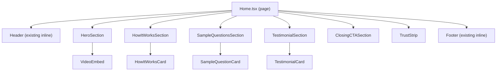

# Design Document: Landing Page UX Redesign

## Overview

This design covers the UX redesign of the SoulReel landing page (`FrontEndCode/src/pages/Home.tsx`). The current page is a single-column, text-heavy layout with no video content — despite SoulReel being a video recording product. The redesign introduces a two-column hero with a video embed placeholder, an optional warm accent color for primary CTAs (designed to be revertible in one line), numbered How It Works steps, stronger testimonials, a closing CTA replacing inline pricing, a trust strip, mobile spacing fixes, enhanced sample question cards, and a footer privacy link.

The scope is limited to the landing page and its new sub-components. No backend changes, no new routes (except linking to the existing `/your-data` route), and no changes to authentication or billing logic.

## Architecture

The redesign stays within the existing React + TypeScript + Tailwind CSS + shadcn/ui stack. No new dependencies are required — `lucide-react` already provides all needed icons, and `fast-check` is available for property-based testing. The VideoEmbed uses native CSS `aspect-ratio: 16/9` (Tailwind's `aspect-video` class) rather than `@radix-ui/react-aspect-ratio` — CSS aspect-ratio has full browser support and avoids an unnecessary JS dependency for a purely presentational concern.

### Component Hierarchy



### Design Decisions

1. **Extract sections into components**: The current Home.tsx is ~180 lines of inline JSX. Each section becomes its own component under `FrontEndCode/src/components/landing/` for maintainability and testability.
2. **VideoEmbed as a standalone component**: Accepts an optional `src` prop. When absent, renders a poster/thumbnail placeholder with a play icon. When the HeyGen avatar video URL is ready, it's a single prop change.
3. **Revertible accent color**: Two new Tailwind colors (`legacy.warmAccent` and `legacy.warmAccentHover`) are added, but all components reference them through a single shared constant file (`FrontEndCode/src/components/landing/colorConfig.ts`). To revert to the original purple palette, change one line in that file. See the "Revert Strategy" section below.
4. **No new npm dependencies**: All icons come from `lucide-react`. Video aspect ratio uses Tailwind's native `aspect-video` class. Hover animations use Tailwind's built-in `transition` and `hover:` utilities.
5. **Testimonial data as static array**: Testimonials are hardcoded in the component since there's no backend source. Easy to swap for API data later.
6. **Remove inline pricing section entirely**: Replace with a warm closing CTA that links to `/pricing` and signup. Pricing details stay on the dedicated pricing page.

## Components and Interfaces

### VideoEmbed

```typescript
// FrontEndCode/src/components/landing/VideoEmbed.tsx
interface VideoEmbedProps {
  src?: string;           // HeyGen video URL — optional, shows placeholder when absent
  posterUrl?: string;     // Custom thumbnail image URL
  title?: string;         // Accessible title for the video/iframe
}
```

- Wraps content in a `div` with Tailwind's `aspect-video` class (native CSS `aspect-ratio: 16/9`)
- Placeholder state: gradient background matching `legacy-lightPurple` → `legacy-purple`, centered `Play` icon from lucide-react, "Watch how it works" label
- Video state: renders `<iframe>` or `<video>` element depending on URL format
- Rounded corners (`rounded-xl`), subtle shadow
- Uses `data-state="placeholder"` or `data-state="video"` attribute on the root element to enable testable state assertions without relying on class name inspection

### HeroSection

```typescript
// FrontEndCode/src/components/landing/HeroSection.tsx
interface HeroSectionProps {
  user: { /* from useAuth */ } | null;
  videoSrc?: string;
}
```

- Two-column grid: `md:grid-cols-2` (text left, video right)
- Single column on mobile: text stacks above video
- `py-12` on mobile, `py-20` on desktop
- Primary CTAs use the shared `PRIMARY_CTA_CLASSES` from `colorConfig.ts` (defaults to `bg-legacy-warmAccent hover:bg-legacy-warmAccentHover`)
- Secondary CTAs retain `border-legacy-purple text-legacy-purple`

### HowItWorksCard

```typescript
// FrontEndCode/src/components/landing/HowItWorksCard.tsx
interface HowItWorksCardProps {
  stepNumber: number;     // 1, 2, or 3
  icon: React.ReactNode;  // lucide-react icon element
  title: string;
  description: string;
}
```

- Step number rendered in top-left with `STEP_NUMBER_CLASSES` from `colorConfig.ts` (defaults to `text-legacy-warmAccent font-bold text-2xl`)
- Icon circle remains `bg-legacy-purple`
- Card: white bg, rounded-lg, shadow-md (unchanged structure, added step number)

### HowItWorksSection

```typescript
// FrontEndCode/src/components/landing/HowItWorksSection.tsx
// No props — static content with hardcoded steps data
```

- Renders heading and grid of 3 HowItWorksCards with MessageSquare, Mic, Heart icons
- `bg-legacy-lightPurple` background, `md:grid-cols-3` grid

### TestimonialCard

```typescript
// FrontEndCode/src/components/landing/TestimonialCard.tsx
interface TestimonialCardProps {
  quote: string;
  name: string;
  relationship: string;   // e.g. "Grandmother, age 74"
  avatarUrl?: string;      // Optional — falls back to initials avatar
}
```

- Card layout with border/shadow, avatar placeholder (initials in a circle), name, relationship, and quote
- Uses shadcn `Avatar` component with `AvatarFallback` for initials

### SampleQuestionCard

```typescript
// FrontEndCode/src/components/landing/SampleQuestionCard.tsx
interface SampleQuestionCardProps {
  category: string;       // e.g. "Life Story"
  question: string;       // The question text
}
```

- Left border accent: `border-l-4 border-legacy-purple`
- Hover animation: `transition-all hover:-translate-y-1 hover:shadow-lg` on desktop
- Category label in `text-legacy-purple`

### SampleQuestionsSection

```typescript
// FrontEndCode/src/components/landing/SampleQuestionsSection.tsx
// No props — static content with hardcoded SAMPLE_QUESTIONS array
```

- Renders heading, subheading, grid of SampleQuestionCards, and a CTA link below the cards
- CTA links to `/legacy-create-choice` (signup flow) since question browsing requires authentication

### TestimonialSection

```typescript
// FrontEndCode/src/components/landing/TestimonialSection.tsx
// No props — static content with hardcoded TESTIMONIALS array
```

- Renders heading and grid of TestimonialCards
- `md:grid-cols-2` on desktop, single column on mobile
- Uses `bg-legacy-lightPurple` background to match the existing section styling

### ClosingCTASection

```typescript
// FrontEndCode/src/components/landing/ClosingCTASection.tsx
interface ClosingCTASectionProps {
  user: { /* from useAuth */ } | null;
}
```

- Warm gradient background: uses `CLOSING_CTA_GRADIENT` from `colorConfig.ts` (defaults to `bg-gradient-to-br from-legacy-lightPurple to-amber-50`)
- Headline: "Ready to preserve your story?"
- Primary CTA → `/pricing` (uses `PRIMARY_CTA_CLASSES` from `colorConfig.ts`)
- Secondary CTA → `/legacy-create-choice` (outline style) — routes to the existing choice page where users pick "Start my legacy" or "Start their legacy", matching the dual-intent pattern from the hero

### TrustStrip

```typescript
// FrontEndCode/src/components/landing/TrustStrip.tsx
// No props — static content
```

- Horizontal row of 3+ trust signals: `Shield` (encryption), `Lock` (data ownership), `EyeOff` (no third-party sharing) from lucide-react
- Muted styling: `text-gray-500`, small text, `py-8`
- Flex wrap for mobile

### Updated Footer

The existing inline footer in Home.tsx gains one new link:
- "Privacy & Your Data" → `/your-data` route (already exists in App.tsx routing)
- Same styling as existing footer links (`text-gray-300 hover:text-white`)

> **Important**: The `/your-data` route is currently wrapped in `<ProtectedRoute>`, meaning unauthenticated visitors will be redirected to login. For the footer link to serve as a trust signal for prospective users, the route should either be made public (remove `ProtectedRoute` wrapper and show a public-facing privacy summary when not authenticated) or the footer link should point to a static privacy policy section/page instead. **Recommended approach**: Keep the link as `/your-data` but update the `YourData` page to show a public privacy summary for unauthenticated users and the full data management UI for authenticated users. This is a separate, small change to the YourData page — not part of this landing page spec — but should be done before or alongside this work.

## Data Models

No new data models or API changes. All content is static/hardcoded:

### Testimonial Data Shape

```typescript
interface Testimonial {
  id: string;
  quote: string;
  name: string;
  relationship: string;
  avatarUrl?: string;
}
```

Stored as a constant array in the TestimonialSection component. Example:

```typescript
const TESTIMONIALS: Testimonial[] = [
  {
    id: "1",
    quote: "I never thought my stories mattered until my grandchildren asked to hear them again.",
    name: "Margaret T.",
    relationship: "Grandmother, age 74",
  },
  {
    id: "2",
    quote: "Setting this up for my dad was the best gift I've ever given him. He lights up every time he records.",
    name: "David R.",
    relationship: "Son, set up for his father",
  },
];
```

### Sample Question Data Shape

```typescript
interface SampleQuestion {
  category: string;
  question: string;
}
```

### Tailwind Config Addition

```typescript
legacy: {
  navy: '#1A1F2C',
  purple: '#7c6bc4',
  lightPurple: '#E5DEFF',
  white: '#FFFFFF',
  warmAccent: '#B45309',       // amber-700 — passes WCAG AA contrast (4.8:1) with white text
  warmAccentHover: '#92400E',  // amber-800 — darker hover state
}
```

### Color Config (Revert Strategy)

All landing page components reference CTA and accent colors through a single shared file:

```typescript
// FrontEndCode/src/components/landing/colorConfig.ts

// === ACCENT COLOR TOGGLE ===
// To revert to the original purple palette, change USE_WARM_ACCENT to false.
// That's it — one line, all components fall back to legacy-purple/legacy-navy.
const USE_WARM_ACCENT = true;

export const PRIMARY_CTA_CLASSES = USE_WARM_ACCENT
  ? 'bg-legacy-warmAccent hover:bg-legacy-warmAccentHover text-white'
  : 'bg-legacy-purple hover:bg-legacy-navy text-white';

export const STEP_NUMBER_CLASSES = USE_WARM_ACCENT
  ? 'text-legacy-warmAccent font-bold text-2xl'
  : 'text-legacy-purple font-bold text-2xl';

export const CLOSING_CTA_GRADIENT = USE_WARM_ACCENT
  ? 'bg-gradient-to-br from-legacy-lightPurple to-amber-50'
  : 'bg-gradient-to-br from-legacy-lightPurple to-white';
```

This means:
- Flipping `USE_WARM_ACCENT` to `false` reverts every CTA, step number, and gradient to the original purple scheme
- No need to touch individual components
- The Tailwind config additions (`warmAccent`, `warmAccentHover`) become unused but harmless when reverted


## Correctness Properties

*A property is a characteristic or behavior that should hold true across all valid executions of a system — essentially, a formal statement about what the system should do. Properties serve as the bridge between human-readable specifications and machine-verifiable correctness guarantees.*

### Property 1: Step number visibility in How It Works cards

*For any* HowItWorksCard rendered with a `stepNumber` prop value N (where N is 1, 2, or 3), the rendered output must contain the text content of that number as a visible element distinct from the card title and description.

**Validates: Requirements 3.1**

### Property 2: Testimonial card content completeness

*For any* testimonial data object with a `name`, `relationship`, and `quote`, when rendered as a TestimonialCard, the rendered output must contain all three text values as visible content.

**Validates: Requirements 4.3**

### Property 3: VideoEmbed renders correct state based on src prop

*For any* string value provided as the `src` prop to VideoEmbed, the component should render a video/iframe element. *For any* call to VideoEmbed where `src` is undefined or empty string, the component should render the placeholder state with a play icon and no video/iframe element. The two states are mutually exclusive — exactly one of placeholder or video content is rendered.

**Validates: Requirements 1.4, 1.5**

### Property 4: CTA button color matches accent config

*For any* rendering of the landing page (with or without authenticated user), all primary CTA buttons must use the class string from `PRIMARY_CTA_CLASSES` in `colorConfig.ts`. All secondary/outline CTA buttons must reference `legacy-purple` and must not use the warm accent classes. This property holds regardless of whether `USE_WARM_ACCENT` is `true` or `false` — the config is the single source of truth.

**Validates: Requirements 2.3, 2.4**

## Error Handling

This redesign is purely presentational — no API calls, no form submissions, no async data fetching (the existing `getPublicPlans` call is removed along with the pricing section). Error scenarios are minimal:

| Scenario | Handling |
|---|---|
| VideoEmbed `src` prop is invalid URL | Render the `<iframe>`/`<video>` element anyway — the browser handles broken media gracefully (shows broken frame). No crash. |
| VideoEmbed `src` is empty string | Treat as absent — render placeholder state (same as `undefined`) |
| Testimonial data array is empty | Render section with no cards. In practice this won't happen since data is hardcoded, but the component should not crash on an empty array. |
| Missing lucide-react icon | Build-time error — TypeScript import will fail. No runtime concern. |
| `/your-data` route doesn't exist | It already exists in App.tsx routing. The footer link is a standard `<Link>` — React Router handles unknown routes via the `*` catch-all. |

## Testing Strategy

### Unit Tests (Vitest + React Testing Library)

Unit tests cover specific examples, edge cases, and structural assertions:

- **VideoEmbed placeholder**: Render with no `src`, assert play icon and placeholder text are present, assert no `<iframe>` or `<video>` element exists.
- **VideoEmbed with source**: Render with `src="https://example.com/video"`, assert `<iframe>` or `<video>` is present, assert placeholder is absent.
- **Pricing section removed**: Render the full Home page, assert no text matching "$" + price pattern or "billed monthly" is present.
- **Footer privacy link**: Render footer, assert "Privacy & Your Data" link exists with `href="/your-data"`.
- **Trust strip signals**: Render TrustStrip, assert at least 3 trust signal items are present.
- **Closing CTA links**: Render ClosingCTASection, assert links to `/pricing` and signup route exist.
- **Sample questions CTA**: Render SampleQuestionsSection, assert a CTA link/button exists below the cards.
- **Testimonial minimum count**: Render TestimonialSection, assert at least 2 testimonial cards are rendered.

### Property-Based Tests (Vitest + fast-check)

Property-based tests verify universal properties across generated inputs. Each test runs a minimum of 100 iterations.

- **Feature: landing-page-ux-redesign, Property 1: Step number visibility in How It Works cards** — Generate random step numbers (1–3) with random title and description strings. Render HowItWorksCard with each combination and verify the step number text appears in the output.

- **Feature: landing-page-ux-redesign, Property 2: Testimonial card content completeness** — Generate random testimonial objects (random name, relationship, quote strings). Render TestimonialCard with each and verify all three text values appear in the rendered output.

- **Feature: landing-page-ux-redesign, Property 3: VideoEmbed renders correct state based on src prop** — Generate random optional strings for the `src` prop (including undefined, empty string, and random URL strings). Render VideoEmbed and verify: if src is truthy, a video/iframe element is present and placeholder is absent; if src is falsy, placeholder is present and video/iframe is absent.

- **Feature: landing-page-ux-redesign, Property 4: CTA button color matches accent config** — Import `PRIMARY_CTA_CLASSES` from `colorConfig.ts`. Generate random auth states (logged in / logged out). Render the landing page and verify all primary CTA buttons contain the classes from `PRIMARY_CTA_CLASSES`, and no secondary/outline buttons contain warm accent classes.

### Test Configuration

- Library: `fast-check` (already installed as devDependency)
- Runner: `vitest --run`
- Minimum iterations: 100 per property test (`fc.assert(property, { numRuns: 100 })`)
- Test location: `FrontEndCode/src/__tests__/landing-page-redesign.property.test.ts` for property tests, `FrontEndCode/src/components/landing/__tests__/` for unit tests
