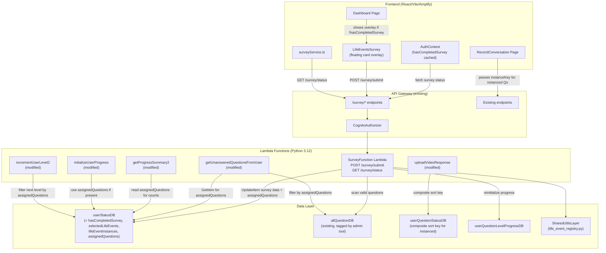
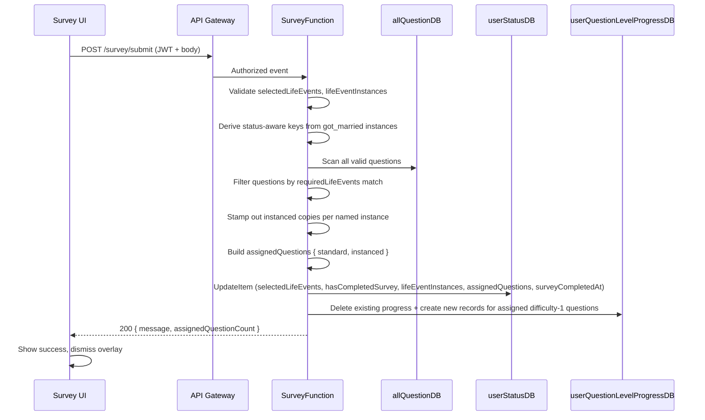

# Design Document: Life-Events Survey

## Overview

The Life-Events Survey feature adds a mandatory, one-time survey that personalizes each legacy maker's question set based on their life experiences. Currently, every user sees the same static pool of questions from `allQuestionDB`. After this feature, each user completes a 7-step floating overlay survey on the Dashboard, the backend filters and assigns only relevant questions (including per-person instanced copies for repeatable events like marriages and children), and all downstream Lambdas (progress, recording, level advancement) operate on the personalized `assignedQuestions` structure stored in `userStatusDB`.

### Key Design Decisions

1. **Single Survey Lambda with routing** — One Lambda handles both `POST /survey/submit` and `GET /survey/status` via HTTP method routing. This mirrors the admin tool pattern and reduces SAM template bloat.

2. **Inline question assignment** — The Question_Assignment_Service runs inside the survey submit Lambda rather than as a separate Lambda. Assignment is a pure filter+stamp operation over `allQuestionDB` that completes in <2 seconds. This avoids async orchestration complexity and lets the frontend show the assigned question count in the success response.

3. **UpdateItem for survey writes** — The survey Lambda uses DynamoDB `UpdateItem` (not `PutItem`) to add survey fields to the existing `userStatusDB` record. This preserves `currLevel`, `allowTranscription`, and other attributes that `PutItem` would overwrite.

4. **Ordinal-based instance keys** — Instance keys use the format `<eventKey>:<ordinal>` (e.g., `got_married:1`), not names. This guarantees uniqueness even when two instances share the same name, and makes the composite sort key in `userQuestionStatusDB` stable across retakes.

5. **Survey gating via AuthContext** — The `hasCompletedSurvey` flag is fetched once on auth and cached in `AuthContext`. The `ProtectedRoute` component and Dashboard check this flag to show/hide the survey overlay. No new route guard component is needed — the overlay renders conditionally inside Dashboard.

6. **Backward-compatible fallbacks** — All modified Lambdas check for the presence of `assignedQuestions` before using it. Missing or empty `assignedQuestions` falls back to current behavior (all valid questions). This ensures existing users without survey data continue working.

7. **Composite sort key for instanced responses** — Video responses for instanced questions use `{questionId}#{instanceKey}` as the sort key in `userQuestionStatusDB`. Non-instanced responses keep the plain `questionId` sort key. No migration of existing records is needed.

## Architecture



### Request Flow: Survey Submission




## Components and Interfaces

### Frontend Components

#### LifeEventsSurvey (New Component)

The main survey overlay component. Renders as a floating card centered over the Dashboard with a semi-transparent backdrop.

```tsx
// FrontEndCode/src/components/LifeEventsSurvey.tsx
interface LifeEventsSurveyProps {
  onComplete: (assignedQuestionCount: number) => void;
  /** Pre-populated data for retakes */
  initialSelections?: string[];
  initialInstances?: LifeEventInstanceData[];
  isRetake?: boolean;
}

interface LifeEventInstanceData {
  eventKey: string;
  instances: Array<{
    name: string;
    ordinal: number;
    status?: 'married' | 'divorced' | 'deceased';
  }>;
}

interface SurveyStep {
  title: string;
  category: string;
  events: LifeEventKeyInfo[];  // from lifeEventRegistry.ts
}
```

Internal state:
- `currentStep: number` (0–6, maps to 7 category steps)
- `selectedEvents: Set<string>` (Life_Event_Keys)
- `instanceData: Map<string, LifeEventInstanceData>` (keyed by eventKey)
- `customLifeEvent: string` (free-text for "other")
- `isSubmitting: boolean`
- `submitError: string | null`
- `submitSuccess: { count: number } | null`

Step navigation:
- "Next" button advances `currentStep` (validates instanceable inputs first)
- "Back" button decrements `currentStep`
- "Submit" button on step 7 calls `POST /survey/submit`
- Progress indicator shows "Step X of 7"
- Animated transitions via CSS `transition` on card content

Instanceable follow-up UI:
- When an instanceable event is checked, a sub-form appears inline within the same step card
- Number picker (1–10) for "How many times?"
- Name input fields with ordinal labels ("What was your first spouse's name?")
- For `got_married`: additional status dropdown per instance (married/divorced/deceased)
- Validation: non-empty name required for each instance; valid status required for `got_married`

#### SurveyGate Integration (Modified Dashboard)

Rather than a new component, the Dashboard conditionally renders the `LifeEventsSurvey` overlay:

```tsx
// Inside Dashboard component
const { user, hasCompletedSurvey, surveyLoading } = useAuth();

// Show loading while survey status is being fetched
if (surveyLoading) return <LoadingSpinner />;

return (
  <div className="min-h-screen bg-gray-50">
    <Header />
    <main>
      {/* Dashboard content renders underneath */}
      <ProgressSection ... />
    </main>
    
    {/* Survey overlay on top */}
    {!hasCompletedSurvey && (
      <LifeEventsSurvey onComplete={handleSurveyComplete} />
    )}
  </div>
);
```

The backdrop prevents interaction with Dashboard controls via `pointer-events-none` on the Dashboard content and a `z-50` overlay.

#### ProtectedRoute Modification

For non-Dashboard protected routes, redirect to Dashboard if survey is incomplete:

```tsx
// Modified ProtectedRoute.tsx
const ProtectedRoute = ({ children, requiredPersona }) => {
  const { user, isLoading, hasCompletedSurvey } = useAuth();
  const location = useLocation();
  
  if (isLoading) return null;
  if (!user) return <Navigate to="/login" replace />;
  
  if (requiredPersona && user.personaType !== requiredPersona) {
    const fallback = user.personaType === 'legacy_benefactor'
      ? '/benefactor-dashboard' : '/dashboard';
    return <Navigate to={fallback} replace />;
  }
  
  // Redirect to dashboard (which shows survey overlay) if survey not completed
  // Only for legacy_maker routes other than dashboard itself
  if (user.personaType === 'legacy_maker' 
      && hasCompletedSurvey === false 
      && location.pathname !== '/dashboard') {
    return <Navigate to="/dashboard" replace />;
  }
  
  return <>{children}</>;
};
```

#### AuthContext Modifications

Add `hasCompletedSurvey` to the auth state:

```tsx
interface AuthContextType {
  // ... existing fields
  hasCompletedSurvey: boolean | null;  // null = loading
  refreshSurveyStatus: () => Promise<void>;
}

interface User {
  // ... existing fields
}
```

On login/auth check, fetch `GET /survey/status` and cache `hasCompletedSurvey`. After survey submission, call `refreshSurveyStatus()` to update the cached value.

#### surveyService.ts (New Service)

```tsx
// FrontEndCode/src/services/surveyService.ts
export async function submitSurvey(payload: {
  selectedLifeEvents: string[];
  lifeEventInstances?: LifeEventInstanceData[];
  customLifeEvent?: string;
}): Promise<{ message: string; assignedQuestionCount: number }>;

export async function getSurveyStatus(): Promise<{
  hasCompletedSurvey: boolean;
  selectedLifeEvents: string[] | null;
  surveyCompletedAt: string | null;
  lifeEventInstances: LifeEventInstanceData[] | null;
}>;
```

#### RecordConversation / RecordResponse Modifications

When rendering instanced questions:
- Replace `instancePlaceholder` in question text with `instanceName`
- Pass `instanceKey` to the video upload call
- Present instanced questions grouped by instance, in ordinal order (not shuffled)

### Backend API Endpoints

#### SurveyFunction Lambda (New)

Single Lambda handling both survey endpoints via HTTP method routing.

**POST /survey/submit**

```
Request:
{
  "selectedLifeEvents": ["got_married", "had_children", "first_job"],
  "lifeEventInstances": [
    {
      "eventKey": "got_married",
      "instances": [
        { "name": "Sarah", "ordinal": 1, "status": "married" },
        { "name": "David", "ordinal": 2, "status": "divorced" }
      ]
    },
    {
      "eventKey": "had_children",
      "instances": [
        { "name": "Emma", "ordinal": 1 },
        { "name": "Jack", "ordinal": 2 }
      ]
    }
  ],
  "customLifeEvent": "Climbed Mount Everest in 2015"
}

Response 200:
{
  "message": "Survey completed",
  "assignedQuestionCount": 187
}

Response 400:
{
  "error": "Invalid life event key: 'invalid_key'"
}
```

**GET /survey/status**

```
Response 200:
{
  "hasCompletedSurvey": true,
  "selectedLifeEvents": ["got_married", "had_children", "first_job"],
  "surveyCompletedAt": "2026-03-15T10:30:00Z",
  "lifeEventInstances": [...]
}
```

#### Question Assignment Logic (Inside SurveyFunction)

```python
def assign_questions(selected_events, life_event_instances, all_questions):
    """
    Filter questions and build assignedQuestions structure.
    
    Args:
        selected_events: list of Life_Event_Key strings
        life_event_instances: list of instance data dicts
        all_questions: list of question records from allQuestionDB
    
    Returns:
        dict with 'standard' and 'instanced' keys
    """
    selected_set = set(selected_events)
    
    # Derive status-aware keys from got_married instances
    for inst_group in life_event_instances:
        if inst_group['eventKey'] == 'got_married':
            for inst in inst_group['instances']:
                status = inst.get('status')
                if status == 'divorced':
                    selected_set.add('spouse_divorced')
                elif status == 'deceased':
                    selected_set.add('spouse_deceased')
                elif status == 'married':
                    selected_set.add('spouse_still_married')
    
    # Build instance lookup: eventKey -> [instances]
    instance_map = {}
    for inst_group in life_event_instances:
        instance_map[inst_group['eventKey']] = inst_group['instances']
    
    standard = []
    instanced = {}  # (eventKey, ordinal) -> { eventKey, instanceName, instanceOrdinal, questionIds }
    
    for q in all_questions:
        if not is_valid_question(q):
            continue
        
        required = q.get('requiredLifeEvents', [])
        
        # Check if question matches user's events
        if required and not all(k in selected_set for k in required):
            continue
        
        if not q.get('isInstanceable', False):
            standard.append(q['questionId'])
        else:
            # Determine which instances this question applies to
            matching_instances = get_matching_instances(q, instance_map, selected_set)
            for inst in matching_instances:
                key = (inst['eventKey'], inst['ordinal'])
                if key not in instanced:
                    instanced[key] = {
                        'eventKey': inst['eventKey'],
                        'instanceName': inst['name'],
                        'instanceOrdinal': inst['ordinal'],
                        'questionIds': []
                    }
                instanced[key]['questionIds'].append(q['questionId'])
    
    # Sort instanced groups by eventKey then ordinal
    sorted_instanced = sorted(instanced.values(), 
                              key=lambda g: (g['eventKey'], g['instanceOrdinal']))
    
    return { 'standard': standard, 'instanced': sorted_instanced }
```

Status-aware matching for `got_married`:

```python
def get_matching_instances(question, instance_map, selected_set):
    """
    For an instanceable question, determine which instances it applies to.
    Handles status-aware keys for got_married.
    """
    required = question.get('requiredLifeEvents', [])
    
    # Find the instanceable event key in requiredLifeEvents
    # Status-derived keys map back to got_married instances
    STATUS_KEY_MAP = {
        'spouse_divorced': ('got_married', 'divorced'),
        'spouse_deceased': ('got_married', 'deceased'),
        'spouse_still_married': ('got_married', 'married'),
    }
    
    for req_key in required:
        if req_key in STATUS_KEY_MAP:
            base_key, required_status = STATUS_KEY_MAP[req_key]
            instances = instance_map.get(base_key, [])
            return [i for i in instances if i.get('status') == required_status]
        
        if req_key in instance_map:
            # Base key (e.g., got_married) — all instances regardless of status
            return instance_map[req_key]
    
    return []
```

### Modifications to Existing Lambdas

#### getUnansweredQuestionsFromUser (Modified)

Add a `GetItem` call to `userStatusDB` to fetch `assignedQuestions`. If present, filter the question list to only assigned question IDs before checking answered status.

```python
# New logic added to get_unanswered_questions()
user_status = user_status_table.get_item(Key={'userId': thisUserId})
assigned = user_status.get('Item', {}).get('assignedQuestions')

if assigned:
    # Build set of all assigned questionIds for this questionType
    assigned_ids = set(assigned.get('standard', []))
    for group in assigned.get('instanced', []):
        assigned_ids.update(group.get('questionIds', []))
    
    # Filter validQuestionIds to only assigned ones
    validQuestionIds = [qid for qid in validQuestionIds if qid in assigned_ids]
```

IAM change: Add `dynamodb:GetItem` on `userStatusDB` to the function's policy.

#### uploadVideoResponse (Modified)

Accept optional `instanceKey` in request body. When present, use composite sort key `{questionId}#{instanceKey}`.

```python
instance_key = body.get('instanceKey')  # e.g., "got_married:1"
sort_key = f"{question_id}#{instance_key}" if instance_key else question_id

# In update_user_question_status:
table.put_item(Item={
    'userId': user_id,
    'questionId': sort_key,  # composite sort key for instanced
    'instanceKey': instance_key,  # stored as separate attribute too
    # ... rest of existing fields
})
```

No IAM changes needed — already has `PutItem` on `userQuestionStatusDB`.

#### getProgressSummary2 (Modified)

When `assignedQuestions` is present in `userStatusDB`, use it to calculate total question counts instead of scanning all valid questions. Each instanced question copy counts separately.

```python
user_status = user_status_table.get_item(Key={'userId': user_id})
assigned = user_status.get('Item', {}).get('assignedQuestions')

if assigned:
    # Handle legacy flat list format
    if isinstance(assigned, list):
        assigned = {'standard': assigned, 'instanced': []}
    
    total_assigned = len(assigned.get('standard', []))
    for group in assigned.get('instanced', []):
        total_assigned += len(group.get('questionIds', []))
    # Use total_assigned for progress calculation
```

No IAM changes needed — already has `GetItem` on `userStatusDB`.

#### initializeUserProgress (Modified)

When `assignedQuestions` is present, filter difficulty-1 questions to only those in the assigned set.

No IAM changes needed — already has `GetItem` and `PutItem` on `userStatusDB`.

#### incrementUserLevel2 (Modified)

When advancing to a new level, filter next-level questions to only those in `assignedQuestions`.

No IAM changes needed — already has `GetItem` on `userStatusDB`.


## Data Models

### userStatusDB Schema Changes

Existing attributes (unchanged):
| Attribute | Type | Description |
|---|---|---|
| `userId` | String (PK) | Cognito `sub` claim |
| `currLevel` | Number | Current global difficulty level |
| `allowTranscription` | Boolean | Transcription preference |

New attributes added by this feature:
| Attribute | Type | Default | Description |
|---|---|---|---|
| `hasCompletedSurvey` | Boolean | `false` (absent = false) | Whether user has completed the life-events survey |
| `selectedLifeEvents` | List of Strings | `[]` | Life_Event_Keys the user selected |
| `surveyCompletedAt` | String | `null` | ISO 8601 UTC timestamp of survey submission |
| `lifeEventInstances` | List of Maps | `[]` | Instance data for repeatable events (see below) |
| `assignedQuestions` | Map | `null` (absent = use all questions) | Structured assigned question set |
| `customLifeEvent` | String | `""` | Free-text custom life event description |

#### lifeEventInstances Structure

```json
[
  {
    "eventKey": "got_married",
    "instances": [
      { "name": "Sarah", "ordinal": 1, "status": "married" },
      { "name": "David", "ordinal": 2, "status": "divorced" }
    ]
  },
  {
    "eventKey": "had_children",
    "instances": [
      { "name": "Emma", "ordinal": 1 },
      { "name": "Jack", "ordinal": 2 }
    ]
  }
]
```

#### assignedQuestions Structure

```json
{
  "standard": ["childhood-00001", "career-00005", "general-00012"],
  "instanced": [
    {
      "eventKey": "got_married",
      "instanceName": "Sarah",
      "instanceOrdinal": 1,
      "questionIds": ["marriage-00001", "marriage-00003", "marriage-00007"]
    },
    {
      "eventKey": "got_married",
      "instanceName": "David",
      "instanceOrdinal": 2,
      "questionIds": ["marriage-00001", "marriage-00003", "divorce-00001"]
    },
    {
      "eventKey": "had_children",
      "instanceName": "Emma",
      "instanceOrdinal": 1,
      "questionIds": ["children-00001", "children-00005"]
    }
  ]
}
```

Note: `assignedQuestions.instanced` is ordered by `eventKey` then `instanceOrdinal` ascending. The same `questionId` (template) can appear in multiple instance groups — each is a separate instanced copy.

#### Legacy Flat List Compatibility

If `assignedQuestions` is a flat list of strings (legacy format from an earlier implementation), all consuming Lambdas treat it as `{ standard: <the flat list>, instanced: [] }`.

### userQuestionStatusDB Schema Changes

Existing schema (unchanged for non-instanced):
| Attribute | Type | Description |
|---|---|---|
| `userId` | String (PK) | Cognito `sub` |
| `questionId` | String (SK) | Question ID (sort key) |
| `questionType` | String | Theme name |
| `filename` | String | Video filename |
| `videoS3Location` | String | S3 path |
| `timestamp` | String | ISO 8601 |
| `status` | String | `completed` |

New composite sort key for instanced responses:
| Sort Key Format | Example | When Used |
|---|---|---|
| `{questionId}` | `marriage-00001` | Non-instanced (standard) questions |
| `{questionId}#{instanceKey}` | `marriage-00001#got_married:1` | Instanced questions |

New attribute on instanced records:
| Attribute | Type | Description |
|---|---|---|
| `instanceKey` | String | `<eventKey>:<ordinal>` (e.g., `got_married:1`). Stored as separate attribute for querying. |

Existing records with plain `questionId` sort keys remain valid — no migration needed.

### allQuestionDB Schema (No Changes)

The admin tool (already deployed) has added `requiredLifeEvents`, `isInstanceable`, and `instancePlaceholder` to all questions. The migration endpoint has backfilled defaults on existing records. No schema changes are needed for this feature.

### SAM Template Additions

New Lambda function definition:

```yaml
SurveyFunction:
  Type: AWS::Serverless::Function
  Properties:
    Layers:
      - !Ref SharedUtilsLayer
    CodeUri: functions/surveyFunctions/survey/
    Handler: app.lambda_handler
    Architectures:
      - arm64
    Timeout: 30
    MemorySize: 256
    Policies:
      - Statement:
          - Effect: Allow
            Action:
              - dynamodb:UpdateItem
              - dynamodb:GetItem
            Resource: !Sub arn:aws:dynamodb:${AWS::Region}:${AWS::AccountId}:table/userStatusDB
      - Statement:
          - Effect: Allow
            Action:
              - dynamodb:Scan
              - dynamodb:Query
            Resource:
              - !Sub arn:aws:dynamodb:${AWS::Region}:${AWS::AccountId}:table/allQuestionDB
              - !Sub arn:aws:dynamodb:${AWS::Region}:${AWS::AccountId}:table/allQuestionDB/index/*
      - Statement:
          - Effect: Allow
            Action:
              - dynamodb:PutItem
              - dynamodb:Query
              - dynamodb:DeleteItem
            Resource: !Sub arn:aws:dynamodb:${AWS::Region}:${AWS::AccountId}:table/userQuestionLevelProgressDB
      - Statement:
          - Effect: Allow
            Action:
              - kms:Decrypt
              - kms:DescribeKey
            Resource: !GetAtt DataEncryptionKey.Arn
    Events:
      SurveySubmitApi:
        Type: Api
        Properties:
          Path: /survey/submit
          Method: POST
          Auth:
            Authorizer: CognitoAuthorizer
      SurveySubmitOptionsApi:
        Type: Api
        Properties:
          Path: /survey/submit
          Method: OPTIONS
      SurveyStatusApi:
        Type: Api
        Properties:
          Path: /survey/status
          Method: GET
          Auth:
            Authorizer: CognitoAuthorizer
      SurveyStatusOptionsApi:
        Type: Api
        Properties:
          Path: /survey/status
          Method: OPTIONS
```

IAM modification to existing `GetUnansweredQuestionsFromUserFunction`:

```yaml
# Add to existing Policies block:
- Statement:
    - Effect: Allow
      Action:
        - dynamodb:GetItem
      Resource: !Sub arn:aws:dynamodb:${AWS::Region}:${AWS::AccountId}:table/userStatusDB
```

No IAM changes needed for `uploadVideoResponse`, `getProgressSummary2`, `initializeUserProgress`, or `incrementUserLevel2` — they already have the required permissions on `userStatusDB`.


## Correctness Properties

*A property is a characteristic or behavior that should hold true across all valid executions of a system — essentially, a formal statement about what the system should do. Properties serve as the bridge between human-readable specifications and machine-verifiable correctness guarantees.*

### Property 1: Assignment filtering correctness

*For any* set of questions (each with a `requiredLifeEvents` list) and *for any* set of user-selected Life_Event_Keys (including status-derived keys), a question is included in the assigned set if and only if: (a) its `requiredLifeEvents` is empty, OR (b) every key in its `requiredLifeEvents` is present in the user's effective selected set. Furthermore, included questions with `isInstanceable` equal to `false` go into `assignedQuestions.standard`, and included questions with `isInstanceable` equal to `true` go into `assignedQuestions.instanced`.

**Validates: Requirements 1.2, 1.8, 6.2, 6.3, 6.4, 6.5**

### Property 2: Instance stamping correctness

*For any* instanceable question that matches a user's selections, and *for any* set of life event instances for the matching event key, the Question_Assignment_Service shall produce exactly one instance group per matching instance. For questions requiring a status-derived key (e.g., `spouse_divorced`), only instances with the matching status are stamped. For questions requiring the base `got_married` key, all instances are stamped regardless of status. Instance groups shall be ordered by `eventKey` ascending, then by `instanceOrdinal` ascending.

**Validates: Requirements 6.6, 6.8, 6.9, 6.10**

### Property 3: Survey data round-trip

*For any* valid survey submission (valid `selectedLifeEvents`, valid `lifeEventInstances`, optional `customLifeEvent`), submitting via `POST /survey/submit` and then reading via `GET /survey/status` shall return the same `selectedLifeEvents`, `lifeEventInstances`, and `hasCompletedSurvey` equal to `true`. The `UpdateItem` operation shall preserve existing attributes (`currLevel`, `allowTranscription`) on the user's record.

**Validates: Requirements 5.3, 5.8, 5.10, 9.3, 13.3**

### Property 4: Input validation rejects invalid data

*For any* survey submission request body, the Survey_Service shall return HTTP 400 if any of the following hold: (a) `selectedLifeEvents` is missing or not an array of strings, (b) any string in `selectedLifeEvents` is not a recognized Life_Event_Key and not `other`, (c) any entry in `lifeEventInstances` has an `eventKey` that is not a recognized instanceable Life_Event_Key, (d) any instance has an empty `name`, (e) any `got_married` instance is missing a `status` field or has a status value other than `married`, `divorced`, or `deceased`.

**Validates: Requirements 3.23, 5.1, 5.2, 5.7, 5.11**

### Property 5: Survey gating logic

*For any* authenticated Legacy_Maker user, the survey overlay is displayed on the Dashboard if and only if `hasCompletedSurvey` is `false` (or absent). When `hasCompletedSurvey` is `false` and the user navigates to any protected route other than the Dashboard, the system redirects to the Dashboard.

**Validates: Requirements 4.1, 4.2, 4.4**

### Property 6: Composite sort key correctness

*For any* video response upload, if `instanceKey` is present in the request body, the record's sort key in `userQuestionStatusDB` shall be `{questionId}#{instanceKey}` and the `instanceKey` shall be stored as a separate attribute. If `instanceKey` is absent or null, the sort key shall be the plain `questionId` with no `#` suffix. The `update_user_progress` function shall use the same composite key format when updating progress records.

**Validates: Requirements 14.8, 14.10, 16.1, 16.2, 16.4, 16.6**

### Property 7: Instanced question ordering

*For any* `assignedQuestions` structure with instanced groups, when the recording flow presents questions, all questions within a single instance group shall be presented consecutively (no interleaving with other groups). All instanced groups for a given `questionType` shall be presented as a contiguous block, separate from standard questions. The order shall follow `eventKey` ascending, then `instanceOrdinal` ascending, then the order of `questionIds` within each group.

**Validates: Requirements 14.1, 14.2, 14.3, 14.5, 14.6**

### Property 8: Placeholder replacement

*For any* instanceable question text containing a placeholder token (e.g., `{spouse_name}`) and *for any* instance name string, replacing the placeholder with the instance name shall produce a string that contains the instance name and does not contain the original placeholder token.

**Validates: Requirements 14.4**

### Property 9: Composite key uniqueness

*For any* set of instanced question assignments where each instance has a unique `instanceKey` (format `<eventKey>:<ordinal>`), the composite sort keys `{questionId}#{instanceKey}` shall be unique across all instanced video responses for a given user. Two different instances of the same template question produce different composite keys.

**Validates: Requirements 14.9**

### Property 10: Progress counting with assignedQuestions

*For any* `assignedQuestions` structure, the total question count shall equal `len(standard) + sum(len(group.questionIds) for group in instanced)`. Each instanced copy of a question counts as a separate question for progress purposes. When questions are added or removed via retake, the count adjusts accordingly.

**Validates: Requirements 7.1, 7.5**

### Property 11: Assigned-questions-aware filtering

*For any* user with a non-empty `assignedQuestions` structure, the `getUnansweredQuestionsFromUser` Lambda shall return only question IDs that appear in the user's `assignedQuestions` (either in `standard` or in any `instanced[].questionIds`). The `initializeUserProgress` and `incrementUserLevel2` Lambdas shall similarly filter questions at the target difficulty level to only those in `assignedQuestions`.

**Validates: Requirements 7.3, 7.4, 15.1, 16.5**

### Property 12: Diff-based retake assignment

*For any* old `assignedQuestions` and new `assignedQuestions` computed from a retaken survey, the diff shall correctly categorize questions into three buckets: (a) kept — present in both old and new, retaining existing progress; (b) added — present only in new, added as unanswered; (c) removed — present only in old, removed from `assignedQuestions` but video responses preserved. For instanced questions, the diff uses `questionId + instanceKey` as the composite identifier.

**Validates: Requirements 13.4, 13.5, 13.7**

### Property 13: AssignedQuestions structure validity

*For any* output of the Question_Assignment_Service, the `assignedQuestions` object shall have exactly two keys: `standard` (a list of questionId strings) and `instanced` (a list of objects each containing `eventKey` (string), `instanceName` (string), `instanceOrdinal` (number), and `questionIds` (list of strings)). Every `questionId` in the structure shall reference a valid question in `allQuestionDB`.

**Validates: Requirements 2.4**


## Error Handling

### Frontend Error Handling

| Scenario | Behavior |
|---|---|
| Survey submit fails (network/4xx/5xx) | Error toast displayed, overlay stays open, selections preserved, Submit button re-enabled |
| Survey status fetch fails on auth | `hasCompletedSurvey` defaults to `null` (loading state), retry on next navigation |
| Instance name validation fails | Inline error message on the name input, Next/Submit button disabled |
| `got_married` status missing | Inline error on status dropdown, Next/Submit button disabled |
| Survey overlay dismissed attempt | No close button, no click-outside-to-dismiss, no escape key handler |
| Retake pre-population fails | Survey opens with empty state (fresh survey), warning toast |

### Backend Error Handling

| Scenario | HTTP Status | Response | Logging |
|---|---|---|---|
| Missing `selectedLifeEvents` | 400 | `{ "error": "Missing required field: selectedLifeEvents" }` | Request body logged |
| Invalid Life_Event_Key | 400 | `{ "error": "Invalid life event key: '<key>'" }` | Invalid key logged |
| Invalid instanceable eventKey | 400 | `{ "error": "Invalid instanceable event key: '<key>'" }` | Invalid key logged |
| Empty instance name | 400 | `{ "error": "Instance name cannot be empty" }` | Instance data logged |
| Missing got_married status | 400 | `{ "error": "got_married instances require a status field" }` | Instance data logged |
| Invalid got_married status value | 400 | `{ "error": "Invalid status '<val>'. Must be married, divorced, or deceased" }` | Invalid value logged |
| DynamoDB UpdateItem fails | 500 | `{ "error": "Failed to save survey. Please try again." }` | Full exception + traceback to CloudWatch |
| DynamoDB Scan fails (allQuestionDB) | 500 | `{ "error": "Failed to process questions. Please try again." }` | Full exception + traceback |
| Progress reinitialization fails | 500 | `{ "error": "Survey saved but progress initialization failed. Please refresh." }` | Full exception + traceback |
| No authenticated user (missing sub) | 401 | `{ "error": "Unauthorized" }` | Event logged |

### Backward Compatibility Error Prevention

| Scenario | Handling |
|---|---|
| `assignedQuestions` missing from userStatusDB | All consuming Lambdas fall back to current behavior (all valid questions) |
| `assignedQuestions` is flat list (legacy) | Treated as `{ standard: <list>, instanced: [] }` |
| `hasCompletedSurvey` missing | Treated as `false` — survey overlay shown |
| `lifeEventInstances` missing | Treated as `[]` — only standard questions assigned |
| Existing video records with plain questionId SK | Remain valid, no migration needed |

## Testing Strategy

### Property-Based Testing

Library: **fast-check** (TypeScript) for frontend logic, **Hypothesis** (Python) for backend Lambda logic.

Each property test must run a minimum of 100 iterations and be tagged with a comment referencing the design property.

Tag format: `Feature: life-events-survey, Property {number}: {property_text}`

#### Frontend Property Tests (fast-check)

| Property | Test Description | Generator Strategy |
|---|---|---|
| Property 1 | Assignment filtering | Generate random questions with random `requiredLifeEvents`, random user selections. Verify inclusion/exclusion and standard/instanced categorization. |
| Property 2 | Instance stamping | Generate random instanceable questions, random instances with random statuses. Verify correct stamp-out count and ordering. |
| Property 4 | Input validation | Generate random request bodies with mix of valid/invalid keys, empty names, missing statuses. Verify 400 vs success. |
| Property 5 | Survey gating | Generate random `hasCompletedSurvey` values and random route paths. Verify overlay/redirect behavior. |
| Property 7 | Instanced question ordering | Generate random `assignedQuestions` with multiple instance groups. Verify ordering invariants. |
| Property 8 | Placeholder replacement | Generate random question texts with placeholders and random instance names. Verify replacement correctness. |
| Property 9 | Composite key uniqueness | Generate random sets of (questionId, instanceKey) pairs. Verify all composite keys are unique. |
| Property 10 | Progress counting | Generate random `assignedQuestions` structures. Verify total count formula. |
| Property 13 | Structure validity | Generate random assignment outputs. Verify structure has correct shape and all questionIds are valid. |

#### Backend Property Tests (Hypothesis)

| Property | Test Description | Generator Strategy |
|---|---|---|
| Property 1 | Assignment filtering (Python) | Same as frontend but testing the Python `assign_questions` function directly. |
| Property 2 | Instance stamping (Python) | Test `get_matching_instances` with random questions and instances. |
| Property 3 | Survey data round-trip | Generate random valid submissions, mock DynamoDB, verify read-back matches write. |
| Property 4 | Input validation (Python) | Generate random payloads, verify validation function accepts/rejects correctly. |
| Property 6 | Composite sort key | Generate random (questionId, instanceKey) pairs, verify sort key format. |
| Property 11 | Assigned-questions-aware filtering | Generate random assignedQuestions and question sets, verify filtering. |
| Property 12 | Diff-based retake | Generate random old and new assignedQuestions, verify diff categorization. |

### Unit Tests

Unit tests complement property tests by covering specific examples, edge cases, and integration points:

- **Edge cases**: Empty selections (zero events), all events selected, single instance, max instances (10), legacy flat-list `assignedQuestions` format
- **Status-aware filtering examples**: Question requiring `spouse_divorced` with mixed-status instances
- **Retake scenarios**: Add new event, remove event, add instance, remove instance, change instance status
- **API integration**: Mock API calls for submit/status endpoints, verify request/response format
- **UI component tests**: Survey step navigation, instanceable follow-up rendering, validation error display
- **Backward compatibility**: User with no survey data, user with legacy assignedQuestions format

### Integration Tests

- End-to-end survey flow: submit survey → verify assignedQuestions → verify progress initialization → verify question filtering
- Retake flow: submit → record some videos → retake with changes → verify diff-based update preserves progress
- Composite sort key flow: record instanced video → verify sort key format → verify unanswered filtering accounts for it

