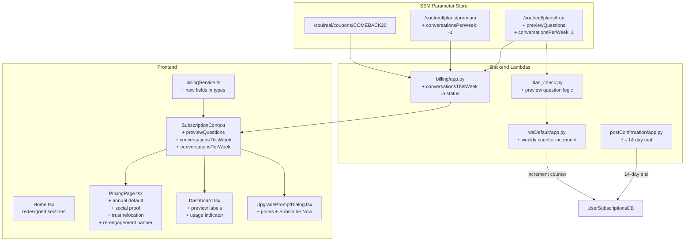

# Design Document: Pricing Conversion Optimization

## Overview

This design covers 10 coordinated changes to improve SoulReel's free-to-premium conversion funnel. The changes span the full stack — SSM plan definitions, Python Lambda backends (plan_check, billing, postConfirmation, wsDefault), and React/TypeScript frontend (Home, PricingPage, Dashboard, UpgradePromptDialog, SubscriptionContext, billingService).

The changes fall into three categories:

1. **Value demonstration** (Req 1, 3, 4): Let free users experience premium content and redesign the landing page to sell the experience.
2. **Friction reduction** (Req 2, 6, 7): Extend trial, default to annual billing, and enable in-dialog checkout.
3. **Conversion nudges** (Req 5, 8, 9, 10): Add social proof, usage indicators, re-engagement coupons, and relocate trust messaging.

No new Lambda functions are created. No new DynamoDB tables are needed. The existing `UserSubscriptionsDB` table gains two new attributes (`conversationsThisWeek`, `weekResetDate`). The SSM plan definitions gain new fields (`previewQuestions`, `conversationsPerWeek`).

**IAM change required**: `WebSocketDefaultFunction` currently only has `dynamodb:GetItem` on `UserSubscriptionsTable`. The conversation counter increment requires adding `dynamodb:UpdateItem` to that policy in `SamLambda/template.yml`.

## Architecture



### Data Flow

1. **Plan definitions** flow from SSM → plan_check.py / billing Lambda → SubscriptionContext → components.
2. **Conversation counter** is incremented by wsDefault on each `start_conversation`, read by billing status, and displayed by Dashboard.
3. **Preview question access** is checked by plan_check.py using the `previewQuestions` list from the free plan SSM definition.
4. **Re-engagement** uses localStorage on the frontend to track pricing page visits; the COMEBACK20 coupon is a standard SSM coupon redeemed through the existing `apply-coupon` endpoint.

## Components and Interfaces

### Backend Changes

#### 1. SSM Plan Definitions

**Free plan** (`/soulreel/plans/free`) — add two fields:

```json
{
  "planId": "free",
  "allowedQuestionCategories": ["life_story_reflections_L1"],
  "maxBenefactors": 2,
  "accessConditionTypes": ["immediate"],
  "features": ["basic"],
  "previewQuestions": [
    "<real_life_events_question_id>",
    "<real_values_emotions_question_id>"
  ],
  "conversationsPerWeek": 3
}
```

> **Note**: The `previewQuestions` values must be real question IDs from `allQuestionDB`. The question ID format is `{category}-{subcategory}-L{level}-Q{number}` (e.g., `life_story_reflections-general-L2-Q5`). During implementation, query `allQuestionDB` for one suitable question from each locked category and use those IDs. Do not invent question IDs — they must exist in the database for the conversation engine to find the question text.

**Premium plan** (`/soulreel/plans/premium`) — add one field:

```json
{
  "conversationsPerWeek": -1
}
```

**COMEBACK20 coupon** (`/soulreel/coupons/COMEBACK20`):

```json
{
  "code": "COMEBACK20",
  "type": "percentage",
  "percentOff": 20,
  "durationMonths": 3,
  "stripeCouponId": "COMEBACK20",
  "maxRedemptions": 0,
  "currentRedemptions": 0,
  "expiresAt": null,
  "createdBy": "system-config"
}
```

> **Note on `maxRedemptions: 0`**: In the existing coupon validation logic (`billing/app.py`), the check is `if max_redemptions > 0 and current_redemptions >= max_redemptions`. So `0` means unlimited redemptions — it skips the limit check entirely. This is intentional for a persistent promotional coupon.

#### 2. plan_check.py — Preview Question Support

Add a new function `check_preview_question_access` and modify `check_question_category_access`:

```python
def check_question_category_access(user_id: str, question_id: str) -> dict:
    # ... existing logic ...
    # After determining access is denied for a free user:
    # Check if question_id is in the free plan's previewQuestions list
    preview_questions = plan_def.get('previewQuestions', [])
    if question_id in preview_questions:
        # Check if user has already completed this preview
        # (query userQuestionStatusDB for this question_id)
        if not _has_completed_preview(user_id, question_id):
            return {'allowed': True, 'isPreview': True, 'reason': None, 'message': None}
    # ... existing deny response ...
```

The `_has_completed_preview` helper queries `userQuestionStatusDB` to check if the user already has a transcript for that question ID. This reuses the existing question status infrastructure — no new tables needed.

**Implementation detail**: plan_check.py currently only accesses `UserSubscriptionsDB`. The `_has_completed_preview` helper needs a new DynamoDB table reference for `userQuestionStatusDB`. Add a module-level table name variable:

```python
_QUESTION_STATUS_TABLE = os.environ.get('TABLE_QUESTION_STATUS', 'userQuestionStatusDB')
```

The query pattern is a `get_item` with `Key={'userId': user_id, 'questionId': question_id}` — if the item exists, the preview has been completed.

**IAM impact**: wsDefault already has `dynamodb:GetItem` on `userQuestionStatusDB` (confirmed in template.yml). Since plan_check.py runs inside wsDefault's Lambda execution context, it inherits these permissions. No IAM changes needed for preview completion checks.

#### 3. postConfirmation/app.py — 14-Day Trial

Single line change:

```python
# Before:
trial_expires = (datetime.now(timezone.utc) + timedelta(days=7)).isoformat()
# After:
trial_expires = (datetime.now(timezone.utc) + timedelta(days=14)).isoformat()
```

No IAM changes needed.

#### 4. wsDefault/app.py — Conversation Counter

In `handle_start_conversation`, after the plan check passes, increment the weekly counter:

```python
def _increment_weekly_conversation_count(user_id: str):
    """Increment conversationsThisWeek, resetting if past weekResetDate.
    
    Uses a conditional update to handle the week-boundary reset atomically,
    avoiding race conditions when multiple conversations start simultaneously.
    """
    table = _dynamodb.Table(os.environ.get('TABLE_SUBSCRIPTIONS', 'UserSubscriptionsDB'))
    now = datetime.now(timezone.utc)
    # Monday of current ISO week
    monday = (now - timedelta(days=now.weekday())).replace(
        hour=0, minute=0, second=0, microsecond=0
    )
    monday_iso = monday.isoformat()

    try:
        # Attempt atomic increment for the current week
        table.update_item(
            Key={'userId': user_id},
            UpdateExpression='SET conversationsThisWeek = if_not_exists(conversationsThisWeek, :zero) + :one, updatedAt = :now',
            ConditionExpression='attribute_not_exists(weekResetDate) OR weekResetDate >= :mon',
            ExpressionAttributeValues={
                ':one': 1, ':zero': 0, ':now': now.isoformat(), ':mon': monday_iso
            },
        )
    except table.meta.client.exceptions.ConditionalCheckFailedException:
        # weekResetDate is from a previous week — reset counter
        table.update_item(
            Key={'userId': user_id},
            UpdateExpression='SET conversationsThisWeek = :one, weekResetDate = :mon, updatedAt = :now',
            ExpressionAttributeValues={
                ':one': 1, ':mon': monday_iso, ':now': now.isoformat()
            },
        )
```

**IAM impact — CHANGE REQUIRED**: wsDefault currently only has `dynamodb:GetItem` on `UserSubscriptionsTable`. The counter increment requires `dynamodb:UpdateItem`. Add to `SamLambda/template.yml` in the WebSocketDefaultFunction policies:

```yaml
# Existing policy (line ~1118):
- Statement:
    - Effect: Allow
      Action:
        - dynamodb:GetItem
      Resource: !GetAtt UserSubscriptionsTable.Arn
# Change to:
- Statement:
    - Effect: Allow
      Action:
        - dynamodb:GetItem
        - dynamodb:UpdateItem
      Resource: !GetAtt UserSubscriptionsTable.Arn
```

This is a required IAM change that must be deployed before the conversation counter code.

#### 5. billing/app.py — Status Endpoint Enhancement

In `handle_status`, add the new fields to the response:

```python
return cors_response(200, {
    # ... existing fields ...
    'conversationsThisWeek': int(item.get('conversationsThisWeek', 0)),
    'weekResetDate': item.get('weekResetDate'),
    'conversationsPerWeek': plan_def.get('conversationsPerWeek', 3),
    'previewQuestions': plan_def.get('previewQuestions', []),
}, event)
```

No IAM changes — billing Lambda already reads SSM plans and DynamoDB subscription records.

> **Note**: The public `/billing/plans` endpoint (`handle_get_plans`) also returns plan definitions from SSM. Adding `previewQuestions` and `conversationsPerWeek` to the SSM plan definitions means they will automatically appear in the public plans response too. This is acceptable — preview question IDs and conversation limits are not sensitive data, and the public plans endpoint is used by the unauthenticated pricing page.

### Frontend Changes

#### 6. billingService.ts — Type Extensions

```typescript
export interface PlanLimits {
  // ... existing fields ...
  previewQuestions?: string[];
  conversationsPerWeek?: number;
}

export interface SubscriptionStatus {
  // ... existing fields ...
  conversationsThisWeek: number;
  weekResetDate: string | null;
  conversationsPerWeek: number;
}
```

#### 7. SubscriptionContext.tsx — New State Fields

Expose `previewQuestions`, `conversationsThisWeek`, `weekResetDate`, and `conversationsPerWeek` from the subscription status response. Add them to the `SubscriptionState` interface and the `useMemo` derivation.

#### 8. Home.tsx — Redesigned Sections

- Replace generic "How It Works" steps with product-specific steps: "Choose a question", "Have an AI-guided conversation", "Share your story"
- Add sample question section with one example per content path
- Add testimonial placeholder section
- Restructure pricing section: value proposition first, annual price primary, monthly secondary
- Add subtitles to CTAs: "Start Free" → "Preserve your own stories and memories"; "Start Their Legacy" → "Set it up for a parent, grandparent, or loved one"
- Style "Start Free" as primary (filled), "Start Their Legacy" as secondary (outline)

#### 9. PricingPage.tsx — Multiple Enhancements

- Default `billingPeriod` state to `"annual"` instead of `"monthly"`
- Add "Best Value" badge next to Annual toggle option
- Add "Recommended" badge on Premium card for non-subscribed users
- Add anchoring text "Less than a cup of coffee a week" below Premium price
- Relocate trust messaging from bottom gray section to directly below plan grid with shield icon
- Add social proof section (testimonial + family counter placeholders) below trust messaging
- Remove the separate bottom gray trust `<section>`
- Add re-engagement banner logic:
  - On mount, check `localStorage.getItem('sr_pricing_first_visit')`
  - If null, set it to current timestamp (first visit — no banner)
  - If exists and user is free/non-subscribed, show COMEBACK20 banner
  - Banner displays: "Welcome back! Use code COMEBACK20 for 20% off Premium"
  - The banner condition is: `!isPremium && !isTrialing && hasLocalStorageTimestamp`. This means:
    - Free users who visited before → see banner ✓
    - Users whose trial expired (status: expired, isPremium: false) → see banner ✓
    - Active trialing users → no banner (they already have premium access)
    - Subscribed users → no banner

#### 10. Dashboard.tsx — Preview Labels and Usage Indicator

- For locked ContentPathCards, check if `previewQuestions` contains a question for that category
- If preview available and not yet completed, show "Try 1 free question" label instead of full lock (use the `badge` prop on `ContentPathCard`)
- Tapping "Try 1 free question" navigates to the preview question. Navigation targets:
  - Life Events preview → `/life-events` (the page will show the preview question as available via the backend access check)
  - Values & Emotions preview → `/personal-insights` (same mechanism)
  - The preview question ID contains the category prefix, so map `previewQuestions` entries to categories by parsing the question ID prefix (e.g., `life_events-*` → Life Events card, `values_emotions-*` or `psych_*` → Values & Emotions card)
- After completion, revert to standard locked state
- Add usage indicator for free users: "{used} of {limit} conversations used this week"
- Hide usage indicator for premium users

#### 11. UpgradePromptDialog.tsx — Price Display and In-Dialog Checkout

- Read `planLimits.monthlyPriceDisplay` and `planLimits.annualMonthlyEquivalentDisplay` from SubscriptionContext
- Display both prices in the dialog body
- Add "Subscribe Now" button that calls `createCheckoutSession` with the annual Stripe price ID. The price ID is read from `import.meta.env.VITE_STRIPE_ANNUAL_PRICE_ID` (same env var already used in PricingPage.tsx)
- Rename dismiss button from "Maybe Later" to "Remind Me Later"
- On "Remind Me Later" click, store `sr_upgrade_deferred` flag in localStorage
- Keep existing "Upgrade to Premium" button for navigating to /pricing

#### 12. Header.tsx — Extended Trial Nudge Threshold

Update the trial indicator threshold from `<= 3` to `<= 5` to match the new 14-day trial:

```typescript
const showTrialIndicator = trialDaysRemaining !== null && trialDaysRemaining <= 5 && trialDaysRemaining > 0;
```

## Data Models

### UserSubscriptionsDB — New Attributes

| Attribute | Type | Description |
|---|---|---|
| `conversationsThisWeek` | Number | Count of conversations started in the current ISO week |
| `weekResetDate` | String (ISO 8601) | Monday 00:00 UTC of the current ISO week |

These are added to existing records via `update_item` — no migration needed. Missing attributes default to 0 / empty.

### SSM Plan Definition — New Fields

| Field | Free Plan | Premium Plan | Description |
|---|---|---|---|
| `previewQuestions` | `["<real_life_events_qid>", "<real_values_emotions_qid>"]` | (not present) | Real question IDs from `allQuestionDB` that free users may try once |
| `conversationsPerWeek` | `3` | `-1` | Weekly conversation limit (-1 = unlimited) |

### SSM Coupon — COMEBACK20

| Field | Value |
|---|---|
| `code` | `COMEBACK20` |
| `type` | `percentage` |
| `percentOff` | `20` |
| `maxRedemptions` | `0` (unlimited — the validation check `max_redemptions > 0` skips the limit when 0) |
| `expiresAt` | `null` (never expires) |

### localStorage Keys (Frontend)

| Key | Value | Used By |
|---|---|---|
| `sr_pricing_first_visit` | ISO timestamp string | PricingPage re-engagement banner |
| `sr_upgrade_deferred` | `"true"` | UpgradePromptDialog "Remind Me Later" |

### SubscriptionContext — Extended Interface

```typescript
interface SubscriptionState {
  // ... existing fields ...
  previewQuestions: string[];
  conversationsThisWeek: number;
  weekResetDate: string | null;
  conversationsPerWeek: number;
}
```


## Correctness Properties

*A property is a characteristic or behavior that should hold true across all valid executions of a system — essentially, a formal statement about what the system should do. Properties serve as the bridge between human-readable specifications and machine-verifiable correctness guarantees.*

### Property 1: Free User Preview Access Gate

*For any* free user and any question ID belonging to a locked category, the plan check service returns `allowed: true` with `isPreview: true` if and only if the question ID is in the free plan's `previewQuestions` list and the user has not already completed that question. Otherwise, access is denied with an upgrade message.

**Validates: Requirements 1.2, 1.3**

### Property 2: Premium User Unrestricted Access

*For any* premium user (status active, comped, or trialing with valid trial) and any question ID, the plan check service returns `allowed: true` without an `isPreview` flag, regardless of question category or preview list membership.

**Validates: Requirements 1.4**

### Property 3: Trial Duration Is 14 Days

*For any* signup timestamp, the `trialExpiresAt` value written to UserSubscriptionsDB equals the signup timestamp plus exactly 14 days (within 1 second tolerance for execution time).

**Validates: Requirements 2.1**

### Property 4: Trial Nudge Threshold

*For any* `trialExpiresAt` timestamp and any current time, the computed `trialDaysRemaining` value is `Math.ceil((trialExpiresAt - now) / 86400000)` when positive, and 0 when non-positive. The trial nudge banner and header indicator are visible if and only if `trialDaysRemaining` is in the range (0, 5].

**Validates: Requirements 2.2, 2.3**

### Property 5: Billing Status Response Completeness

*For any* subscription record in UserSubscriptionsDB and its associated plan definition, the billing status endpoint response includes `previewQuestions` (from plan limits), `conversationsThisWeek`, `weekResetDate`, and `conversationsPerWeek` fields with values matching the stored record and plan definition.

**Validates: Requirements 1.8, 8.6**

### Property 6: Weekly Conversation Counter

*For any* user and any sequence of conversation starts across multiple ISO weeks, after each `start_conversation` call: (a) `weekResetDate` equals the Monday 00:00 UTC of the current ISO week, and (b) `conversationsThisWeek` equals the number of conversations started since that Monday. When a conversation starts in a new ISO week relative to the stored `weekResetDate`, the counter resets to 1 and `weekResetDate` updates to the new week's Monday.

**Validates: Requirements 8.3, 8.4, 8.5**

### Property 7: Upgrade Dialog Displays Both Prices

*For any* plan limits object containing `monthlyPriceDisplay` and `annualMonthlyEquivalentDisplay` strings, the UpgradePromptDialog rendered output contains both price strings.

**Validates: Requirements 7.1**

### Property 8: Usage Indicator Visibility

*For any* subscription state, the Dashboard usage indicator is visible if and only if `isPremium` is false. When visible, it displays the text `"{conversationsThisWeek} of {conversationsPerWeek} conversations used this week"`.

**Validates: Requirements 8.8, 8.9**

### Property 9: Re-engagement Banner Visibility

*For any* user visiting the pricing page, the COMEBACK20 banner is visible if and only if: (a) the user is not premium (`isPremium` is false, which covers free users and expired trial users but excludes active trialing, active subscribers, and comped users), AND (b) `localStorage` contains a prior visit timestamp for key `sr_pricing_first_visit`. First-time visitors have no prior timestamp and do not see the banner.

**Validates: Requirements 9.2, 9.4, 9.5**

## Error Handling

### Backend

| Scenario | Handling | Rationale |
|---|---|---|
| SSM plan definition missing `previewQuestions` | Default to empty list `[]` — no previews available, locked cards show standard lock | Fail-safe: missing config should not break existing behavior |
| SSM plan definition missing `conversationsPerWeek` | Default to `3` for free, `-1` for premium | Consistent with existing fail-open pattern in plan_check.py |
| `userQuestionStatusDB` query fails in preview check | Fail-open: allow the preview attempt | Matches existing plan_check.py fail-open design principle |
| `conversationsThisWeek` increment fails in wsDefault | Log error, do not block conversation start | Counter is informational — never gate conversations on counter failure |
| `weekResetDate` parsing fails | Treat as new week, reset counter to 1 | Safe default: worst case user sees "1 of 3" instead of accurate count |
| COMEBACK20 coupon not found in SSM | `apply-coupon` returns "Invalid coupon code" (existing behavior) | No special handling needed — existing coupon infrastructure handles this |
| Stripe checkout session creation fails in UpgradePromptDialog | Show toast error, keep dialog open | User can retry or navigate to /pricing as fallback |

### Frontend

| Scenario | Handling |
|---|---|
| `previewQuestions` undefined in SubscriptionContext | Default to `[]` — locked cards show standard lock behavior |
| `conversationsThisWeek` / `conversationsPerWeek` undefined | Default to `0` / `3` — show "0 of 3" as safe default |
| localStorage unavailable (private browsing) | Wrap all localStorage calls in try/catch — re-engagement banner defaults to hidden, "Remind Me Later" flag is not persisted |
| billingService.createCheckoutSession fails from dialog | Catch error, show toast via `toastError`, do not close dialog |
| Plan limits missing price display strings | Fall back to hardcoded `"$9.99"` / `"$6.58"` (existing pattern in PricingPage) |

## Testing Strategy

### Unit Tests (Vitest + React Testing Library)

Unit tests cover specific examples, edge cases, and integration points:

- **Home.tsx**: Verify "How It Works" steps contain product-specific text; verify CTA subtitles render; verify pricing section shows annual price prominently
- **PricingPage.tsx**: Verify billing toggle defaults to "annual"; verify "Best Value" badge renders; verify "Recommended" badge on Premium card for free users; verify trust messaging relocated; verify COMEBACK20 banner logic (first visit → no banner, second visit → banner, subscribed → no banner)
- **Dashboard.tsx**: Verify "Try 1 free question" label on locked cards when preview available; verify usage indicator renders for free users; verify usage indicator hidden for premium users
- **UpgradePromptDialog.tsx**: Verify both prices render; verify "Subscribe Now" button exists; verify "Remind Me Later" label; verify localStorage flag on dismiss
- **plan_check.py**: Verify preview question access for free user; verify denial for non-preview locked question; verify premium user bypass; verify completed preview is denied
- **postConfirmation/app.py**: Verify trial record has 14-day expiration
- **wsDefault/app.py**: Verify counter increment; verify week reset logic; verify counter not incremented on plan check failure
- **billing/app.py**: Verify status response includes new fields

### Property-Based Tests (fast-check for frontend, Hypothesis for Python)

Each property test runs a minimum of 100 iterations and references its design document property.

The frontend already uses `fast-check` (v4.5.3) and `vitest`. The backend uses `pytest` with `hypothesis`.

**Frontend property tests** (fast-check + vitest):

1. **Feature: pricing-conversion-optimization, Property 4: Trial nudge threshold** — Generate random timestamps for `trialExpiresAt` and `now`, compute `trialDaysRemaining` via `computeTrialDaysRemaining`, verify banner visibility matches `0 < days <= 5`.

2. **Feature: pricing-conversion-optimization, Property 7: Upgrade dialog displays both prices** — Generate random price strings, render UpgradePromptDialog with those prices in context, verify both strings appear in rendered output.

3. **Feature: pricing-conversion-optimization, Property 8: Usage indicator visibility** — Generate random subscription states (varying isPremium, conversationsThisWeek, conversationsPerWeek), verify indicator visibility matches `!isPremium` and text matches format.

4. **Feature: pricing-conversion-optimization, Property 9: Re-engagement banner visibility** — Generate random combinations of (isPremium, hasLocalStorageTimestamp), verify banner visibility matches `!isPremium && hasLocalStorageTimestamp`.

**Backend property tests** (Hypothesis + pytest):

5. **Feature: pricing-conversion-optimization, Property 1: Free user preview access gate** — Generate random question IDs and preview question lists, mock plan definition, verify `check_question_category_access` returns `isPreview: true` iff question is in preview list and not completed.

6. **Feature: pricing-conversion-optimization, Property 2: Premium user unrestricted access** — Generate random question IDs, mock premium subscription record, verify access is always allowed without `isPreview`.

7. **Feature: pricing-conversion-optimization, Property 3: Trial duration is 14 days** — Generate random UTC timestamps, compute trial expiration, verify delta is exactly 14 days.

8. **Feature: pricing-conversion-optimization, Property 5: Billing status response completeness** — Generate random subscription records with varying fields present/absent, verify status response always includes `previewQuestions`, `conversationsThisWeek`, `weekResetDate`, `conversationsPerWeek`.

9. **Feature: pricing-conversion-optimization, Property 6: Weekly conversation counter** — Generate random sequences of (timestamp, user_id) pairs spanning multiple ISO weeks, simulate the increment logic, verify `conversationsThisWeek` and `weekResetDate` are correct after each operation.
