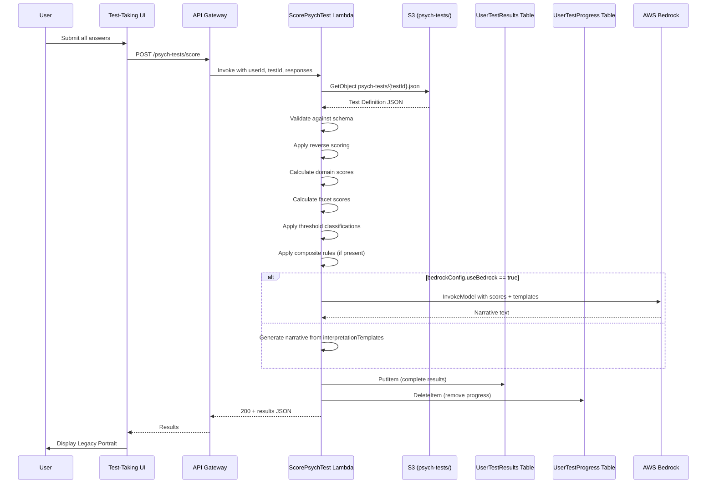

# Design Document: Psychological Testing Framework

## Overview

This design describes a data-driven psychological testing framework for Soul Reel's Section 3 ("Values and Emotions Deep Dive"). The system enables legacy makers to complete validated open-source personality assessments and receive a unified "Legacy Portrait" combining results across tests.

The core architectural principle is that tests are defined entirely by JSON definition files stored in S3. A single generic scoring Lambda processes any test by loading its definition at runtime — no code changes are needed to add new tests. The framework integrates with the existing SAM-based backend, DynamoDB storage, Cognito authentication, and React/TypeScript frontend.

### Key Design Decisions

1. **Single Lambda for scoring**: One `ScorePsychTest` Lambda handles all test types by interpreting the Test Definition JSON dynamically. This avoids per-test Lambda proliferation and simplifies deployment.
2. **S3 for test definitions, DynamoDB for metadata**: Test definitions (large JSON files with questions, scoring rules, templates) live in S3. Lightweight metadata (testId, status, version) lives in DynamoDB for fast listing and querying.
3. **Bedrock integration is optional per-test**: Each Test Definition can opt into AI narrative generation via `bedrockConfig`. The Lambda falls back to static `interpretationTemplates` if Bedrock is disabled or fails.
4. **Frontend is fully dynamic**: The Test-Taking UI renders any test based on its definition — question types, page breaks, facet groupings, and video prompts are all driven by the JSON.
5. **Progress auto-save with TTL**: In-progress responses are saved to DynamoDB with a 30-day TTL, enabling resume without permanent storage of incomplete data.

## Architecture

```mermaid
graph TB
    subgraph Frontend ["React/TypeScript Frontend"]
        UI[Test-Taking UI<br/>/personal-insights]
        VR[VideoRecorder Component]
    end

    subgraph API ["API Gateway + Cognito"]
        GW[REST API<br/>CognitoAuthorizer]
    end

    subgraph Lambda ["Lambda Functions"]
        SCORE[ScorePsychTest Lambda]
        LIST[ListPsychTests Lambda]
        PROGRESS[SaveTestProgress Lambda]
        GETPROG[GetTestProgress Lambda]
        EXPORT[ExportTestResults Lambda]
        IMPORT[AdminImportTest Lambda]
    end

    subgraph Storage ["AWS Storage"]
        S3DEF[S3: psych-tests/]
        S3EXP[S3: psych-exports/]
        PTABLE[PsychTests Table]
        UPTABLE[UserTestProgress Table]
        URTABLE[UserTestResults Table]
        AQTABLE[allQuestionDB Table]
    end

    subgraph AI ["AI Services"]
        BEDROCK[AWS Bedrock<br/>Claude]
    end

    UI -->|POST /psych-tests/score| GW
    UI -->|GET /psych-tests/list| GW
    UI -->|POST /psych-tests/progress/save| GW
    UI -->|GET /psych-tests/progress/{testId}| GW
    UI -->|POST /psych-tests/export| GW
    UI --> VR

    GW --> SCORE
    GW --> LIST
    GW --> PROGRESS
    GW --> GETPROG
    GW --> EXPORT

    SCORE --> S3DEF
    SCORE --> URTABLE
    SCORE --> UPTABLE
    SCORE -->|optional| BEDROCK
    SCORE --> PTABLE

    LIST --> PTABLE

    PROGRESS --> UPTABLE
    GETPROG --> UPTABLE

    EXPORT --> URTABLE
    EXPORT --> S3EXP

    IMPORT --> S3DEF
    IMPORT --> PTABLE
    IMPORT --> AQTABLE
```

### Request Flow: Test Scoring



## Components and Interfaces

### Backend Components

#### 1. ScorePsychTest Lambda (`SamLambda/functions/psychTestFunctions/scorePsychTest/app.py`)

Primary Lambda handling scoring, validation, and Bedrock narrative generation.

**API**: `POST /psych-tests/score`

```python
# Request body
{
    "testId": "ipip-neo-60",
    "responses": [
        {"questionId": "q1", "answer": 4},
        {"questionId": "q2", "answer": 2}
    ],
    "progressId": "optional-progress-id"
}

# Response body
{
    "userId": "cognito-user-id",
    "testId": "ipip-neo-60",
    "version": "1.0.0",
    "timestamp": "2025-01-15T10:30:00Z",
    "domainScores": {
        "openness": {"raw": 42, "normalized": 70, "label": "High"},
        "conscientiousness": {"raw": 38, "normalized": 63, "label": "Average"}
    },
    "facetScores": {
        "imagination": {"raw": 14, "normalized": 78, "label": "High"},
        "artistic_interests": {"raw": 12, "normalized": 67, "label": "Average"}
    },
    "compositeScores": {},
    "thresholdClassifications": {},
    "narrativeText": "Your personality profile suggests...",
    "narrativeSource": "bedrock",
    "exportFormats": ["PDF", "JSON", "CSV"]
}
```

**IAM Policies**:
- `s3:GetObject` on `arn:aws:s3:::virtual-legacy/psych-tests/*`
- `dynamodb:GetItem`, `dynamodb:PutItem` on PsychTests, UserTestResults tables
- `dynamodb:DeleteItem` on UserTestProgress table
- `bedrock:InvokeModel` on configured model ARN
- `kms:Decrypt`, `kms:DescribeKey` on DataEncryptionKey

#### 2. ListPsychTests Lambda (`SamLambda/functions/psychTestFunctions/listPsychTests/app.py`)

Returns available tests for the frontend.

**API**: `GET /psych-tests/list`

```python
# Response body
{
    "tests": [
        {
            "testId": "ipip-neo-60",
            "testName": "IPIP-NEO-60",
            "description": "Big Five personality assessment",
            "estimatedMinutes": 15,
            "status": "active",
            "version": "1.0.0"
        }
    ]
}
```

**IAM Policies**:
- `dynamodb:Query` on PsychTests table (status-index GSI)

#### 3. SaveTestProgress Lambda (`SamLambda/functions/psychTestFunctions/saveTestProgress/app.py`)

Saves in-progress test responses.

**API**: `POST /psych-tests/progress/save`

```python
# Request body
{
    "testId": "ipip-neo-60",
    "responses": [{"questionId": "q1", "answer": 4}],
    "currentQuestionIndex": 15
}
```

**IAM Policies**:
- `dynamodb:PutItem` on UserTestProgress table
- `kms:Decrypt`, `kms:DescribeKey`, `kms:GenerateDataKey` on DataEncryptionKey

#### 4. GetTestProgress Lambda (`SamLambda/functions/psychTestFunctions/getTestProgress/app.py`)

Retrieves saved progress for a test.

**API**: `GET /psych-tests/progress/{testId}`

**IAM Policies**:
- `dynamodb:GetItem` on UserTestProgress table
- `kms:Decrypt`, `kms:DescribeKey` on DataEncryptionKey

#### 5. ExportTestResults Lambda (`SamLambda/functions/psychTestFunctions/exportTestResults/app.py`)

Generates PDF/JSON/CSV exports and returns pre-signed download URLs.

**API**: `POST /psych-tests/export`

```python
# Request body
{
    "testId": "ipip-neo-60",
    "version": "1.0.0",
    "timestamp": "2025-01-15T10:30:00Z",
    "format": "PDF"
}

# Response body
{
    "downloadUrl": "https://s3.amazonaws.com/...",
    "expiresIn": 86400
}
```

**IAM Policies**:
- `dynamodb:GetItem` on UserTestResults table
- `s3:PutObject`, `s3:GetObject` on `arn:aws:s3:::virtual-legacy/psych-exports/*`
- `kms:Decrypt`, `kms:DescribeKey`, `kms:GenerateDataKey` on DataEncryptionKey

#### 6. AdminImportTest Lambda (`SamLambda/functions/psychTestFunctions/adminImportTest/app.py`)

Parses a Test Definition JSON, creates metadata in PsychTests table, and generates question records in allQuestionDB for the admin interface.

**API**: `POST /psych-tests/admin/import` (admin-only)

**IAM Policies**:
- `s3:GetObject`, `s3:PutObject` on `arn:aws:s3:::virtual-legacy/psych-tests/*`
- `dynamodb:PutItem`, `dynamodb:GetItem` on PsychTests table
- `dynamodb:PutItem` on allQuestionDB table
- `kms:Decrypt`, `kms:DescribeKey`, `kms:GenerateDataKey` on DataEncryptionKey

### Frontend Components

#### 1. PsychTestPage (`FrontEndCode/src/pages/PersonalInsights.tsx`)

Replaces the current "Coming Soon" placeholder. Serves as the entry point showing available tests and completed results.

#### 2. TestTakingUI (`FrontEndCode/src/components/psych-tests/TestTakingUI.tsx`)

Dynamic test renderer that interprets a Test Definition to display:
- Consent block with required checkbox
- Questions grouped by facet with appropriate response controls (Likert, bipolar, multiple choice)
- Progress bar
- Page breaks
- Video recording prompts via existing `VideoRecorder` component
- Auto-save every 30 seconds when `saveProgressEnabled` is true

#### 3. TestResultsView (`FrontEndCode/src/components/psych-tests/TestResultsView.tsx`)

Displays scored results including domain/facet breakdowns, threshold labels, narrative text, and export buttons.

#### 4. API Service (`FrontEndCode/src/services/psychTestService.ts`)

Service layer for all psych-test API calls, following the pattern in existing services.

```typescript
// Key functions
export async function listPsychTests(): Promise<PsychTest[]>;
export async function getTestDefinition(testId: string): Promise<TestDefinition>;
export async function saveTestProgress(testId: string, responses: Response[], currentIndex: number): Promise<void>;
export async function getTestProgress(testId: string): Promise<TestProgress | null>;
export async function scoreTest(testId: string, responses: Response[]): Promise<TestResult>;
export async function exportResults(testId: string, version: string, timestamp: string, format: string): Promise<ExportResponse>;
```

### Test Definition Schema

Stored at `SamLambda/schemas/psych-test-definition.schema.json`. This is the canonical schema that all Test Definition files must conform to.

```typescript
interface TestDefinition {
    testId: string;
    testName: string;
    description: string;
    version: string;
    previousVersionMapping?: Record<string, string>;
    estimatedMinutes: number;
    consentBlock: {
        title: string;
        bodyText: string;
        requiredCheckboxLabel: string;
    };
    disclaimerText: string;
    questions: Question[];
    scoringRules: Record<string, ScoringRule>;
    compositeRules: Record<string, CompositeRule>;
    interpretationTemplates: Record<string, InterpretationEntry[]>;
    bedrockConfig?: {
        useBedrock: boolean;
        maxTokens: number;
        temperature: number;
        cacheResultsForDays: number;
    };
    videoPromptTrigger: string;
    saveProgressEnabled: boolean;
    analyticsEnabled: boolean;
    exportFormats: string[];
}

interface Question {
    questionId: string;
    text: string;
    responseType: "likert5" | "bipolar5" | "multipleChoice";
    options: string[];
    reverseScored: boolean;
    scoringKey: string;
    groupByFacet: string;
    pageBreakAfter: boolean;
    accessibilityHint: string;
    videoPromptFrequency?: number;
}

interface ScoringRule {
    formula: string;
    thresholds: Array<{ min: number; max: number; label: string }>;
    lookupTables?: Record<string, number[]>;
}

interface CompositeRule {
    sources: Array<{ testId: string; domain: string }>;
    formula: string;
}

interface InterpretationEntry {
    min: number;
    max: number;
    text: string;
}
```


## Data Models

### DynamoDB Tables

#### PsychTests Table

| Attribute | Type | Key | Description |
|-----------|------|-----|-------------|
| testId | String | PK | Unique test identifier |
| version | String | SK | Semantic version string |
| testName | String | — | Display name |
| description | String | — | Test description |
| estimatedMinutes | Number | — | Estimated completion time |
| status | String | GSI PK (status-index) | "active", "inactive", or "archived" |
| createdAt | String | GSI SK (status-index) | ISO 8601 timestamp |
| s3Path | String | — | S3 key for the Test Definition JSON |
| previousVersionMapping | Map | — | Maps old questionIds to new questionIds |

**Table Configuration**: PAY_PER_REQUEST billing, KMS encryption via DataEncryptionKey, point-in-time recovery enabled.

**GSI: status-index**: Partition key `status`, sort key `createdAt`. Enables querying all active tests sorted by creation date.

#### UserTestProgress Table

| Attribute | Type | Key | Description |
|-----------|------|-----|-------------|
| userId | String | PK | Cognito user ID |
| testId | String | SK | Test identifier |
| responses | List | — | Array of {questionId, answer} objects |
| currentQuestionIndex | Number | — | Last answered question index |
| updatedAt | String | — | ISO 8601 timestamp of last save |
| expiresAt | Number | TTL | Unix epoch, 30 days from updatedAt |

**Table Configuration**: PAY_PER_REQUEST billing, KMS encryption via DataEncryptionKey, point-in-time recovery enabled, TTL on `expiresAt`.

#### UserTestResults Table

| Attribute | Type | Key | Description |
|-----------|------|-----|-------------|
| userId | String | PK | Cognito user ID |
| testId#version#timestamp | String | SK | Composite sort key |
| testId | String | GSI PK (testId-index) | Test identifier |
| timestamp | String | GSI SK (testId-index) | ISO 8601 timestamp |
| version | String | — | Test version used |
| domainScores | Map | — | Domain name → {raw, normalized, label} |
| facetScores | Map | — | Facet name → {raw, normalized, label} |
| compositeScores | Map | — | Composite name → {raw, normalized, label} |
| thresholdClassifications | Map | — | Domain/facet → threshold label |
| narrativeText | String | — | Generated narrative (optional) |
| narrativeSource | String | — | "bedrock" or "template" |
| rawResponses | List | — | Original {questionId, answer} pairs |
| exportPaths | Map | — | Format → S3 path for generated exports |

**Table Configuration**: PAY_PER_REQUEST billing, KMS encryption via DataEncryptionKey, point-in-time recovery enabled.

**GSI: testId-index**: Partition key `testId`, sort key `timestamp`. Enables querying all results for a specific test.

### S3 Storage Layout

```
virtual-legacy/
├── psych-tests/
│   ├── ipip-neo-60.json          # IPIP-NEO-60 Test Definition
│   ├── oejts.json                # Open Extended Jungian Type Scales
│   └── personality-ei.json       # Personality-Based EI Test
└── psych-exports/
    └── {userId}/
        └── {testId}/
            ├── {timestamp}.pdf
            ├── {timestamp}.json
            └── {timestamp}.csv
```

### SAM Template Additions

New environment variables added to `Globals.Function.Environment.Variables`:

```yaml
TABLE_PSYCH_TESTS: !Ref PsychTestsTable
TABLE_USER_TEST_PROGRESS: !Ref UserTestProgressTable
TABLE_USER_TEST_RESULTS: !Ref UserTestResultsTable
```

All new Lambda functions follow existing patterns:
- `arm64` architecture
- `python3.12` runtime
- SharedUtilsLayer included
- `import os` at top of every handler
- CORS headers via `os.environ.get('ALLOWED_ORIGIN', 'https://www.soulreel.net')`
- CognitoAuthorizer on all API events
- OPTIONS method events for CORS preflight

### Frontend Route

The `/personal-insights` route currently renders a "Coming Soon" placeholder. It will be replaced with the full test-taking experience:

- `/personal-insights` — Test listing and results overview
- `/personal-insights/:testId` — Test-taking flow (consent → questions → results)

These are handled as state within the `PersonalInsights` page component rather than separate routes, keeping the router configuration minimal.

### API Endpoints Summary

| Method | Path | Lambda | Auth | Description |
|--------|------|--------|------|-------------|
| GET | /psych-tests/list | ListPsychTests | Cognito | List available tests |
| GET | /psych-tests/{testId} | ListPsychTests | Cognito | Get test definition |
| POST | /psych-tests/score | ScorePsychTest | Cognito | Score completed test |
| POST | /psych-tests/progress/save | SaveTestProgress | Cognito | Save in-progress responses |
| GET | /psych-tests/progress/{testId} | GetTestProgress | Cognito | Get saved progress |
| POST | /psych-tests/export | ExportTestResults | Cognito | Generate export file |
| POST | /psych-tests/admin/import | AdminImportTest | Cognito | Import test definition (admin) |


## Correctness Properties

*A property is a characteristic or behavior that should hold true across all valid executions of a system — essentially, a formal statement about what the system should do. Properties serve as the bridge between human-readable specifications and machine-verifiable correctness guarantees.*

### Property 1: Schema conformance

*For any* JSON object generated to conform to the Test Definition Schema, validating it against the schema should pass. Conversely, *for any* JSON object that violates a required field or type constraint, validation should fail and produce a descriptive error message with a 400 status code.

**Validates: Requirements 1.1, 1.2, 1.3, 1.4, 1.5, 1.6, 1.7, 2.1, 2.2**

### Property 2: Test Definition JSON round-trip

*For any* valid Test Definition object, serializing it to JSON and then parsing the JSON back should produce an object equivalent to the original.

**Validates: Requirements 1.10**

### Property 3: Admin import correctness

*For any* valid Test Definition with N questions, importing it via the Admin Conversion Script should produce exactly N question records in allQuestionDB where each record has `questionType` equal to the Test Definition's `testId` and a facet tag matching the question's `groupByFacet` value, plus a metadata record in PsychTests table containing testId, version, status, s3Path, and (if present) previousVersionMapping.

**Validates: Requirements 3.1, 3.2, 3.3, 3.5**

### Property 4: Progress TTL calculation

*For any* saved progress record, the `expiresAt` TTL value should equal the `updatedAt` timestamp plus exactly 30 days (2,592,000 seconds), expressed as a Unix epoch.

**Validates: Requirements 5.2**

### Property 5: Progress save/load round-trip

*For any* set of partial responses and a current question index, saving progress and then loading progress for the same userId and testId should return the same responses and current question index.

**Validates: Requirements 5.5**

### Property 6: Progress cleanup after scoring

*For any* completed test submission that is successfully scored, the corresponding progress record in UserTestProgress table should be deleted (i.e., a subsequent GetItem for that userId+testId should return no item).

**Validates: Requirements 5.6**

### Property 7: Reverse scoring transformation

*For any* question marked `reverseScored: true` with a Likert-5 response value V (where 1 ≤ V ≤ 5), the scored value should equal (6 - V). For questions with `reverseScored: false`, the scored value should equal V unchanged.

**Validates: Requirements 6.3**

### Property 8: Domain and facet score calculation

*For any* set of valid responses to a test and a scoring rule with formula "mean", the calculated domain score should equal the arithmetic mean of the scored responses grouped by `scoringKey`, and the calculated facet score should equal the arithmetic mean of the scored responses grouped by `groupByFacet`.

**Validates: Requirements 6.4, 6.5**

### Property 9: Threshold classification

*For any* numeric score and a non-overlapping, contiguous thresholds array (each with min, max, and label), the classification should return the label of the threshold range where `min ≤ score ≤ max`. If the score falls outside all ranges, the classification should indicate "unclassified".

**Validates: Requirements 6.6**

### Property 10: Scoring idempotence

*For any* valid set of responses to a test, scoring the responses and then scoring the identical responses again should produce identical domain scores, facet scores, threshold classifications, and composite scores.

**Validates: Requirements 6.12**

### Property 11: Export path construction

*For any* userId, testId, timestamp, and export format, the constructed S3 path should match the pattern `psych-exports/{userId}/{testId}/{timestamp}.{format}` where format is lowercased.

**Validates: Requirements 9.2**

### Property 12: JSON export excludes rawResponses

*For any* test result record, generating a JSON export and parsing it back should produce an object containing all result fields (domainScores, facetScores, compositeScores, thresholdClassifications, narrativeText) but not containing rawResponses.

**Validates: Requirements 9.4**

### Property 13: CSV export structure

*For any* test result with D domain scores and F facet scores, the generated CSV should have exactly (D + F) data rows (plus a header row) and columns for name, raw score, threshold label, and percentile.

**Validates: Requirements 9.5**

### Property 14: Progress percentage calculation

*For any* total question count T > 0 and answered count A where 0 ≤ A ≤ T, the displayed progress percentage should equal `Math.round((A / T) * 100)`.

**Validates: Requirements 10.3**

### Property 15: Question facet grouping

*For any* array of questions, grouping by `groupByFacet` should produce groups where every question in a group shares the same `groupByFacet` value, and the total number of questions across all groups equals the original array length.

**Validates: Requirements 10.5**

### Property 16: Video prompt trigger logic

*For any* question index I ≥ 0 and videoPromptFrequency F > 0, the video prompt should be shown if and only if `I % F === 0`.

**Validates: Requirements 10.8**

### Property 17: CORS headers on all responses

*For any* Lambda response (success or error), the response headers should include `Access-Control-Allow-Origin` set to the value of the `ALLOWED_ORIGIN` environment variable (defaulting to `https://www.soulreel.net`).

**Validates: Requirements 11.2**

### Property 18: Response type renders correct control

*For any* question with `responseType` value R, the rendered input control type should be: Likert 5-point scale when R is "likert5", bipolar 5-point scale when R is "bipolar5", and radio buttons when R is "multipleChoice".

**Validates: Requirements 10.2**

## Error Handling

### Backend Error Handling

All Lambda functions follow a consistent error response pattern:

```python
def build_error_response(status_code, message):
    return {
        'statusCode': status_code,
        'headers': {
            'Content-Type': 'application/json',
            'Access-Control-Allow-Origin': os.environ.get('ALLOWED_ORIGIN', 'https://www.soulreel.net')
        },
        'body': json.dumps({'error': message})
    }
```

| Error Condition | Status Code | Message |
|----------------|-------------|---------|
| Test Definition fails schema validation | 400 | Descriptive validation error (field name + issue) |
| Scoring rules reference missing questionId | 400 | "Orphaned scoring reference: {questionId} not found in questions" |
| Composite rules reference missing domain | 400 | "Missing domain reference: {domain} not defined in scoringRules" |
| Duplicate testId + version on import | 409 | "Test {testId} version {version} already exists" |
| Test Definition not found in S3 | 404 | "Test definition not found: {testId}" |
| Test not found in PsychTests table | 404 | "Test not found: {testId}" |
| No progress record found | 404 | "No saved progress for test: {testId}" |
| No results found for export | 404 | "No results found for test: {testId}" |
| Unsupported export format | 400 | "Unsupported export format: {format}. Supported: PDF, JSON, CSV" |
| Bedrock API failure | 200 | Falls back to template-generated narrative; sets `narrativeSource: "template"` |
| Missing or invalid request body | 400 | "Invalid request body: {details}" |
| Incomplete responses (missing required questions) | 400 | "Missing responses for questions: {questionIds}" |

### Frontend Error Handling

The Test-Taking UI handles errors using the existing toast notification system:

- **Network errors during auto-save**: Silent retry with exponential backoff (3 attempts). Show toast only after all retries fail.
- **Scoring API failure**: Display error toast with retry button. Preserve user responses in local state.
- **Test Definition fetch failure**: Display error card with retry button instead of the test.
- **Export generation failure**: Display error toast with the specific format that failed.

### Bedrock Fallback Strategy

When `bedrockConfig.useBedrock` is true but the Bedrock API call fails:

1. Log the error with the Bedrock request ID for debugging
2. Generate narrative text from `interpretationTemplates` using the scored results
3. Set `narrativeSource` to `"template"` in the result record
4. Return the result normally — the user sees a valid narrative, just not AI-generated

## Testing Strategy

### Dual Testing Approach

This feature uses both unit tests and property-based tests for comprehensive coverage:

- **Unit tests**: Verify specific examples, edge cases, error conditions, and integration points
- **Property tests**: Verify universal properties across randomly generated inputs

### Backend Testing (Python)

**Library**: `hypothesis` (already in `SamLambda/tests/requirements.txt`)

**Property tests** go in `SamLambda/tests/property/` following the existing pattern. Each property test:
- Runs a minimum of 100 iterations (`@settings(max_examples=100)`)
- References its design document property in a comment tag
- Tag format: `Feature: psych-test-framework, Property {N}: {title}`

**Unit tests** go in `SamLambda/tests/unit/` and cover:
- Schema validation with specific valid and invalid Test Definition examples
- Cross-reference validation (orphaned questionIds, missing domains) — edge cases from Requirements 2.3, 2.4
- Duplicate version import rejection — edge case from Requirement 3.4
- Bedrock fallback behavior — edge case from Requirement 7.4
- Specific test definitions (IPIP-NEO-60, OEJTS, Personality-Based EI) — examples from Requirements 12.1, 12.2, 12.3
- Legacy Portrait composite scoring with all three tests — example from Requirement 12.4
- PDF export content verification — example from Requirement 9.3
- Consent block rendering before questions — example from Requirement 10.1
- Accessibility hint as aria-describedby — example from Requirement 10.6

### Frontend Testing (TypeScript)

**Library**: `fast-check` (already in `FrontEndCode/package.json` devDependencies)

**Property tests** go in `FrontEndCode/src/__tests__/` following the existing pattern (e.g., `sorting.property.test.ts`). Each property test:
- Runs a minimum of 100 iterations (`{ numRuns: 100 }`)
- References its design document property in a comment tag
- Tag format: `Feature: psych-test-framework, Property {N}: {title}`

**Unit tests** go in `FrontEndCode/src/components/__tests__/` and cover:
- Component rendering with mock test definitions
- Consent block interaction flow
- Auto-save timing behavior
- Video prompt display at correct intervals

### Property-to-Test Mapping

| Property | Test Location | Library |
|----------|--------------|---------|
| P1: Schema conformance | `SamLambda/tests/property/test_psych_schema.py` | hypothesis |
| P2: JSON round-trip | `SamLambda/tests/property/test_psych_schema.py` | hypothesis |
| P3: Admin import correctness | `SamLambda/tests/property/test_psych_import.py` | hypothesis |
| P4: Progress TTL calculation | `SamLambda/tests/property/test_psych_progress.py` | hypothesis |
| P5: Progress save/load round-trip | `SamLambda/tests/property/test_psych_progress.py` | hypothesis |
| P6: Progress cleanup after scoring | `SamLambda/tests/property/test_psych_scoring.py` | hypothesis |
| P7: Reverse scoring transformation | `SamLambda/tests/property/test_psych_scoring.py` | hypothesis |
| P8: Domain and facet score calculation | `SamLambda/tests/property/test_psych_scoring.py` | hypothesis |
| P9: Threshold classification | `SamLambda/tests/property/test_psych_scoring.py` | hypothesis |
| P10: Scoring idempotence | `SamLambda/tests/property/test_psych_scoring.py` | hypothesis |
| P11: Export path construction | `SamLambda/tests/property/test_psych_export.py` | hypothesis |
| P12: JSON export excludes rawResponses | `SamLambda/tests/property/test_psych_export.py` | hypothesis |
| P13: CSV export structure | `SamLambda/tests/property/test_psych_export.py` | hypothesis |
| P14: Progress percentage calculation | `FrontEndCode/src/__tests__/psych-test-progress.property.test.ts` | fast-check |
| P15: Question facet grouping | `FrontEndCode/src/__tests__/psych-test-grouping.property.test.ts` | fast-check |
| P16: Video prompt trigger logic | `FrontEndCode/src/__tests__/psych-test-video-prompt.property.test.ts` | fast-check |
| P17: CORS headers on all responses | `SamLambda/tests/property/test_psych_cors.py` | hypothesis |
| P18: Response type renders correct control | `FrontEndCode/src/__tests__/psych-test-controls.property.test.ts` | fast-check |

Each correctness property is implemented by a single property-based test. Unit tests complement these by covering specific examples, edge cases, and integration scenarios that property tests don't address.
