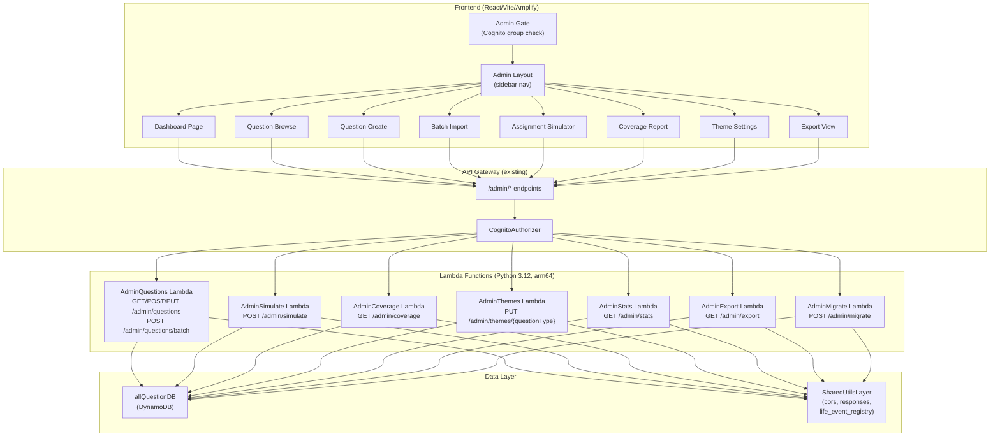
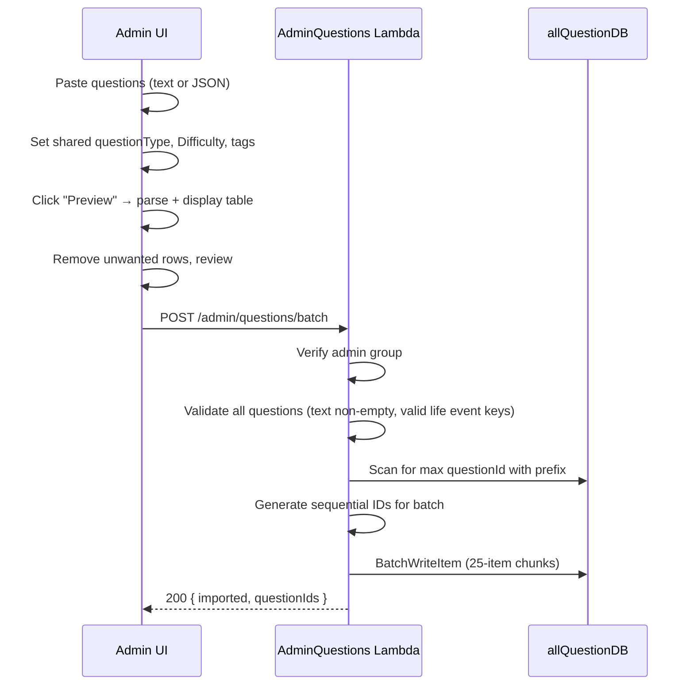
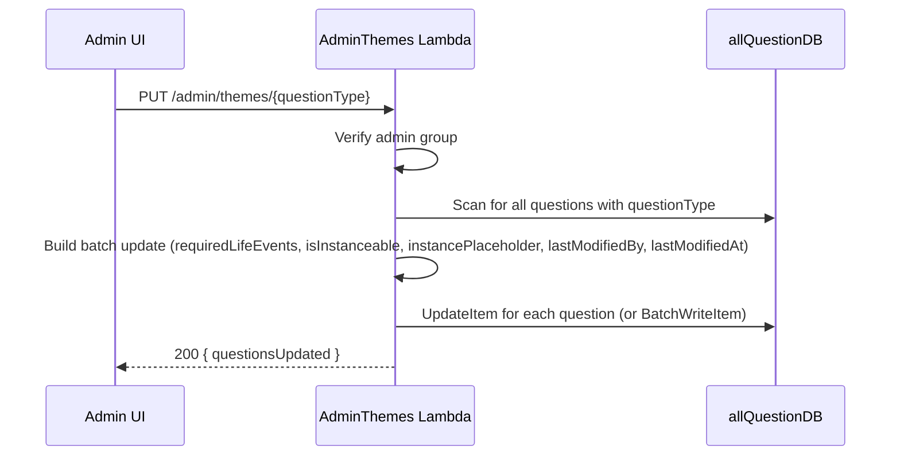

# Design Document: Question Management Admin Tool

## Overview

The Question Management Admin Tool replaces the manual Excel-to-DynamoDB workflow for managing the SoulReel question bank. It is an internal web application hosted under `/admin` in the existing React/Vite/Amplify frontend, backed by new Lambda functions behind the existing API Gateway. Access is restricted to users in the `SoulReelAdmins` Cognito group.

The tool provides:
- CRUD operations on questions in `allQuestionDB`
- Life-event tagging with validation against a Canonical Life Event Key Registry
- Batch import of AI-generated questions
- Assignment simulation (preview what a user with given life events would see)
- Life event coverage reporting (identify gaps)
- Theme-level bulk tagging
- Dashboard with question type × difficulty grid
- CSV/JSON export
- One-time migration endpoint for backfilling new attributes on existing questions

### Key Design Decisions

1. **Single Lambda per domain** — Rather than one Lambda per endpoint, we group related admin endpoints into a small number of multi-route Lambda functions (AdminQuestions, AdminSimulate, AdminCoverage, AdminThemes, AdminStats, AdminExport, AdminMigrate). This reduces cold-start surface and SAM template bloat while keeping IAM policies scoped.

2. **Server-side admin group check** — The CognitoAuthorizer validates the JWT, but each Lambda additionally inspects `cognito:groups` in the claims to verify `SoulReelAdmins` membership. This defense-in-depth approach prevents access if the frontend gate is bypassed.

3. **Shared Canonical Registry** — Life Event Keys are defined once in TypeScript (frontend) and once in Python (backend). Both files are generated from the same logical source of truth. The Python version lives in the SharedUtilsLayer so all admin Lambdas can import it.

4. **No separate theme metadata table** — Theme defaults are derived from the current state of questions in a `questionType`, not stored in a separate table. The PUT `/admin/themes/{questionType}` endpoint bulk-updates all questions in that theme.

5. **Client-side pagination and filtering** — For the initial version, the admin questions list endpoint returns all questions via DynamoDB Scan (the table is small — hundreds of questions). Filtering, sorting, and pagination are handled client-side with React Query. If the table grows significantly, server-side pagination with `LastEvaluatedKey` can be added.

## Architecture



### Request Flow

1. Admin navigates to `/admin/*` → `AdminGate` checks Cognito JWT for `SoulReelAdmins` group membership in the token's `cognito:groups` claim (available via `fetchAuthSession()`)
2. Frontend makes API call with `Authorization: Bearer <idToken>` header
3. API Gateway `CognitoAuthorizer` validates the JWT
4. Lambda extracts `cognito:groups` from `requestContext.authorizer.claims` and verifies `SoulReelAdmins` membership (server-side defense-in-depth)
5. Lambda performs the requested operation on `allQuestionDB`
6. Response includes CORS headers via shared `cors_headers(event)` utility

## Components and Interfaces

### Frontend Components

#### AdminGate (Route Guard)

A wrapper component similar to `ProtectedRoute` but with an additional Cognito group check. Wraps all `/admin/*` routes.

```tsx
// FrontEndCode/src/components/AdminGate.tsx
interface AdminGateProps {
  children: React.ReactNode;
}
```

- Calls `fetchAuthSession()` from `aws-amplify/auth` to get the ID token's payload
- Checks `payload['cognito:groups']` for `SoulReelAdmins`
- If not admin → redirects to `/dashboard` or `/benefactor-dashboard` with "Access denied" toast
- If not authenticated → redirects to `/login`

#### AdminLayout
Provides the admin shell: sidebar navigation, header with admin email, and content area.

Routes nested under `/admin`:
| Route | Component | Description |
|---|---|---|
| `/admin` | `AdminDashboard` | Summary stats + question type × difficulty grid |
| `/admin/questions` | `QuestionBrowse` | Paginated table with filters |
| `/admin/create` | `QuestionCreate` | Single question creation form |
| `/admin/batch` | `BatchImport` | Paste + preview + import |
| `/admin/simulate` | `AssignmentSimulator` | Life event checkbox → filtered results |
| `/admin/coverage` | `CoverageReport` | Life event key → question count |
| `/admin/themes` | `ThemeSettings` | Theme-level bulk tagging |
| `/admin/export` | `ExportView` | CSV/JSON export |

#### Shared Admin Components
- `LifeEventTagEditor` — Multi-select dropdown populated from the Canonical Life Event Registry TypeScript constant. Used in question create/edit, batch import, simulator, and theme settings.
- `QuestionValidationWarnings` — Displays inline warnings for tagging issues (missing placeholder in text, unrecognized keys, instanceable mismatch, duplicate text).
- `ConfirmDialog` — Reusable confirmation dialog for destructive/bulk operations.

### Backend API Endpoints

All admin endpoints use the existing API Gateway with `CognitoAuthorizer`. Each Lambda performs an additional server-side check for `SoulReelAdmins` group membership.

#### Admin Group Verification Pattern (shared helper)

```python
# SamLambda/functions/shared/python/admin_auth.py
def verify_admin(event):
    """
    Extract user info and verify SoulReelAdmins group membership.
    Returns (user_email, user_sub) or raises Forbidden.
    """
    claims = event.get('requestContext', {}).get('authorizer', {}).get('claims', {})
    groups = claims.get('cognito:groups', '')
    # cognito:groups comes as comma-separated string in API Gateway claims
    if 'SoulReelAdmins' not in groups.split(','):
        return None  # caller returns 403
    email = claims.get('email', 'unknown')
    sub = claims.get('sub', '')
    return (email, sub)
```

#### Endpoint Summary

| Method | Path | Lambda | Description |
|---|---|---|---|
| GET | `/admin/questions` | AdminQuestions | List all questions (full scan) |
| POST | `/admin/questions` | AdminQuestions | Create single question |
| PUT | `/admin/questions/{questionId}` | AdminQuestions | Update question |
| POST | `/admin/questions/batch` | AdminQuestions | Batch import |
| POST | `/admin/simulate` | AdminSimulate | Run assignment simulation |
| GET | `/admin/coverage` | AdminCoverage | Life event coverage report |
| PUT | `/admin/themes/{questionType}` | AdminThemes | Apply theme-level tags |
| GET | `/admin/stats` | AdminStats | Dashboard summary data |
| GET | `/admin/export` | AdminExport | Export CSV or JSON |
| POST | `/admin/migrate` | AdminMigrate | One-time migration |

#### API Request/Response Schemas

**GET /admin/questions**
```
Response 200:
{
  "questions": [
    {
      "questionId": "divorce-00001",
      "questionType": "Divorce",
      "Difficulty": 1,
      "Valid": 1,
      "Question": "What was the hardest part about...",
      "requiredLifeEvents": ["got_married", "spouse_divorced"],
      "isInstanceable": true,
      "instancePlaceholder": "{spouse_name}",
      "lastModifiedBy": "admin@soulreel.net",
      "lastModifiedAt": "2025-03-15T10:30:00Z"
    }
  ]
}
```

**POST /admin/questions**
```
Request:
{
  "questionType": "Divorce",
  "Difficulty": 3,
  "Question": "How did you tell your children about the divorce?",
  "requiredLifeEvents": ["got_married", "spouse_divorced", "had_children"],
  "isInstanceable": true,
  "instancePlaceholder": "{spouse_name}"
}

Response 200:
{
  "questionId": "divorce-00024",
  "message": "Question created"
}
```

**PUT /admin/questions/{questionId}**
```
Request:
{
  "questionType": "Divorce",
  "Difficulty": 3,
  "Valid": 1,
  "Question": "Updated question text...",
  "requiredLifeEvents": ["got_married"],
  "isInstanceable": false,
  "instancePlaceholder": ""
}

Response 200:
{
  "message": "Question updated",
  "questionId": "divorce-00001"
}
```

**POST /admin/questions/batch**
```
Request:
{
  "questionType": "Career",
  "Difficulty": 2,
  "requiredLifeEvents": ["first_job"],
  "isInstanceable": false,
  "instancePlaceholder": "",
  "questions": [
    "What was your first day at work like?",
    "Who was your first boss and what did you learn from them?"
  ]
}

Response 200:
{
  "message": "Batch import complete",
  "imported": 2,
  "questionIds": ["career-00015", "career-00016"]
}
```

**POST /admin/simulate**
```
Request:
{
  "selectedLifeEvents": ["got_married", "had_children", "first_job", "spouse_divorced"]
}

Response 200:
{
  "totalCount": 142,
  "byQuestionType": {
    "Childhood": { "count": 30, "questions": [...] },
    "Divorce": { "count": 12, "questions": [...] }
  }
}
```

**GET /admin/coverage**
```
Response 200:
{
  "coverage": {
    "got_married": { "total": 15, "instanceable": 10, "nonInstanceable": 5 },
    "had_children": { "total": 8, "instanceable": 5, "nonInstanceable": 3 },
    "first_job": { "total": 0, "instanceable": 0, "nonInstanceable": 0 }
  },
  "universalCount": 85
}
```

**PUT /admin/themes/{questionType}**
```
Request:
{
  "requiredLifeEvents": ["got_married"],
  "isInstanceable": true,
  "instancePlaceholder": "{spouse_name}"
}

Response 200:
{
  "message": "Theme updated",
  "questionsUpdated": 25
}
```

**GET /admin/stats**
```
Response 200:
{
  "totalQuestions": 350,
  "validQuestions": 320,
  "invalidQuestions": 30,
  "questionTypes": 12,
  "difficultyLevels": 10,
  "zeroCoverageKeys": 5,
  "instanceableQuestions": 45,
  "grid": {
    "Childhood": { "1": 5, "2": 4, "3": 3, ... "10": 2, "total": 35 },
    "Divorce": { "1": 3, "2": 2, ... "total": 20 }
  },
  "difficultyTotals": { "1": 30, "2": 28, ... "10": 15 },
  "grandTotal": 320
}
```

**GET /admin/export?format=csv** or **GET /admin/export?format=json**
```
Response 200 (JSON format):
{
  "questions": [ ...full Question_Record objects... ]
}

Response 200 (CSV format):
"questionId,questionType,Difficulty,Valid,Question,requiredLifeEvents,isInstanceable,instancePlaceholder,lastModifiedBy,lastModifiedAt\n..."
```

**POST /admin/migrate**
```
Response 200:
{
  "message": "Migration complete",
  "updated": 280,
  "skipped": 40
}
```

### Canonical Life Event Key Registry

#### TypeScript (Frontend)
```typescript
// FrontEndCode/src/constants/lifeEventRegistry.ts

export interface LifeEventKeyInfo {
  key: string;
  label: string;
  category: string;
  isInstanceable: boolean;
  instancePlaceholder?: string;
}

export const LIFE_EVENT_CATEGORIES = [
  'Core Relationship & Family',
  'Education & Early Life',
  'Career & Professional',
  'Health & Resilience',
  'Relocation & Transitions',
  'Spiritual, Creative & Legacy',
  'Other',
  'Status-derived',
] as const;

export const LIFE_EVENT_REGISTRY: LifeEventKeyInfo[] = [
  // Core Relationship & Family
  { key: 'got_married', label: 'Got married', category: 'Core Relationship & Family', isInstanceable: true, instancePlaceholder: '{spouse_name}' },
  { key: 'had_children', label: 'Had children', category: 'Core Relationship & Family', isInstanceable: true, instancePlaceholder: '{child_name}' },
  { key: 'became_grandparent', label: 'Became a grandparent', category: 'Core Relationship & Family', isInstanceable: false },
  { key: 'death_of_child', label: 'Death of child', category: 'Core Relationship & Family', isInstanceable: true, instancePlaceholder: '{deceased_name}' },
  { key: 'death_of_parent', label: 'Death of parent', category: 'Core Relationship & Family', isInstanceable: true, instancePlaceholder: '{deceased_name}' },
  { key: 'death_of_sibling', label: 'Death of sibling', category: 'Core Relationship & Family', isInstanceable: true, instancePlaceholder: '{deceased_name}' },
  { key: 'death_of_friend_mentor', label: 'Death of friend/mentor', category: 'Core Relationship & Family', isInstanceable: true, instancePlaceholder: '{deceased_name}' },
  { key: 'estranged_family_member', label: 'Estranged from family member', category: 'Core Relationship & Family', isInstanceable: false },
  { key: 'infertility_or_pregnancy_loss', label: 'Infertility or pregnancy loss', category: 'Core Relationship & Family', isInstanceable: false },
  { key: 'raised_child_special_needs', label: 'Raised child with special needs', category: 'Core Relationship & Family', isInstanceable: false },
  { key: 'falling_out_close_friend', label: 'Falling out with close friend', category: 'Core Relationship & Family', isInstanceable: false },
  // ... all other categories follow the same pattern
  // Status-derived (virtual)
  { key: 'spouse_divorced', label: 'Spouse divorced', category: 'Status-derived', isInstanceable: false },
  { key: 'spouse_deceased', label: 'Spouse deceased', category: 'Status-derived', isInstanceable: false },
  { key: 'spouse_still_married', label: 'Spouse still married', category: 'Status-derived', isInstanceable: false },
];

export const ALL_LIFE_EVENT_KEYS = LIFE_EVENT_REGISTRY.map(e => e.key);

export const INSTANCEABLE_KEYS = LIFE_EVENT_REGISTRY
  .filter(e => e.isInstanceable)
  .map(e => e.key);

export const VALID_PLACEHOLDERS = ['{spouse_name}', '{child_name}', '{deceased_name}'] as const;

export const INSTANCEABLE_KEY_TO_PLACEHOLDER: Record<string, string> = Object.fromEntries(
  LIFE_EVENT_REGISTRY
    .filter(e => e.isInstanceable && e.instancePlaceholder)
    .map(e => [e.key, e.instancePlaceholder!])
);
```

#### Python (Backend — SharedUtilsLayer)
```python
# SamLambda/functions/shared/python/life_event_registry.py

LIFE_EVENT_KEYS = [
    'got_married', 'had_children', 'became_grandparent',
    'death_of_child', 'death_of_parent', 'death_of_sibling', 'death_of_friend_mentor',
    'estranged_family_member', 'infertility_or_pregnancy_loss',
    'raised_child_special_needs', 'falling_out_close_friend',
    'graduated_high_school', 'graduated_college', 'graduate_degree',
    'studied_abroad', 'influential_mentor',
    'first_job', 'career_change', 'started_business', 'got_fired', 'retired', 'became_mentor',
    'serious_illness', 'mental_health_challenge', 'caregiver',
    'addiction_recovery', 'financial_hardship', 'major_legal_issue',
    'moved_city', 'immigrated', 'lived_abroad', 'learned_second_language',
    'spiritual_awakening', 'changed_religion', 'creative_work',
    'major_award', 'experienced_discrimination',
    'military_service', 'survived_disaster', 'near_death', 'act_of_kindness',
    # Status-derived
    'spouse_divorced', 'spouse_deceased', 'spouse_still_married',
]

INSTANCEABLE_KEYS = [
    'got_married', 'had_children',
    'death_of_child', 'death_of_parent', 'death_of_sibling', 'death_of_friend_mentor',
]

VALID_PLACEHOLDERS = ['{spouse_name}', '{child_name}', '{deceased_name}']

INSTANCEABLE_KEY_TO_PLACEHOLDER = {
    'got_married': '{spouse_name}',
    'had_children': '{child_name}',
    'death_of_child': '{deceased_name}',
    'death_of_parent': '{deceased_name}',
    'death_of_sibling': '{deceased_name}',
    'death_of_friend_mentor': '{deceased_name}',
}

def validate_life_event_keys(keys):
    """Return list of invalid keys, or empty list if all valid."""
    return [k for k in keys if k not in LIFE_EVENT_KEYS]
```

## Data Models

### allQuestionDB Table Schema

Existing attributes (unchanged):
| Attribute | Type | Description |
|---|---|---|
| `questionId` | String (PK) | e.g., `divorce-00001` |
| `questionType` | String | Theme name, e.g., `Divorce` |
| `Difficulty` | Number | 1–10 |
| `Valid` | Number | 1 (active) or 0 (soft-deleted) |
| `Question` | String | Question text |

Existing GSI:
- `questionTypeIndex` — PK: `questionType`, SK: `Valid`

New attributes added by this feature:
| Attribute | Type | Default | Description |
|---|---|---|---|
| `requiredLifeEvents` | List of Strings | `[]` | Life Event Keys required for assignment |
| `isInstanceable` | Boolean | `false` | Whether question uses placeholder substitution |
| `instancePlaceholder` | String | `""` | Placeholder token, e.g., `{spouse_name}` |
| `lastModifiedBy` | String | `""` | Admin email who last modified |
| `lastModifiedAt` | String | `""` | ISO 8601 UTC timestamp of last modification |

No new GSIs are needed. The admin tool uses `Scan` operations (the table is small) and client-side filtering.

### Question ID Generation

Legacy format: `{questionType}-{sequentialNumber}`
- `questionType` is lowercased and hyphenated (e.g., `Divorce` → `divorce`, `Career Change` → `career-change`)
- `sequentialNumber` is zero-padded to 5 digits (e.g., `00001`)
- To find the next number: query/scan for all `questionId` values with the matching prefix, extract the numeric suffix, find the max, and increment by 1
- For batch imports, the sequential number increments across the batch (e.g., if max is `00023`, batch of 3 gets `00024`, `00025`, `00026`)

### Assignment Simulation Logic

The simulator replicates the Question_Assignment_Service filtering:

```python
def simulate_assignment(selected_life_events, all_questions):
    """
    Filter questions based on selected life events.
    Returns questions that would be assigned to a user with these selections.
    """
    assigned = []
    selected_set = set(selected_life_events)
    
    for q in all_questions:
        if q.get('Valid') != 1:
            continue
        required = q.get('requiredLifeEvents', [])
        if not required:
            # Universal question — always included
            assigned.append(q)
        elif all(key in selected_set for key in required):
            # All required keys present in user's selections
            assigned.append(q)
    
    return assigned
```

### Migration Endpoint Logic

The one-time migration scans all questions and backfills missing attributes:

```python
def migrate_question(item):
    """Return update expression parts for missing attributes."""
    updates = {}
    if 'requiredLifeEvents' not in item:
        updates['requiredLifeEvents'] = []
    if 'isInstanceable' not in item:
        updates['isInstanceable'] = False
    if 'instancePlaceholder' not in item:
        updates['instancePlaceholder'] = ''
    if 'lastModifiedBy' not in item:
        updates['lastModifiedBy'] = 'system-migration'
    if 'lastModifiedAt' not in item:
        updates['lastModifiedAt'] = datetime.utcnow().isoformat() + 'Z'
    return updates  # empty dict means no update needed
```

Uses `BatchWriteItem` with 25-item batches for efficiency. Returns count of updated vs skipped records.

### Batch Import Processing Flow



### Theme-Level Tagging Flow



Note: `BatchWriteItem` only supports PutItem/DeleteItem, not UpdateItem. For theme updates, we use individual `UpdateItem` calls in a loop (acceptable for the small table size). If performance becomes an issue, we can switch to reading all items, modifying in memory, and using `BatchWriteItem` with full PutItem replacements.


## Correctness Properties

*A property is a characteristic or behavior that should hold true across all valid executions of a system — essentially, a formal statement about what the system should do. Properties serve as the bridge between human-readable specifications and machine-verifiable correctness guarantees.*

### Property 1: Non-admin requests are rejected

*For any* API request to an admin endpoint where the caller's `cognito:groups` claim does not include `SoulReelAdmins`, the Lambda SHALL return HTTP 403 with `{ "error": "Forbidden: admin access required" }`.

**Validates: Requirements 2.4, 2.5**

### Property 2: Question filtering correctness

*For any* set of questions and any combination of filter criteria (text search string, questionType, Difficulty level, Valid toggle, life-event-tagged toggle, instanceable toggle), the filtered result set SHALL contain exactly those questions that satisfy all active filter predicates simultaneously. Text search SHALL be case-insensitive substring matching against the `Question` field.

**Validates: Requirements 3.2, 3.3, 3.4, 3.6**

### Property 3: Question sorting stability

*For any* list of questions and any sort field (`questionType`, `Difficulty`, `Valid`, `lastModifiedAt`), sorting the list SHALL produce a sequence where for every pair of adjacent elements, the sort field value of the first element is less than or equal to (or greater than or equal to, for descending) the sort field value of the second element.

**Validates: Requirements 3.5, 10.4**

### Property 4: Question validation warnings

*For any* Question_Record, the validation function SHALL produce warnings if and only if one or more of these conditions hold: (a) `isInstanceable` is true and `Question` text does not contain `instancePlaceholder`, (b) `isInstanceable` is true and `requiredLifeEvents` does not contain the corresponding instanceable Life_Event_Key from the registry mapping, (c) `isInstanceable` is false and `instancePlaceholder` is non-empty, (d) `isInstanceable` is true and `instancePlaceholder` is empty.

**Validates: Requirements 4.5, 5.1, 5.3, 5.4**

### Property 5: Life event key validation rejects invalid keys

*For any* list of strings submitted as `requiredLifeEvents`, if the list contains at least one string that is not present in the Canonical Life Event Key Registry, the validation function SHALL return an error identifying the invalid key(s). If all strings are valid keys, validation SHALL pass.

**Validates: Requirements 4.10, 5.2, 6.7**

### Property 6: Audit trail on all mutations

*For any* admin API operation that creates or modifies a Question_Record (create, update, validity toggle, batch import, theme apply, migration), the resulting record SHALL have `lastModifiedBy` set to the calling admin's email and `lastModifiedAt` set to a valid ISO 8601 UTC timestamp within a reasonable window of the operation time.

**Validates: Requirements 4.8, 6.4, 7.5, 10.2, 16.8**

### Property 7: Question ID generation format and sequencing

*For any* questionType string and any existing set of questionIds with that type's prefix, the generated questionId SHALL match the pattern `{lowercased-hyphenated-type}-{zero-padded-5-digit-number}` where the number is exactly one greater than the maximum existing number for that prefix. For a batch of N questions, the IDs SHALL be sequential starting from max+1 through max+N.

**Validates: Requirements 6.2, 8.6**

### Property 8: Batch input parsing

*For any* valid plain-text input (non-empty lines separated by newlines, blank lines ignored) or valid JSON array input (array of strings or array of objects with a `question` field), the parser SHALL produce a list of question text strings matching the input content. The parsed count SHALL equal the number of non-blank lines (for text) or array length (for JSON).

**Validates: Requirements 8.2, 8.5**

### Property 9: Batch import atomicity

*For any* batch of questions where at least one question fails validation (empty text, invalid life event key), the API SHALL reject the entire batch with HTTP 400 and SHALL NOT write any records to DynamoDB.

**Validates: Requirements 8.9**

### Property 10: Batch duplicate detection

*For any* batch of question texts, the duplicate detector SHALL flag all questions whose text appears more than once within the batch or matches the text of any existing question in allQuestionDB.

**Validates: Requirements 8.12**

### Property 11: Assignment simulation filtering

*For any* set of selected Life_Event_Keys and any set of valid questions, the simulator SHALL include a question if and only if: (a) the question's `requiredLifeEvents` is empty (universal), OR (b) every key in the question's `requiredLifeEvents` is present in the selected set. Questions with `Valid` != 1 SHALL be excluded.

**Validates: Requirements 9.3**

### Property 12: Migration defaults and count invariant

*For any* set of Question_Records in allQuestionDB, after running the migration endpoint: (a) every record SHALL have `requiredLifeEvents` (list), `isInstanceable` (boolean), `instancePlaceholder` (string), `lastModifiedBy` (string), and `lastModifiedAt` (string) attributes, (b) records that already had these attributes SHALL retain their original values, and (c) the sum of `updated` + `skipped` in the response SHALL equal the total number of records scanned.

**Validates: Requirements 14.1, 14.2, 14.6**

### Property 13: Coverage aggregation correctness

*For any* set of questions in allQuestionDB and for every Life_Event_Key in the Canonical Registry, the coverage count for that key SHALL equal the number of valid questions (`Valid` = 1) whose `requiredLifeEvents` contains that key. The instanceable sub-count SHALL equal the number of those questions where `isInstanceable` is true. The universal count SHALL equal the number of valid questions with empty `requiredLifeEvents`.

**Validates: Requirements 15.2, 15.4, 15.5**

### Property 14: Theme bulk update applies to all questions in theme

*For any* questionType and any set of life event tag values (`requiredLifeEvents`, `isInstanceable`, `instancePlaceholder`), after applying theme-level tags, every Question_Record with that `questionType` SHALL have the specified tag values. Questions with other `questionType` values SHALL be unchanged.

**Validates: Requirements 16.3**

### Property 15: Stats grid computation

*For any* set of questions in allQuestionDB, the stats grid SHALL satisfy: (a) each cell `grid[type][difficulty]` equals the count of valid questions matching that type and difficulty, (b) each row total equals the sum of that row's cells, (c) each column total equals the sum of that column's cells, and (d) the grand total equals the sum of all row totals (which also equals the sum of all column totals).

**Validates: Requirements 17.3, 17.4, 17.5, 17.6**

### Property 16: Export JSON round-trip

*For any* set of Question_Records, exporting to JSON and parsing the result back SHALL produce an equivalent set of records. Each exported record SHALL include all attributes: `questionId`, `questionType`, `Difficulty`, `Valid`, `Question`, `requiredLifeEvents`, `isInstanceable`, `instancePlaceholder`, `lastModifiedBy`, `lastModifiedAt`.

**Validates: Requirements 18.2, 18.6**

### Property 17: Export respects active filters

*For any* set of questions and any active filter criteria, the exported set SHALL contain exactly the same questions as the filtered browse view — no more, no less.

**Validates: Requirements 18.3**

### Property 18: Duplicate text detection

*For any* question text and any set of existing Question_Records, the duplicate detector SHALL return the `questionId`(s) of all existing records whose `Question` text exactly matches the input text. If no match exists, it SHALL return an empty list.

**Validates: Requirements 5.6**

### Property 19: Case-sensitive questionType warning

*For any* questionType string and any set of existing distinct questionType values, if there exists an existing type that is equal to the input ignoring case but not equal with case, the validator SHALL produce a warning identifying the existing type.

**Validates: Requirements 5.7**

## Error Handling

### Backend Error Handling

All admin Lambda functions follow the existing project pattern:

1. **OPTIONS preflight** — Return 200 with CORS headers immediately
2. **Auth check** — Verify JWT via CognitoAuthorizer (handled by API Gateway), then verify `SoulReelAdmins` group membership. Return 403 if not admin.
3. **Input validation** — Validate request body/parameters. Return 400 with descriptive error for invalid input.
4. **Business logic** — Perform the operation. Catch `ClientError` from boto3 and general `Exception`.
5. **DynamoDB errors** — Log full error to CloudWatch via `error_response()` utility. Return 500 with generic message `"A server error occurred. Please try again."`.
6. **CORS headers** — Every response (200, 4xx, 5xx) includes CORS headers via `cors_headers(event)`.
7. **Decimal handling** — Use `DecimalEncoder` when serializing DynamoDB responses.

### Frontend Error Handling

- API errors display toast notifications via `sonner`
- Network errors show "Something went wrong. Please try again."
- 403 errors show "Access denied" and redirect to dashboard
- 400 errors show the server's descriptive error message
- Loading states use shadcn/ui `Skeleton` components
- Optimistic updates are NOT used — all mutations wait for server confirmation

### Batch Import Error Handling

- If any question in the batch fails validation, the entire batch is rejected (atomic)
- The error response identifies which questions failed and why
- The frontend preserves the user's input so they can fix and retry

## Testing Strategy

### Dual Testing Approach

This feature uses both unit tests and property-based tests for comprehensive coverage.

**Unit tests** (vitest for frontend, pytest for backend):
- Specific examples: known question records, known filter inputs, expected outputs
- Edge cases: empty question bank, missing attributes, boundary values (Difficulty 1 and 10)
- Integration points: API request/response format, DynamoDB mock interactions
- Error conditions: invalid JSON in batch import, missing required fields, DynamoDB failures

**Property-based tests** (fast-check for frontend, hypothesis for backend):
- Universal properties across all valid inputs (see Correctness Properties above)
- Minimum 100 iterations per property test
- Each property test references its design document property via tag comment

### Property-Based Testing Configuration

**Frontend (TypeScript/React)**:
- Library: `fast-check` (already in devDependencies)
- Runner: `vitest`
- Location: `FrontEndCode/src/components/__tests__/admin/`
- Each test tagged: `// Feature: question-admin-tool, Property N: <title>`

**Backend (Python)**:
- Library: `hypothesis`
- Runner: `pytest`
- Location: `SamLambda/functions/tests/unit/admin/`
- Each test tagged: `# Feature: question-admin-tool, Property N: <title>`
- Add `hypothesis` to `SamLambda/functions/tests/requirements.txt`

### Test Distribution

| Property | Frontend (fast-check) | Backend (hypothesis) |
|---|---|---|
| 1: Non-admin rejection | | ✓ |
| 2: Question filtering | ✓ | |
| 3: Question sorting | ✓ | |
| 4: Validation warnings | ✓ | |
| 5: Life event key validation | ✓ | ✓ |
| 6: Audit trail | | ✓ |
| 7: Question ID generation | | ✓ |
| 8: Batch input parsing | ✓ | |
| 9: Batch atomicity | | ✓ |
| 10: Batch duplicate detection | ✓ | |
| 11: Assignment simulation | ✓ | ✓ |
| 12: Migration defaults | | ✓ |
| 13: Coverage aggregation | | ✓ |
| 14: Theme bulk update | | ✓ |
| 15: Stats grid computation | ✓ | ✓ |
| 16: Export JSON round-trip | ✓ | ✓ |
| 17: Export respects filters | ✓ | |
| 18: Duplicate text detection | ✓ | |
| 19: Case-sensitive type warning | ✓ | |

Each property-based test MUST:
- Run a minimum of 100 iterations
- Reference the design property number in a comment tag
- Use the format: `Feature: question-admin-tool, Property N: <title>`
- Be implemented as a single property-based test per correctness property
