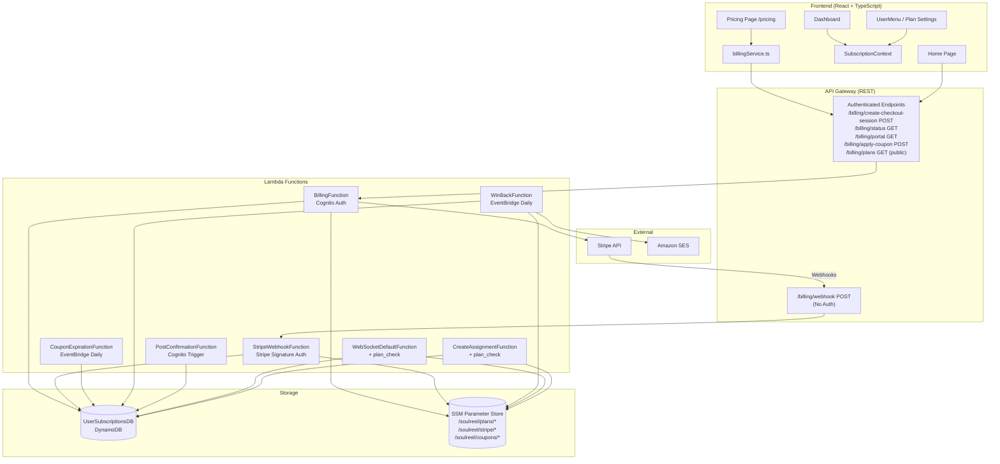
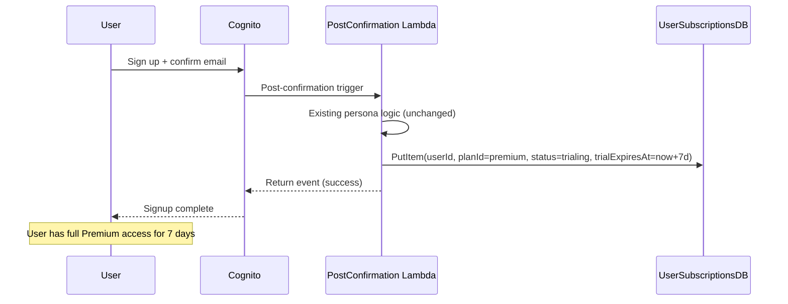
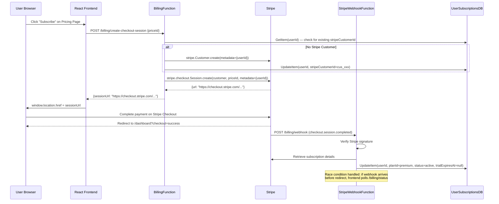
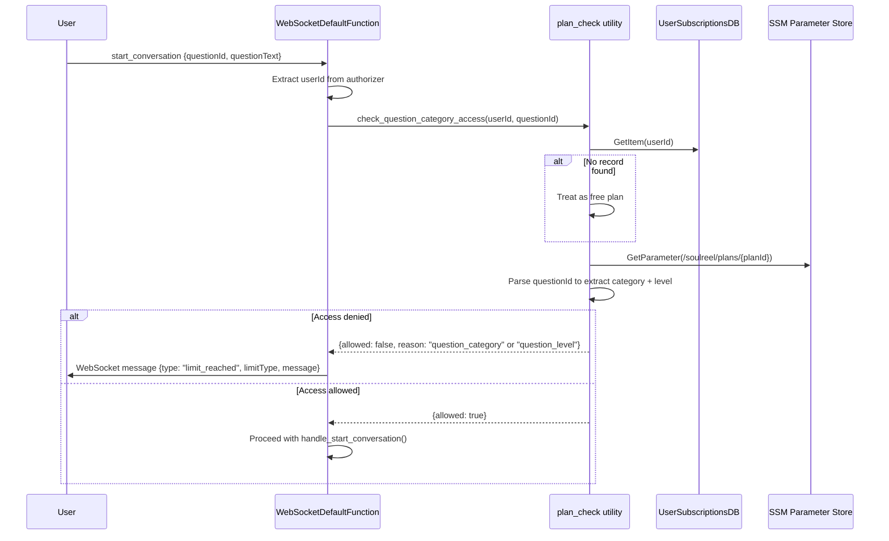

# Design Document: Stripe Subscription Tiers

## Overview

This design introduces a two-tier Stripe-powered subscription model (Free and Premium at $9.99/month or $79/year) into the existing SoulReel platform. The system adds billing infrastructure (two new Lambda functions, a DynamoDB table, SSM-based configuration), modifies existing Lambdas for access enforcement, and extends the React frontend with pricing, upgrade prompts, and plan management UI.

The architecture follows the existing SAM/Python backend patterns and React/TypeScript/shadcn frontend conventions. Key design goals:

1. **Minimal blast radius**: New billing Lambdas are isolated; existing Lambdas gain a lightweight `plan_check` utility call before expensive operations.
2. **Runtime configurability**: Plan limits, pricing display text, and coupons live in SSM Parameter Store — no redeploy to change prices or limits.
3. **Security-first**: Stripe webhook verification via signing secret, SSM SecureString for API keys, no Cognito auth bypass except the webhook endpoint.
4. **Graceful degradation**: If UserSubscriptionsDB is unreachable, treat user as free-tier (fail-closed for premium features, fail-open for basic access).

### Key Flows

- **Signup → Trial**: PostConfirmation Lambda creates a `trialing` record in UserSubscriptionsDB with 7-day expiry.
- **Checkout**: Frontend calls BillingFunction → Stripe Checkout Session → redirect to Stripe → webhook updates DynamoDB.
- **Access enforcement**: WebSocketDefaultFunction and CreateAssignmentFunction call `plan_check` utility before allowing operations.
- **Expiration**: Daily EventBridge-triggered Lambda scans for expired trials and coupons.
- **Win-back**: Separate EventBridge Lambda (3 days post-trial-expiry) sends SES email with auto-generated single-use coupon.

## Architecture

### High-Level Architecture



### Signup Trial Flow



### Checkout Flow



### Access Enforcement Flow



### Design Decisions and Rationale

| Decision | Rationale |
|----------|-----------|
| **Single BillingFunction for all authenticated billing endpoints** | Reduces cold start surface area. One Lambda handles checkout, status, portal, and coupon — routed by path+method. Matches existing pattern (e.g., assignment functions). |
| **Separate StripeWebhookFunction** | Must have `Auth: NONE` in SAM. Isolating it prevents accidental auth bypass on billing endpoints. Different IAM scope (read-only SSM for stripe secrets, no coupon write). |
| **SSM Parameter Store for plan definitions (not DynamoDB)** | Plans change rarely. SSM is simpler, cheaper, and supports in-Lambda caching with no TTL management. Avoids a new table for 2 records. |
| **SSM for coupons (not DynamoDB)** | Coupon volume is low (tens, not thousands). SSM supports atomic read-modify-write via PutParameter with overwrite. For high-volume coupons, migrate to DynamoDB later. |
| **plan_check as a shared module in SharedUtilsLayer** | Avoids code duplication across WebSocketDefaultFunction, CreateAssignmentFunction, and BillingFunction. Follows existing pattern (validation_utils, assignment_dal). |
| **questionId parsing for category/level** | Question IDs follow the pattern `{category}-{subcategory}-L{level}-Q{number}` (e.g., `life_story_reflections-general-L1-Q3`). The plan_check utility parses this to determine category and level without a DB lookup. |
| **Frontend SubscriptionContext (not per-component fetch)** | Subscription status is needed by Dashboard, Header, ContentPathCard, ConversationInterface, and ManageBenefactors. A context with React Query caching avoids redundant API calls. |
| **Pricing page is public (no ProtectedRoute)** | Unauthenticated visitors need to see pricing. The page conditionally shows "Subscribe" (authenticated) or "Sign Up" (unauthenticated) CTAs. |
| **Webhook CORS: return headers but Stripe doesn't need them** | Stripe's server-to-server calls ignore CORS. But API Gateway may add CORS headers via GatewayResponse resources. We return them for consistency and to avoid debugging confusion. |
| **Daily EventBridge for expiration (not DynamoDB TTL)** | TTL deletion is eventual (up to 48h delay) and doesn't trigger state transitions. We need to actively set `planId=free` and `status=expired`, not just delete the record. |
| **In-Lambda SSM caching (module-level dict)** | SSM parameters are cached in a module-level dict for the lifetime of the Lambda execution context (warm invocations reuse the cache). This avoids SSM API calls on every request. Cache is naturally invalidated on cold starts. No explicit TTL needed for plan definitions that change rarely. |

## Components and Interfaces

### Backend Components

#### 1. UserSubscriptionsDB Table (DynamoDB)

New table added to `SamLambda/template.yml`. PAY_PER_REQUEST, KMS-encrypted with existing `DataEncryptionKey`, PITR enabled. GSI on `stripeCustomerId` for webhook lookups.

#### 2. StripeDependencyLayer (Lambda Layer)

New Lambda Layer at `SamLambda/layers/stripe/` containing the `stripe` Python package. Built with `BuildMethod: python3.12`. Referenced by BillingFunction and StripeWebhookFunction.

Build process:
```
SamLambda/layers/stripe/
  requirements.txt    # contains: stripe
```
SAM `BuildMethod: python3.12` handles pip install into the layer structure automatically.

#### 3. BillingFunction (Lambda)

Single Lambda handling all authenticated billing endpoints. Routes by `path` + `httpMethod`.

| Endpoint | Method | Auth | Handler |
|----------|--------|------|---------|
| `/billing/create-checkout-session` | POST | CognitoAuthorizer | `handle_create_checkout()` |
| `/billing/status` | GET | CognitoAuthorizer | `handle_status()` |
| `/billing/portal` | GET | CognitoAuthorizer | `handle_portal()` |
| `/billing/apply-coupon` | POST | CognitoAuthorizer | `handle_apply_coupon()` |
| `/billing/plans` | GET | NONE | `handle_get_plans()` |

**IAM Policies:**
- `dynamodb:GetItem`, `dynamodb:PutItem`, `dynamodb:UpdateItem`, `dynamodb:Query` on UserSubscriptionsDB and its GSI
- `ssm:GetParameter` on `/soulreel/stripe/*`, `/soulreel/plans/*`, `/soulreel/coupons/*`
- `ssm:PutParameter` on `/soulreel/coupons/*` (for incrementing redemption counters)
- `kms:Decrypt`, `kms:DescribeKey` on DataEncryptionKey (for SSM SecureString decryption and DynamoDB)

**Environment Variables:**
- `SUBSCRIPTIONS_TABLE`: UserSubscriptionsDB table name (via `!Ref`)
- `FRONTEND_URL`: `https://www.soulreel.net`
- `ALLOWED_ORIGIN`: inherited from Globals

#### 4. StripeWebhookFunction (Lambda)

Unauthenticated endpoint for Stripe webhook events. Verifies signature before processing.

| Endpoint | Method | Auth | Handler |
|----------|--------|------|---------|
| `/billing/webhook` | POST | NONE | `handle_webhook()` |

**IAM Policies:**
- `dynamodb:GetItem`, `dynamodb:PutItem`, `dynamodb:UpdateItem`, `dynamodb:Query` on UserSubscriptionsDB and its GSI
- `ssm:GetParameter` on `/soulreel/stripe/*` only
- `kms:Decrypt`, `kms:DescribeKey` on DataEncryptionKey

**Price-to-Plan Mapping** (hardcoded in Lambda, not SSM — these are Stripe-specific IDs):
```python
PRICE_PLAN_MAP = {
    'price_monthly_xxx': 'premium',  # Premium Monthly
    'price_annual_xxx': 'premium',   # Premium Annual
}
```

#### 5. CouponExpirationFunction (Lambda)

EventBridge-triggered daily. Scans UserSubscriptionsDB for expired trials and time-limited coupons.

**IAM Policies:**
- `dynamodb:Scan`, `dynamodb:UpdateItem` on UserSubscriptionsDB

**Logic:**
1. Scan for `status=trialing` AND `trialExpiresAt < now()`
2. Scan for `couponType=time_limited` AND `couponExpiresAt < now()`
3. For each match: UpdateItem → `planId=free`, `status=expired`

**Note:** Uses `Scan` (not `Query`) because there's no GSI on `status` or `trialExpiresAt`. At low user volumes (<10K), a daily scan is acceptable. If user volume grows, add a GSI on `status` with `trialExpiresAt` as sort key.

#### 6. WinBackFunction (Lambda)

EventBridge-triggered daily. Queries for users whose trial expired 3-4 days ago and who haven't subscribed.

**IAM Policies:**
- `dynamodb:Scan` on UserSubscriptionsDB
- `ssm:GetParameter` on `/soulreel/stripe/*`
- `ssm:PutParameter` on `/soulreel/coupons/*` (to create auto-generated coupons)
- `ses:SendEmail` on `*`

**Logic:**
1. Scan for `status=expired` AND `trialExpiresAt` between 3 and 4 days ago
2. For each user: auto-generate a single-use `percentage` coupon in SSM with 48h expiry
3. Create corresponding Stripe Coupon via API
4. Send SES email with coupon code and link to `/pricing`

#### 7. plan_check Utility (SharedUtilsLayer module)

New file: `SamLambda/functions/shared/python/plan_check.py`

```python
# Public API
def get_user_plan(user_id: str) -> dict
def check_question_category_access(user_id: str, question_id: str) -> dict
def check_benefactor_limit(user_id: str) -> dict
def is_trial_active(subscription_record: dict) -> bool
def is_premium_active(subscription_record: dict) -> bool
```

**SSM Caching Strategy:**
```python
_plan_cache = {}  # Module-level, survives warm invocations

def _get_plan_definition(plan_id: str) -> dict:
    if plan_id not in _plan_cache:
        resp = ssm.get_parameter(Name=f'/soulreel/plans/{plan_id}')
        _plan_cache[plan_id] = json.loads(resp['Parameter']['Value'])
    return _plan_cache[plan_id]
```

Cache is invalidated on cold start (new Lambda execution context). For plan definition changes to take effect immediately, invoke a dummy request to force a cold start, or accept ~15 min propagation as warm instances cycle.

**Question ID Parsing:**
```python
def _parse_question_id(question_id: str) -> tuple[str, int]:
    """Parse 'life_story_reflections-general-L2-Q5' → ('life_story_reflections', 2)"""
    parts = question_id.split('-')
    # Category is everything before the L{n} segment
    # Find the level segment (starts with 'L' followed by digits)
    category_parts = []
    level = 1
    for part in parts:
        if part.startswith('L') and part[1:].isdigit():
            level = int(part[1:])
            break
        category_parts.append(part)
    category = '_'.join(category_parts) if category_parts else question_id
    return category, level
```

#### 8. PostConfirmation Lambda Changes

**File:** `SamLambda/functions/cognitoTriggers/postConfirmation/app.py`

Add after existing persona attribute logic (after the `admin_update_user_attributes` call):

```python
# Create trial subscription record
try:
    from datetime import timedelta
    subscriptions_table = dynamodb.Table(os.environ.get('TABLE_SUBSCRIPTIONS', 'UserSubscriptionsDB'))
    trial_expires = (datetime.utcnow() + timedelta(days=7)).isoformat() + 'Z'
    subscriptions_table.put_item(Item={
        'userId': username,
        'planId': 'premium',
        'status': 'trialing',
        'trialExpiresAt': trial_expires,
        'benefactorCount': 0,
        'createdAt': datetime.utcnow().isoformat() + 'Z',
        'updatedAt': datetime.utcnow().isoformat() + 'Z',
    })
    print(f"Created trial subscription for user: {username}")
except Exception as e:
    print(f"WARNING: Failed to create trial subscription for {username}: {e}")
    # Don't fail signup — user will be treated as free tier
```

**New IAM permissions needed:**
- `dynamodb:PutItem` on UserSubscriptionsDB table
- `kms:Encrypt`, `kms:GenerateDataKey` on DataEncryptionKey (for writing to KMS-encrypted table)

**New environment variable:**
- `TABLE_SUBSCRIPTIONS`: `!Ref UserSubscriptionsTable`

#### 9. WebSocketDefaultFunction Changes

**File:** `SamLambda/functions/conversationFunctions/wsDefault/app.py`

Add plan check at the start of `handle_start_conversation()`:

```python
def handle_start_conversation(connection_id: str, user_id: str, body: dict, config: dict):
    question_id = body.get('questionId')
    question_text = body.get('questionText')
    
    if not question_id or not question_text:
        send_message(connection_id, {'type': 'error', 'message': 'Missing questionId or questionText'})
        return
    
    # NEW: Check subscription access before starting conversation
    try:
        from plan_check import check_question_category_access
        access = check_question_category_access(user_id, question_id)
        if not access['allowed']:
            send_message(connection_id, {
                'type': 'limit_reached',
                'limitType': access['reason'],
                'message': access['message'],
                'upgradeUrl': '/pricing'
            })
            return
    except Exception as e:
        print(f"[PLAN_CHECK] Error checking access, allowing by default: {e}")
        # Fail open — don't block conversations if plan_check has an error
    
    # ... existing logic continues unchanged
```

**New IAM permissions needed:**
- `dynamodb:GetItem` on UserSubscriptionsDB
- `ssm:GetParameter` on `/soulreel/plans/*`

**Note:** The WebSocketDefaultFunction already has `ssm:GetParameter` on `/virtuallegacy/conversation/*` and `/virtuallegacy/deepgram/*`. We add a new statement for `/soulreel/plans/*` specifically.

#### 10. CreateAssignmentFunction Changes

**File:** `SamLambda/functions/assignmentFunctions/createAssignment/app.py`

Add benefactor limit check after extracting `legacy_maker_id`:

```python
# NEW: Check benefactor limit before creating assignment
try:
    sys.path.append('/opt/python')
    from plan_check import check_benefactor_limit
    limit_check = check_benefactor_limit(legacy_maker_id)
    if not limit_check['allowed']:
        return {
            'statusCode': 403,
            'headers': cors_headers(event),
            'body': json.dumps({
                'error': 'benefactor_limit',
                'message': limit_check['message'],
                'currentCount': limit_check['currentCount'],
                'limit': limit_check['limit']
            })
        }
except Exception as e:
    print(f"[PLAN_CHECK] Error checking benefactor limit, allowing by default: {e}")
```

**New IAM permissions needed:**
- `dynamodb:GetItem` on UserSubscriptionsDB
- `ssm:GetParameter` on `/soulreel/plans/*`

### Frontend Components

#### 1. SubscriptionContext (`FrontEndCode/src/contexts/SubscriptionContext.tsx`)

New React context that fetches and caches subscription status. Uses React Query under the hood.

```typescript
interface SubscriptionState {
  planId: 'free' | 'premium';
  status: 'active' | 'canceled' | 'past_due' | 'trialing' | 'comped' | 'expired';
  trialExpiresAt: string | null;
  trialDaysRemaining: number | null;
  couponCode: string | null;
  benefactorCount: number;
  planLimits: PlanLimits;
  isLoading: boolean;
  isPremium: boolean;  // computed: status in [active, trialing (valid), comped]
  refetch: () => void;
}

interface PlanLimits {
  allowedQuestionCategories: string[];
  maxBenefactors: number;
  accessConditionTypes: string[];
  features: string[];
  monthlyPriceDisplay?: string;
  annualPriceDisplay?: string;
  annualMonthlyEquivalentDisplay?: string;
  annualSavingsPercent?: number;
}
```

**Caching strategy:** React Query with `staleTime: 5 * 60 * 1000` (5 minutes). Refetch on window focus. Immediate refetch after checkout success (detected via URL param `?checkout=success`).

**For unauthenticated users:** Returns a static free-plan object without making an API call.

#### 2. billingService.ts (`FrontEndCode/src/services/billingService.ts`)

New service module following existing patterns (see `assignmentService.ts`).

```typescript
export const getSubscriptionStatus = async (): Promise<SubscriptionStatus> => { ... }
export const createCheckoutSession = async (priceId: string): Promise<{ sessionUrl: string }> => { ... }
export const getPortalUrl = async (): Promise<{ portalUrl: string }> => { ... }
export const applyCoupon = async (code: string): Promise<CouponResult> => { ... }
export const getPublicPlans = async (): Promise<PlanDefinition[]> => { ... }
```

#### 3. PricingPage (`FrontEndCode/src/pages/PricingPage.tsx`)

Public route at `/pricing`. No `ProtectedRoute` wrapper.

**Component hierarchy:**
```
PricingPage
├── Header (existing, conditional — show if authenticated)
├── PricingHero (value proposition headline)
├── BillingToggle (monthly / annual switch)
├── PlanComparisonGrid
│   ├── PlanCard (Free tier)
│   │   ├── PlanFeatureList
│   │   └── CTA: "Current Plan" or "Start Free"
│   └── PlanCard (Premium tier)
│       ├── PlanFeatureList
│       ├── PriceDisplay (monthly or annual equivalent)
│       └── CTA: "Subscribe" / "Manage Subscription" / "Start Free Trial"
├── CouponSection (collapsed by default)
│   ├── "Have a code?" link
│   └── CouponInput + Apply button (expanded on click)
└── Footer
```

**Behavior by auth state:**
- **Unauthenticated**: Shows "Sign Up Free" and "Start Free Trial" CTAs → navigate to `/signup-create-legacy`
- **Authenticated, free plan**: Shows "Subscribe" → calls `createCheckoutSession()` → redirect to Stripe
- **Authenticated, premium**: Shows "Manage Subscription" → calls `getPortalUrl()` → redirect to Stripe Portal
- **Authenticated, trialing**: Shows "Subscribe Now" with trial-ending messaging

All pricing text (monthly price, annual price, savings %) is rendered from `PlanLimits` data returned by `/billing/status` or `/billing/plans`, never hardcoded.

#### 4. Dashboard Changes (`FrontEndCode/src/pages/Dashboard.tsx`)

- Import `useSubscription()` from SubscriptionContext
- Pass `locked` and `isPremium` props to ContentPathCard
- Show trial nudge banner when `trialDaysRemaining <= 3`
- Show checkout success toast when URL has `?checkout=success`

#### 5. ContentPathCard Changes (`FrontEndCode/src/components/ContentPathCard.tsx`)

New props: `locked?: boolean`, `onLockedClick?: () => void`

When `locked=true`:
- Show `Lock` icon from lucide-react
- Show "Premium" badge (using existing Badge component)
- On click: show preview overlay dialog instead of navigating

#### 6. UpgradePromptDialog (`FrontEndCode/src/components/UpgradePromptDialog.tsx`)

Reusable dialog for locked content previews and limit-reached prompts. Uses shadcn Dialog.

Props: `title`, `message`, `previewQuestion?`, `onUpgrade`, `onClose`

#### 7. Home Page Changes (`FrontEndCode/src/pages/Home.tsx`)

- Change primary CTA from "Create Your Legacy" to "Start Free"
- Add `HomePricingSection` component below "How It Works"
- Add "Pricing" link to footer navigation

#### 8. UserMenu Changes (`FrontEndCode/src/components/UserMenu.tsx`)

Add "Plan & Billing" menu item between "Manage Benefactors" and "Security & Privacy":
- Shows current plan name badge
- Links to `/pricing` for free users
- Links to Stripe Portal for premium users

### API Contracts

#### POST /billing/create-checkout-session (Cognito Auth)

**Request:**
```json
{
  "priceId": "price_xxx"
}
```

**Response 200:**
```json
{
  "sessionUrl": "https://checkout.stripe.com/c/pay/cs_xxx"
}
```

**Response 400:**
```json
{
  "error": "Missing priceId"
}
```

#### GET /billing/status (Cognito Auth)

**Response 200 (existing subscriber):**
```json
{
  "planId": "premium",
  "status": "active",
  "currentPeriodEnd": "2026-05-29T00:00:00Z",
  "trialExpiresAt": null,
  "couponCode": null,
  "couponExpiresAt": null,
  "benefactorCount": 3,
  "planLimits": {
    "allowedQuestionCategories": ["life_story_reflections", "life_events", "values_and_emotions"],
    "maxBenefactors": -1,
    "accessConditionTypes": ["immediate", "time_delayed", "inactivity_trigger", "manual_release"],
    "features": ["basic", "dead_mans_switch", "pdf_export", "priority_ai", "legacy_export", "psych_profile", "avatar"],
    "monthlyPriceDisplay": "$9.99",
    "annualPriceDisplay": "$79",
    "annualMonthlyEquivalentDisplay": "$6.58",
    "annualSavingsPercent": 34
  },
  "freePlanLimits": {
    "allowedQuestionCategories": ["life_story_reflections_L1"],
    "maxBenefactors": 2,
    "accessConditionTypes": ["immediate"],
    "features": ["basic"]
  }
}
```

**Response 200 (no subscription record — free plan):**
```json
{
  "planId": "free",
  "status": "active",
  "currentPeriodEnd": null,
  "trialExpiresAt": null,
  "couponCode": null,
  "couponExpiresAt": null,
  "benefactorCount": 0,
  "planLimits": {
    "allowedQuestionCategories": ["life_story_reflections_L1"],
    "maxBenefactors": 2,
    "accessConditionTypes": ["immediate"],
    "features": ["basic"]
  },
  "freePlanLimits": {
    "allowedQuestionCategories": ["life_story_reflections_L1"],
    "maxBenefactors": 2,
    "accessConditionTypes": ["immediate"],
    "features": ["basic"]
  }
}
```

#### GET /billing/portal (Cognito Auth)

**Response 200:**
```json
{
  "portalUrl": "https://billing.stripe.com/p/session/xxx"
}
```

**Response 400:**
```json
{
  "error": "No billing account found"
}
```

#### POST /billing/apply-coupon (Cognito Auth)

**Request:**
```json
{
  "code": "FAMILY2026"
}
```

**Response 200 (forever_free):**
```json
{
  "success": true,
  "type": "forever_free",
  "planId": "premium",
  "message": "You have lifetime Premium access"
}
```

**Response 200 (time_limited):**
```json
{
  "success": true,
  "type": "time_limited",
  "planId": "premium",
  "expiresAt": "2026-05-29T00:00:00Z",
  "message": "30 days of free Premium access"
}
```

**Response 200 (percentage):**
```json
{
  "success": true,
  "type": "percentage",
  "stripeCouponId": "HALFOFF3",
  "message": "50% off — apply at checkout"
}
```

**Response 400 (various):**
```json
{ "error": "Invalid coupon code" }
{ "error": "This coupon has expired" }
{ "error": "This coupon has reached its redemption limit" }
{ "error": "You already have an active plan" }
```

#### GET /billing/plans (No Auth — public endpoint)

Returns plan definitions for unauthenticated pricing page display.

**Response 200:**
```json
{
  "plans": {
    "free": {
      "planId": "free",
      "allowedQuestionCategories": ["life_story_reflections_L1"],
      "maxBenefactors": 2,
      "accessConditionTypes": ["immediate"],
      "features": ["basic"]
    },
    "premium": {
      "planId": "premium",
      "allowedQuestionCategories": ["life_story_reflections", "life_events", "values_and_emotions"],
      "maxBenefactors": -1,
      "accessConditionTypes": ["immediate", "time_delayed", "inactivity_trigger", "manual_release"],
      "features": ["basic", "dead_mans_switch", "pdf_export", "priority_ai", "legacy_export", "psych_profile", "avatar"],
      "monthlyPriceDisplay": "$9.99",
      "annualPriceDisplay": "$79",
      "annualMonthlyEquivalentDisplay": "$6.58",
      "annualSavingsPercent": 34
    }
  }
}
```

#### POST /billing/webhook (No Auth — Stripe signature verification)

**Request:** Raw Stripe event payload with `Stripe-Signature` header.

**Response 200:**
```json
{ "received": true }
```

**Response 400:**
```json
{ "error": "Invalid signature" }
```

#### WebSocket limit_reached message (sent by WebSocketDefaultFunction)

```json
{
  "type": "limit_reached",
  "limitType": "question_category",
  "message": "Life Events questions are available with Premium. Upgrade to preserve the moments that shaped who you are.",
  "upgradeUrl": "/pricing"
}
```

```json
{
  "type": "limit_reached",
  "limitType": "question_level",
  "message": "You've explored the first chapter. Upgrade to Premium to go deeper into your life story.",
  "upgradeUrl": "/pricing"
}
```

## Data Models

### UserSubscriptionsDB Table Schema

**Table Configuration:**
- Table Name: `UserSubscriptionsDB`
- Partition Key: `userId` (String) — Cognito `sub`
- Billing Mode: PAY_PER_REQUEST
- Encryption: KMS with existing `DataEncryptionKey`
- Point-in-Time Recovery: Enabled
- GSI: `stripeCustomerId-index` (PK: `stripeCustomerId`, Projection: ALL)

**Item Schema:**

| Attribute | Type | Required | Description |
|-----------|------|----------|-------------|
| `userId` | String | Yes (PK) | Cognito `sub` UUID |
| `stripeCustomerId` | String | No | Stripe Customer ID (`cus_xxx`). Set on first checkout. GSI key. |
| `stripeSubscriptionId` | String | No | Stripe Subscription ID (`sub_xxx`). Set on successful checkout. |
| `planId` | String | Yes | `free` or `premium` |
| `status` | String | Yes | `active`, `canceled`, `past_due`, `trialing`, `comped`, `expired` |
| `currentPeriodEnd` | String | No | ISO 8601 timestamp. Stripe subscription period end. |
| `trialExpiresAt` | String | No | ISO 8601 timestamp. Set on signup, cleared on subscription. |
| `couponCode` | String | No | Applied coupon code (e.g., `FAMILY2026`). |
| `couponType` | String | No | `forever_free`, `time_limited`, or `percentage`. |
| `couponExpiresAt` | String | No | ISO 8601 timestamp. For time-limited coupons. |
| `benefactorCount` | Number | Yes | Current number of benefactor assignments. Default 0. |
| `createdAt` | String | Yes | ISO 8601 timestamp. |
| `updatedAt` | String | Yes | ISO 8601 timestamp. |

**GSI Eventual Consistency Note:** The `stripeCustomerId-index` GSI uses eventual consistency. When a webhook arrives immediately after checkout, the GSI may not yet reflect the newly written `stripeCustomerId`. The webhook handler for `checkout.session.completed` uses the `userId` from session metadata (direct table lookup by PK) rather than the GSI. Only `customer.subscription.updated`, `customer.subscription.deleted`, and `invoice.payment_failed` use the GSI — these events arrive later, after the GSI has propagated.

### SSM Parameter Store Schemas

#### Plan Definitions

**Path:** `/soulreel/plans/free`
```json
{
  "planId": "free",
  "allowedQuestionCategories": ["life_story_reflections_L1"],
  "maxBenefactors": 2,
  "accessConditionTypes": ["immediate"],
  "features": ["basic"]
}
```

**Path:** `/soulreel/plans/premium`
```json
{
  "planId": "premium",
  "allowedQuestionCategories": ["life_story_reflections", "life_events", "values_and_emotions"],
  "maxBenefactors": -1,
  "accessConditionTypes": ["immediate", "time_delayed", "inactivity_trigger", "manual_release"],
  "features": ["basic", "dead_mans_switch", "pdf_export", "priority_ai", "legacy_export", "psych_profile", "avatar"],
  "monthlyPriceDisplay": "$9.99",
  "annualPriceDisplay": "$79",
  "annualMonthlyEquivalentDisplay": "$6.58",
  "annualSavingsPercent": 34
}
```

**`allowedQuestionCategories` encoding:**
- `life_story_reflections_L1` — only Level 1 of life_story_reflections
- `life_story_reflections` — all levels of life_story_reflections
- `life_events` — all life events questions
- `values_and_emotions` — all values & emotions questions

The `plan_check` utility interprets `_L{n}` suffix as a level restriction. No suffix means all levels.

#### Stripe Secrets

| Path | Type | Description |
|------|------|-------------|
| `/soulreel/stripe/secret-key` | SecureString | Stripe secret API key (`sk_live_xxx`) |
| `/soulreel/stripe/webhook-secret` | SecureString | Stripe webhook signing secret (`whsec_xxx`) |
| `/soulreel/stripe/publishable-key` | String | Stripe publishable key (`pk_live_xxx`) — safe to expose to frontend |

#### Coupon Definitions

**Path:** `/soulreel/coupons/{CODE}` (e.g., `/soulreel/coupons/FAMILY2026`)

```json
{
  "code": "FAMILY2026",
  "type": "forever_free",
  "grantPlan": "premium",
  "maxRedemptions": 10,
  "currentRedemptions": 0,
  "expiresAt": null,
  "createdBy": "admin"
}
```

```json
{
  "code": "LAUNCH30",
  "type": "time_limited",
  "grantPlan": "premium",
  "durationDays": 30,
  "maxRedemptions": 500,
  "currentRedemptions": 0,
  "expiresAt": "2026-06-30T00:00:00Z",
  "createdBy": "admin"
}
```

```json
{
  "code": "HALFOFF3",
  "type": "percentage",
  "percentOff": 50,
  "durationMonths": 3,
  "stripeCouponId": "HALFOFF3",
  "maxRedemptions": 200,
  "currentRedemptions": 0,
  "expiresAt": "2026-12-31T00:00:00Z",
  "createdBy": "admin"
}
```

**Auto-generated win-back coupon (created by WinBackFunction):**
```json
{
  "code": "WINBACK-{userId-short}-{timestamp}",
  "type": "percentage",
  "percentOff": 50,
  "durationMonths": 1,
  "stripeCouponId": "WINBACK-{userId-short}-{timestamp}",
  "maxRedemptions": 1,
  "currentRedemptions": 0,
  "expiresAt": "2026-04-02T00:00:00Z",
  "createdBy": "system-winback"
}
```

### SAM Template Additions (template.yml)

**New Global Environment Variable:**
```yaml
TABLE_SUBSCRIPTIONS: 'UserSubscriptionsDB'
```

**New Resources Summary:**
1. `UserSubscriptionsTable` — DynamoDB table
2. `StripeDependencyLayer` — Lambda Layer with `stripe` package
3. `BillingFunction` — Authenticated billing Lambda
4. `StripeWebhookFunction` — Unauthenticated webhook Lambda
5. `CouponExpirationFunction` — Daily scheduled Lambda
6. `WinBackFunction` — Daily scheduled Lambda
7. `PublicBillingPlansFunction` — OR: add `/billing/plans` as `Auth: NONE` event on BillingFunction

**IAM Additions to Existing Functions:**

PostConfirmationFunction:
```yaml
- Statement:
    - Effect: Allow
      Action:
        - dynamodb:PutItem
      Resource: !GetAtt UserSubscriptionsTable.Arn
- Statement:
    - Effect: Allow
      Action:
        - kms:Encrypt
        - kms:GenerateDataKey
      Resource: !GetAtt DataEncryptionKey.Arn
```

WebSocketDefaultFunction:
```yaml
- Statement:
    - Effect: Allow
      Action:
        - dynamodb:GetItem
      Resource: !GetAtt UserSubscriptionsTable.Arn
- Statement:
    - Effect: Allow
      Action:
        - ssm:GetParameter
      Resource:
        - !Sub arn:aws:ssm:${AWS::Region}:${AWS::AccountId}:parameter/soulreel/plans/*
```

CreateAssignmentFunction:
```yaml
- Statement:
    - Effect: Allow
      Action:
        - dynamodb:GetItem
      Resource: !GetAtt UserSubscriptionsTable.Arn
- Statement:
    - Effect: Allow
      Action:
        - ssm:GetParameter
      Resource:
        - !Sub arn:aws:ssm:${AWS::Region}:${AWS::AccountId}:parameter/soulreel/plans/*
```

## Correctness Properties

*A property is a characteristic or behavior that should hold true across all valid executions of a system — essentially, a formal statement about what the system should do. Properties serve as the bridge between human-readable specifications and machine-verifiable correctness guarantees.*

### Property 1: Subscription record round-trip

*For any* valid subscription record (with all required fields: userId, planId, status, benefactorCount, createdAt, updatedAt, and optional fields), serializing it to a DynamoDB item and deserializing it back should produce an equivalent record with all fields preserved.

**Validates: Requirements 1.6**

### Property 2: Trial record creation correctness

*For any* user ID and any signup timestamp, the trial subscription record created by PostConfirmation should have `planId=premium`, `status=trialing`, `benefactorCount=0`, and `trialExpiresAt` exactly 7 days (604800 seconds) after the signup timestamp.

**Validates: Requirements 3.1**

### Property 3: Active trial grants premium access

*For any* subscription record where `status=trialing` and `trialExpiresAt` is in the future relative to the current time, `is_premium_active()` should return `true` and `check_question_category_access()` should allow all question categories and levels.

**Validates: Requirements 3.2, 3.3**

### Property 4: Expiration service transitions expired records to free

*For any* set of subscription records, after the expiration service runs at time T, every record where (`status=trialing` AND `trialExpiresAt < T`) OR (`couponType=time_limited` AND `couponExpiresAt < T`) should have `planId=free` and `status=expired`. Records that are not expired should remain unchanged.

**Validates: Requirements 3.4, 11.2, 11.3, 11.4, 11.5**

### Property 5: Trial days remaining computation

*For any* `trialExpiresAt` timestamp and any current time, the computed `trialDaysRemaining` should equal `ceil((trialExpiresAt - now) / 86400)` when positive, and 0 when the trial has expired. The trial nudge should display if and only if `0 < trialDaysRemaining <= 3`.

**Validates: Requirements 3.5**

### Property 6: Subscribing during trial clears trial state

*For any* user with `status=trialing` and a valid `trialExpiresAt`, when a `checkout.session.completed` webhook is processed for that user, the resulting record should have `status=active`, `planId=premium`, and `trialExpiresAt` set to null.

**Validates: Requirements 3.6**

### Property 7: Checkout session creation includes userId and returns sessionUrl

*For any* authenticated user and any valid `priceId`, the created Stripe Checkout Session should include the user's Cognito `userId` in its metadata, and the response should contain a non-empty `sessionUrl` string.

**Validates: Requirements 4.2, 4.4, 4.6**

### Property 8: All billing responses include CORS headers

*For any* request to any billing endpoint (authenticated or webhook), the response should include `Access-Control-Allow-Origin` matching the configured `ALLOWED_ORIGIN`, `Access-Control-Allow-Headers`, and `Access-Control-Allow-Methods` headers.

**Validates: Requirements 4.8, 5.11, 6.4, 7.4, 8.10**

### Property 9: Webhook signature verification gates processing

*For any* webhook request, if the `Stripe-Signature` header does not match the expected signature for the request body and webhook secret, the handler should return HTTP 400 and should not modify any DynamoDB records.

**Validates: Requirements 5.2**

### Property 10: checkout.session.completed webhook updates subscription correctly

*For any* valid `checkout.session.completed` event with a `userId` in session metadata and a valid price ID, the resulting UserSubscriptionsDB record should have `planId=premium`, `status=active`, the correct `stripeCustomerId` and `stripeSubscriptionId`, and a valid `currentPeriodEnd`.

**Validates: Requirements 5.4**

### Property 11: Subscription lifecycle webhook transitions

*For any* `customer.subscription.updated` event, the user's record should reflect the new `status` and `currentPeriodEnd`. *For any* `customer.subscription.deleted` event, the user's record should have `planId=free` and `status=canceled`. *For any* `invoice.payment_failed` event, the user's `status` should be `past_due`.

**Validates: Requirements 5.6, 5.7, 5.8**

### Property 12: Webhook updates preserve usage counters

*For any* webhook event that updates a subscription record, the `benefactorCount` field should remain unchanged from its value before the update.

**Validates: Requirements 5.9**

### Property 13: Missing subscription record defaults to free plan

*For any* user ID that has no record in UserSubscriptionsDB, `get_user_plan()` should return the free plan definition, `check_question_category_access()` should enforce free-tier restrictions, and `check_benefactor_limit()` should use `maxBenefactors=2` with `benefactorCount=0`.

**Validates: Requirements 6.2, 9.5, 10.4**

### Property 14: Status endpoint returns plan limits matching plan definition

*For any* user with a subscription record, the `/billing/status` response should include `planLimits` that exactly match the SSM Plan_Definition for the user's `planId`, including all pricing display fields.

**Validates: Requirements 6.3**

### Property 15: Coupon redemption creates correct subscription record

*For any* valid `forever_free` coupon and any eligible user, redemption should produce a record with `planId=premium`, `status=comped`, the coupon code, and `couponType=forever_free`. *For any* valid `time_limited` coupon with `durationDays=D`, redemption should produce a record with `planId=premium`, `status=trialing`, and `couponExpiresAt` equal to the current time plus D days.

**Validates: Requirements 8.2, 8.3**

### Property 16: Percentage coupon returns stripeCouponId without DB modification

*For any* valid `percentage` coupon, the apply-coupon response should contain the `stripeCouponId` from the coupon definition, and the user's UserSubscriptionsDB record should not be created or modified.

**Validates: Requirements 8.4**

### Property 17: Coupon redemption increments counter

*For any* successful `forever_free` or `time_limited` coupon redemption, the coupon's `currentRedemptions` in SSM should increase by exactly 1.

**Validates: Requirements 8.5**

### Property 18: Free-plan users are denied access to restricted question categories and levels

*For any* user on the free plan (or with no subscription record) and *for any* question ID whose category is `life_events` or `values_and_emotions`, or whose category is `life_story_reflections` with level > 1, `check_question_category_access()` should return `{allowed: false}` with the appropriate `reason` (`question_category` or `question_level`).

**Validates: Requirements 9.2, 9.3**

### Property 19: Premium users have unrestricted question access

*For any* user with `status` in `[active, comped]` or (`status=trialing` with valid `trialExpiresAt`), and *for any* question ID regardless of category or level, `check_question_category_access()` should return `{allowed: true}`.

**Validates: Requirements 9.4**

### Property 20: Benefactor limit enforcement

*For any* user on a plan with `maxBenefactors=N` (where N >= 0), if the user's `benefactorCount >= N`, `check_benefactor_limit()` should return `{allowed: false}`. If `maxBenefactors=-1`, `check_benefactor_limit()` should return `{allowed: true}` regardless of `benefactorCount`.

**Validates: Requirements 10.2, 10.3**

### Property 21: Pricing text is derived from plan definition data

*For any* plan definition containing `monthlyPriceDisplay`, `annualPriceDisplay`, `annualMonthlyEquivalentDisplay`, and `annualSavingsPercent`, the rendered pricing UI (both PricingPage and HomePricingSection) should display these exact values, not hardcoded strings.

**Validates: Requirements 16.3, 17.2, 21.1, 21.2, 21.3**

### Property 22: Dashboard content path card visibility by plan

*For any* user, the Dashboard should render all three content path cards. *For any* free-plan user, the Life Events and Values & Emotions cards should have `locked=true`. *For any* premium-plan user (active, trialing with valid trial, or comped), all three cards should have `locked=false`.

**Validates: Requirements 18.1, 18.2, 18.4**

### Property 23: Plan settings display matches subscription state

*For any* subscription record, the Plan_Settings_Section should display the plan name matching `planId`. *For any* record with `status=trialing` and `trialExpiresAt` in the future, it should display the trial status and correct days remaining.

**Validates: Requirements 19.2, 19.3**

### Property 24: Win-back targets correct user cohort

*For any* set of subscription records, the WinBackFunction should send notifications only to users where `status=expired` AND `trialExpiresAt` is between 3 and 4 days before the current time. Users outside this window should not receive notifications.

**Validates: Requirements 22.1**

### Property 25: Win-back coupon generation

*For any* win-back notification, the auto-generated coupon should have `type=percentage`, `maxRedemptions=1`, `expiresAt` within 48 hours of generation, and a non-null `stripeCouponId`.

**Validates: Requirements 22.5, 22.6**

### Property 26: Question ID parsing correctness

*For any* question ID string following the pattern `{category_parts}-L{level}-Q{number}`, the `_parse_question_id()` function should extract the correct category (joined with underscores) and the correct integer level. For question IDs without a level segment, the default level should be 1.

**Validates: Requirements 9.2, 9.3 (prerequisite)**

## Error Handling

### Backend Error Handling Strategy

#### Fail-Open vs Fail-Closed

| Component | Failure Mode | Strategy | Rationale |
|-----------|-------------|----------|-----------|
| `plan_check` in WebSocketDefaultFunction | DynamoDB/SSM unreachable | **Fail-open** (allow conversation) | Don't block paying users due to infra issues. Log error for alerting. |
| `plan_check` in CreateAssignmentFunction | DynamoDB/SSM unreachable | **Fail-open** (allow assignment) | Same rationale. Benefactor count may drift but is correctable. |
| BillingFunction | Stripe API error | **Fail-closed** (return 502) | Can't create checkout without Stripe. Return user-friendly error. |
| StripeWebhookFunction | DynamoDB write failure | **Return 500** (Stripe will retry) | Stripe retries webhooks for up to 3 days. Transient DDB errors self-heal. |
| PostConfirmation trial creation | DynamoDB write failure | **Fail-open** (don't block signup) | User gets free tier instead of trial. Log CRITICAL for manual fix. |
| CouponExpirationFunction | Partial scan failure | **Continue processing** | Process what we can, log failures. Next daily run catches stragglers. |

#### Error Response Format

All billing endpoints use the existing `error_response()` from `responses.py` in SharedUtilsLayer:

```python
from responses import error_response

# Returns safe error with CORS headers, logs full exception internally
return error_response(400, "Missing priceId", exception=e, event=event)
```

#### Stripe Webhook Idempotency

Stripe may deliver the same webhook event multiple times. The webhook handler must be idempotent:

- `checkout.session.completed`: Uses `UpdateItem` with all fields — re-processing produces the same result.
- `customer.subscription.updated`: Same — overwrites with latest state.
- `customer.subscription.deleted`: Sets `planId=free`, `status=canceled` — idempotent.
- `invoice.payment_failed`: Sets `status=past_due` — idempotent.

#### Race Condition: Webhook Before Redirect

After Stripe Checkout, the webhook may arrive before the user is redirected back to `/dashboard?checkout=success`. The frontend handles this:

1. On Dashboard mount, if `?checkout=success` is in the URL:
   - Show a "Processing your subscription..." loading state
   - Poll `GET /billing/status` every 2 seconds for up to 10 seconds
   - Once `status=active` is returned, show success toast and update SubscriptionContext
   - If polling times out, show "Your subscription is being processed. It may take a moment to appear."

#### SSM Parameter Not Found

If a plan definition or coupon is not found in SSM:
- `plan_check`: Defaults to free plan (fail-safe)
- BillingFunction coupon endpoint: Returns 400 "Invalid coupon code"
- BillingFunction status endpoint: Returns free plan limits

#### Benefactor Count Drift

The `benefactorCount` in UserSubscriptionsDB may drift from the actual count in PersonaRelationshipsDB if:
- A webhook update accidentally overwrites it (prevented by Property 12)
- An assignment creation succeeds but the count increment fails

Mitigation: The `check_benefactor_limit()` function reads `benefactorCount` from UserSubscriptionsDB. If the record doesn't exist, it queries PersonaRelationshipsDB to get the actual count and creates the subscription record. This self-heals on first access.

### Frontend Error Handling

| Scenario | Handling |
|----------|---------|
| `/billing/status` fails | Show free-plan UI as fallback. Log error. Don't block dashboard. |
| Checkout session creation fails | Show toast error "Unable to start checkout. Please try again." |
| Coupon apply fails | Show the error message from the API response in the coupon input area. |
| Portal URL fetch fails | Show toast error "Unable to open billing portal. Please try again." |
| WebSocket `limit_reached` received | Show UpgradePromptDialog with the message from the event. |
| Stripe redirect fails (user closes tab) | No action needed — webhook still processes. User sees updated status on next visit. |

### Monitoring and Alerting

| Metric | Source | Alert Threshold |
|--------|--------|----------------|
| `PostConfirmation trial creation failure` | CloudWatch Logs filter on "WARNING: Failed to create trial subscription" | Any occurrence |
| `Webhook signature verification failure` | CloudWatch Logs filter on "Invalid signature" | > 5 in 5 minutes (indicates misconfigured secret or attack) |
| `Webhook DynamoDB write failure` | CloudWatch Logs filter on "Error updating subscription" | Any occurrence |
| `plan_check DynamoDB/SSM failure` | CloudWatch Logs filter on "[PLAN_CHECK] Error" | > 10 in 5 minutes |
| `CouponExpirationFunction errors` | Lambda error metric | Any invocation error |
| `BillingFunction 5xx responses` | API Gateway 5XX metric | > 5 in 5 minutes |

## Testing Strategy

### Dual Testing Approach

This feature requires both unit tests and property-based tests. Unit tests verify specific examples, edge cases, and integration points. Property-based tests verify universal properties across randomized inputs.

### Property-Based Testing Configuration

- **Library**: `fast-check` (already in `devDependencies`) for frontend TypeScript tests; `hypothesis` for Python backend tests
- **Minimum iterations**: 100 per property test
- **Tag format**: `Feature: stripe-subscription-tiers, Property {number}: {property_text}`
- **Each correctness property is implemented by a SINGLE property-based test**

### Backend Tests (Python + Hypothesis)

#### Property Tests (`SamLambda/tests/test_plan_check_properties.py`)

| Test | Property | Description |
|------|----------|-------------|
| `test_subscription_record_roundtrip` | Property 1 | Generate random subscription records, serialize to DynamoDB format, deserialize, assert equality |
| `test_trial_creation_correctness` | Property 2 | Generate random user IDs and timestamps, verify trial record fields |
| `test_active_trial_grants_premium` | Property 3 | Generate records with status=trialing and future trialExpiresAt, verify is_premium_active returns true |
| `test_expiration_transitions` | Property 4 | Generate mixed sets of expired/active records, run expiration logic, verify correct transitions |
| `test_trial_days_remaining` | Property 5 | Generate random trialExpiresAt and current times, verify days remaining computation |
| `test_subscribe_during_trial_clears_state` | Property 6 | Generate trialing records, simulate checkout.session.completed, verify state transition |
| `test_cors_headers_present` | Property 8 | Generate random request events, call each handler, verify CORS headers in response |
| `test_webhook_signature_gates_processing` | Property 9 | Generate random payloads with invalid signatures, verify 400 response and no DB writes |
| `test_checkout_completed_updates_record` | Property 10 | Generate valid checkout events with userId metadata, verify DynamoDB record |
| `test_subscription_lifecycle_transitions` | Property 11 | Generate subscription.updated/deleted/payment_failed events, verify correct state transitions |
| `test_webhook_preserves_benefactor_count` | Property 12 | Generate records with random benefactorCount, process webhook events, verify count unchanged |
| `test_missing_record_defaults_to_free` | Property 13 | Generate random user IDs with no records, verify free plan returned |
| `test_status_returns_matching_plan_limits` | Property 14 | Generate records with random planIds, verify response planLimits match SSM definition |
| `test_coupon_redemption_creates_correct_record` | Property 15 | Generate valid coupons and users, verify resulting DynamoDB records |
| `test_percentage_coupon_no_db_write` | Property 16 | Generate percentage coupons, verify response contains stripeCouponId and no DB modification |
| `test_coupon_redemption_increments_counter` | Property 17 | Generate coupons with random currentRedemptions, redeem, verify counter incremented by 1 |
| `test_free_plan_denies_restricted_questions` | Property 18 | Generate free-plan users and restricted question IDs, verify access denied |
| `test_premium_allows_all_questions` | Property 19 | Generate premium users and random question IDs, verify access allowed |
| `test_benefactor_limit_enforcement` | Property 20 | Generate users with random benefactorCount and plan limits, verify enforcement |
| `test_question_id_parsing` | Property 26 | Generate question ID strings, verify correct category and level extraction |

#### Unit Tests (`SamLambda/tests/test_billing_unit.py`)

| Test | Criteria | Description |
|------|----------|-------------|
| `test_missing_price_id_returns_400` | 4.7 | Verify 400 response when priceId is missing |
| `test_invalid_signature_returns_400` | 5.3 | Verify 400 response for invalid webhook signature |
| `test_checkout_without_userid_returns_200` | 5.5 | Verify 200 response with no DB modification |
| `test_portal_without_customer_returns_400` | 7.3 | Verify 400 when user has no stripeCustomerId |
| `test_invalid_coupon_code_returns_400` | 8.6 | Verify 400 for non-existent coupon |
| `test_expired_coupon_returns_400` | 8.7 | Verify 400 for expired coupon |
| `test_max_redemptions_returns_400` | 8.8 | Verify 400 when coupon is fully redeemed |
| `test_active_plan_rejects_coupon` | 8.9 | Verify 400 when user already has active plan |
| `test_price_to_plan_mapping_has_two_entries` | 15.2 | Verify PRICE_PLAN_MAP has exactly 2 entries, both mapping to 'premium' |
| `test_webhook_returns_200_received_true` | 5.10 | Verify all valid webhook events return 200 with received:true |

### Frontend Tests (TypeScript + fast-check + Vitest)

#### Property Tests (`FrontEndCode/src/__tests__/subscription.property.test.ts`)

| Test | Property | Description |
|------|----------|-------------|
| `test_pricing_text_from_plan_definition` | Property 21 | Generate random plan definitions with pricing fields, render PricingPage, verify displayed text matches |
| `test_dashboard_card_visibility_by_plan` | Property 22 | Generate random subscription states, verify correct locked/unlocked card rendering |
| `test_plan_settings_matches_subscription` | Property 23 | Generate random subscription records, verify plan name and trial days display |
| `test_win_back_targets_correct_cohort` | Property 24 | Generate sets of subscription records with various expiry dates, verify only 3-4 day window is targeted |
| `test_win_back_coupon_generation` | Property 25 | Generate win-back scenarios, verify coupon has correct fields |

#### Unit Tests (`FrontEndCode/src/__tests__/subscription.unit.test.ts`)

| Test | Criteria | Description |
|------|----------|-------------|
| `test_pricing_page_renders_at_pricing_route` | 16.1 | Verify /pricing route renders PricingPage |
| `test_coupon_input_hidden_by_default` | 23.3 | Verify coupon input is not visible on initial render |
| `test_coupon_input_expands_on_click` | 23.2 | Verify "Have a code?" click reveals input |
| `test_checkout_success_shows_toast` | 20.5 | Verify success toast on ?checkout=success |
| `test_home_cta_says_start_free` | 17.5 | Verify CTA text is "Start Free" |
| `test_footer_has_pricing_link` | 17.6 | Verify footer contains /pricing link |
| `test_locked_card_shows_preview_on_click` | 18.3 | Verify preview overlay appears on locked card click |

### Integration Tests

| Test | Description |
|------|-------------|
| Signup → Trial → Dashboard | Verify new user gets trial record, dashboard shows premium access |
| Checkout → Webhook → Status | Verify end-to-end checkout flow updates subscription correctly |
| Trial Expiration → Free Tier | Verify expired trial user sees locked content |
| Coupon Apply → Premium Access | Verify forever_free coupon grants immediate premium access |
| Benefactor Limit → 403 → Upgrade Prompt | Verify limit enforcement and frontend prompt |

## Architectural Review and Mitigations

This section documents issues identified during self-critique and the design decisions made to address them.

### 1. Race Condition: Webhook Arrives Before Checkout Redirect

**Issue:** After Stripe Checkout, the `checkout.session.completed` webhook may arrive at the backend before the user's browser is redirected to `/dashboard?checkout=success`. If the frontend fetches `/billing/status` before the webhook has been processed, it will show stale data.

**Mitigation (already addressed in design):** The frontend detects `?checkout=success` in the URL and enters a polling loop: fetch `/billing/status` every 2 seconds for up to 10 seconds. This covers the typical webhook delivery latency (1-5 seconds). If polling times out, show a soft message ("Your subscription is being processed") rather than an error. The SubscriptionContext `refetch()` is called after successful poll.

**Additional safeguard:** The BillingFunction's `handle_create_checkout` stores the `stripeCustomerId` in DynamoDB immediately (before returning the session URL). This means even if the webhook is delayed, the user's record already has the customer ID, and the webhook can find it.

### 2. Cold Start Impact of SSM Calls

**Issue:** The `plan_check` utility makes SSM `GetParameter` calls on cold start. SSM calls add 50-200ms latency. For WebSocketDefaultFunction (which already has ~2s cold start due to Bedrock SDK), this is acceptable. For CreateAssignmentFunction, it adds noticeable latency on cold starts.

**Mitigation:** Module-level caching (`_plan_cache` dict) ensures SSM is called at most once per plan ID per Lambda execution context. Warm invocations (which handle 90%+ of requests) pay zero SSM cost. The free and premium plan definitions are the only two values, so after the first two requests, all subsequent warm invocations are cache hits.

**Additional optimization:** Use `ssm.get_parameters()` (plural) to fetch both plan definitions in a single API call on first access, reducing cold-start SSM calls from 2 to 1. This requires `ssm:GetParameters` in addition to `ssm:GetParameter` in the IAM policy (per the lambda-iam-permissions rule).

```python
_plan_cache = {}
_plans_loaded = False

def _load_all_plans():
    global _plans_loaded
    if not _plans_loaded:
        resp = ssm.get_parameters(
            Names=['/soulreel/plans/free', '/soulreel/plans/premium']
        )
        for param in resp['Parameters']:
            plan_id = param['Name'].split('/')[-1]
            _plan_cache[plan_id] = json.loads(param['Value'])
        _plans_loaded = True
```

**IAM update required:** Add `ssm:GetParameters` alongside `ssm:GetParameter` for WebSocketDefaultFunction and CreateAssignmentFunction.

### 3. DynamoDB GSI Eventual Consistency

**Issue:** The `stripeCustomerId-index` GSI has eventual consistency. If a webhook arrives immediately after the `stripeCustomerId` is written (during checkout session creation), a GSI query may return empty results.

**Mitigation (already addressed in design):** The `checkout.session.completed` webhook uses `userId` from session metadata for a direct PK lookup (strongly consistent), not the GSI. Only `customer.subscription.updated`, `customer.subscription.deleted`, and `invoice.payment_failed` use the GSI — these events arrive later (minutes to hours after checkout), well past the GSI propagation window (typically <1 second, worst case a few seconds).

**Additional safeguard:** If a GSI query returns no results for a `stripeCustomerId`, the webhook handler logs a warning and returns 200 (so Stripe doesn't retry). A CloudWatch alarm on these warnings catches any persistent GSI issues.

### 4. CORS for Unauthenticated Webhook Endpoint

**Issue:** The `/billing/webhook` endpoint has `Auth: NONE` in SAM. Stripe's server-to-server calls don't send CORS preflight requests, but API Gateway's automatic CORS configuration may interfere. The `GatewayResponseDefault4XX` and `GatewayResponseDefault5XX` resources already set CORS headers on error responses.

**Mitigation:** The StripeWebhookFunction returns CORS headers on all responses (using the shared `cors_headers()` utility) for consistency. Stripe ignores them. The SAM template does NOT need a separate OPTIONS event for the webhook endpoint since Stripe never sends OPTIONS. However, if a browser accidentally hits the webhook URL, the CORS headers prevent confusing error messages.

**Important:** The webhook endpoint must NOT have `Auth: CognitoAuthorizer`. The SAM template event definition uses no `Auth` property (which defaults to NONE for the specific event, even though the API-level default is CognitoAuthorizer). This is the correct pattern — verified against existing SAM documentation.

### 5. Frontend State Management Complexity

**Issue:** Subscription state is needed by multiple components (Dashboard, Header/UserMenu, ContentPathCard, ConversationInterface, ManageBenefactors, PricingPage). A naive approach of fetching in each component creates redundant API calls and inconsistent state.

**Mitigation:** The `SubscriptionContext` wraps React Query's `useQuery` hook with `staleTime: 5 * 60 * 1000` (5 minutes). This provides:
- **Deduplication:** Multiple components mounting simultaneously share a single in-flight request.
- **Caching:** Subsequent renders within 5 minutes use cached data.
- **Background refetch:** On window focus, React Query refetches in the background.
- **Manual invalidation:** `refetch()` is exposed for post-checkout and post-coupon-apply scenarios.

The context is placed inside `AuthProvider` in the component tree, so it only fetches when a user is authenticated. For unauthenticated users (pricing page), a separate `getPublicPlans()` call fetches plan definitions without auth.

### 6. Security: Webhook Signature Verification

**Issue:** The webhook endpoint is unauthenticated. Without proper signature verification, an attacker could send fake webhook events to grant themselves premium access.

**Mitigation:** The `stripe.Webhook.construct_event()` method verifies the `Stripe-Signature` header against the webhook signing secret stored in SSM SecureString. This is the standard Stripe-recommended approach. The signing secret is never exposed to the frontend or logged.

**Additional hardening:**
- The webhook handler validates that the `event.type` is in the expected set before processing.
- The handler validates that `userId` in metadata is a valid UUID format before using it as a DynamoDB key.
- The handler uses `UpdateItem` with `ConditionExpression` to prevent creating new records from webhook events — only existing records (created during checkout or signup) can be updated.

### 7. SSM SecureString Handling

**Issue:** The Stripe secret key and webhook secret are stored as SSM SecureStrings. Decrypting them requires KMS permissions. The Lambda execution role needs `kms:Decrypt` on the AWS-managed SSM key (not the custom DataEncryptionKey).

**Mitigation:** SSM SecureStrings encrypted with the default AWS-managed key (`aws/ssm`) are automatically decryptable by any Lambda with `ssm:GetParameter` permission and `WithDecryption=True`. No additional KMS policy is needed for the default key. If the SecureStrings were encrypted with the custom `DataEncryptionKey`, we'd need explicit KMS permissions — but using the default key is simpler and sufficient for Stripe secrets.

### 8. Operational Concerns: Debugging Webhook Issues

**Issue:** Webhook processing failures are hard to debug because Stripe sends events asynchronously and retries silently.

**Mitigation:**
- **Structured logging:** Every webhook event is logged with `event.id`, `event.type`, and the resolved `userId`. This enables CloudWatch Logs Insights queries like: `filter @message like "event.id=evt_xxx"`.
- **Stripe Dashboard:** The Stripe webhook dashboard shows delivery attempts, response codes, and retry history. This is the primary debugging tool.
- **Dead letter handling:** If a webhook consistently fails (Stripe gives up after 3 days), the CloudWatch alarm on webhook errors triggers investigation.

### 9. Cost Implications

| Resource | Estimated Monthly Cost (100 users) | Notes |
|----------|-----------------------------------|-------|
| UserSubscriptionsDB | ~$0.50 | PAY_PER_REQUEST, ~100 records, low read/write volume |
| BillingFunction | ~$0.10 | Infrequent invocations (status checks, checkouts) |
| StripeWebhookFunction | ~$0.05 | Only invoked on Stripe events |
| CouponExpirationFunction | ~$0.01 | Once daily, scans small table |
| WinBackFunction | ~$0.01 | Once daily, scans small table |
| SSM Parameter Store | Free | Standard parameters are free (up to 10K) |
| Stripe fees | 2.9% + $0.30 per transaction | Standard Stripe pricing |
| **Total infrastructure** | **~$0.67/month** | Negligible at 100 users |

The dominant cost is Stripe's transaction fee, not AWS infrastructure. At 1,000 users with 10% conversion, that's ~100 subscribers × $9.99 × 2.9% = ~$29/month in Stripe fees.

### 10. Benefactor Count Consistency

**Issue:** The `benefactorCount` in UserSubscriptionsDB must stay in sync with the actual number of assignments in PersonaRelationshipsDB. If CreateAssignmentFunction increments the count but the assignment creation fails (or vice versa), the count drifts.

**Mitigation:** The CreateAssignmentFunction already has rollback logic (it deletes the assignment record if access conditions creation fails, and deletes both if email sending fails). The benefactor count increment should be the LAST step, after all other operations succeed:

```python
# After successful assignment creation and email sending:
try:
    subscriptions_table.update_item(
        Key={'userId': legacy_maker_id},
        UpdateExpression='SET benefactorCount = benefactorCount + :inc, updatedAt = :now',
        ExpressionAttributeValues={':inc': 1, ':now': datetime.utcnow().isoformat() + 'Z'},
    )
except Exception as e:
    print(f"WARNING: Failed to increment benefactorCount: {e}")
    # Don't rollback the assignment — the count will self-heal on next plan_check
```

If the increment fails, the assignment still exists. The `check_benefactor_limit()` function can fall back to querying PersonaRelationshipsDB for the actual count if the subscription record is missing or stale.

### 11. Public Pricing Endpoint Design

**Issue:** The `/billing/plans` endpoint needs to serve plan definitions to unauthenticated visitors on the pricing page and homepage. This endpoint must bypass Cognito auth.

**Mitigation:** Add `/billing/plans` as an additional event on BillingFunction with `Auth: NONE`:

```yaml
GetPlans:
  Type: Api
  Properties:
    Path: /billing/plans
    Method: get
    Auth:
      Authorizer: NONE
```

This endpoint only reads from SSM (plan definitions) and returns non-sensitive data (plan names, limits, pricing display text). It does NOT return Stripe keys, user data, or coupon details.

**Caching:** The frontend caches this response aggressively (React Query `staleTime: 30 * 60 * 1000` — 30 minutes) since plan definitions change rarely.

### 12. WebSocketDefaultFunction Layer Dependency

**Issue:** The WebSocketDefaultFunction uses `x86_64` architecture (for the ffmpeg layer), while SharedUtilsLayer is built for `arm64`. The `plan_check` module needs to be accessible from WebSocketDefaultFunction.

**Mitigation:** The `plan_check` module is pure Python (no native dependencies) — it works on both architectures. However, the SharedUtilsLayer is declared with `CompatibleArchitectures: [arm64]`. Two options:

**Option A (recommended):** Add `x86_64` to SharedUtilsLayer's `CompatibleArchitectures`:
```yaml
CompatibleArchitectures:
  - arm64
  - x86_64
```
This works because the layer contains only pure Python code.

**Option B:** Inline the `plan_check` module directly in the WebSocketDefaultFunction's `CodeUri` directory. This avoids the layer compatibility issue but duplicates code.

We go with Option A since all existing shared modules (cors.py, responses.py, etc.) are also pure Python and already work on x86_64 via the layer.
