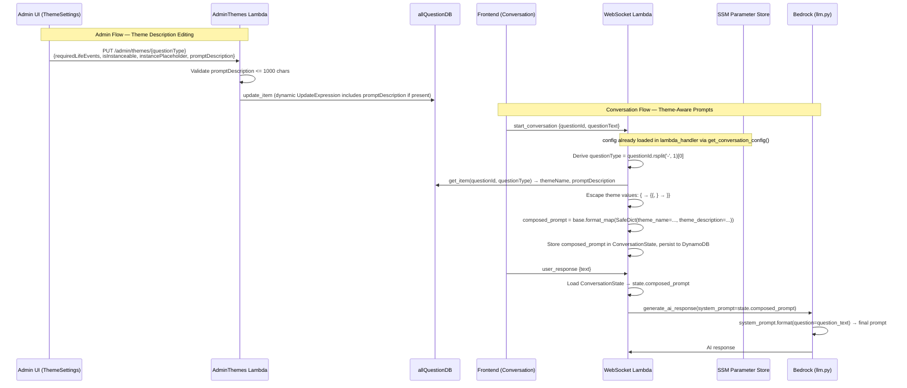

# Design Document: Theme-Aware AI Prompts

## Overview

This feature makes the AI conversation system theme-aware by composing a final system prompt from three parts: the base system prompt (from SSM), the theme name, and a per-theme prompt description. The composition happens once at conversation start in `handle_start_conversation`, is stored in `ConversationState` for reuse across turns, and flows through to `generate_ai_response` in `llm.py` — which continues to call `.format(question=question_text)` to resolve the final `{question}` placeholder.

The key technical challenge is safe string formatting: admin-authored theme descriptions may contain literal curly braces, and the `{question}` placeholder must survive the first formatting pass. This is solved with a `SafeDict` subclass used with `str.format_map()`.

Changes span four layers:
1. **Backend — AdminThemes Lambda**: Accept and persist `promptDescription` per theme with dynamic `UpdateExpression` building
2. **Backend — WebSocket Lambda**: Fetch theme metadata at conversation start, compose prompt via `SafeDict`, store in `ConversationState`, pass to LLM calls
3. **Frontend — ThemeSettings + adminService**: Add prompt description editing UI with character counter and validation
4. **Infrastructure — template.yml**: Add `TABLE_ALL_QUESTIONS` env var and `dynamodb:GetItem` IAM policy for allQuestionDB

No changes to `llm.py` or `config.py` are required.

## Architecture



## Components and Interfaces

### 1. SafeDict (new utility in `wsDefault/app.py`)

A `dict` subclass whose `__missing__` method returns the placeholder string itself, preserving unrecognized placeholders during `str.format_map()`.

```python
class SafeDict(dict):
    """Dict subclass that preserves unrecognized format placeholders.
    
    Used with str.format_map() to substitute known keys while leaving
    unknown keys (like {question}) as literal placeholder text.
    """
    def __missing__(self, key):
        return '{' + key + '}'
```

**Interface**: Used as `base_prompt.format_map(SafeDict(theme_name=..., theme_description=...))`.

**Why not `string.Template` or regex?**: `str.format_map` with `SafeDict` is the idiomatic Python approach. It handles all format spec edge cases, is well-understood, and requires minimal code. The `__missing__` method is called only for keys not in the dict, so `{question}` passes through as `{question}` while `{theme_name}` and `{theme_description}` are substituted.

### 2. ConversationState Changes (`conversation_state.py`)

Add `composed_prompt` attribute:

```python
# In __init__:
self.composed_prompt = ""

# In to_dict():
'composedPrompt': self.composed_prompt

# In from_dict():
state.composed_prompt = data.get('composedPrompt', '')
```

Backward compatibility: `from_dict` defaults to `''` when `composedPrompt` is absent, so existing in-flight conversations are not broken.

### 3. handle_start_conversation Changes (`wsDefault/app.py`)

After creating `ConversationState` (`state = ConversationState(...)`) and before the existing `set_conversation(connection_id, state)` call, add theme lookup and prompt composition. The module already has `_dynamodb = boto3.resource('dynamodb')` at the top level — reuse it:

```python
# Derive question type
question_type = question_id.rsplit('-', 1)[0]

# Fetch theme metadata from allQuestionDB
theme_name = ""
theme_description = ""
try:
    all_questions_table = os.environ.get('TABLE_ALL_QUESTIONS', 'allQuestionDB')
    aq_table = _dynamodb.Table(all_questions_table)
    resp = aq_table.get_item(Key={'questionId': question_id, 'questionType': question_type})
    item = resp.get('Item', {})
    theme_name = item.get('themeName', '')
    theme_description = item.get('promptDescription', '')
except Exception as e:
    print(f"[START] Error fetching theme metadata: {e}")
    # Fall back to empty strings — conversation proceeds with base prompt only

# Compose theme-aware prompt
escaped_name = theme_name.replace('{', '{{').replace('}', '}}')
escaped_desc = theme_description.replace('{', '{{').replace('}', '}}')
composed_prompt = config['system_prompt'].format_map(
    SafeDict(theme_name=escaped_name, theme_description=escaped_desc)
)
state.composed_prompt = composed_prompt
# The existing set_conversation(connection_id, state) call below persists the state
# including the new composed_prompt field
```

### 4. handle_user_response / handle_audio_response Changes (`wsDefault/app.py`)

Both functions change the `system_prompt` argument passed to `process_user_response_parallel`:

```python
# Before (both functions):
config['system_prompt'],

# After (both functions):
state.composed_prompt if state.composed_prompt else config['system_prompt'],
```

The fallback to `config['system_prompt']` handles backward compatibility for conversations that started before this feature was deployed (where `composed_prompt` would be `''`).

### 5. AdminThemes Lambda Changes (`adminThemes/app.py`)

Build the `UpdateExpression` and `ExpressionAttributeValues` dynamically to conditionally include `promptDescription`:

```python
# After parsing body, add:
prompt_description = body.get('promptDescription')  # None if key absent

# Validate length if present
if prompt_description is not None and len(prompt_description) > 1000:
    return {
        'statusCode': 400,
        'headers': cors_headers(event),
        'body': json.dumps({'error': 'promptDescription must be 1000 characters or fewer'})
    }

# Build dynamic UpdateExpression
update_parts = [
    'requiredLifeEvents = :rle',
    'isInstanceable = :inst',
    'instancePlaceholder = :ph',
    'lastModifiedBy = :by',
    'lastModifiedAt = :at',
]
expr_values = {
    ':rle': required_events,
    ':inst': is_instanceable,
    ':ph': instance_placeholder,
    ':by': admin_email,
    ':at': now,
}

if prompt_description is not None:
    update_parts.append('promptDescription = :pd')
    expr_values[':pd'] = prompt_description

update_expression = 'SET ' + ', '.join(update_parts)

# In the update_item call:
table.update_item(
    Key={'questionId': qid, 'questionType': question_type},
    UpdateExpression=update_expression,
    ExpressionAttributeValues=expr_values,
)
```

### 6. Frontend — adminService.ts Changes

```typescript
// QuestionRecord interface — add field:
promptDescription?: string;

// applyThemeDefaults — update settings type:
export async function applyThemeDefaults(
  questionType: string,
  settings: {
    requiredLifeEvents: string[];
    isInstanceable: boolean;
    instancePlaceholder: string;
    promptDescription?: string;
  }
): Promise<{ message: string; questionsUpdated: number }> {
  // ... body unchanged, settings is passed directly to JSON.stringify
}
```

### 7. Frontend — ThemeSettings.tsx Changes

**ThemeInfo interface** — add field:
```typescript
currentPromptDescription: string;
```

**State** — add:
```typescript
const [editPromptDescription, setEditPromptDescription] = useState("");
```

**loadThemes** — populate from first question record:
```typescript
currentPromptDescription: first.promptDescription || "",
```

**startEdit** — populate edit state:
```typescript
setEditPromptDescription(t.currentPromptDescription);
```

**handleApply** — include in request:
```typescript
const result = await applyThemeDefaults(editingTheme, {
  requiredLifeEvents: editTags,
  isInstanceable: editInstanceable,
  instancePlaceholder: editInstanceable ? editPlaceholder : "",
  promptDescription: editPromptDescription,
});
```

**UI additions in edit mode** (after the instanceable section, before the Apply/Cancel buttons):
- A `<textarea>` with placeholder "Describe the theme context for the AI interviewer..."
- A character counter: `{editPromptDescription.length}/1000`
- Validation: if length > 1000, show red text and disable Apply button

**UI additions in non-edit summary** (below the existing tags line):
- Show truncated `currentPromptDescription` or "No prompt description" when empty

### 8. Infrastructure — template.yml Changes

**Environment variables** (add to WebSocketDefaultFunction's Environment.Variables block):
```yaml
TABLE_ALL_QUESTIONS: allQuestionDB
```

**IAM policy** (add new Statement to WebSocketDefaultFunction's Policies):
```yaml
- Statement:
    - Effect: Allow
      Action:
        - dynamodb:GetItem
      Resource:
        - !Sub arn:aws:dynamodb:${AWS::Region}:${AWS::AccountId}:table/allQuestionDB
```

Per the IAM permissions steering rule: the code change (`get_item` on allQuestionDB) and the IAM policy change must be in the same deploy. The existing `kms:Decrypt` and `kms:DescribeKey` on `DataEncryptionKey` already covers allQuestionDB since it uses the same KMS key.

## Data Models

### allQuestionDB — New Attribute

| Attribute | Type | Description |
|---|---|---|
| `promptDescription` | String (optional) | Free-text theme description for AI context. Max 1000 chars. Empty string clears the description. Absent attribute treated as empty string. |

No schema migration needed — DynamoDB is schemaless. Existing records without `promptDescription` are handled by `.get('promptDescription', '')` in all read paths.

### ConversationStateDB — New Attribute

| Attribute | Type | Description |
|---|---|---|
| `composedPrompt` | String | The fully composed system prompt with theme values substituted but `{question}` preserved. Empty string for backward compat. |

No migration needed — `from_dict` defaults to `''` for missing `composedPrompt`.

### SSM Parameter Update (Requirement 5)

The base system prompt stored at `/virtuallegacy/conversation/system-prompt` must be updated to include `{theme_name}` and `{theme_description}` placeholders. This is a one-time manual update via Admin > System Settings. The System Settings description for the Conversation System Prompt should document the available placeholders: `{question}`, `{theme_name}`, and `{theme_description}`.

### Prompt Composition Data Flow

```
Base System Prompt (SSM):
  "You are an interviewer for {theme_name}. {theme_description} The question is: {question}"

Theme values from allQuestionDB:
  themeName: "Childhood Memories"
  promptDescription: "Focus on early childhood experiences and family dynamics"

After escaping + format_map with SafeDict:
  "You are an interviewer for Childhood Memories. Focus on early childhood experiences and family dynamics The question is: {question}"

After generate_ai_response calls .format(question=question_text):
  "You are an interviewer for Childhood Memories. Focus on early childhood experiences and family dynamics The question is: What is your earliest memory?"
```

## Correctness Properties

*A property is a characteristic or behavior that should hold true across all valid executions of a system — essentially, a formal statement about what the system should do. Properties serve as the bridge between human-readable specifications and machine-verifiable correctness guarantees.*

### Property 1: promptDescription Length Validation

*For any* string `s`, the AdminThemes Lambda validation logic SHALL accept `s` as a valid `promptDescription` if and only if `len(s) <= 1000`. Strings longer than 1000 characters SHALL be rejected with a 400 status code.

**Validates: Requirements 1.1, 1.4, 1.5**

### Property 2: questionId Type Derivation

*For any* valid `questionId` string in the format `"{type}-{number}"` (where `type` may itself contain hyphens), `questionId.rsplit('-', 1)[0]` SHALL produce the correct `questionType` prefix — i.e., everything before the last hyphen.

**Validates: Requirements 3.1**

### Property 3: SafeDict Prompt Composition Preserves {question} and Substitutes Theme Values

*For any* base prompt template containing `{question}`, `{theme_name}`, and `{theme_description}` placeholders, and *for any* `theme_name` and `theme_description` strings (including strings containing literal curly braces), composing via `base.format_map(SafeDict(theme_name=escaped_name, theme_description=escaped_desc))` (where escaping replaces `{` with `{{` and `}` with `}}` in the theme values) SHALL:
- Preserve `{question}` as a literal placeholder in the output
- Substitute `{theme_name}` with the original (unescaped) theme_name value
- Substitute `{theme_description}` with the original (unescaped) theme_description value
- Never raise a `KeyError`

**Validates: Requirements 4.1, 4.2, 4.3, 4.8**

### Property 4: ConversationState composed_prompt Serialization Round-Trip

*For any* `ConversationState` instance with an arbitrary `composed_prompt` string, serializing via `to_dict()` and reconstructing via `from_dict()` SHALL produce a state whose `composed_prompt` attribute equals the original value. Additionally, *for any* dict without a `composedPrompt` key, `from_dict()` SHALL produce a state with `composed_prompt` equal to `""`.

**Validates: Requirements 4.4, 7.1, 7.2, 7.3**

## Error Handling

### Theme Metadata Fetch Failure (Requirement 3.5)
- If `get_item` on allQuestionDB raises any exception, the error is logged and both `theme_name` and `theme_description` default to empty strings
- The conversation proceeds with the base prompt (theme placeholders substituted with empty strings)
- This is a graceful degradation — the user still gets a working conversation, just without theme context

### Missing Attributes (Requirements 3.3, 3.4)
- `themeName` and `promptDescription` are read with `.get('attributeName', '')` — missing attributes silently default to empty strings
- No error is raised; the composed prompt simply has empty values for those placeholders

### Invalid promptDescription Length (Requirement 1.4)
- The AdminThemes Lambda validates `len(promptDescription) > 1000` before any DynamoDB writes
- Returns HTTP 400 with descriptive error message
- No partial updates occur — validation happens before the scan/update loop

### Backward Compatibility (Requirement 7.4)
- Existing in-flight conversations have no `composedPrompt` in their DynamoDB state
- `from_dict` defaults to `composed_prompt = ""`
- `handle_user_response` and `handle_audio_response` check: `state.composed_prompt if state.composed_prompt else config['system_prompt']`
- This ensures existing conversations continue using the base system prompt without interruption

### Curly Brace Escaping (Requirement 4.8)
- Admin-authored theme descriptions may contain literal `{` and `}` characters
- Before `format_map`, theme values are escaped: `{` → `{{`, `}` → `}}`
- This prevents `KeyError` from unrecognized placeholders and ensures literal braces appear in the output

## Testing Strategy

### Property-Based Tests (Python, using Hypothesis)

Property-based testing is appropriate for this feature because the core logic involves string transformation (prompt composition), input validation (length checking), and serialization round-trips — all pure functions with clear input/output behavior where input variation reveals edge cases.

Each property test runs a minimum of 100 iterations. Tests are tagged with the format: **Feature: theme-aware-ai-prompts, Property {number}: {title}**.

| Property | What It Tests | Key Generators |
|---|---|---|
| 1: promptDescription Length Validation | Validation accepts ≤1000, rejects >1000 | `st.text(min_size=0, max_size=2000)` |
| 2: questionId Type Derivation | `rsplit('-', 1)[0]` produces correct type prefix | `st.from_regex(r'[a-z]+-[0-9]+', fullmatch=True)` plus types with hyphens |
| 3: SafeDict Prompt Composition | {question} preserved, theme values substituted, no KeyError | `st.text()` for theme values including `{`, `}`, `{word}` patterns |
| 4: ConversationState Round-Trip | composed_prompt survives to_dict/from_dict | `st.text()` for composed_prompt, plus missing-key case |

### Unit Tests (Example-Based)

| Test | What It Verifies |
|---|---|
| AdminThemes includes promptDescription in UpdateExpression when present | Req 1.2 |
| AdminThemes omits promptDescription from UpdateExpression when absent | Req 1.3 |
| handle_start_conversation fetches theme metadata and composes prompt | Req 3.2 |
| handle_start_conversation falls back on get_item failure | Req 3.5 |
| handle_user_response passes composed_prompt to LLM | Req 4.5 |
| handle_audio_response passes composed_prompt to LLM | Req 4.6 |
| Fallback to config system_prompt when composed_prompt is empty | Req 7.4 |

### Frontend Tests

| Test | What It Verifies |
|---|---|
| ThemeSettings renders textarea in edit mode | Req 2.1 |
| ThemeSettings loads and displays promptDescription | Req 2.2 |
| Apply includes promptDescription in request | Req 2.3 |
| Character counter displays correct count | Req 2.4 |
| Apply disabled when >1000 chars | Req 2.5 |
| Summary shows truncated description or "No prompt description" | Req 2.10 |

### Integration / Smoke Tests

| Test | What It Verifies |
|---|---|
| template.yml contains TABLE_ALL_QUESTIONS env var for WebSocketDefaultFunction | Req 6.2 |
| template.yml contains dynamodb:GetItem on allQuestionDB for WebSocketDefaultFunction | Req 6.1 |
| End-to-end: start conversation → verify composed prompt used in LLM call | Reqs 3, 4 |
