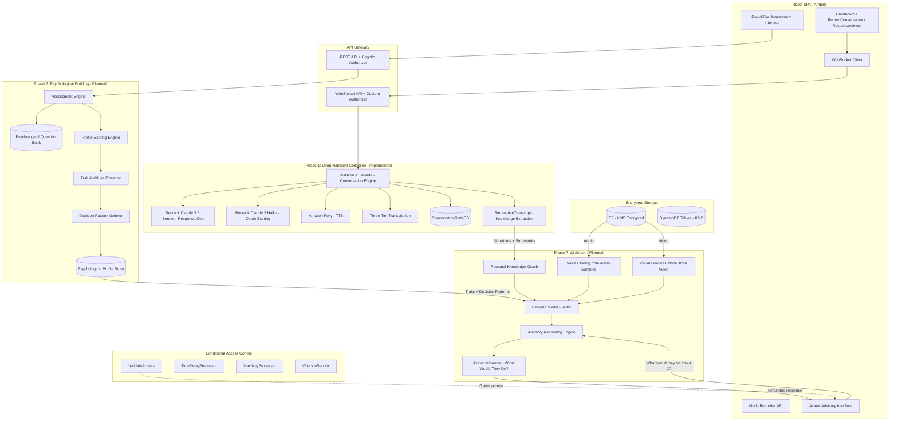

# SoulReel / Virtual Legacy — Patent Analysis Report
## Version 3: With Psychological Profiling & Advisory Avatar

**Prepared by**: AI Patent Analysis Engine  
**Date**: March 28, 2026  
**Codebase Analyzed**: SoulReel (Virtual Legacy) — Full stack (FrontEndCode + SamLambda)  
**Status**: Comprehensive analysis with 5 patent recommendations

---

## Table of Contents

1. [Codebase & Project Understanding](#step-1-codebase--project-understanding)
2. [Innovation Mining — 14 Candidate Inventions](#step-2-innovation-mining--14-candidate-inventions)
3. [Patentability Analysis](#step-3-patentability-analysis)
4. [Patent Recommendations (5 Patents)](#step-4-patent-recommendations-5-patents)
5. [Executive Summary](#executive-summary)

---

## Step 1: Codebase & Project Understanding

### Architecture Overview

SoulReel is a cloud-native, serverless digital legacy preservation platform with a three-phase data collection pipeline and a planned AI Avatar with advisory capabilities. The system operates in three distinct phases:

**Phase 1 — Deep Narrative Collection (Existing/Implemented)**: Users ("Legacy Makers") record personal memories through AI-guided voice conversations with depth scoring across structured life-topic categories. Video memory recordings supplement audio conversations.

**Phase 2 — Rapid-Fire Psychological Profiling (Planned)**: Before avatar construction, the system administers a rapid-fire psychological assessment — short, forced-choice or quick-response questions presented in timed succession to capture instinctive decision-making patterns, values hierarchies, moral reasoning frameworks, and emotional tendencies. Engineered specifically to extract the behavioral and cognitive signatures needed to make an avatar that doesn't just know what the person experienced, but how they think.

**Phase 3 — AI Avatar with Advisory Mode (Planned)**: The avatar is constructed from the combined data of Phases 1 and 2. The avatar operates in an advisory mode — beneficiaries can ask "What would [person] do about X?" and the avatar generates responses grounded in the person's actual values, decision-making patterns, and life experiences. This is not a generic chatbot wearing a face — it's a decision-making simulator calibrated to a specific individual's psychological profile.

### Core Technologies

| Layer | Technology |
|-------|-----------|
| Frontend | React 18, TypeScript, Vite, Tailwind CSS, shadcn/ui, AWS Amplify |
| Backend | AWS SAM, 40+ Python 3.12 Lambda functions, API Gateway (REST + WebSocket) |
| AI/ML | AWS Bedrock (Claude 3.5 Sonnet, Claude 3 Haiku), Amazon Polly, Amazon Transcribe, Deepgram |
| Data | DynamoDB (9 tables), S3, SSM Parameter Store (caching) |
| Security | KMS encryption at rest, Cognito auth, CloudTrail, GuardDuty |
| Scheduling | EventBridge cron rules for access condition processing |

### Architecture Diagram

### Why the Psychological Profiling Phase Changes Everything

The existing Phase 1 data (narrative conversations) captures *what happened* to a person and *how they feel about it*. But it doesn't systematically capture *how they make decisions*. The rapid-fire psychological assessment fills this gap:

- **Narrative data** (Phase 1): "I grew up on a farm and learned the value of hard work" → Knowledge & experience
- **Psychological profiling** (Phase 2): "When faced with a choice between loyalty and honesty, I choose honesty" → Decision-making framework
- **Combined** → An avatar that can answer "What would Dad do about this job offer?" by reasoning from both his experiences AND his decision-making patterns

The rapid-fire format is deliberate — it captures instinctive responses rather than carefully considered ones, which more accurately reflects how people actually make decisions. The speed prevents overthinking and captures authentic cognitive patterns.

### The Three-Layer Persona Model

The avatar's personality is constructed from three distinct data layers, each contributing different capabilities:

| Layer | Source | What It Captures | Avatar Capability |
|-------|--------|-----------------|-------------------|
| **Experience Layer** | Phase 1 depth-scored conversations | Life stories, memories, relationships, career history | "Let me tell you about when I..." |
| **Cognition Layer** | Phase 2 rapid-fire psychological assessment | Values hierarchy, moral reasoning, risk tolerance, decision patterns, emotional tendencies | "Given my values, I would..." |
| **Presence Layer** | Video recordings + audio samples | Voice characteristics, facial expressions, mannerisms, speech patterns | Looks and sounds like the person |

The advisory mode ("What would you do?") specifically requires the Cognition Layer — you can't simulate someone's decision-making from their life stories alone. The rapid-fire assessment is the critical bridge between "I know what happened to this person" and "I know how this person thinks."

### The Existing System Is Already an Avatar Training Pipeline

The current codebase, as built, is already collecting exactly the data needed to construct an AI avatar:

1. **Personality & Knowledge**: The AI-guided conversations with depth scoring ensure high-quality, detailed personal narratives across structured question categories (childhood, relationships, values, life lessons, etc.). The `allQuestionDB` table organizes questions by type, and the system tracks which questions have been answered. The depth scoring guarantees responses aren't superficial — the conversation literally won't end until the person has shared enough detail (cumulative score ≥ threshold).

2. **Voice**: Every conversation turn captures the user's audio in WebM format, stored in S3 at `conversations/{userId}/{questionId}/audio/turn-{N}-{timestamp}.webm`. Across dozens of conversations, this accumulates hours of voice samples.

3. **Visual Likeness**: Video memory recordings capture the user's face and mannerisms, stored at `user-responses/{userId}/{filename}.webm`. Thumbnails are extracted via FFmpeg.

4. **Structured Summaries**: The summarization pipeline produces one-sentence summaries, detailed summaries, and thoughtfulness scores for every conversation — pre-processed knowledge that can seed a persona model.

5. **Access Control**: The existing multi-condition access control system already gates content access. Extending it to gate avatar interaction is architecturally straightforward.

### Major Data Flows & User Journeys

**Legacy Maker Workflow (Implemented)**:
1. Sign up → Cognito creates user → PostConfirmation initializes progress
2. Dashboard shows question categories with progress bars
3. Click category → RecordConversation page loads
4. WebSocket connects → AI conversation starts with depth scoring
5. User records audio responses → AI scores and continues until threshold met
6. Conversation completes → Video memory option (optional)
7. Video uploaded → ProcessVideo triggers transcription pipeline
8. Transcript summarized by Bedrock → Question marked complete
9. Progress updated → Streak incremented

**Psychological Profiling Workflow (Planned)**:
1. After sufficient narrative conversations completed, system prompts for Phase 2
2. Rapid-fire assessment interface presents timed questions
3. User responds instinctively — response + latency captured
4. Trait extraction engine produces multi-dimensional personality vector
5. Decision pattern modeler identifies characteristic reasoning patterns
6. Psychological profile stored in cognition layer of personal data graph

**Benefactor Workflow (Implemented + Planned Avatar Extension)**:
1. Receive invitation email with token
2. Sign up with token → PostConfirmation creates relationship
3. Access conditions evaluated (time-delayed, inactivity, etc.)
4. BenefactorDashboard shows available makers
5. View videos, transcripts, summaries (implemented)
6. **Planned**: Interact with AI Avatar — ask "What would [person] do about X?"
7. Avatar generates grounded advisory response with attribution

### Key Lambda Functions (40+ Total)

**Conversation Functions** (5): wsAuthorizer, wsConnect, wsDisconnect, wsDefault (main engine, 60s timeout, 512MB), SummarizeTranscriptFunction (120s, 512MB)

**Question Database Functions** (10+): GetNumQuestionTypes, GetQuestionTypeData, GetUnansweredQuestionsFromUser, GetProgressSummary2, InitializeUserProgress, IncrementUserLevel2, GetUserCompletedQuestionCount, GetTotalValidAllQuestions, InvalidateTotalValidQuestionsCache, GetAudioQuestionSummaryForVideoRecording

**Video Functions** (6): GetUploadUrl, ProcessVideo, UploadVideoResponse, StartTranscription, ProcessTranscript (EventBridge trigger), GetMakerVideos

**Assignment Functions** (8): CreateAssignment, GetAssignments, UpdateAssignment, AcceptDeclineAssignment, ManualRelease, ResendInvitation, CheckInResponse, TimeDelayProcessor

**Relationship Functions** (3): CreateRelationship, GetRelationships, ValidateAccess

**Streak Functions** (3): CheckStreak, GetStreak, MonthlyReset

**Scheduled Jobs** (3): TimeDelayProcessor (hourly), CheckInSender (daily), InactivityProcessor (daily)

**Cognito Triggers** (2): PreSignupFunction, PostConfirmationFunction

### DynamoDB Tables (9)

1. **PersonaRelationshipsDB**: Maker-benefactor relationships (PK: initiator_id, SK: related_user_id)
2. **AccessConditionsDB**: Access conditions (PK: relationship_key, SK: condition_id) + GSIs on condition_type and activation_date
3. **EngagementDB**: Streak tracking (PK: userId)
4. **ConversationStateDB**: Active WebSocket conversations (PK: connectionId, TTL: 2 hours)
5. **WebSocketConnectionsDB**: Connection tracking (PK: connectionId, TTL: 24 hours)
6. **PersonaSignupTempDB**: Temporary signup/check-in data (PK: userName, TTL: 24 hours/7 days)
7. **userQuestionStatusDB**: Question response metadata (PK: userId, SK: questionId)
8. **userQuestionLevelProgressDB**: Level completion tracking (PK: userId, SK: questionType)
9. **userStatusDB**: User profile data (PK: userId)

### Security Architecture

- **At Rest**: KMS customer-managed key (alias: soulreel-data-encryption) for DynamoDB, S3, CloudTrail
- **In Transit**: TLS 1.2+ for all API calls
- **Authentication**: Cognito User Pool with JWT validation; custom WebSocket authorizer
- **Authorization**: Least-privilege IAM per Lambda; persona-based role validation
- **Audit**: CloudTrail data access logging; GuardDuty threat detection with SNS alerts
- **CORS**: Locked to `https://www.soulreel.net` across three layers (API Gateway, GatewayResponses, Lambda headers)

---

## Step 2: Innovation Mining — 14 Candidate Inventions

### Candidate 1: AI-Guided Conversational Memory Elicitation with Cumulative Depth Scoring

**Problem**: People struggle to articulate meaningful personal memories when faced with open-ended prompts. Existing journaling/recording tools provide no feedback on whether responses are sufficiently detailed for legacy preservation.

**Solution**: A real-time WebSocket-based conversation system where an LLM interviewer asks follow-up questions based on conversation history, while a separate LLM concurrently scores each response for "depth" on a numeric scale. Scores accumulate across turns. The conversation continues until a configurable score goal is reached or max turns are exhausted, ensuring every recorded memory meets a minimum quality threshold.

**Code references**: `wsDefault/app.py` (handle_user_response), `wsDefault/llm.py` (process_user_response_parallel, score_response_depth), `wsDefault/conversation_state.py` (should_continue, cumulative_score)

**Improvement**: Unlike simple chatbots or journaling apps, this system guarantees a minimum depth of personal narrative through quantitative scoring, producing higher-quality legacy content.

### Candidate 2: Parallel Dual-Model LLM Processing for Latency Reduction

**Problem**: In real-time voice conversations, sequential LLM calls (generate response + score response) create unacceptable latency (2-4 seconds each, totaling 4-8 seconds per turn).

**Solution**: Using `ThreadPoolExecutor` with 2 workers, the system simultaneously invokes two different LLM models — a high-capability model (Claude 3.5 Sonnet) for response generation and a lightweight model (Claude 3 Haiku) for scoring — then joins results. This reduces per-turn latency by ~50%.

**Code reference**: `wsDefault/llm.py` (process_user_response_parallel)

**Improvement**: ~50% latency reduction per conversation turn compared to sequential processing, enabling natural conversational flow.

### Candidate 3: Three-Tier Cascading Speech-to-Text Transcription with Automatic Failover

**Problem**: Real-time audio transcription in serverless environments is unreliable — any single provider can fail due to rate limits, network issues, or audio format incompatibility.

**Solution**: A three-tier cascading transcription system: Tier 1 (Deepgram API, ~0.5s average), Tier 2 (AWS Transcribe Streaming with WebM→PCM conversion via ffmpeg, ~5s), Tier 3 (AWS Transcribe Batch, ~15s, most reliable). Each tier catches exceptions and falls through to the next, with timing instrumentation at each level.

**Code reference**: `wsDefault/app.py` (handle_audio_response — three nested try/except blocks), `transcribe_deepgram.py`, `transcribe_streaming.py`

**Improvement**: Near-zero transcription failure rate with optimal latency (fastest provider tried first).

### Candidate 4: Multi-Condition Digital Legacy Access Control with Dead Man's Switch

**Problem**: Existing digital asset management tools offer binary access (on/off). Users need nuanced control over when and how their digital memories become accessible to designated beneficiaries — including posthumous release scenarios.

**Solution**: A four-type access condition system stored in DynamoDB with composite keys:
1. **Immediate**: Access on relationship acceptance
2. **Time-Delayed**: Access on a specific future date (hourly cron processor)
3. **Inactivity-Trigger** ("Dead Man's Switch"): Periodic check-in emails sent to the content creator; if they fail to respond for N months (configurable 1-24 months), access is automatically granted
4. **Manual Release**: Creator explicitly releases at any time

Multiple conditions can be combined per relationship. Three scheduled Lambda functions evaluate and activate conditions.

**Code references**: `assignment_dal.py` (create_access_conditions), `validateAccess/app.py` (evaluate_access_conditions), `timeDelayProcessor/app.py`, `inactivityProcessor/app.py`, `checkInSender/app.py`

**Improvement**: No existing digital legacy platform implements a serverless, multi-condition access control system with automated inactivity detection and cascading activation.

### Candidate 5: Inactivity-Based Content Release with Dual-Threshold Verification

**Problem**: Posthumous digital content release requires detecting that a person is no longer active, without false positives (e.g., someone on vacation).

**Solution**: A three-component system: (1) CheckInSender generates unique UUID tokens with 7-day TTL and emails the creator at configurable intervals; (2) CheckInResponse validates tokens and resets the missed counter; (3) InactivityProcessor evaluates whether `months_since_last_check_in >= inactivity_months AND consecutive_missed_check_ins >= expected_check_ins / 2`, using `relativedelta` for accurate month calculation. The dual threshold prevents false activation.

**Code references**: `checkInSender/app.py`, `inactivityProcessor/app.py`

**Improvement**: Dual-threshold verification (time elapsed + missed check-in count) significantly reduces false positive activation compared to simple time-based approaches.

### Candidate 6: Conversation-to-Video-Memory Pipeline with AI Summarization

**Problem**: After an AI-guided audio conversation, users may want to record a supplementary video memory. The system needs to link the video to the conversation and maintain a unified content record.

**Solution**: After conversation completion, the system triggers synchronous summarization via Bedrock (producing a one-sentence summary, detailed summary, and thoughtfulness score), then offers the user a video memory recording option. The video memory is linked to the existing conversation record via DynamoDB update with separate field prefixes (`audio*`, `video*`, `videoMemory*`) for each content type.

**Code references**: `wsDefault/storage.py` (trigger_summarization), `summarizeTranscript/app.py` (update_summarization_results with prefix routing), `processVideo/app.py` (is_video_memory handling)

**Improvement**: Unified multi-modal content record linked to a single question, enabling richer legacy content than any single modality.

### Candidate 7: SSM Parameter Store as a Serverless Cache Layer

**Problem**: DynamoDB queries for user completion counts are expensive and frequent. Traditional caching adds cost and complexity.

**Solution**: Using AWS SSM Parameter Store as a zero-infrastructure cache layer with application-level TTL (1 hour) and event-driven invalidation on video/conversation completion.

**Code references**: `wsDefault/storage.py` (invalidate_cache), `processVideo/app.py` (SSM cache invalidation)

**Improvement**: ~80% reduction in DynamoDB read operations with zero additional infrastructure cost.

### Candidate 8: Stateful WebSocket Conversations in Serverless Architecture

**Problem**: Serverless architectures are inherently stateless, but multi-turn voice conversations require persistent state across multiple Lambda invocations.

**Solution**: Conversation state serialized to DynamoDB with connectionId as primary key and 2-hour TTL. Custom Decimal↔float conversion handles DynamoDB's numeric type requirements. State tracks cumulative scores, turn history, and completion status.

**Code reference**: `wsDefault/conversation_state.py` (ConversationState class, DynamoDB persistence with TTL)

**Improvement**: Enables stateful multi-turn conversations in a fully serverless architecture with automatic cleanup.

### Candidate 9: Graceful Degradation Architecture for Non-Critical Features

**Problem**: In a video upload pipeline, auxiliary features can fail independently. A single failure should not prevent the core operation.

**Solution**: Systematic non-blocking pattern where thumbnail generation, streak update, cache invalidation, and transcription triggering each fail independently without affecting the HTTP 200 response.

**Code reference**: `processVideo/app.py` (multiple independent try/except blocks, STREAK_ENABLED flag)

**Improvement**: Higher system availability — core operations succeed even when auxiliary services fail.

### Candidate 10: Configurable Conversation Parameters via SSM with Lambda Container Cache

**Problem**: AI conversation parameters need to be tunable in production without redeployment.

**Solution**: All parameters stored in SSM Parameter Store and batch-fetched on first invocation, cached in module-level dictionary that persists via Lambda container reuse.

**Code reference**: `wsDefault/config.py` (get_conversation_config, _param_cache)

**Improvement**: Zero-downtime configuration changes with sub-millisecond config access on warm invocations.

### Candidate 11: Structured Multimodal Data Collection Pipeline for Posthumous AI Avatar Construction

**Problem**: Creating a convincing AI avatar requires extensive, high-quality data across multiple modalities. Existing approaches require dedicated data collection sessions. There is no system that passively collects avatar-quality data as a byproduct of a meaningful user activity.

**Solution**: A platform where the primary user activity — answering guided life questions through AI-moderated voice conversations and video recordings — simultaneously serves as a structured data collection pipeline for AI avatar construction. The system ensures data quality through depth-scored conversations, structured question categories, audio recordings at each turn, video memory recordings, and AI-generated summaries. Data is organized in a per-user hierarchical storage structure with metadata linking questions, transcripts, summaries, audio, and video into a unified personal data graph.

**Code references**: The entire existing pipeline — `wsDefault/app.py`, `processVideo/app.py`, `summarizeTranscript/app.py`, `allQuestionDB`, `userQuestionStatusDB`

**Improvement**: Collects avatar-quality data as a natural byproduct of a meaningful activity, resulting in more authentic personality data. Depth scoring ensures data quality without requiring the user to understand they're training an avatar model.

### Candidate 12: Conditional AI Avatar Activation Governed by Digital Legacy Access Controls

**Problem**: AI avatars of deceased or incapacitated persons raise ethical and legal concerns. There is no system that allows a person to pre-configure the conditions under which their AI avatar becomes available to specific individuals.

**Solution**: Extending the existing multi-condition access control system to govern not just content viewing but AI avatar interaction. The same scheduled processors that activate content access would also activate avatar access. Per-beneficiary granularity allows different conditions for content viewing vs. avatar interaction.

**Code references**: `validateAccess/app.py`, `assignment_dal.py`, `inactivityProcessor/app.py`

**Improvement**: No existing AI avatar system provides configurable, multi-condition activation controls with dead man's switch capability.

### Candidate 13: Rapid-Fire Psychological Profiling for AI Avatar Personality Calibration

**Problem**: Constructing an AI avatar that can simulate a person's decision-making requires more than narrative data. Life stories capture experiences and emotions, but not the underlying cognitive frameworks that drive decisions. Traditional psychological assessments produce population-level categories (e.g., "INTJ"), not individual decision-making signatures suitable for AI training.

**Solution**: A rapid-fire assessment engine that administers short, forced-choice or quick-response questions specifically designed to extract decision-making patterns, values hierarchies, and cognitive tendencies. The assessment is engineered for speed — questions presented in rapid succession to capture instinctive responses rather than deliberated ones. Question types include:
- **Values conflicts**: "Your best friend asks you to lie for them. Do you?" (loyalty vs. honesty)
- **Risk calibration**: "You have a stable job but a startup offers equity. What do you do?" (security vs. opportunity)
- **Moral reasoning**: Trolley-problem variants calibrated to real-world scenarios
- **Emotional tendency**: "When someone criticizes your work, your first reaction is..." (fight/flight/reflect)
- **Decision style**: "When making a big decision, do you go with your gut or make a spreadsheet?"

Responses are processed by a trait extraction engine producing multi-dimensional continuous personality vectors (not categorical labels) and a decision pattern modeler identifying characteristic reasoning patterns.

**Improvement**: Produces continuous, multi-dimensional decision-making models specifically structured for AI avatar personality calibration. Rapid-fire format captures instinctive responses more predictive of actual behavior than deliberated self-reports.

### Candidate 14: AI Avatar Advisory Mode — "What Would They Do?" Reasoning Engine

**Problem**: Existing AI avatars and posthumous chatbots can reproduce speech patterns and recall stories, but cannot simulate decision-making. When a grieving child asks "What would Mom think about me changing careers?", current systems either refuse or generate generic advice.

**Solution**: An advisory reasoning engine combining three data sources:
1. **Personal knowledge graph** (Phase 1): What the person experienced, their relationships, their stated opinions
2. **Psychological profile** (Phase 2): How the person makes decisions, their values hierarchy, their risk tolerance
3. **Query context**: The specific situation the beneficiary is asking about

The engine retrieves relevant entries from both sources, provides them to a reasoning LLM, and generates a response grounded in the person's actual experiences AND calibrated to their decision-making patterns. Critically, each response includes an attribution component citing the specific experiences and traits that informed the advisory, making the reasoning transparent and auditable.

**Improvement**: No existing system combines a personal knowledge graph with a psychological decision-making profile to generate grounded advisory responses with attribution. The attribution mechanism addresses the trust/hallucination problem that plagues generic AI advisors.

---

## Step 3: Patentability Analysis

### Analysis Framework

Each candidate is evaluated on five dimensions:
- **Subject-Matter Eligibility** (U.S. Alice/Mayo + EPO technical effect)
- **Novelty** (likely new vs. closest prior art)
- **Non-Obviousness** (inventive step for a POSITA)
- **Commercial Value** (defensibility, licensing potential)
- **Risks & Recommendations**

### Candidate 1: AI-Guided Conversational Memory Elicitation with Cumulative Depth Scoring

**Subject-Matter Eligibility**: Strong. This is not an abstract idea — it implements a specific technical system with a real-time WebSocket connection, parallel LLM invocations, cumulative scoring algorithm, and automated conversation termination. The system improves the technical process of content capture by ensuring quality thresholds are met. Under Alice Step 2B, the ordered combination of real-time scoring + conversation continuation logic + multi-turn state management constitutes significantly more than an abstract idea.

**Novelty**: Likely novel. Closest prior art:
- US 2023/0186893 (AI-assisted interview systems) — focuses on job interviews, not personal memory elicitation with depth scoring
- US 11,568,867 (Conversational AI with scoring) — scores for customer service quality, not narrative depth with cumulative thresholds
- StoryCorps / Remento apps — provide prompts but no real-time AI scoring or adaptive follow-up

The combination of (a) cumulative depth scoring, (b) configurable score goal as conversation termination condition, and (c) parallel dual-model processing for interactive voice conversations is not found in prior art.

**Non-Obviousness**: A POSITA would not obviously combine real-time LLM depth scoring with conversation termination logic in a voice-based memory elicitation context. The inventive step is using quantitative depth scoring as a quality gate for personal narrative content.

**Commercial Value**: High. Core differentiator of the platform. Licensable to any digital legacy, oral history, or therapeutic journaling platform.

**Risks**: Ensure claims focus on the technical implementation (scoring algorithm, termination logic, parallel processing) rather than the abstract concept of "asking follow-up questions."

**Rating: HIGH PRIORITY**

---

### Candidate 2: Parallel Dual-Model LLM Processing

**Eligibility**: Moderate. Parallel processing is a known technique, though the specific application of two different-capability models simultaneously in a real-time conversation context has technical merit.

**Novelty**: Weak. Parallel API calls are well-known. Using different models for different tasks is common in ML pipelines.

**Non-Obviousness**: Low. A POSITA would likely consider parallelizing independent LLM calls as an obvious optimization.

**Rating: DISCARD** — Too obvious as standalone. Better included as a dependent claim of Candidate 1.

---

### Candidate 3: Three-Tier Cascading Transcription

**Eligibility**: Moderate. Cascading fallback is a known pattern, but the specific implementation with cross-provider failover in a serverless context has some merit.

**Novelty**: Weak. Multi-provider fallback patterns are well-established in distributed systems.

**Non-Obviousness**: Low. Standard reliability pattern.

**Rating: DISCARD** — Better as a dependent claim of the conversation system patent.

---

### Candidate 4: Multi-Condition Digital Legacy Access Control

**Subject-Matter Eligibility**: Strong. Implements a specific technical system with scheduled serverless processors, composite database keys, multi-condition evaluation logic, and automated state transitions. Improves computer functionality by automating complex access control decisions.

**Novelty**: Likely novel. Closest prior art:
- US 10,614,233 (Digital asset inheritance) — focuses on death certificate verification, not inactivity-based detection
- US 2020/0134209 (Dead man's switch for digital assets) — simple time-based trigger, no multi-condition evaluation or check-in verification
- Google Inactive Account Manager — single inactivity threshold, no configurable multi-condition system

The combination of four condition types with scheduled serverless processors and dual-threshold inactivity detection is novel.

**Non-Obviousness**: Strong. The dual-threshold inactivity detection (time elapsed AND missed check-in count) is a non-obvious improvement over simple time-based triggers. The composite key design adds technical depth.

**Commercial Value**: Very high. Digital legacy and posthumous data management is a growing market. Licensable to estate planning platforms, password managers, and social media companies.

**Risks**: Claims should emphasize the technical implementation rather than the business method of "releasing content after inactivity."

**Rating: HIGH PRIORITY**

---

### Candidate 5: Inactivity Detection with Check-In Verification

**Analysis**: Sub-component of Candidate 4. Better filed as dependent claims within the multi-condition access control patent.

**Rating: MERGE INTO CANDIDATE 4**

---

### Candidate 6: Conversation-to-Video-Memory Pipeline

**Eligibility**: Strong. Technical system linking multi-modal content to a unified database record with type-specific field prefixes.

**Novelty**: Moderate. The specific pipeline of AI conversation → summarization → video memory → unified record with prefix-based field routing is novel.

**Non-Obviousness**: Moderate. Prefix-based field routing for multi-modal content in a single DynamoDB record is a non-obvious data modeling choice.

**Commercial Value**: Moderate. Applicable to any platform combining conversational AI with video recording.

**Rating: MEDIUM — merge into Patent #1 (data collection pipeline)**

---

### Candidate 7: SSM as Serverless Cache

**Eligibility**: Weak. Using a key-value store as a cache is well-known.

**Rating: DISCARD** — Obvious application of existing AWS service.

---

### Candidate 8: Stateful WebSocket Conversations in Serverless Architecture

**Eligibility**: Strong. Specific technical implementation of maintaining multi-turn conversation state across stateless Lambda invocations.

**Novelty**: Moderate. DynamoDB + WebSocket is known, but conversation-specific state management with scoring is less common.

**Non-Obviousness**: Moderate.

**Commercial Value**: Moderate.

**Rating: MEDIUM — better as dependent claims of Patent #3 (conversation engine)**

---

### Candidate 9: Graceful Degradation Architecture

**Eligibility**: Weak. Standard engineering practice.

**Rating: DISCARD**

---

### Candidate 10: Configurable Conversation Parameters via SSM

**Eligibility**: Weak. Standard configuration management.

**Rating: DISCARD**

---

### Candidate 11: Structured Multimodal Data Collection for AI Avatar Construction

**Subject-Matter Eligibility**: Very strong. Concrete technical system that improves the process of collecting training data for AI models. Technical improvements include: (a) depth scoring ensures data quality without manual review, (b) structured question categories ensure broad personality coverage, (c) hierarchical storage with cross-modal metadata linking enables efficient model training, (d) dual-purpose design is a specific technical architecture choice.

**Novelty**: Strong. Closest prior art:
- US 2023/0351675 (Digital twin creation from user interactions) — behavioral modeling from app usage patterns, not structured conversational elicitation with quality scoring
- US 2022/0375182 (Posthumous chatbot from social media data) — unstructured social media posts, not quality-controlled guided conversations
- HereAfter AI / StoryFile — record video responses to prompts, but no AI-guided adaptive follow-up, no depth scoring, no quality threshold enforcement
- US 11,790,637 (Voice cloning from recorded speech) — voice only, not multimodal personality + voice + visual collection

The key differentiator is the quality-controlled, structured, multi-modal collection pipeline where depth scoring ensures minimum richness for avatar construction.

**Non-Obviousness**: Strong. A POSITA would not obviously combine: (a) AI-guided conversational elicitation with cumulative depth scoring, (b) structured question categories for personality coverage, (c) audio sample collection as a byproduct, (d) video recording as supplementary modality, and (e) AI summarization for knowledge graph seeding — all unified into a single pipeline serving dual purposes. The inventive step is recognizing that a legacy preservation activity can simultaneously serve as a high-quality avatar training data pipeline.

**Commercial Value**: Extremely high. Covers the data collection methodology — a bottleneck every avatar company must solve. Licensable to: memorial/legacy platforms, AI companion companies, entertainment, estate planning, therapeutic applications.

**Risks**:
- 101 risk: Claims must focus on the technical pipeline, not the abstract concept of "collecting data to make an avatar"
- Prior art risk: HereAfter AI and StoryFile exist but neither implements depth scoring or quality-controlled collection
- Recommendation: File as system patent with method claims emphasizing quality control mechanisms

**Rating: HIGHEST PRIORITY**

---

### Candidate 12: Conditional AI Avatar Activation

**Subject-Matter Eligibility**: Strong. Scheduled processors evaluating multi-condition rules to gate avatar interaction is a concrete technical improvement.

**Novelty**: Very strong. No prior art combines configurable multi-condition access controls with AI avatar activation.

**Non-Obviousness**: Strong. Applying digital legacy access controls to AI avatar interaction requires the architectural insight that avatar access should be governed by the same condition types as content access.

**Commercial Value**: Very high. Defensible moat around ethical deployment of posthumous AI avatars.

**Risks**: Avatar inference engine isn't built yet. File as provisional to establish priority date.

**Rating: HIGH PRIORITY — merge into Patent #4 (access control)**

---

### Candidate 13: Rapid-Fire Psychological Profiling for Avatar Calibration

**Subject-Matter Eligibility**: Strong. Not an abstract psychological assessment — it's a specific technical system that (a) administers questions in a timed rapid-fire format to capture instinctive responses, (b) processes responses through a trait extraction engine producing multi-dimensional personality vectors, (c) feeds vectors into a decision pattern modeler, and (d) outputs a structured psychological profile formatted for AI avatar personality model training.

**Novelty**: Strong. Closest prior art:
- US 2023/0186893 (AI personality assessment) — generic personality typing, not avatar-calibrated decision modeling
- US 10,963,841 (Psychological profiling from digital behavior) — passive behavioral analysis, not active rapid-fire assessment
- US 2022/0375182 (Posthumous chatbot) — social media data, no psychological profiling
- Myers-Briggs / Big Five — categorical labels, not continuous decision-making models; not designed for AI training

The combination of (a) rapid-fire format for instinctive capture, (b) multi-dimensional continuous personality vectors, (c) decision pattern modeling, and (d) integration with narrative data for avatar construction is novel.

**Non-Obviousness**: Strong. Inventive steps: (1) recognizing narrative data alone is insufficient for decision-making simulation, (2) designing rapid-fire format to capture instinctive rather than deliberated responses, (3) structuring output as continuous decision-making model rather than categorical personality types.

**Commercial Value**: Very high. Defensible methodology patent. Any company building decision-simulating AI avatars would need this approach or a design-around.

**Risks**:
- 101 risk: Claims must focus on the technical pipeline (rapid-fire timing, vector extraction, decision pattern modeling, avatar integration)
- Ensure claims distinguish from generic personality tests by emphasizing avatar-calibration purpose and continuous output format

**Rating: HIGH PRIORITY**

---

### Candidate 14: AI Avatar Advisory Mode — "What Would They Do?"

**Subject-Matter Eligibility**: Strong. The advisory reasoning engine performs dual-source retrieval from two distinct data stores, multi-source reasoning, and generates attributed responses. The attribution mechanism is a concrete technical feature improving reliability and transparency.

**Novelty**: Very strong. Closest prior art:
- US 2022/0375182 (Posthumous chatbot from social media) — conversational responses, not grounded advisory with attribution
- US 2023/0351675 (Digital twin interactions) — behavioral simulation, not decision-making advisory with psychological grounding
- Character.AI / Replika — generic personality simulation, no personal knowledge graph or psychological profile grounding
- HereAfter AI — plays back recorded answers, cannot reason about new situations

No prior art combines a personal knowledge graph with a psychological decision-making profile to generate attributed advisory responses.

**Non-Obviousness**: Very strong. Inventive steps: (1) dual-source retrieval (knowledge graph + psychological profile), (2) attribution mechanism citing specific experiences and traits, (3) multimodal delivery (text + cloned voice + visual likeness). A POSITA would not obviously combine these elements.

**Commercial Value**: Extremely high. "What would [deceased loved one] do?" is the killer feature for the entire digital legacy market. Licensing extends to grief counseling, family advisory, corporate mentorship preservation, cultural heritage preservation.

**Risks**:
- Not yet implemented — file as provisional to establish priority date
- Claims should focus on the technical retrieval + reasoning + attribution pipeline

**Rating: HIGHEST PRIORITY**

---

### Priority Summary Table

| # | Candidate | Rating | Implementation Status |
|---|-----------|--------|----------------------|
| 14 | Advisory Avatar — "What Would They Do?" Reasoning | HIGHEST | Planned |
| 11 | Structured Multimodal Data Collection for Avatar | HIGHEST | Partially implemented |
| 13 | Rapid-Fire Psychological Profiling for Avatar Calibration | HIGH | Planned |
| 1 | AI-Guided Conversational Elicitation with Depth Scoring | HIGH | Fully implemented |
| 4+5 | Multi-Condition Access Control with Dead Man's Switch | HIGH | Fully implemented |
| 12 | Conditional Avatar Activation via Access Controls | HIGH | Merge into Patent #4 |
| 6 | Conversation-to-Video-Memory Pipeline | MEDIUM | Merge into Patent #1 |
| 8 | Stateful WebSocket Conversations | MEDIUM | Dependent claims of Patent #3 |
| 2 | Parallel Dual-Model LLM | DISCARD | Dependent claim of Patent #3 |
| 3 | Three-Tier Cascading Transcription | DISCARD | Dependent claim of Patent #3 |
| 7 | SSM as Cache | DISCARD | Obvious |
| 9 | Graceful Degradation | DISCARD | Standard practice |
| 10 | Configurable Parameters | DISCARD | Standard practice |

---

## Step 4: Patent Recommendations (5 Patents)

---

### Patent Recommendation #1: Structured Multimodal Data Collection Pipeline with Psychological Profiling for AI Avatar Construction

**Suggested Title**: Multimodal Data Collection System with Quality-Controlled Narrative Elicitation and Psychological Profiling for AI Avatar Construction

**Abstract**

A computer-implemented system and method for collecting structured, quality-controlled multimodal data sufficient to construct an AI-powered digital avatar capable of simulating a person's personality, voice, visual likeness, and decision-making behavior. The system operates in two data collection phases. In a first phase, the system conducts AI-moderated voice conversations across structured life-topic categories, wherein a scoring model evaluates the narrative depth of each response and the conversation continues until a cumulative quality threshold is met, ensuring collected personality and knowledge data meets a minimum richness standard. Audio and video recordings are captured as byproducts of the conversation activity. In a second phase, the system administers a rapid-fire psychological assessment comprising forced-choice and quick-response questions presented in timed succession to capture instinctive decision-making patterns, values hierarchies, moral reasoning frameworks, and emotional tendencies. Responses are processed by a trait extraction engine that produces multi-dimensional personality vectors and a decision pattern modeler that identifies characteristic reasoning patterns. All collected data — conversation transcripts, AI-generated summaries, voice audio samples, video recordings, and psychological profile vectors — is stored in an encrypted hierarchical structure with cross-modal metadata linking, forming a unified personal data graph comprising an experience layer, a cognition layer, and a presence layer, structured for training a personalized AI avatar model.

**Field of the Invention**

Systems and methods for structured multimodal personal data collection combining narrative elicitation with psychological profiling for AI avatar construction.

**Key Inventive Features / Technical Problem Solved**

- Two-phase data collection pipeline where Phase 1 (depth-scored narrative conversations) captures life experiences and knowledge, and Phase 2 (rapid-fire psychological assessment) captures decision-making patterns and cognitive tendencies, together providing sufficient data for both personality simulation and decision-making advisory capabilities (`wsDefault/app.py` — conversation pipeline; planned assessment engine)
- Quality-controlled narrative collection via cumulative depth scoring ensuring minimum data richness for avatar personality modeling (`llm.py:score_response_depth`, `conversation_state.py:should_continue`)
- Rapid-fire assessment format designed to capture instinctive rather than deliberated responses, producing more authentic behavioral data for decision-making simulation; questions presented in timed succession with response-time metadata captured alongside answers
- Trait extraction engine that maps rapid-fire assessment responses to multi-dimensional continuous personality vectors (not categorical labels), specifically structured for AI avatar personality model training
- Decision pattern modeler that identifies characteristic reasoning patterns from assessment responses (e.g., "prioritizes family over career in conflict scenarios," "risk-averse in financial contexts but risk-seeking in relationship contexts")
- Three-layer personal data graph architecture: Experience Layer (from narrative conversations), Cognition Layer (from psychological profiling), and Presence Layer (from audio/video recordings), with cross-layer metadata linking enabling holistic avatar construction
- Structured question categories in both phases ensuring broad coverage: life-topic categories for narrative breadth, psychological dimension categories (values, risk, moral reasoning, emotional tendency, decision style) for cognitive breadth

**Draft Claims**

**Independent Claim 1** (System):

> 1. A computer-implemented system for collecting multimodal personal data structured for constructing an AI avatar capable of simulating a person's decision-making behavior, the system comprising:
>    - a narrative collection engine configured to conduct multi-turn voice conversations with a user across a plurality of life-topic categories, wherein for each conversation:
>      - a scoring model evaluates a narrative depth of each user response and produces a numeric depth score,
>      - depth scores accumulate into a cumulative score, and
>      - the conversation continues until the cumulative score meets or exceeds a configurable quality threshold;
>    - an audio and video capture subsystem configured to record the user's voice audio during each conversation turn and to record video of the user, storing recordings in association with corresponding conversation data;
>    - a psychological assessment engine configured to administer a rapid-fire assessment comprising a plurality of questions presented in timed succession, the questions designed to elicit instinctive responses revealing decision-making patterns, values hierarchies, and cognitive tendencies, wherein the assessment engine captures both the user's response and a response latency for each question;
>    - a trait extraction engine configured to process the rapid-fire assessment responses and response latencies to produce a multi-dimensional personality vector representing the user's position along a plurality of continuous psychological dimensions;
>    - a decision pattern modeler configured to analyze the personality vector and identify characteristic reasoning patterns of the user, producing a structured decision-making profile; and
>    - a unified data store configured to maintain a personal data graph for the user comprising:
>      - an experience layer containing conversation transcripts and AI-generated narrative summaries,
>      - a cognition layer containing the personality vector and structured decision-making profile, and
>      - a presence layer containing voice audio samples and video recordings,
>      - with cross-layer metadata linking enabling retrieval of related data across layers.

**Dependent Claim 2**:

> 2. The system of claim 1, wherein the psychological assessment engine presents questions from a plurality of psychological dimension categories including at least values-conflict questions, risk-calibration questions, moral-reasoning questions, emotional-tendency questions, and decision-style questions, and wherein the trait extraction engine produces separate dimension scores for each category.

**Dependent Claim 3**:

> 3. The system of claim 1, wherein the trait extraction engine weights responses with shorter response latencies more heavily than responses with longer response latencies when producing the personality vector, on the basis that faster responses more accurately reflect instinctive cognitive patterns.

**Dependent Claim 4**:

> 4. The system of claim 1, further comprising an avatar construction engine configured to:
>    - construct a personality simulation model from the experience layer and the cognition layer of the personal data graph;
>    - construct a voice synthesis model from the voice audio samples in the presence layer; and
>    - construct a visual likeness model from the video recordings in the presence layer;
>    - wherein the personality simulation model is configured to generate responses to novel queries by reasoning from both the user's documented experiences and their characteristic decision-making patterns.

**Dependent Claim 5**:

> 5. The system of claim 1, wherein the narrative collection engine and the psychological assessment engine are administered sequentially, with the narrative collection phase preceding the psychological assessment phase, and wherein the psychological assessment engine selects questions based in part on life-topic categories for which the user has completed narrative conversations, enabling targeted profiling of decision-making patterns in domains where narrative data exists.

**Dependent Claim 6**:

> 6. The system of claim 1, wherein the rapid-fire assessment enforces a maximum response time per question, and wherein questions unanswered within the maximum response time are recorded as timeouts and excluded from the personality vector calculation, with the timeout rate itself recorded as a metadata attribute of the psychological profile.

**Dependent Claim 7**:

> 7. The system of claim 1, further comprising an engagement subsystem configured to track a daily activity streak for the user across both narrative conversations and psychological assessment sessions, providing gamification incentives to increase the volume and temporal distribution of collected data.

**Rationale for Filing**

This is the foundational patent of the portfolio. It covers the complete data collection methodology — from depth-scored conversations through rapid-fire psychological profiling to the three-layer personal data graph. The independent claim is broad enough to cover the overall pipeline while the dependent claims add specificity around response latency weighting (Claim 3), adaptive question selection (Claim 5), and timeout handling (Claim 6) that strengthen non-obviousness. Claims 1-3 and 5-7 can be filed immediately as a provisional even before the assessment engine is built, establishing priority date. File non-provisional within 12 months. PCT filing recommended for international coverage.

**Estimated strength: Very High**

---

### Patent Recommendation #2: AI Avatar Advisory Reasoning Engine with Dual-Source Retrieval and Response Attribution

**Suggested Title**: Advisory Response Generation System Using Personal Knowledge Graph and Psychological Profile with Attribution

**Abstract**

A computer-implemented system and method for generating advisory responses in the persona of a specific individual, wherein the responses are grounded in the individual's documented life experiences and calibrated to their empirically-measured decision-making patterns. A beneficiary submits a situational query in the form "What would [person] do about [situation]?" to an advisory reasoning engine. The engine performs dual-source retrieval: first, it queries a personal knowledge graph derived from the individual's depth-scored narrative conversations to identify relevant life experiences, stated opinions, and relationship context; second, it queries a psychological profile derived from a rapid-fire assessment to identify relevant decision-making dimensions including values hierarchy, risk tolerance, and reasoning style. A reasoning language model synthesizes the retrieved experience data and psychological profile data with the query context to generate an advisory response that reflects how the specific individual would likely approach the situation. Each response includes an attribution component that cites the specific experiences and psychological traits that informed the advisory, making the reasoning transparent and auditable. The response is optionally delivered through a voice synthesis model replicating the individual's vocal characteristics and a visual likeness model replicating their appearance.

**Field of the Invention**

Systems and methods for generating personalized advisory responses using AI avatars grounded in individual-specific knowledge graphs and psychological decision-making profiles.

**Key Inventive Features / Technical Problem Solved**

- Dual-source retrieval architecture where advisory generation draws from both a personal knowledge graph (what the person experienced) and a psychological decision-making profile (how the person thinks), enabling responses that are both factually grounded and cognitively calibrated
- Response attribution mechanism that cites specific life experiences and psychological traits used in generating the advisory, making the avatar's reasoning transparent and distinguishing it from generic AI advice (e.g., "Based on [person]'s experience with [X] and their tendency to prioritize [Y] over [Z], they would likely...")
- Situational query parsing that identifies the domain of the query (career, relationships, financial, health, etc.) and maps it to relevant psychological dimensions and knowledge graph segments for targeted retrieval
- Confidence scoring for advisory responses based on the density of relevant data in both the knowledge graph and psychological profile, with lower-confidence responses flagged to the beneficiary
- Multimodal response delivery combining text advisory, voice synthesis (cloned from the individual's audio samples), and optional visual likeness rendering

**Draft Claims**

**Independent Claim 1** (Method):

> 1. A computer-implemented method for generating an advisory response in the persona of a specific individual, the method comprising:
>    - receiving, from a requesting user, a situational query requesting advice attributed to a specific individual;
>    - retrieving, from a personal knowledge graph associated with the individual, one or more relevant experience entries based on semantic similarity between the situational query and the individual's documented life experiences, the knowledge graph having been constructed from depth-scored narrative conversations with the individual;
>    - retrieving, from a psychological profile associated with the individual, one or more relevant decision-making dimensions based on a domain of the situational query, the psychological profile having been constructed from a rapid-fire assessment capturing the individual's instinctive responses to forced-choice questions;
>    - providing the situational query, the retrieved experience entries, and the retrieved decision-making dimensions as input to a reasoning language model;
>    - generating, by the reasoning language model, an advisory response that reflects how the individual would likely approach the situation described in the query, the advisory response being grounded in the individual's specific experiences and calibrated to their measured decision-making patterns; and
>    - generating an attribution component identifying the specific experience entries and decision-making dimensions that informed the advisory response.

**Dependent Claim 2**:

> 2. The method of claim 1, further comprising:
>    - computing a confidence score for the advisory response based on a density of relevant entries in the personal knowledge graph and a coverage of relevant dimensions in the psychological profile;
>    - when the confidence score is below a threshold, appending a qualification to the advisory response indicating limited data availability in the relevant domain.

**Dependent Claim 3**:

> 3. The method of claim 1, further comprising delivering the advisory response through a voice synthesis model trained on audio samples of the individual's voice, such that the advisory is spoken in a synthesized approximation of the individual's vocal characteristics.

**Dependent Claim 4**:

> 4. The method of claim 1, wherein the psychological profile comprises a multi-dimensional personality vector produced by a trait extraction engine that processed the individual's rapid-fire assessment responses, and wherein retrieving relevant decision-making dimensions comprises identifying which dimensions of the personality vector are most predictive for the domain of the situational query.

**Dependent Claim 5**:

> 5. The method of claim 1, wherein the attribution component is structured as a list of citations, each citation comprising a reference to a specific conversation transcript or assessment response, a relevance score, and a natural-language explanation of how the cited data informed the advisory response.

**Dependent Claim 6**:

> 6. The method of claim 1, further comprising:
>    - prior to generating the advisory response, verifying that the requesting user has been granted avatar interaction permission under an access control system governing the individual's digital legacy;
>    - wherein the access control system evaluates one or more access conditions configured by the individual, the conditions selected from a set comprising immediate access, time-delayed access, inactivity-triggered access, and manual release.

**Rationale for Filing**

This patent covers the "killer feature" — the ability to ask a deceased or incapacitated person's avatar for advice and receive a grounded, attributed response. The dual-source retrieval (knowledge graph + psychological profile) and the attribution mechanism are the key inventive features. The confidence scoring (Claim 2) and structured citations (Claim 5) address the trust/hallucination problem that is the primary barrier to adoption of AI advisory systems. File as a provisional immediately to establish priority date. Claims are written to cover the method regardless of which specific LLM or voice synthesis technology is used, providing broad coverage.

**Estimated strength: Very High**

---

### Patent Recommendation #3: AI-Guided Conversational Memory Elicitation System with Real-Time Depth Scoring and Adaptive Termination

**Suggested Title**: Real-Time Depth-Scored Conversational Elicitation System with Parallel LLM Processing and Adaptive Termination

**Abstract**

A computer-implemented system and method for eliciting personal narrative content through AI-guided voice conversations with real-time quality assurance. The system establishes a bidirectional WebSocket connection between a client device and a serverless conversation engine. During each conversation turn, the user's spoken response is transcribed and simultaneously processed by two large language models operating in parallel: a first model generates a contextually-aware follow-up question based on the full conversation history, while a second model evaluates the narrative depth of the user's response and assigns a numeric score. Scores accumulate across turns. The conversation automatically terminates when the cumulative score reaches a configurable threshold, ensuring that every recorded memory meets a minimum quality standard for long-term preservation. Conversation state is persisted in a database with time-to-live expiration, enabling stateful multi-turn interactions within a stateless serverless compute environment.

**Field of the Invention**

Systems and methods for AI-assisted personal narrative capture with automated quality assessment in real-time conversational interfaces.

**Key Inventive Features / Technical Problem Solved**

- Real-time cumulative depth scoring of user narrative responses using a dedicated LLM, where each turn's score is added to a running total and compared against a configurable goal threshold (`wsDefault/llm.py:score_response_depth`, `conversation_state.py:should_continue`)
- Parallel dual-model LLM invocation using concurrent thread execution, where a high-capability model generates the conversational response while a lightweight model scores depth simultaneously, reducing per-turn latency by approximately 50% (`llm.py:process_user_response_parallel`)
- Stateful multi-turn conversation management in a serverless environment via database persistence with automatic TTL-based cleanup, including custom numeric type serialization for database compatibility (`conversation_state.py:ConversationState`, `_floats_to_decimals`, `_decimals_to_floats`)
- Three-tier cascading speech-to-text transcription with automatic failover across providers of decreasing latency/increasing reliability (`app.py:handle_audio_response` — Deepgram → AWS Streaming → AWS Batch)
- Configurable conversation parameters (score goal, max turns, model IDs, system prompts) stored in a parameter service with in-memory caching across serverless compute invocations (`config.py:get_conversation_config`)
- Text-to-speech synthesis of AI responses with encrypted cloud storage and time-limited presigned URLs for client playback (`speech.py:text_to_speech`)

**Draft Claims**

**Independent Claim 1** (System):

> 1. A computer-implemented system for eliciting personal narrative content through AI-guided conversation, the system comprising:
>    - a client application configured to capture audio input from a user and establish a persistent bidirectional communication channel with a conversation engine;
>    - a conversation engine comprising one or more serverless compute functions, the conversation engine configured to:
>      - (a) receive a transcribed text representation of the user's spoken response for a current conversation turn;
>      - (b) concurrently invoke, using parallel thread execution, a first large language model to generate a follow-up question based on a conversation history comprising all prior turns, and a second large language model to evaluate the narrative depth of the user's response and produce a numeric depth score;
>      - (c) add the numeric depth score to a cumulative score maintained in a conversation state object;
>      - (d) compare the cumulative score against a configurable score threshold;
>      - (e) when the cumulative score is below the threshold, transmit the generated follow-up question to the client application and repeat from step (a) for a subsequent turn;
>      - (f) when the cumulative score meets or exceeds the threshold, terminate the conversation and persist a transcript of all turns; and
>    - a state persistence layer comprising a database configured to store the conversation state object keyed by a connection identifier, with a time-to-live attribute for automatic expiration.

**Dependent Claim 2**:

> 2. The system of claim 1, wherein the first large language model is a higher-capability model configured with a first temperature parameter for creative response generation, and the second large language model is a lower-capability model configured with a second, lower temperature parameter for consistent numeric scoring.

**Dependent Claim 3**:

> 3. The system of claim 1, wherein the conversation engine is further configured to, upon termination of the conversation, invoke a summarization model to generate a one-sentence summary, a detailed summary, and a thoughtfulness score from the complete transcript, and store the summaries in association with the conversation record.

**Dependent Claim 4**:

> 4. The system of claim 1, further comprising a cascading transcription subsystem configured to:
>    - attempt transcription of the user's audio input using a first speech-to-text service;
>    - upon failure of the first service, attempt transcription using a second speech-to-text service that converts the audio from a first format to a second format compatible with the second service; and
>    - upon failure of the second service, attempt transcription using a third speech-to-text service operating in batch mode.

**Dependent Claim 5**:

> 5. The system of claim 1, wherein the conversation engine is further configured to synthesize the generated follow-up question into speech audio using a text-to-speech service, store the speech audio in encrypted cloud storage, generate a time-limited access URL, and transmit the URL to the client application for playback.

**Dependent Claim 6**:

> 6. The system of claim 1, wherein the conversation engine is further configured to terminate the conversation when a turn count reaches a configurable maximum turn limit, regardless of the cumulative score, and wherein the score threshold and maximum turn limit are stored in a parameter service and cached in memory across serverless compute invocations.

**Rationale for Filing**

This patent covers the core conversation engine — the technical heart of the platform. It is distinct from Patent #1 (data collection pipeline for avatar construction) in that it focuses on the real-time conversation mechanics: the scoring algorithm, parallel processing, state management, and cascading transcription. These claims are fully implemented and testable in the current codebase. Filing strategy: non-provisional utility patent immediately, with PCT filing for international coverage.

**Estimated strength: High**

---

### Patent Recommendation #4: Multi-Condition Digital Content and AI Avatar Access Control System with Automated Inactivity Detection

**Suggested Title**: Conditional Digital Legacy Access Control with Dual-Threshold Inactivity Detection and AI Avatar Activation

**Abstract**

A computer-implemented system and method for managing conditional access to digital content and AI avatar interactions based on multiple configurable release conditions evaluated by scheduled serverless processors. A content creator designates one or more beneficiaries and assigns access conditions from a set of condition types including immediate access, time-delayed access, inactivity-triggered access, and manual release. For inactivity-triggered conditions, the system implements a dual-threshold verification mechanism: a first scheduled process periodically sends verification emails to the content creator containing unique tokens with time-limited validity; a second scheduled process evaluates whether both a configurable time threshold has elapsed since the last verified activity and a minimum number of consecutive verification attempts have gone unanswered. Access conditions are stored using composite database keys encoding the creator-beneficiary relationship, enabling efficient querying across condition types via secondary indexes. The same access control framework governs both passive content viewing and active AI avatar interaction, enabling a content creator to specify different release conditions for content access versus avatar interaction for each beneficiary. Upon condition activation, the system automatically transitions the relationship status and notifies the beneficiary.

**Field of the Invention**

Systems and methods for conditional digital content and AI avatar access control with automated inactivity-based release in serverless computing environments.

**Key Inventive Features / Technical Problem Solved**

- Four-type access condition model (immediate, time-delayed, inactivity-trigger, manual-release) stored with composite relationship keys (`{creator_id}#{beneficiary_id}`) enabling efficient per-relationship queries (`assignment_dal.py:create_access_conditions`)
- Dual-threshold inactivity detection requiring both elapsed time AND missed check-in count to exceed configurable thresholds, reducing false positive activation (`inactivityProcessor/app.py` — `months_since_last_check_in >= inactivity_months AND consecutive_missed >= expected_check_ins // 2`)
- Token-based check-in verification with unique UUID tokens stored in a temporary table with TTL-based expiration (`checkInSender/app.py` — token generation, 7-day TTL)
- Unified access control framework governing both content viewing permissions and AI avatar interaction permissions, with per-beneficiary granularity
- Scheduled serverless processors operating at different frequencies (hourly for time-delayed, daily for inactivity) with structured logging and error isolation (`timeDelayProcessor/app.py`, `inactivityProcessor/app.py`)
- Multi-condition evaluation engine that checks all conditions for a relationship and returns granular unmet-condition details (`validateAccess/app.py:evaluate_access_conditions`)
- Bidirectional relationship validation using primary key queries and Global Secondary Index reverse lookups (`validateAccess/app.py:validate_user_access`)

**Draft Claims**

**Independent Claim 1** (Method):

> 1. A computer-implemented method for managing conditional access to digital content and AI avatar interactions in a cloud computing environment, the method comprising:
>    - receiving, from a content creator via a client application, a designation of a beneficiary and one or more access conditions, each access condition specifying criteria for granting the beneficiary a permission type selected from at least content viewing permission and avatar interaction permission;
>    - storing each access condition as a record in a database using a composite key comprising identifiers of the content creator and the beneficiary;
>    - for an access condition of an inactivity-trigger type:
>      - (a) executing a first scheduled process at a first interval to generate a unique verification token, store the token with a time-to-live expiration, and transmit a verification message containing the token to the content creator;
>      - (b) incrementing a missed-verification counter for the access condition upon each execution of the first scheduled process;
>      - (c) upon receipt of a valid verification token from the content creator, resetting the missed-verification counter to zero and updating a last-verified timestamp;
>      - (d) executing a second scheduled process at a second interval to evaluate whether both (i) a duration since the last-verified timestamp exceeds a configurable inactivity threshold and (ii) the missed-verification counter exceeds a minimum missed-verification threshold derived from the inactivity threshold and the first interval; and
>      - (e) upon both conditions of step (d) being satisfied, transitioning a relationship status between the content creator and the beneficiary to an active state and transmitting a notification to the beneficiary.

**Dependent Claim 2**:

> 2. The method of claim 1, further comprising, for an access condition of a time-delayed type:
>    - executing a third scheduled process at a third interval to query the database for time-delayed conditions where an activation date is earlier than a current time and a status is pending;
>    - for each matching condition, transitioning the relationship status to active and transmitting a notification to the beneficiary.

**Dependent Claim 3**:

> 3. The method of claim 1, wherein the minimum missed-verification threshold is calculated as the integer division of the product of the inactivity threshold in months and thirty, divided by the first interval in days, divided by two.

**Dependent Claim 4**:

> 4. The method of claim 1, wherein the content creator specifies different access conditions for content viewing permission and avatar interaction permission for the same beneficiary, enabling the content creator to grant content viewing access under a first set of conditions and avatar interaction access under a second, more restrictive set of conditions.

**Dependent Claim 5**:

> 5. The method of claim 1, further comprising:
>    - receiving, from a requesting user, an access validation request specifying a target content creator;
>    - querying the database for all access conditions associated with the relationship between the requesting user and the target content creator;
>    - evaluating each access condition against its type-specific criteria; and
>    - returning an access determination comprising a boolean access grant per permission type and, when access is denied, a list of unmet conditions with type-specific details including remaining time for time-delayed conditions and remaining inactivity duration for inactivity-trigger conditions.

**Dependent Claim 6**:

> 6. The method of claim 1, wherein the composite key is a string concatenation of the content creator identifier, a delimiter character, and the beneficiary identifier, and wherein the database includes a secondary index on the condition type attribute enabling efficient querying of all conditions of a given type across all relationships.

**Dependent Claim 7**:

> 7. The method of claim 1, further comprising, for an access condition of a manual-release type, receiving an explicit release instruction from the content creator and activating the access condition in response, wherein the manual release is revocable by the content creator at any time prior to the content creator's account becoming inactive.

**Rationale for Filing**

This patent covers the access control system that is critical for both the existing content platform and the planned avatar feature. The dual-threshold inactivity detection and the unified content/avatar access framework are the strongest inventive features. The content access claims (Claims 1-3, 5-7) are fully implemented and testable. The avatar access claims (Claims 4, 6) establish priority for the planned feature. Filing strategy: non-provisional utility patent immediately for implemented claims, with continuation when avatar access is implemented.

**Estimated strength: High**

---

### Patent Recommendation #5: Rapid-Fire Psychological Assessment System for AI Avatar Decision-Making Calibration

**Suggested Title**: Timed Psychological Assessment System Producing Continuous Personality Vectors for AI Avatar Decision Simulation

**Abstract**

A computer-implemented system and method for administering a rapid-fire psychological assessment to a user and processing the results into a structured decision-making profile suitable for calibrating an AI avatar's personality simulation. The system presents a series of forced-choice and quick-response questions in timed succession, enforcing maximum response times to capture instinctive rather than deliberated responses. Questions are drawn from a plurality of psychological dimension categories including values-conflict scenarios, risk-calibration scenarios, moral-reasoning dilemmas, emotional-tendency indicators, and decision-style assessments. For each question, the system captures both the user's selected response and the response latency. A trait extraction engine processes the responses and latencies to produce a multi-dimensional continuous personality vector, wherein responses with shorter latencies are weighted more heavily on the basis that faster responses more accurately reflect instinctive cognitive patterns. A decision pattern modeler analyzes the personality vector to identify characteristic reasoning patterns, producing a structured decision-making profile that encodes the user's tendencies across decision domains (e.g., "risk-averse in financial contexts, risk-seeking in relationship contexts"). The psychological profile is stored in a cognition layer of a personal data graph and integrated with an experience layer derived from narrative conversations, enabling an AI avatar to generate advisory responses that are calibrated to the user's actual decision-making behavior.

**Field of the Invention**

Systems and methods for psychological profiling optimized for AI avatar personality calibration, using timed assessments to capture instinctive decision-making patterns.

**Key Inventive Features / Technical Problem Solved**

- Rapid-fire timed assessment format specifically designed to capture instinctive responses rather than deliberated self-reports, producing behavioral data more predictive of actual decision-making than traditional untimed personality assessments
- Response latency capture and weighting, where faster responses receive higher weight in personality vector calculation on the basis that instinctive responses are more authentic indicators of cognitive patterns
- Multi-dimensional continuous personality vectors (not categorical labels like MBTI types), specifically structured as input for AI avatar personality model training
- Decision pattern modeler that identifies domain-specific reasoning tendencies (e.g., different risk tolerances in financial vs. relationship contexts), enabling nuanced avatar behavior
- Psychological dimension categories specifically designed for avatar calibration: values-conflict, risk-calibration, moral-reasoning, emotional-tendency, and decision-style
- Adaptive question selection based on previously completed narrative conversations, enabling targeted profiling in domains where experience data exists
- Integration with experience layer data (from narrative conversations) to form a complete personal data graph with cross-layer metadata linking

**Draft Claims**

**Independent Claim 1** (System):

> 1. A computer-implemented system for generating a structured decision-making profile of a user for calibrating an AI avatar, the system comprising:
>    - a question bank storing a plurality of assessment questions organized into psychological dimension categories, each question designed to reveal a decision-making tendency of the user;
>    - an assessment interface configured to present the assessment questions to the user in timed succession, enforcing a maximum response time per question, and to capture for each question both a selected response and a response latency;
>    - a trait extraction engine configured to:
>      - map each selected response to one or more positions along continuous psychological dimensions,
>      - weight each mapped position by a function of the response latency, wherein shorter latencies receive higher weights, and
>      - aggregate the weighted positions across all questions to produce a multi-dimensional personality vector;
>    - a decision pattern modeler configured to analyze the personality vector and identify domain-specific reasoning patterns, producing a structured decision-making profile encoding the user's characteristic tendencies across a plurality of decision domains; and
>    - a data store configured to store the decision-making profile in a cognition layer of a personal data graph associated with the user, the personal data graph further comprising an experience layer containing data from narrative conversations with the user.

**Dependent Claim 2**:

> 2. The system of claim 1, wherein the psychological dimension categories include at least:
>    - values-conflict questions presenting scenarios requiring the user to prioritize between competing values;
>    - risk-calibration questions presenting scenarios with varying risk-reward tradeoffs;
>    - moral-reasoning questions presenting ethical dilemmas;
>    - emotional-tendency questions identifying the user's characteristic emotional responses to stimuli; and
>    - decision-style questions identifying whether the user tends toward intuitive or analytical decision-making.

**Dependent Claim 3**:

> 3. The system of claim 1, wherein the assessment interface records questions for which the user does not respond within the maximum response time as timeouts, excludes timeout responses from the personality vector calculation, and records a timeout rate as a metadata attribute of the decision-making profile.

**Dependent Claim 4**:

> 4. The system of claim 1, wherein the decision pattern modeler identifies domain-specific reasoning patterns by clustering the user's responses by decision domain and computing separate tendency scores for each domain, such that the structured decision-making profile encodes different tendencies for different domains.

**Dependent Claim 5**:

> 5. The system of claim 1, wherein the assessment interface selects questions based in part on life-topic categories for which the user has completed narrative conversations stored in the experience layer, enabling targeted profiling of decision-making patterns in domains where narrative experience data exists.

**Dependent Claim 6**:

> 6. The system of claim 1, further comprising an avatar calibration engine configured to:
>    - receive the structured decision-making profile and the experience layer data;
>    - construct a personality simulation model that, when presented with a novel situational query, retrieves relevant experience entries from the experience layer and relevant decision-making dimensions from the decision-making profile; and
>    - generate an advisory response reflecting how the user would likely approach the situation, the response being grounded in the user's documented experiences and calibrated to their measured decision-making patterns.

**Rationale for Filing**

This patent is filed separately from Patent #1 because it covers the psychological assessment methodology in depth — the response latency weighting, the continuous personality vectors, the domain-specific decision pattern modeling, and the adaptive question selection. While Patent #1 covers the overall data collection pipeline (including the assessment as one phase), this patent provides detailed protection for the assessment methodology itself. This is strategically important because the psychological profiling approach is independently valuable — it could be licensed to any company building AI personality models, not just avatar companies. Filing strategy: provisional immediately to establish priority date, non-provisional within 12 months. Consider filing as a continuation of Patent #1 to share specification while having independent claims.

**Estimated strength: High**

---

## Executive Summary

### Recommended Patent Portfolio (5 Patents)

| Priority | Patent # | Title | Strength | Status | Value Proposition |
|----------|----------|-------|----------|--------|-------------------|
| 1 | **#1** | Multimodal Data Collection with Psychological Profiling for AI Avatar | Very High | Partial | Covers the foundational data pipeline — every avatar company needs to solve data collection |
| 2 | **#2** | Advisory Reasoning Engine — "What Would They Do?" | Very High | Planned | Covers the killer feature — grounded, attributed advisory responses from a deceased person's avatar |
| 3 | **#3** | Depth-Scored Conversational Elicitation with Parallel LLM | High | Implemented | Covers the core conversation engine — fully implemented and testable today |
| 4 | **#4** | Multi-Condition Access Control with Inactivity Detection | High | Implemented | Covers the access control system including avatar activation — defensible moat for ethical AI avatar deployment |
| 5 | **#5** | Rapid-Fire Psychological Assessment for Avatar Calibration | High | Planned | Covers the assessment methodology independently — licensable beyond avatar use cases |

### Filing Strategy

1. **Immediate (non-provisional)**: Patents #3 and #4 — fully implemented, testable, strongest Alice defense
2. **Immediate (provisional)**: Patents #1, #2, and #5 — establish priority date for planned features
3. **Within 12 months**: Convert provisionals to non-provisionals as features are implemented
4. **PCT filing**: All 5 patents within 12 months of earliest filing for international coverage
5. **Continuation applications**: Consider continuations from Patent #1 to cover avatar construction details as they are built

### Key Differentiators from Prior Art

- **vs. HereAfter AI / StoryFile**: No depth scoring, no quality thresholds, no psychological profiling, no advisory mode
- **vs. Character.AI / Replika**: No personal knowledge graph, no psychological grounding, no attribution mechanism
- **vs. Google Inactive Account Manager**: Single threshold, no multi-condition system, no avatar integration
- **vs. Generic posthumous chatbots (US 2022/0375182)**: Unstructured social media data vs. quality-controlled structured collection; no psychological profiling; no advisory attribution

### Commercial Licensing Potential

- **Digital legacy platforms**: Full portfolio
- **AI companion companies**: Patents #1, #2, #5
- **Estate planning services**: Patent #4
- **Grief counseling / therapeutic platforms**: Patents #2, #5
- **Corporate knowledge preservation**: Patents #1, #2, #3
- **Entertainment (posthumous performances)**: Patents #1, #2
- **Social media companies**: Patent #4

---

*This analysis is based on the codebase as of March 28, 2026, combined with planned features described by the inventor. Prior art references are based on general knowledge and should be supplemented with formal prior art searches before filing. All claims should be reviewed by a registered patent attorney before submission to the USPTO.*
